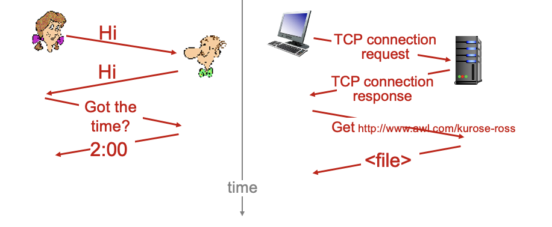

<!-- more -->

## Classification of network 

### by Physical Media

physical media is what lies between a transmitter and receiver pair
- **Wired Network** uses guided media: solid media
  - twisted pair (双绞线), 
    > reduces electrical interference
    > 
    > adequate performance and low cost
  - fiber optics (光纤), 
    > wide bandwidth 10's THz
    > 
    > low error rate
  - coaxial cable (同轴电缆), ...
    > high performance and excellent noise immunity
    > 
    > bandwidth better than twisted pair
    > 
    > but being replaced by fiber
- **Wireless Network** uses unguided media: signal propagates freely, atmosphere, outer space (through satellietes)
  - radio link types
    - terrestrial microwave (地面微波)
    - LAN (local-area network, e.g. WiFi)
    - wide-area (e.g. cellular)
    - satellite

::: tip Bandwidth

e.g. UTP CAT3 has 16MHz bandwidth, 10Mbps 
- data rate: bit per second
- bandwidth: measured by frequency
> Not same, but related

:::

### by Transmission Technology

- **Broadcast Network**, a single channel is shared by all computers
  - sending a packet implies all others receive it
  > of course, some protocals can enable "broadcasting" in a network where all computers are connected to a same media
- **Point-to-Point Network**, connected in pairs
  - sending a packet goes strictly from one to another
  - possibly having to visit intermediate machines (routing)
  > i.e. the transfer of information between two hosts

### by Topology

Logical Connection

- Bus,
  > e.g. Ethernet, as a broadcast network
- Star,
- Ring,
- Tree,
- ...

### by Scale

According to **Interprocessor Distance** or **the size of area where Processors are located**, We have
- Personal Area Network
- Local Area Network
  - generally using boradcast technology
  - having simple topologies

::: details How to realize broadcasting in a ring network

- When no information is being broadcast, a token will circulate in the network
- When a host want to broadcast a packet, it will wait for the token (no host is broadcasting)
- Other hosts will notice that what it receives is not a token, it will help forward it.
- When the packet come to the original host again, it knows that the packet is done broadcasting. It will resend the token.

The token strategy ensures that only a single client will be using the channel
:::

- Metropolitian Area Network
  > a case in point is Cable TV
  >
  > Not only can the existing TV infrastructure receive information, it can also be used to send information
  > 
  > thus, certain protocals and devices(e.g. juntion box, head end) have been designed
- Wide Area Network
  > **Network Core/Backbone**, or communication subnet (通信子网), consist of various routers that can forward the packet to the receiver
- the Internet

## Components of Computer Networks
- **Hardware**
  - adapter
  - repeaters
  - switches
  - routers
  - firewalls
- **Software**
  - **protocals**: how two or more communicating parties exchange information
  - **services**: what a network offers to parties that want to communicate
  - **interfaces**: how the serves can be accessed
  > Difference between services and interfaces
  >
  > every layer will use the services provided by the lower layer
  >
  > every lower layer will define several interfaces that can be used by higher layer
  >
  > In a word, **interface is called to provide services**

### Protocals

Define the **format** and the **order** of messages exchanged between two or more communicating entities, as well as the **actions** taken on the transmission and/or **receipt** of a message or other event.

Application programs interact with **protocol software** that follows the rules of a given protocol.

Protocal Layering matters because it
- reduces design complexity
- guarantees independence (separeted by services)
- enables flexibility

Protocal Software works through **encapsulation** - *multiple, nested headers*
- outgoing - down the layer: headers are **added**
- incoming - up the layer: headers are **verified** and **removed**

### Services

Connection or not
- **Connectinon-oriented** Services
  - **telephone model**
  - First **establish** a connection, then **release** the connection
- **Connectionless** Services
  - **postal model**

Reliable or not
- **Reliable**
  - no bit error, no data loss, in order
  > e.g. data loss happens when the buffer size of router is not enough
  >
  > e.g. in order happens when different packages are routed differently
  - by having the receiver acknowledge the receipt of each message (with implemented protocol)
  - Performance may degrade
  > because the sender may need to wait for a receipt from the receiver

|  Service     | Example      |  Connection     |
|  ---  |  ---  |  ---  |
|  Reliable Connection     | TCP (www, email)      | Connection-Oriented      |
|  UnReliable Connection     |  Voice over IP     |  Connection-Oriented     |
|  Reliable Datagram     |  RUDP     |  Connectionless     |
|  Unreliable Datagram     |  IP, UDP(DNS)     |   Connectionless    |

::: tip Layering Models

The OSI 7-layer Reference Model is an ideal layer design, where many protocols are actually not implemented. It is less used now.    

|  | | Layers | |
| --------- | ------- | ------- | ------- |
| Application    | Presentation    | Session    | Transport    
| Network    | Link    | Physical |   |

4-layer TCP/IP model is more common. 
- Application (http/ASCII = Application + Presentation)
  - HTTP/FTP/SMTP/DNS
- Transport (TCP = Session + Transport)
  - TCP/UDP
- Network (IP = Network)
  - IP
  > Hourglass philosophy - IP connects all the layers
- Link (Ethernet = link + physical)
  - LAN/ARPANET/Ethernet/802.11/...

:::