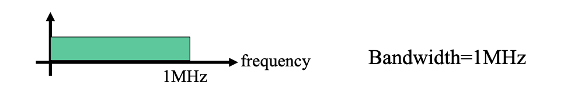
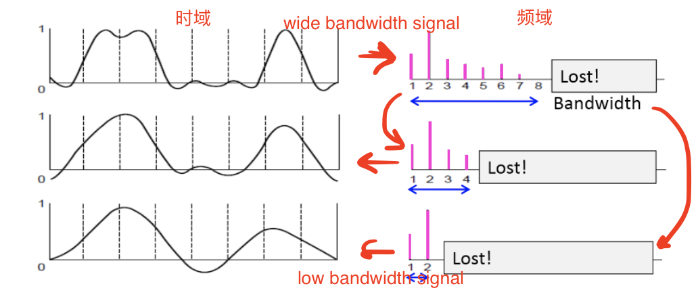
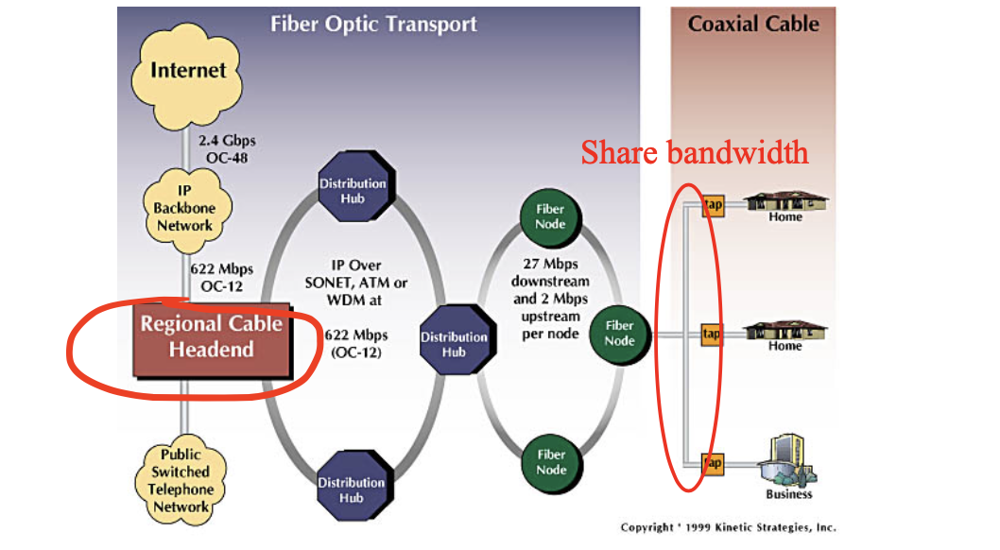
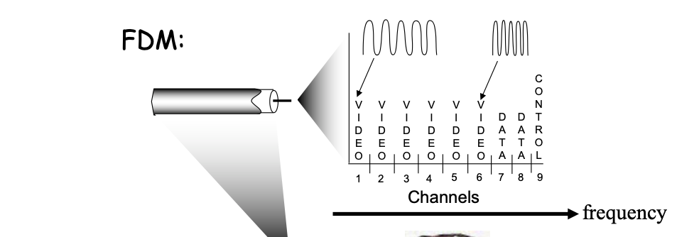

<!-- more -->


## What's the Internet

- **Nuts and bolts View**: Internet has ... 
  - hosts / end systems
  - communication links
  - routers
  - protocols

- **Service View**: communication **infrastructure** enables distributed applications, which contains
  - Network Edge ( 边缘 )
  - Access Networks, Physical Media
  - Network Core


## Network Edge

called **end systems (hosts)**: run application programs, usually at "edge of network", has two working models

- client/server model
  > requires an always-on server
- peer-peer model
  > e.g., in Skype, once the connection is built, hosts make communications directly through their IPs

### TCP Service

We want data transfer between end systems. For service that requires **connection** 
- **connection** : prepare for data transfer ahead of time
  - Request / Respond 
  - set up “state” in two communicating hosts

**TCP (Transmission Control Protocol)** for Internet's connection-oriented service
- **reliable**, in-order bytestream data transfer
  > Cause of packet loss: overflow of buffer in routers
  - In case of loss: acknowledgements (from receiver) and retransmissions (from sender)
- flow control:
  - sender won’t overwhelm receiver
- congestion control:
  - senders “slow down sending rate” when network congested

Application using TCP includes
- HTTP (Web), FTP (file transfer), Telnet (remote login), SMTP (email)

### UDP Service

**UDP - User Datagram Protocol** [RFC 768]:
- connectionless
- unreliable data transfer 
- no flow control
- no congestion control

App’s using UDP includes
- streaming media, teleconferencing, DNS, Internet telephony


## Access Networks and Physical Media

Elements of Access Networks
- **Bandwidth** of access network
- **shared** or **dedicated**

### Bandwidth vs. Data Rate

**Bandwidth (Hz)**: the range of frequencies transmitted without being strongly attenuated. 一个通信电路允许的传输的频率范围

a physical property of the transmission medium and usually depends on the construction, thickness, and length of the medium.



A Wide Band signal will be **distorted** when transmitted thru relatively narrower band channel with the higher harmonics cut off or hold back. 



**Data Rate (aka Bit Rate) (bit/s)**: the rate at which bits can be transmitted. 通信电路单位时间内允许发送的数据量

**Shannon's theorem**: the maximum data rate of a noisy channel with signal-to-noise ratio S/N is:

$$R=B\log_2 (1+S/N)$$
,where $R$ is Data Rate (bit/s) and $B$ is Bandwidth (Hz)


::: tip What's the bandwidth of WiFi?

Neither 2.4GHz nor 5GHz

```
    ▲
    │       ┌─────────┐   ┌─────┐
    │       │         │   │     │
    └───────┴─────────┴───┴─────┴─►
   0           2.4G         5G   Hz
          Central Frequency
```

`60GHz` as a central frequency has a wide bandwidth to use, enabling larger data rate, but it decays very fast. Hard to implement.
:::


### Residential access: point to point access

- **Dialup via modem**
  - up to 56Kbps direct access to router (often less)
  - Can’t surf and phone at same time: can’t be “always on”
- **ADSL: asymmetric digital subscriber line**
  - up to 1 Mbps upstream
  - up to 8 Mbps downstream
  - **FDM (Frequency Division Multiplexing)**: 
    - 50 kHz - 1 MHz for downstream 
    - 4 kHz - 50 kHz for upstream
    - 0 kHz - 4 kHz for ordinary telephone

> Using phone lines, dedicated

### Residential access: cable modems

- **HFC: hybrid fiber coax**
  - asymmetric: up to 30Mbps downstream, 2 Mbps upstream
- **network** of cable and fiber attaches home to ISP router
  homes share access to router



> Using Cables, shared
>
> FDM is also used
>
> 

|  DSL     |  Cabel Modem    |
|  ---  |  ---  |
|  point to point      |   share the pipe to the cable headend     |
| data rate does not reduce when neighbor uses his/her DSL |  data rate can reduce when neighbors are surfing concurrently |
|  uses twisted- pair     |  fibre optic lines     |
| low bandwidth, low data rate |  significantly higher data rate, even with other users | 


### Company access: local area networks


- **Ethernet**:
  - **shared or dedicated link connects** end system and router
  - 10 Mbs, 100Mbps, Gigabit Ethernet

### Wireless access networks

- viar **base station** aka **"access point"**
- **wireless LANs:**
  - Protocols: 802.11b/g (WiFi)
  - 11 or 54 Mbps
- **wider-area wireless access**
  - provided by telco operator


## Network Core

Network core is a **mesh of interconnected routers**

The fundamental question: how is data transferred through net?                          
- **circuit switching**: *dedicated circuit per call*: like telephone net
- **packet-switching**: *data sent through net* in discrete “chunks”