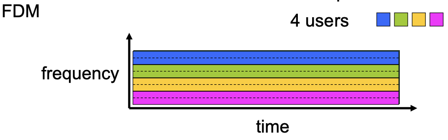
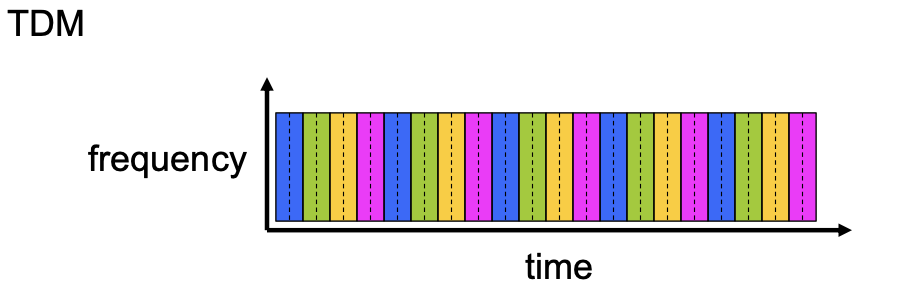
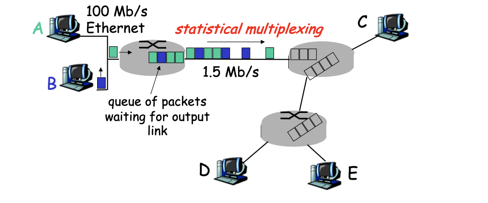
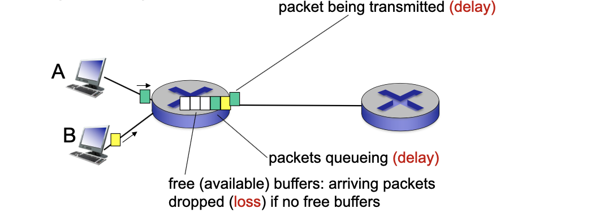
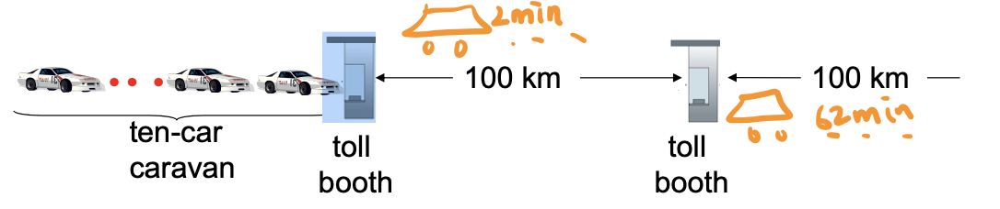
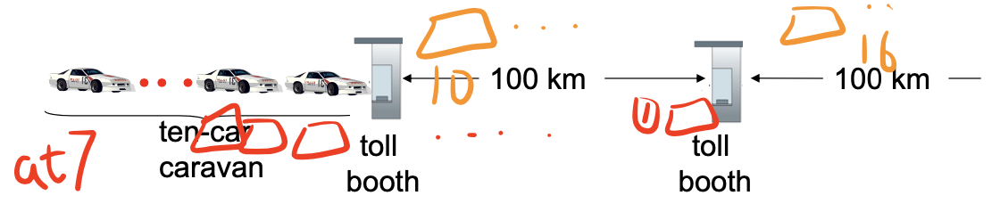
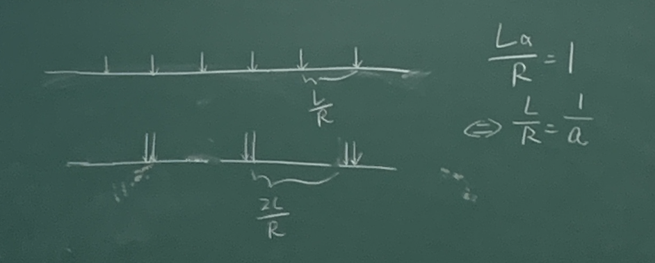
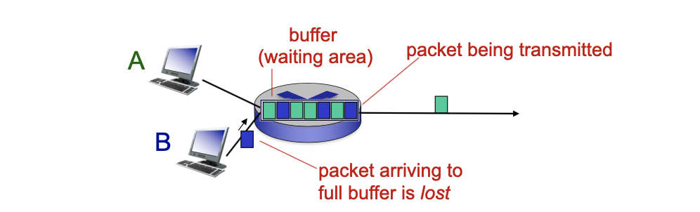
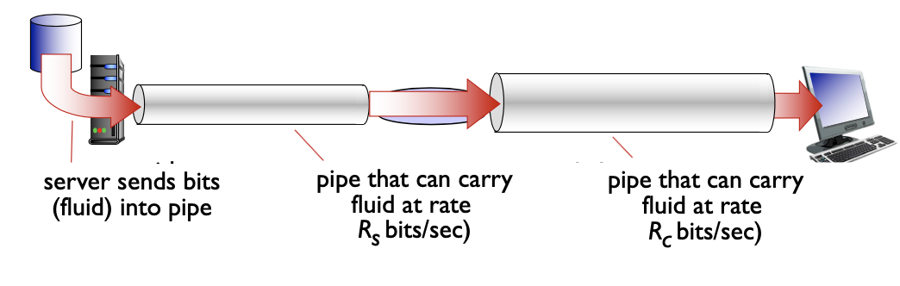

<!-- more -->


## What's the Internet

- **Nuts and bolts View**: Internet has ... 
  - hosts / end systems
  - communication links
  - routers
  - protocols

- **Service View**: communication **infrastructure** enables distributed applications, which contains
  - Network Edge ( 边缘 )
  - Access Networks, Physical Media
  - Network Core


## Network Edge

called **end systems (hosts)**: run application programs, usually at "edge of network", has two working models

- client/server model
  > requires an always-on server
- peer-peer model
  > e.g., in Skype, once the connection is built, hosts make communications directly through their IPs

### TCP Service

We want data transfer between end systems. For service that requires **connection** 
- **connection** : prepare for data transfer ahead of time
  - Request / Respond 
  - set up “state” in two communicating hosts

**TCP (Transmission Control Protocol)** for Internet's connection-oriented service
- **reliable**, in-order bytestream data transfer
  > Cause of packet loss: overflow of buffer in routers
  - In case of loss: acknowledgements (from receiver) and retransmissions (from sender)
- flow control:
  - sender won’t overwhelm receiver
- congestion control:
  - senders “slow down sending rate” when network congested

Application using TCP includes
- HTTP (Web), FTP (file transfer), Telnet (remote login), SMTP (email)

### UDP Service

**UDP - User Datagram Protocol** [RFC 768]:
- connectionless
- unreliable data transfer 
- no flow control
- no congestion control

App’s using UDP includes
- streaming media, teleconferencing, DNS, Internet telephony


## Access Networks and Physical Media

Elements of Access Networks
- **Bandwidth** of access network
- **shared** or **dedicated**

### Bandwidth vs. Data Rate

**Bandwidth (Hz)**: the range of frequencies transmitted without being strongly attenuated. 一个通信电路允许的传输的频率范围

a physical property of the transmission medium and usually depends on the construction, thickness, and length of the medium.


A Wide Band signal will be **distorted** when transmitted thru relatively narrower band channel with the higher harmonics cut off or hold back. 


**Data Rate (aka Bit Rate) (bit/s)**: the rate at which bits can be transmitted. 通信电路单位时间内允许发送的数据量

**Shannon's theorem**: the maximum data rate of a noisy channel with signal-to-noise ratio S/N is:

$$R=B\log_2 (1+S/N)$$
,where $R$ is Data Rate (bit/s) and $B$ is Bandwidth (Hz)


::: tip What's the bandwidth of WiFi?

Neither 2.4GHz nor 5GHz

```
    ▲
    │       ┌─────────┐   ┌─────┐
    │       │         │   │     │
    └───────┴─────────┴───┴─────┴─►
   0           2.4G         5G   Hz
          Central Frequency
```

`60GHz` as a central frequency has a wide bandwidth to use, enabling larger data rate, but it decays very fast. Hard to implement.
:::


### Residential access: point to point access

- **Dialup via modem**
  - up to 56Kbps direct access to router (often less)
  - Can’t surf and phone at same time: can’t be “always on”
- **ADSL: asymmetric digital subscriber line**
  - up to 1 Mbps upstream
  - up to 8 Mbps downstream
  - **FDM (Frequency Division Multiplexing)**: 
    - 50 kHz - 1 MHz for downstream 
    - 4 kHz - 50 kHz for upstream
    - 0 kHz - 4 kHz for ordinary telephone

> Using phone lines, dedicated

### Residential access: cable modems

- **HFC: hybrid fiber coax**
  - asymmetric: up to 30Mbps downstream, 2 Mbps upstream
- **network** of cable and fiber attaches home to ISP router
  homes share access to router


> Using Cables, shared
>
> FDM is also used
>
> 

|  DSL     |  Cabel Modem    |
|  ---  |  ---  |
|  point to point      |   share the pipe to the cable headend     |
| data rate does not reduce when neighbor uses his/her DSL |  data rate can reduce when neighbors are surfing concurrently |
|  uses twisted- pair     |  fibre optic lines     |
| low bandwidth, low data rate |  significantly higher data rate, even with other users | 


### Company access: local area networks


- **Ethernet**:
  - **shared or dedicated link connects** end system and router
  - 10 Mbs, 100Mbps, Gigabit Ethernet

### Wireless access networks

- viar **base station** aka **"access point"**
- **wireless LANs:**
  - Protocols: 802.11b/g (WiFi)
  - 11 or 54 Mbps
- **wider-area wireless access**
  - provided by telco operator


## Network Core

Network core is a **mesh of interconnected routers**

The fundamental question: how is data transferred through net?                          
- **circuit switching**: *dedicated circuit per call*: like telephone net
- **packet-switching**: *data sent through net* in discrete “chunks”

> Why packet switching gradually replace circuit switching?

### Circuit Switching

End-end resources reserved for “call”
> "call" is referred to here as an end-to-end communication
- link bandwidth, switch capacity
- dedicated resources: no sharing
- circuit-like (guaranteed) performance
- call setup required

**Problem**. network resources (e.g., bandwidth) divided into “pieces”
- pieces allocated to calls
- resource piece **idle** *if not used by owning call* (no sharing)
- dividing link bandwidth into “pieces”
  - frequency division 
  - time division


::: tip FDM and TDM

| Frequency Division Multiplexing | Time Division Multiplexing
| --- | --- |
|  |  |
| allocate different frequency to different users | allocate different time slots to different users |
| enables constant data streaming, but low bandwidth | enables large bandwidth  |
| e.g. voice over IP requires low bandwidth (<Kbps) |  |  

:::

### Packet Switching


- each end-end data stream divided into packets
  - user A, B packets share network resources
  - each packet uses full link bandwidth
  - resources **used as needed**
  > implemented by maintaining a series of queues in the router
- resource contention:
  - aggregate resource demand can exceed amount available
    - Packets queue up
- store and forward: _packets move one hop at a time_
  - Node receives complete packet before forwarding

::: tip Statistical Multiplexing



Sequence of A & B packets does not have fixed pattern, shared on demand $\Rightarrow$ **statistical multiplexing**. 统计复用
**Recall TDM**: each host gets same slot in revolving TDM frame.

:::


### Packet Switching versus Circuit Switching


- **Advantages**. Great for bursty data
  - resource sharing
  - simpler, no call setup
- **Problem**. Excessive congestion: packet delay and loss
  - protocols needed for reliability, congestion control
  ::: danger Store-and-forward
  **K-times the delay** for (K-1) intermediate routers (K links),

  assumes zero propagation delay (from the input of router to the output)
  :::
- Q: How to provide circuit-like behavior?
  - bandwidth guarantees needed for audio/video apps 
  - still unsolved (chapter 7)


## Delay, loss, and throughput

packets queue in router buffers
- packet arrival rate to link (temporarily) exceeds output link capacity $\Rightarrow$ Loss
- packets **queue**, wait for turn $\Rightarrow$ Delay




### Sources of packet delay

- **nodal processing delay,**
  > i.e. the delay caused by the introduction of this particular node (router)
  - The time required to examine the packet’s header and determine where to direct the packet
  - *often negligible*
- **queuing delay,**
  - the time needed for waiting to be transmitted onto the link.
  - The length of the queuing delay of a specific packet will depend on the number of earlier-arriving packets that are queued and waiting for transmission onto the link.
- **transmission delay,**
  - the amount of time required to push (that is, transmit) all of the packet’s bits into the link
  - $d_{trans}=L/R$, where L is the packet length (bits) and R is bandwidth (bps)
  > from the first bit to the last bit being pushed onto the link
- **and propagation delay**
  - The time required to propagate from the beginning of the link to router B
  - *typically, at the speed of light*
  - $d_{prop}=d/s$


::: tip Issues related to store-and-wait

- If propagate speed is slow,
  - delay = propagate delay + transmission delay = s/v + L/R
  - In the example below, the propagate delay dominates the total delay
  
    

- If propagate speed is very fast, reaches before all packages arrive
  - delay = propagate delay + transmission delay = s/v + L/R
  - In the example below, transmission delay dominates the total delay
  - It can happen that first car arrives at second both while three still at first booth

    


:::

### Queuing Delay

- R: link bandwidth (bps)
- L: packet length (bits)
- a: average packet arrival rate


- `La/R ~ 0`: avg. queueing delay small
- `La/R -> 1`: avg. queueing delay large 
- `La/R > 1`: more “work” arriving  than can be serviced, average delay infinite!

> We should avoid the last case when designing a real network

::: tip

When La/R = 1, the queuing delay may be dependent on the packet arriving pattern. Usually a large queuing delay may still exist.



:::


### Real Internet delays, routes

`traceroute` program: provides delay measurement from source to router along end-end Internet path towards destination. For all router `i`:
- sends three packets that will reach router `i` on path towards destination
- router `i` will return packets to sender
- sender times interval between transmission and reply.


### Packet Loss

- queue (aka buffer) preceding link in buffer has finite capacity
- packet arriving to full queue dropped (aka lost) 
- lost packet may be retransmitted by previous node, by source end system, or not at all




### Throughput

- **throughput**: rate (bits/time unit) at which bits transferred between sender/receiver
  - **instantaneous**: rate at given point in time 
  - **average**: rate over longer period of time
  > An end-to-end concept



$$ThroughPut = \min (R_s, R_c)$$

- **Bottleneck Link**: the link on end-end path that constrains end-end throughput

- In real Internet, assume $R$ is shared, per end-end throughput $=\min(R_c,R_s,R/10)$
  - and $R_c$ or $R_s$ is often the bottleneck
