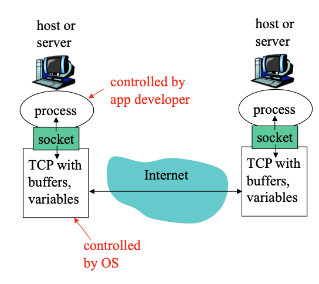
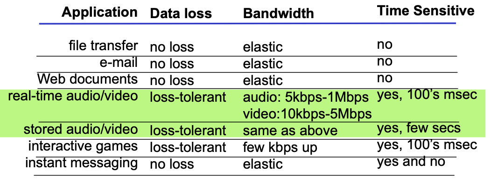
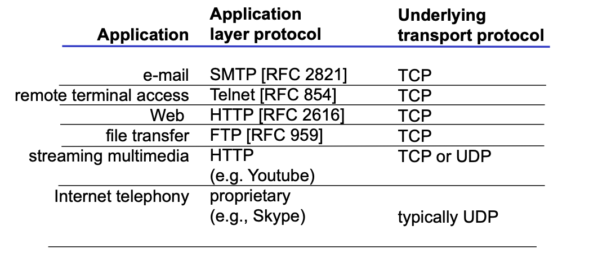
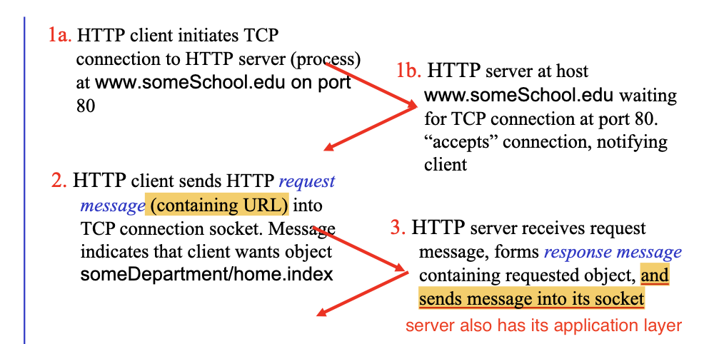
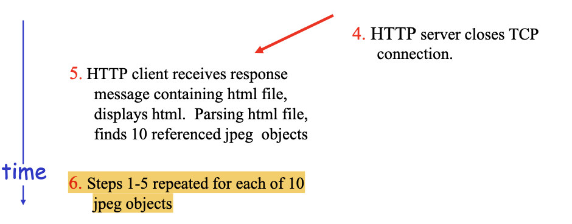
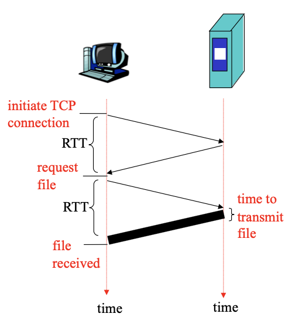
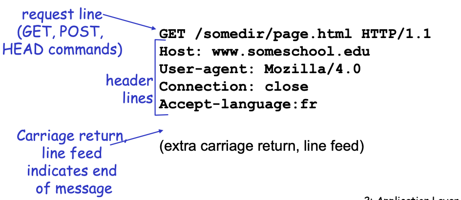
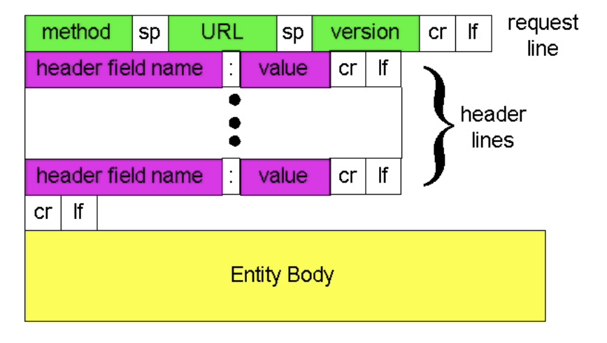

<!-- more -->

## Principles of network applications

### Application Architectures

**Client-server Architecture**

- server:
  - always-on host
  - permanent IP address 
  - server *farms* for scaling
- clients:
  - communicate with server 
  - may be *intermittently connected*
  - may have *dynamic IP addresses*
  - do not communicate directly with each other

**Pure P2P architecture**

- no always-on server 
- arbitrary end systems directly communicate
- peers are intermittently connected and change IP addresses
- example: Gnutella

> Highly scalable but difficult to manage
> 
> The network formed between peers are also known as overlay network
> 
> Though conceptually, nodes are directly connected, but the connection is actually based on the infrastructures provided by the Internet

**Hybrid of client-server and P2P**

- Skype
  - Internet telephony app
  - Finding address of remote party: centralized server(s) 
  - Client-client connection is direct (not through server)
- Instant messaging
  - Chatting between two users is P2P
  - Presence detection/location centralized:
    - User registers its IP address with central server when it comes online
    - User contacts central server to find IP addresses of buddies

### Process Communicating

**Process**: program running within a host.
- Recall in OS, within same host, two processes communicate using inter-process communication.
- processes in different hosts communicate by exchanging messages
  - **Client process**: process that *initiates communication*
  - **Server process**: process that *waits to be contacted*

Note: applications with P2P architectures have **both** client processes & server processes

### Sockets

process sends/receives messages to/from its **socket**. Socket provides application layer with a series of **API**: 
1. **choice** of transport protocol; 
2. ability to **fix a few parameters** (lots more on this later)

> Socket seperate the process (which is controled by app developer) and the lower-level network services (which should be controled by OS)

::: tip Addressing processes

To receive messages, process must have **identifier**. The 32-bit IP address certainly can't suffice for identifying processes

identifier includes **both IP address and port numbers** associated with process on host. e.g.
- HTTP server: 80
- Mail server: 25

:::

### Message Format

App-layer protocol defines
- **Types of messages** exchanged,
  - e.g., request, response 
- Message **syntax**:
  - what fields in messages & how fields are delineated
- Message **semantics**
  - meaning of information in fields
- Rules for when and how processes send & respond to messages

Typical Application Protocol includes

- **Public-domain protocols**:
  - defined in RFCs
  - allows for interoperability 
  - e.g., HTTP, SMTP 
- **Proprietary protocols**:
  - e.g., Skype

### Requirements for Message Transport

- **Data loss**
- **Timing**
- **Bandwidth**

> Why is **bandwidth** different from **timing** constraints?
> 
> guarantee 1000 bps data rate VS. latency 1ms for every bit
> 
> - the latter can guarantee the former
> - 1000 bit data can be transmitted at the last few ms, but on average the data rate is satisfied
> - therefore, 1000 bps doesn't imply 1ms latency
> - On the other word, every latency guarantee will come with a minimal bandwidth guarantee

::: details Different Applications pose different requirements to the transport service

:::

### Internet Transport protocols services

#### TCP service
- connection-oriented: setup required between client and server processes
- reliable transport between sending and receiving process
- flow control: sender won’t overwhelm receiver
- congestion control: throttle sender when network overloaded
- does not provide: timing, minimum bandwidth guarantees

#### UDP service
- unreliable data transfer between sending and receiving process
- does not provide: connection setup, reliability, flow control, congestion control, timing, or bandwidth guarantee

::: details Different Applications use different transport protocols

:::

## Web and HTTP

- Basic Jargons
  - **Webpage** consists of **Objects**
  - each object is addressable by a **URL (Uniform Resource Locater)**
  - Web page consists of **base HTML-file** which includes several referenced objects

### HTTP Overview

- **HTTP: hypertext transfer protocol**
  - Web’s application layer protocol
  - **client/server model**
    - **client**: browser that requests, receives, “displays” Web objects
    - **server**: Web server sends objects in response to requests

- Uses TCP:
  1. client initiates TCP connection (creates socket) to server, port 80
  2. server accepts TCP connection from client
  3. HTTP messages (application-layer protocol messages) exchanged between browser (HTTP client) and Web server (HTTP server)
  4. TCP connection closed

- HTTP is “stateless”
  - server maintains no information about past client requests
  > But other strategies such as cookies may be used

::: tip Protocols that maintain “state” are complex!
- past history (state) must be maintained
- if server/client crashes, their views of “state” may be inconsistent, must be reconciled

> Computer Networks concepts are derived from its simplest form.
:::

### HTTP Connection

**Nonpersistent HTTP**
- At most one object is sent over a TCP connection.
- HTTP/1.0 uses nonpersistent HTTP
> naive and inefficient

::: details An Example

:::

::: tip Response Time

**Round Trip Time (RTT)** = time to send _a small packet_ to travel from client to server and back.
> We imagine that once the packet is sent, it is all sent. And server/client processing the request itself finishes at once
> 
> can be considered as the sum of all four kinds of delay introduced before

**Response Time** for Non-persistent HTTP
- one RTT to initiate TCP connection
- one RTT for HTTP request and first few bytes of HTTP response to return
- file transmission time

**total = 2RTT + file transmission time**

:::

**Persistent HTTP**
- Multiple objects can be sent over single TCP connection between client and server.
- HTTP/1.1 uses persistent connections in default mode

### Persistent HTTP

- Issues with Non-persistent HTTP
  - requires 2 RTTs **per object **
  - **OS overhead** for each TCP connection
  - browsers often open parallel TCP connections to fetch referenced objects

- Persistent HTTP
  - server **leaves connection open** after sending response
  - subsequent HTTP messages between same client/server sent over open connection

- Persistent **without Pipelining**
  - new request after last received
  - one RTT for each referenced object
- Persistent **with Pipelining**
  - **default** in HTTP/1.1
  - client sends requests as soon as it encounters a referenced object
  - as little as one RTT for all the referenced objects

### HTTP Request Message

| ASCII Example | General Format |
| ------ | ----- |
|  |  |

- Method Types
  - HTTP/1.0: GET/POST/HEAD (for debug use)
  - HTTP/1.1: GET/POST/HEAD
    - PUT
    - DELETE

## FTP

## Electronic Mail (SMTP, POP3, IMAP)

## DNS