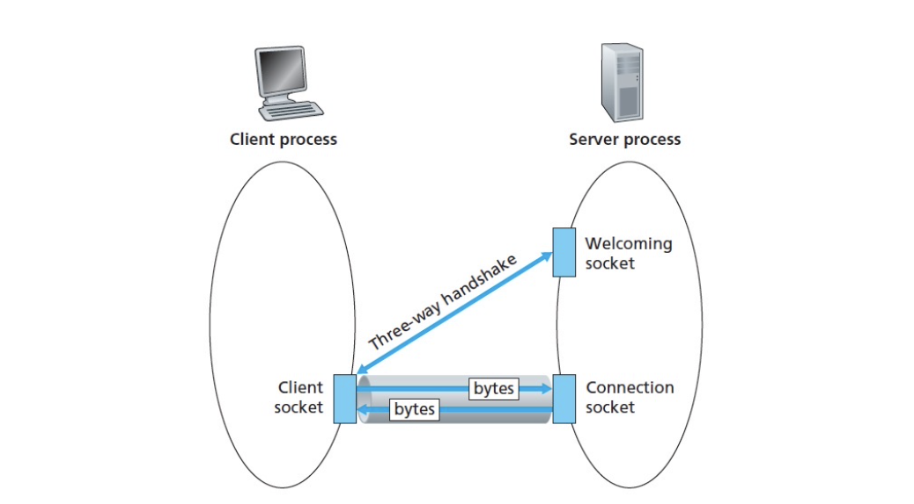

<!-- more -->


## Principles of network applications

### Application Architectures

**Client-server Architecture**

- server:
  - always-on host
  - permanent IP address 
  - server *farms* for scaling
- clients:
  - communicate with server 
  - may be *intermittently connected*
  - may have *dynamic IP addresses*
  - do not communicate directly with each other

**Pure P2P architecture**

- no always-on server 
- arbitrary end systems directly communicate
- peers are intermittently connected and change IP addresses
- example: Gnutella

> Highly scalable but difficult to manage
> 
> The network formed between peers are also known as overlay network
> 
> Though conceptually, nodes are directly connected, but the connection is actually based on the infrastructures provided by the Internet

**Hybrid of client-server and P2P**

- Skype
  - Internet telephony app
  - Finding address of remote party: centralized server(s) 
  - Client-client connection is direct (not through server)
- Instant messaging
  - Chatting between two users is P2P
  - Presence detection/location centralized:
    - User registers its IP address with central server when it comes online
    - User contacts central server to find IP addresses of buddies

### Process Communicating

**Process**: program running within a host.
- Recall in OS, within same host, two processes communicate using inter-process communication.
- processes in different hosts communicate by exchanging messages
  - **Client process**: process that *initiates communication*
  - **Server process**: process that *waits to be contacted*

Note: applications with P2P architectures have **both** client processes & server processes

### Sockets


process sends/receives messages to/from its **socket**. Socket provides application layer with a series of **API**: 
1. **choice** of transport protocol; 
2. ability to **fix a few parameters** (lots more on this later)

> Socket seperate the process (which is controled by app developer) and the lower-level network services (which should be controled by OS)

::: tip Addressing processes

To receive messages, process must have **identifier**. The 32-bit IP address certainly can't suffice for identifying processes

identifier includes **both IP address and port numbers** associated with process on host. e.g.
- HTTP server: 80
- Mail server: 25

:::

### Message Format

App-layer protocol defines
- **Types of messages** exchanged,
  - e.g., request, response 
- Message **syntax**:
  - what fields in messages & how fields are delineated
- Message **semantics**
  - meaning of information in fields
- Rules for when and how processes send & respond to messages

Typical Application Protocol includes

- **Public-domain protocols**:
  - defined in RFCs
  - allows for interoperability 
  - e.g., HTTP, SMTP 
- **Proprietary protocols**:
  - e.g., Skype


### Requirements for Message Transport

- **Data loss**
- **Timing**
- **Bandwidth**

> Why is **bandwidth** different from **timing** constraints?
> 
> guarantee 1000 bps data rate VS. latency 1ms for every bit
> 
> - the latter can guarantee the former
> - 1000 bit data can be transmitted at the last few ms, but on average the data rate is satisfied
> - therefore, 1000 bps doesn't imply 1ms latency
> - On the other word, every latency guarantee will come with a minimal bandwidth guarantee

::: details Different Applications pose different requirements to the transport service


:::

### Internet Transport protocols services

#### TCP service
- connection-oriented: setup required between client and server processes
- reliable transport between sending and receiving process
- flow control: sender won’t overwhelm receiver
- congestion control: throttle sender when network overloaded
- does not provide: timing, minimum bandwidth guarantees

#### UDP service
- unreliable data transfer between sending and receiving process
- does not provide: connection setup, reliability, flow control, congestion control, timing, or bandwidth guarantee

::: details Different Applications use different transport protocols


:::

## Web and HTTP

- Basic Jargons
  - **Webpage** consists of **Objects**
  - each object is addressable by a **URL (Uniform Resource Locater)**
  - Web page consists of **base HTML-file** which includes several referenced objects

### HTTP Overview

- **HTTP: hypertext transfer protocol**
  - Web’s application layer protocol
  - **client/server model**
    - **client**: browser that requests, receives, “displays” Web objects
    - **server**: Web server sends objects in response to requests

- Uses TCP:
  1. client initiates TCP connection (creates socket) to server, port 80
  2. server accepts TCP connection from client
  3. HTTP messages (application-layer protocol messages) exchanged between browser (HTTP client) and Web server (HTTP server)
  4. TCP connection closed

- HTTP is “stateless”
  - server maintains no information about past client requests
  > But other strategies such as cookies may be used

::: tip Protocols that maintain “state” are complex!
- past history (state) must be maintained
- if server/client crashes, their views of “state” may be inconsistent, must be reconciled

> Computer Networks concepts are derived from its simplest form.
:::

### HTTP Connection

**Nonpersistent HTTP**
- At most one object is sent over a TCP connection.
- HTTP/1.0 uses nonpersistent HTTP
> naive and inefficient


::: details An Example


:::

::: tip Response Time

**Round Trip Time (RTT)** = time to send _a small packet_ to travel from client to server and back.
> We imagine that once the packet is sent, it is all sent. And server/client processing the request itself finishes at once
> 
> can be considered as the sum of all four kinds of delay introduced before

**Response Time** for Non-persistent HTTP
- one RTT to initiate TCP connection
- one RTT for HTTP request and first few bytes of HTTP response to return
- file transmission time

**total = 2RTT + file transmission time**


:::


**Persistent HTTP**
- Multiple objects can be sent over single TCP connection between client and server.
- HTTP/1.1 uses persistent connections in default mode


### Persistent HTTP

- Issues with Non-persistent HTTP
  - requires 2 RTTs **per object **
  - **OS overhead** for each TCP connection
  - browsers often open parallel TCP connections to fetch referenced objects

- Persistent HTTP
  - server **leaves connection open** after sending response
  - subsequent HTTP messages between same client/server sent over open connection

- Persistent **without Pipelining**
  - new request after last received
  - one RTT for each referenced object
- Persistent **with Pipelining**
  - **default** in HTTP/1.1
  - client sends requests as soon as it encounters a referenced object
  - as little as one RTT for all the referenced objects


```

        without pipelining                       with pipelinging

 client              server              client              server
     │      TCP         │                     │      TCP         │
     ├─────────────────►│                     ├─────────────────►│
     │      TCP         │                     │      TCP         │
     │◄─────────────────┤                     │◄─────────────────┤
     │                  │                     │                  │
     │      Request     │                     │      Request     │
     ├─────────────────►│                     ├─────────────────►│
     │                  │                     │┴┼┼┼┼┼┼┼┼┼┼┼┼┼┼┤► │
     │◄─────────────────┤                     │▼└┼┼┼┼┼┼┼┼┼┼┼┼┼┼┬─┤
     │ ◄├┼┼┼┼┼┼┼┼┼┼┼┼┼┼┼│Transmission         │ ◄├┼┼┼┼┼┼┼┼┼┼┼┼┼┼┼│Transmission
     │◄─────────────────┤ Time                │◄┼┼┼┼┼┼┼┼┼┼┼┼┼┼┼┼┼│ Time
     │                  │                     │ ◄────────────────┤
     │                  │                     │                  │
     ├─────────────────►│                     ├─────────────────►│
     │                  │                     │    TCP close     │
     │◄┌────────────────┤                     │◄─────────────────┤
     │ │┼┼┼┼┼┼┼┼┼┼┼┼┼┼┼┼│                     │                  │
     │◄└────────────────┤                     │                  │
     │      ......      │                     │                  │
     │                  │                     │                  │
     ├─────────────────►│                     │                  │
     │    TCP close     │                     │                  │
```

### HTTP Request Message

| ASCII Example                 | General Format                |
| ----------------------------- | ----------------------------- |
|  |  |

- Method Types
  - HTTP/1.0: GET/POST/HEAD (for debug use)
  - HTTP/1.1: GET/POST/HEAD
    - PUT
    - DELETE

### Cookies

Many major Web sites use cookies, Four components:
1. cookie header line of HTTP response message
2. cookie header line in HTTP request message
3. cookie file kept on user’s host, managed by user’s browser
4. back-end database at Web site


What cookies can bring:
- authorization
- shopping carts
- recommendations
- user session state (Web e-mail)

### Web Caches (Proxy Server)

Goal: satisfy client request without involving origin server

- user sets browser: Web accesses via cache
- browser sends all HTTP requests to cache
  - object in cache: cache returns object
  - else cache requests object from origin server, then returns object to client

Why Web caching?
- *Client*: Reduce response time for client request.
- *LAN*: Reduce traffic on an institution’s access link.
  > e.g. SJTU -> Internet
- *Internet* dense with caches enables “poor” content providers to effectively deliver content (but so does P2P file sharing)


::: details Caching Example

**Assumptions**
- average object size = 100,000 bits 
- avg. request rate from institution’s browsers to origin servers = 15/sec
- delay from institutional router to any origin server and back to router = 2 sec

| Origin                        | Increase Access Link Bandwidth | Institutional Cache           |
| ----------------------------- | ------------------------------ | ----------------------------- |
|  |   |  |


**Consequences**

- utilization on LAN = 15%
  > $=\frac{La}{R} = \frac{10^5 \times 15}{10^t} = 15\%$
- utilization on access link = 100%
  > $=\frac{La}{R} = \frac{10^5 \times 15}{1.5 \times 10 ^ 6} = 100\%$
- total delay = Internet delay + access delay + LAN delay = 2 sec + minutes + milliseconds
  > Why minutes? Queuing Delay

**increase bandwidth of access link to, say, 10 Mbps**

- utilization on LAN = 15%
- utilization on access link = 15%
- Total delay = Internet delay + access delay + LAN delay = 2 sec + msecs + msecs 
- often a costly upgrade

**Install Cache, suppose hit rate is .4**

- 40% requests will be satisfied almost immediately
- 60% requests satisfied by origin server
- utilization of access link reduced to 60%, resulting in negligible delays (say 10 msec)
- total avg delay = Internet delay + access delay + LAN delay = .6*(2.01) secs + .4*milliseconds < 1.4 secs

:::

### Conditional GET


- Goal: don’t send object if cache has up-to-date cached version
- cache: specify date of cached copy in HTTP request
  `If-modified-since: <date>`
- server: response contains no object if cached copy is up-to-date: `HTTP/1.0 304 Not Modified`


## FTP

**FTP: the file transfer protocol**

- Client Server Model
  - client: side that **initiates transfer(always)** (either to/from remote)
  - server: remote host
- Standard: "RFC 959"
- ftp server: port 21

### Separate Control, Data Connections


|  Control Connection     |  Data Connection (s)     |
|  ---  |  ---  |
|  Port 21     |  Port X     |
|  Client contacts server, obtains authorization     |       |
|  Client browses remote directory by sending control commands      | When server receives a command, opens TCP data connection to client      |
|       | After transferring one file, server closes connection.       |
|    | Server **open a second TCP data connection** to transfer another file    |    


- Such pattern of control connection is called **"out of band"**
  > By contrast, HTTP is called "in-band" connection
- FTP server maintains “state”: current directory, earlier authentication
  > - which may sometimes be a constraint on the total connections of a FTP server
  > - By constrast, HTTP is stateless


### FTP commands, responses

|  Sample Commands     |  Sample return codes     |
|  ---  |  ---  |
|  sent as ASCII text over control channel     |  status code and phrase (as in HTTP)     |
| `USER username`        |  `331 Username OK, password required`     |
| `PASS password`       |       |
| `LIST` return list of file in current directory       |  `425 Can’t open data connection`     |
| `RETR filename` retrieves (gets) file       |  `125 data connection already open; transfer starting`     |
| `STOR filename` stores (puts) file onto remote host | `452 Error writing file`  | 


## Electronic Mail (SMTP, POP3, IMAP)


**Three major components**
- user agents
  - a.k.a. “mail reader”
  - composing, editing, reading mail messages
  - e.g., Eudora, Outlook, elm, Netscape Messenger
  - outgoing, incoming messages stored on server
- mail servers
  - **mailbox** contains incoming messages for user
  - **message queue** of outgoing (to be sent) mail messages
  - **SMTP protocol** between mail servers to send email messages
    > a client-server view of SMTP protocol, not referring to user agents
    - client: sending mail server
    - “server”: receiving mail server
- **simple mail transfer protocol: SMTP**

### Electronic Mail: SMTP [RFC 2821]
- r uses TCP on port 25 to reliably transfer email
- direct transfer: sending server to receiving server
- three phases of transfer
  - handshaking (greeting) 
  - transfer of messages
  - Closure
- command/response interaction
  - **commands**: ASCII text
  - **response**: status code and phrase


**Features**
- SMTP uses persistent connections
- SMTP requires message (header & body) to be in 7-bit ASCII
- SMTP server uses CRLF.CRLF to determine end of message
  
**Comparison with HTTP:**
- HTTP: pull 
- SMTP: push
- both have ASCII
  - command/response interaction, status codes
- HTTP: each object encapsulated in its own response msg *1-1*
- SMTP: multiple objects sent in multipart msg *\*-1*


### Message Format

| Simple Encoding, defined by RFC 822 | Multimedia Extensions, defined by RFC 2045, 2056 |
| --- | --- |
|  |  | 


### Mail access protocols


- Recall, SMTP: delivery/storage to receiver’s server
- Mail access protocol: retrieval from server
  - POP: Post Office Protocol [RFC 1939]
    - authorization (agent <-->server) and download
  - IMAP: Internet Mail Access Protocol [RFC 1730] 
    - more features(more complex)
    - manipulation of stored msgs on server
  - HTTP: Hotmail , Yahoo! Mail, etc.


### POP3
- Phases
  - Authorization Phase
  - Transaction Phase
  - Update Phase
- Modes
  - Download and Delete
  - Download and Keep
- Has state within a TCP connection
- Stateless across sessions

```
telnet pop3.sjtu.edu.cn 110
> user ltzhou
> pass XXXXXX
> list
> retr 1
> dele 1
> quit
```

### IMAP

- Keep all messages in one place: the server
- Allows user to organize messages in folders
- IMAP keeps user state across sessions:
  - names of folders and mappings between message IDs and folder name


## DNS: Domain Name System

- **distributed database** implemented in hierarchy of many servers
- **decentralized**
  - single point of failure
  - traffic volume
  - distant centralized database

### DNS Services

- Hostname to IP address translation
- Host aliasing
  - Canonical and alias names（规范主机名）
- Load distribution
  - Replicated Web servers: set of IP addresses for one canonical name


### Distributed, Hierarchical Database

#### Local Name Server
- Does not strictly belong to hierarchy
- Each ISP (residential, company, univ) has one.
  - Also called “default name server”
- When a host makes a DNS query
  - query is sent to its local DNS server
  - Acts as a proxy, forwards query into hierarchy.


#### Authoritative DNS servers:
- An organization’s DNS servers,
  - providing authoritative hostname to IP mappings for organization’s servers (e.g., Web and mail).
- Can be maintained by organization or service provider


#### Top-level domain (TLD) servers:
- responsible for com, org, net, edu, etc.
- all top-level country domains uk, fr, ca, jp. v Educause for edu TLD


#### Root name servers

- contacted by local name server that can not resolve name 
- root name server:
  - contacts authoritative name server if name mapping not known v gets mapping
  - returns mapping to local name server

### Iterative VS Recursive Querying 

|  Iterative     |  Recursive     |
|  ---  |  ---  |
|       |       |
|   puts burden of name resolution on contacted name server    |  contacted server replies with name of server to contact
         |

### DNS Caching

- Once (any) name server learns mapping, it caches mapping
  - cache entries timeout (disappear) after some time
  - TLD servers typically cached in local name servers

### DNS Records

**Resource Records(RR)** format `(name, value, type, ttl)`

|  Type     |  Name     |  Value     |
|  ---  |  ---  |  ---  |
|  A     |  hostname     |  IP address     |
|   NS    |  domain     |   hostname of authoritative name server    |
|   CNAME    |  alias name for some canonical name     |  canonical name     |
|   MX    |  mailserver name     |  the actucal name of the mail server     |


## Socket programming with TCP

**Socket**: a door between application process and end-end- transport protocol (UCP or TCP)

**Prequisites**
- Client must contact server
  - server process must first be running
  - server must have created socket (door) that welcomes client’s contact
- Client contacts server by:
  - creating client-local TCP socket r specifying IP address, port number of server process
  - When **client creates socket**: client TCP establishes connection to server TCP
- When contacted by client, **server TCP creates new socket** for server process to communicate with client
  - allows server to talk with multiple clients
  - source port numbers used to distinguish clients (more in Chap 3)


First establish TCP's threeway handshake through welcoming socket, then transfer data through another connection socket.

