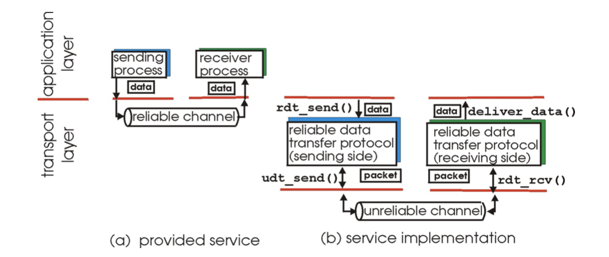
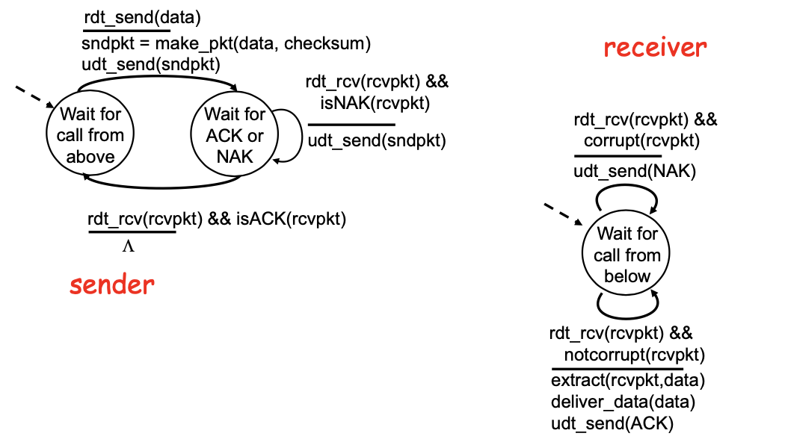
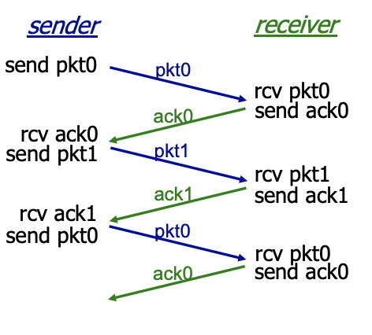
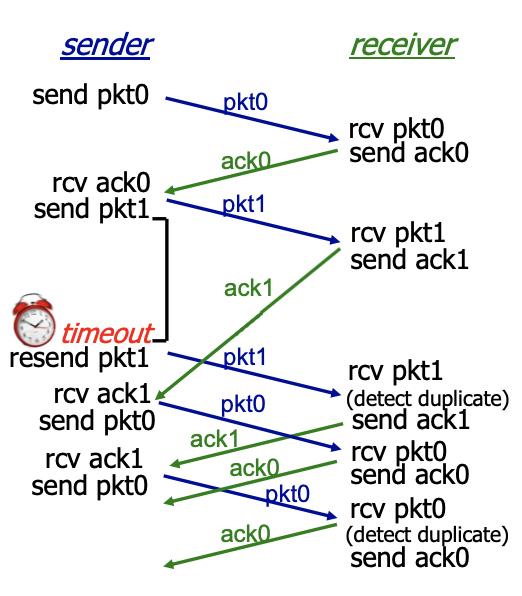

- understand principles behind transport layer services:
  - multiplexing/demultiplexing 多路复用
  - reliable data transfer
  - flow control in TCP
  - congestion control in TCP
- learn about transport layer protocols in the Internet:
  - UDP: connectionless transport 
  - TCP: connection-oriented transport
  - TCP congestion control


<!-- more -->


## 1 Transport-layer services

### Transport vs. application layer

- provide **logical communication** between **app processes** running on different hosts
  > From the application layer's view, it's like talking directly to another address:port in the network
- transport protocols run in end systems 
  - sender: breaks app messages into **segments**, passes to network layer 
  - receiver: reassembles segments into messages, passes to app layer
- more than one transport protocol available to apps
  - Internet: TCP and UDP

### Transport vs. network layer

- network layer: **logical** communication between **hosts**
- transport layer: **logical** communication between **processes**
  -  relies on, enhances, network layer services

### Internet transport-layer protocols


- reliable, in-order delivery (TCP)
  - congestion control 
  - flow control
  - connection setup
- unreliable, unordered delivery: UDP
  - no-frills extension of “best-effort” IP
  > - a simple augmentation of port number based on IP protocol,
  > - also make error-check extension, but no retry strategy
- services not available: 
- delay guarantees
- bandwidth guarantees


## 2 Multiplexing and demultiplexing

**Demultiplexing** at **rcv host**:
- delivering received segments to correct socket

**Multiplexing** at **send host**:
- gathering data from multiple sockets, enveloping data with header (later used for demultiplexing)

> Note, the (de)multiplexing strategy differ w.r.t. the protocol.

**host uses IP addresses & port numbers to direct segment to appropriate socket**


> Two segments coming from **different IP**, but have same **port numbers** will be directed into the **same** UDP socket


### Connectionless Demultiplexing

UDP sockets are identified by two-tuple `(dest IP address, dest port number)`
```
DatagramSocket mySocket1 = new DatagramSocket(99111);
DatagramSocket mySocket2 = new DatagramSocket(99222);
```


> SP = sender port number, DP = destination port number


### Connection-oriented demux

- TCP socket identified by 4-tuple:
  - `source IP address `
  - `source port number `
  - `dest IP address`
  - `dest port number`

- recv host uses all four values to direct segment to appropriate socket
- Server host may support many simultaneous TCP sockets:
  - each socket identified by its own 4-tuple
  - e.g. Web **servers** have different sockets for each connecting client
  - e.g. for each **client**, non-persistent HTTP will have different socket for each request

> Unlike UDP, **several sockets** will be established **on one port**
> - Now `(host address, host pair)` tuple is not enough!


## 3 Connectionless transport: UDP

User Datagram Protocol

::: theorem Why is there a UDP

- no connection establishment (which can add delay)
- simple: no connection state at sender, receiver
- small segment header
- no congestion control: UDP can blast away as fast as desired

> DNS is using UDP

:::


- “no frills,” “bare bones” Internet transport protocol
- “best effort” service, UDP segments may be:
  - lost
  - delivered out of order to app
- connectionless:
  - no handshaking between UDP sender, receiver
  - each UDP segment handled independently of others
- often used for streaming multimedia apps
  - loss tolerant 
  - rate sensitive


### UDP Checksum (校验和)

**Goal**. detect “errors” (e.g., flipped bits) in transmitted segment

**Sender**:
- treat segment contents as sequence of 16-bit integers
- checksum: addition (1’s complement sum) of segment contents
  > - for overflow, add the overflowed bit into the first bit
  > - takes complement
- sender puts checksum value into UDP checksum field
  
**Receiver**:
- compute checksum of received segment
  > - sum together, then sum checksum
  > - if all one, no error detected
- check if computed checksum equals checksum field value:
  - NO - error detected
  - YES - no error detected. *But maybe errors nonetheless?* More later ....

> Why sometimes can't detect, and why ensures a fair performance?

## 4 Principles of reliable data transfer



- `rdt_send()`, shorthand for reliable data trasfer send. called from above (e.g. by app). But the actual tranfer takes place on unreliable channel `udt_send()`.
- Data packed into packet.
- `rdt_rcv()` called when packet arrives, decides **whether** to pass the packet to the upper layer. Then call `deliver_data()` to deliver data to upper.

**characteristics of unreliable channel** will determine complexity of reliable data transfer protocol (rdt)
> The less reliable the channel is, the more complexity in the design of the protocol


### Rdt1.0: over a reliable channel

> The extreme case of an unreliable channel is a reliable channel


- Assume underlying channel perfectly reliable 
  - no bit errors
  - no loss of packets
- separate FSMs for sender, receiver:
  - sender sends data into underlying channel 
  - receiver read data from underlying channel


> The dashed line is the initial state


### Rdt2.0: channel with bit errors

- underlying channel may flip bits in packet m checksum to detect bit errors
- the question: how to recover from errors:
  - **acknowledgements (ACKs)**: receiver explicitly tells sender that pkt received OK
  - **negative acknowledgements (NAKs)**: receiver explicitly tells sender that pkt had errors
  - sender retransmits pkt on receipt of NAK
- new mechanisms in rdt2.0 (beyond rdt1.0):
  - error detection
  - receiver feedback: control msgs (ACK,NAK) rcvr->sender




> - `make_pkt(data, checksum)` in 2.0 compared to `make_pkt(data)` in 1.0


### Rdt2.1: improvement with sequence number

::: warning
- A major flow of `rdt2.0`:
  - What if ACK/NCK corrupted?
    - sender doesn't know what happened at receiver
    - can't just retransmit, possible duplicate?
  - Handling Duplicates
    - sender retransmits current pkt if ACK/NAK garbled
    - sender **adds sequence number to each pkt**
    - receiver discards (doesn't deliver up) duplicate pkt

A Feature of this strategy is **Stop and wait.** sender sends one packet, then waits for receiver response

:::


> How many bits are required for sequence number?
> - Ans: **1**
> - We only need to distinguish between consecutive packets using 0 and 1


### Rdt2.2: a NAK-free protocol

> Are NAK signal really necessary? What about ACK itself? Save a control signal

- instead of NAK, receiver sends ACK for last pkt received (correctly)
  - receiver must explicitly include **seq # of pkt being ACKed**
- duplicate ACK at sender results in same action as NAK: retransmit current pkt

> Shrink NAK and sequence number together


### Rdt3.0: channels with errors and LOSS

**New assumption**: underlying channel can also lose packets (data or ACKs)
- checksum, seq. #, ACKs, retransmissions will be of help, but not enough

**Approach**: sender waits "reasonable" amout of time for ACK (**timeout**)
- retransmits if no ACK received in this time
> The selection of time matters, will be resolved in TCP
- if packet (or ACK) just delayed (not lost)
  - retransmission will be dupliate, but use of seq.#'s already handles this
  - receiver must specify seq # of packet being ACKed
- requires countdown timer


> difference: after sending a packet, it will begin timing. And resent packet if timeout

> Loss during sender -> receiver pkt / receiver -> sender ACK will both leads to a timeout and resending

|  No Loss     |  Packet Loss     |  ACK Loss     |  Premature timeout/delayed ACK     |
|  ---  |  ---  |  ---  |  ---  |
|       |       |        |       |

> - Note, in the last case, sender doesn't need to worry if the `ACK1` corresponds to its `pkt1`, as long as he knows that the `pkt1` is received successfully
> - However, the second `ACK1` will cause the sender to send a duplicate packet (and **always** duplicate packets for all later sending) (a price to pay for!)
> - Fortunately, receiver can detect duplicate. and order can be ensured correct


::: theorem

**Performance of rdt3.0**, an example: 1 Gbps link, 15 ms e-e prop. delay, 1KB packet:

$T_{trans} = \frac{L(packetLength)}{transRate} = \frac{8kb/pkt}{10^9 b/sec} = 8 \mu s$

**Utilization.** fraction of time sender busy sending

$U_{sender} = \frac{L/R}{RTT+L/R} = \frac{0.008ms}{2\times 15ms + 0.008ms} = 0.00027$


### Pipelined Protocols

> By contrast to Stop and Wait

**Pipelining:** sender allows multiple, “in-flight”, yet-to-be-acknowledged pkts
> Increase the utilization of data rate/bandwidth of the network
- range of sequence numbers must be increased 
- buffering at sender and/or receiver
- Two generic forms of pipelined protocols: 
  - go-Back-N, *needs not buffer at receiver end*
  - selective repeat *needs buffer at receiver end*


### Go Back N

**Sender Settings**:
- k-bit seq # in pkt header
- “window” of up to N, consecutive unack’ed pkts allowed
- `ACK(n)`: ACKs **all pkts up to**, including seq # n - “**cumulative** ACK”
  > So that the sender can safely move the `send_base s`
  - may receive duplicate ACKs (see receiver)
- timer for each in-flight pkt
- `timeout(n)`: retransmit pkt n and all higher seq # pkts in window


> - if data waiting to be sent > N, the GBN will refuse the data
> - which means all sequence numbers in the window have been utilized and unavailable
> - a timer will be sent for **base** packet
> - if timeout happens, "go-back-N", from `base` to `nextseq-1` will be resent

> A duplicate ACK index check should be added on receipt of `rcvpkt` and `notcorrput(rcvpkt)`


**Receiver Settings**:

- ACK-only: always send ACK for correctly-received pkt with highest **in-order** seq #
  - may generate duplicate ACKs
  - need only remember `expectedseqnum`
    - to know when all the packets are received
- out-of-order pkt:
  - discard (don’t buffer) -> **no receiver buffering!** 
  - Re-ACK pkt with highest in-order seq #


**Example**


> This diagram may be misleading, according to FSM, pkt 2 time out should start from "ignore duplicate ACK"


> Protocols of this type is called sliding-window protocol


### Selective Repeat


- receiver individually acknowledges all correctly received pkts 
  - buffers pkts, as needed, for eventual in-order delivery to upper layer
- sender only resends pkts for which ACK not received 
  - sender timer for each unACKed pkt
- sender window
  - N consecutive seq #’s
  - again limits seq #s of sent, unACKed pkts


> Later, we will see that receiver window will affect flow control.


**Sender Events**
- data from above :
  - if next available seq # in window, send pkt
- timeout(n):
  - resend pkt n, restart timer 
- ACK(n) in `[sendbase,sendbase+N]`:
  - mark pkt n as received
  - if n smallest unACKed pkt, advance window base to next unACKed seq #

**Receiver Events.**
- pkt n in [rcvbase, rcvbase+N-1]
  - send ACK(n)
  - out-of-order: buffer
  - in-order: deliver (also deliver buffered, in-order pkts), advance window to next not- yet-received pkt
- pkt n in `[rcvbase-N,rcvbase-1]`
  > Though abandoned, delivered to application, seem to be out of business from receiver's perspective. Still unsure whether sender receive the ACK, must be sent so that sender can proceed to move the window forward.
  - ACK(n)
- otherwise:
  - ignore


Every individual has its own ACK and timer, no more cumulative


::: theorem Selective repeat: dilemma

Example: 
- seq#: 0,1,2,3
- window size = 3


all ACKs are lost, sender send pkt0 again, but receiver will put it into the 0 buffer. will deliver a duplicate data to the application


- sender/receiver have no idea of each other's status
- receiver sees no difference in two scenarios!
- incorrectly passes duplicate data as new in (a)

What's the relationship between seq # size and window size is safe?
- seq # > 2 * window size

:::