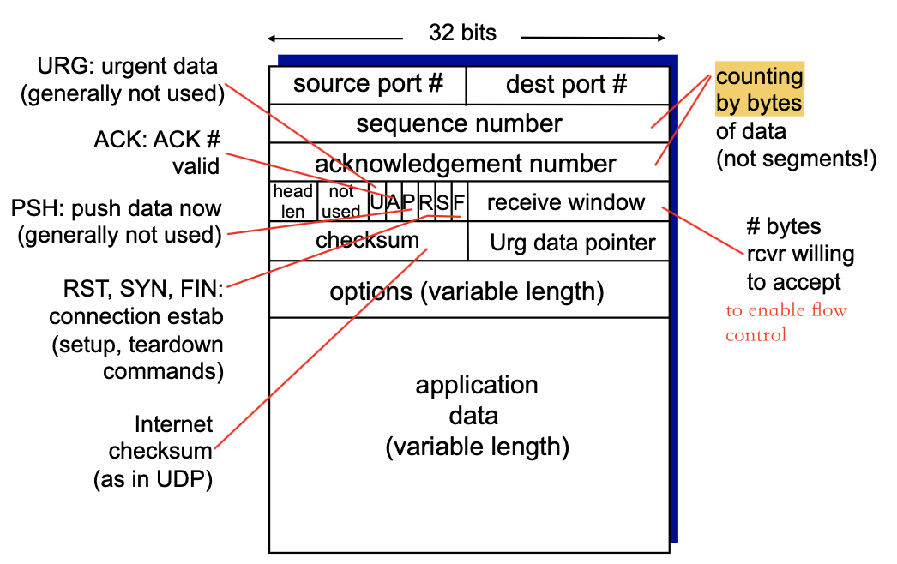

<!-- more -->

## Connection-oriented transport: TCP

- **point-to-point:**
  - one sender, one receiver
- **reliable, in-order byte steam:**
  - no “message boundaries”
- **pipelined:**
  - TCP congestion and flow control set window size
- **full duplex data:** 全双工服务
  - bi-directional data flow in same connection
  - MSS: maximum segment size
  > Exists a upper bound of segment data size
- connection-oriented:
  - handshaking (exchange of control msgs) inits sender, receiver state before data exchange
- flow controlled: 
  - sender will not overwhelm receiver

### segment structure

**sequence numbers:**
- byte stream “number” of the first byte in the segment’s data
- counts by bytes of data

> 
> 
> Assume 2000 Bytes Data, and a TCP can transfer 1000 Bytes, the sequence number of the first segment is 0, for the second segment is 1000

**acknowledgements**
- seq # of next byte expected from other side
- cumulative ACK
> For the example above, the ack for the first segment should be 1000

> Example
> 
> 

### round trip time, timeout

**Intuition**. How to set TCP timeout value?
- should be longer than RTT
  - but RTT varies
- too short $\Rightarrow$ premature timeout, unnecessary retransmissions
- too long $\Rightarrow$ slow reaction to segment loss

**Solution**.  How to estimate RTT?
- `SampleRTT`: measured time from segment transmission until ACK receipt
  - ignore retransmissions
  > Why ignore?
- `SampleRTT` will vary, want estimated RTT “smoother”
  - average several recent measurements, not just current `SampleRTT`

$$
\mathsf{EstimatedRTT} = (1-\alpha)\times \mathsf{EstimatedRTT} + \alpha \times \mathsf{SampleRTT}
$$

- exponential weighted moving average
- influence of past sample decreases exponentially fast
- typical value: a = 0.125

> `Timeout` based on `EstimatedRTT` ?

- timeout interval: `EstimatedRTT` plus **“safety margin”**
  - large variation in EstimatedRTT -> larger safety margin 
- estimate SampleRTT deviation from EstimatedRTT:
$$
\mathsf{DevRTT} = (1-b)\times \mathsf{DevRTT} + b\times|\mathsf{SampleRTT}-\mathsf{EstimatedRTT}|
$$
(typically, $b = 0.25$)

$$
\mathsf{TimeoutInterval} = \mathsf{EstimatedRTT} + 4*\mathsf{DevRTT}
$$

### reliable data transfer

First we consider a simplified TCP sender:
- ignore duplicate acks 
- ignore flow control, congestion control

::: theorem

Sender events:

- data rcvd from app:
  - create segment with seq #
  - seq # is byte-stream number of first data byte in segment
  - start timer if not already running
    - think of timer as for oldest unacked segment
    - expiration interval: TimeOutInterval
- timeout:
  - retransmit segment that caused timeout
  - restart timer 
- ack rcvd:
  - if ack acknowledges previously unacked segments
  - update what is known to be ACKed
  - start timer if there are still unacked segments

Scenerio, A is sender, B is receiver

|  Lost ACK   |  Premature Timeout     |       |
|  ---  |  ---  |  ---  |
|       |       |       |
| Retransmission works fine for single transmission | If the timeout is set to be small, ACK takes longer to return. B will still return ACK 120 for the re-transmission because 100 has been received. | An interesting case, even if ACK=100 is lost, but A still knows B receives by ACK=120! no transmission is required. |

> In TCP, ACK is acumulative!

**Receiver**. **not ACK immediately**, pending strategy as follows!

|  event at receiver     |  TCP receiver action     |
|  ---  |  ---  |
|  arrival of in-order segment with expected seq #. All data up to expected seq # already ACKed     |  delayed ACK. Wait up to 500ms for next segment. If no next segment, send ACK     |
|  arrival of in-order segment with expected seq #. One other segment has ACK pending     |  immediately send single cumulative ACK, ACKing both in-order segments     |
|  arrival of out-of-order segment higher-than-expect seq #. Gap detected     |  immediately send **duplicate ACK**(i.e. send the previously sent ACK again!), indicating seq. # of next expected byte     |
|  arrival of segment that partially or completely fills gap     |  immediate send ACK, provided that segment starts at lower end of gap     |

:::

> How will the duplicate ACK tell the sender to retransmit the segment (Note, in simplified model, only timeout event will trigger retransimission)

::: theorem

**TCP fast retransmit**

**Problem**.
- time-out period often relatively long:
  - long delay before resending lost packet
- detect lost segments via duplicate ACKs.
  - sender often sends many segments back- to-back
  - if segment is lost, there will likely be many duplicate ACKs.

**Solution.**

if sender receives 3 ACKs for same data (“**triple duplicate ACKs**”), (“triple duplicate ACKs”), resend unacked segment with smallest seq #
- likely that unacked segment lost, so don’t wait for timeout
 

:::

::: tip

TCP looks like a mixture of GBN and SR. "selective acknowledge"
- GBN, sender retransmit all > n, but TCP only retransmit at most 1 segment
- SR, separate ACK(n), TCP, acumulative ACK, sender only needs to maintain a base and next seqnum

:::

### flow control

> **Motivation**.
> 
> 

- receiver “advertises” free buffer space by including `rwnd` value in TCP header of receiver-to-sender segments
  - RcvBuffer size set via socket options (typical default is 4096 bytes)
  - many operating systems autoadjust `RcvBuffer`
- sender limits amount of unacked (“in-flight”) data to receiver’s `rwnd` value
- guarantees receive buffer will not overflow

::: tip

**payload**: all the data except TCP header (don't need to be buffered) in the segment

:::

### Connection Management

> Many attacks are based on SYN packet, so it is necessary to init `x` as a random number

#### build connection

TCP 3-way handshake

#### closing a connection

> Why timed wait ?
> 

## Principles of congestion control

> Unlike flow control which aims to avoid overflow on receiver's buffer. Congenstion control avoid the **network** from being  overwhelmed

- manifestations:
  - lost packets (buffer overflow at routers)
  - long delays (queueing in router buffers)
- a top-10 problem!

### Causes/Costs of Congestion Control

#### Scenario I: large queuing delay

- two senders, two receivers
- one router, infinite buffers
- output link capacity: R
- no retransmission
- Assume two hosts have same $\lambda_{in}$

> Router becomes the bottleneck, causing large delay when all the output link capacity is used up

#### Scenario II: decreasing throughput

- one router, finite buffers
- sender retransmission of timed-out packet
  - transport-layer input includes retransmissions 
    $\lambda'_{in}=\lambda_{in}$

> $\lambda_{out}$ no longer grows linearly to $\lambda'_{in}$
> - For receiver's application, it only needs one packet
> - Premature Timeout causes redundant packet to be transmitted, wasting bandwidth

- packets can be lost, dropped at router due to full buffers
- sender times out prematurely, sending two copies, both of which are delivered

**“costs” of congestion**:
- more work (retrans) for given “goodput” *i.e. good $\lambda_{out}$*
- unneeded retransmissions: link carries multiple copies of pkt
  - decreasing goodput

#### Scenario III: affect other links
- four senders
- multihop paths
- timeout/retransmit

As red $\lambda'_{in}$ increases, all arriving blue pkts at upper queue are dropped, blue throughput $\rightarrow$ 0

Since the blue pkts are dropped anyway, its throughput allocated by the left switcher is wasted!

another “cost” of congestion:
- when packet dropped, any “upstream transmission capacity used for that packet was wasted!

## TCP Congestion Control

**A GENERAL approach**: sender increases transmission rate (window size), probing for usable bandwidth, until loss occurs
- **additive increase**: increase `cwnd`(congestion window) by 1 MSS every RTT until loss detected
- **multiplicative decrease**: cut `cwnd` in half after loss

### Details

- sender limits transmission:
  
  `LastByteSent - LastByteAcked <= cwnd`
  > For flow control, RHS will also be restricted by flow control, `min(rwnd,cwnd)`
- cwnd is dynamic, function of perceived network congestion
- which gives an approximate estimation of TCP sending rate:
  
  roughly: send `cwnd` bytes, wait RTT for ACKS, then send more bytes

  `rate ~ cwnd/RTT` bytes/sec

### FSM of TCP Congestion Control

- **Slow Start**: initialize congestion window, duplicate the windows every RTT
- **Congestion Avoidance**: When duplicate to a certain extent, congestion window now grows linearly every one RTT.
- When timeout happens at **Slow Start/Congestion Avoidance**, the sending rate will always be reduced to 1 and return to **Slow Start** state again
- Recall that three duplicate ACKs are obtained, retransmission should be taken. into the **Fast Recovery** state. This state will not immediately reduce `cwnd` to 1, but half the `cwnd`, we don't need to begin from 1 (Not implemented in all TCP, e.g. Tahoe reduce to 1)

TCP treats two indicators differently, considers timeout a more serious indicator of traffic in the network than a single lost packet 

#### Reacting to Loss

- loss indicated by timeout:
  - `cwnd` set to 1 MSS;
  - begins slow start again until `cwnd` *reaches threshold*, then grows linearly
- loss indicated by 3 duplicate ACKs:
  - TCP RENO 
    - dup ACKs indicate network capable of delivering some segments
    - `cwnd` is cut in half window and added in 3 MSS, then grows linearly
    > In e.g. below, 9 = 12 / 2 + 3 
  - TCP Tahoe
    - always sets cwnd to 1 (timeout or 3 duplicate acks)

### TCP Throughput

- avg. TCP thruput as function of window size, RTT? 
  - ignore slow start, assume always data to send
- W: window size (measured in bytes) where loss occurs 
  - avg. window size (# in-flight bytes) is 3⁄4 W
  - avg. thruput is 3/4W per RTT

### Fairness of TCP

fairness goal: if K TCP sessions share same bottleneck link of bandwidth R, each should have average rate of R/K

two competing sessions:
- additive increase gives slope of 1, as throughout increases
- multiplicative decrease decreases throughput proportionally

**Fairness and UDP**
- multimedia apps often do not use TCP
  - do not want rate throttled by congestion control
- instead use UDP:
  - send audio/video at constant rate, tolerate packet loss

**Fairness, parallel TCP connections**
- application can open multiple parallel connections between two hosts
- web browsers do this
- e.g., link of rate R with 9 existing connections:
- new app asks for 1 TCP, gets rate R/10
- new app ask for 11 TCPs, gets R/2