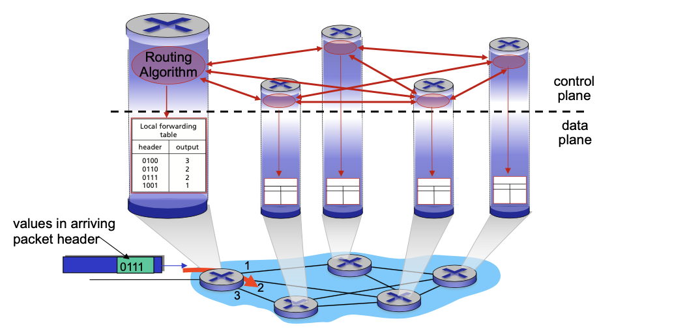
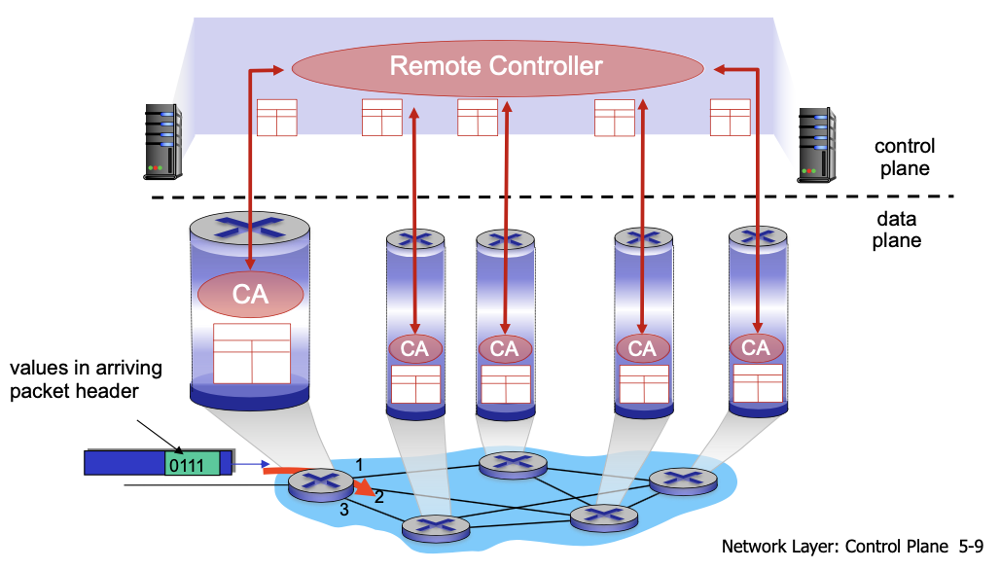
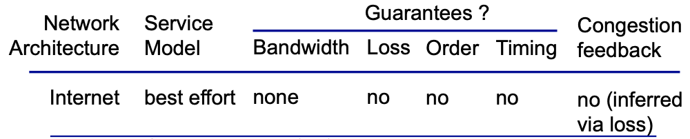
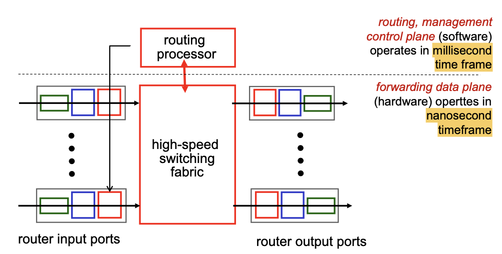
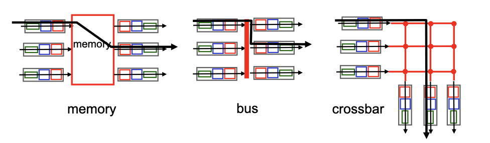
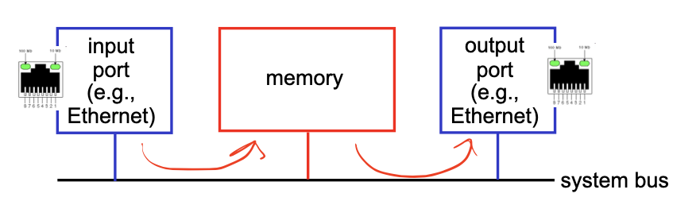
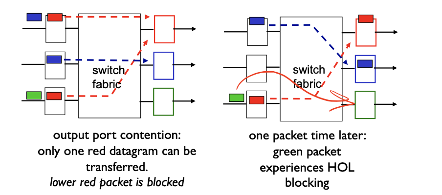
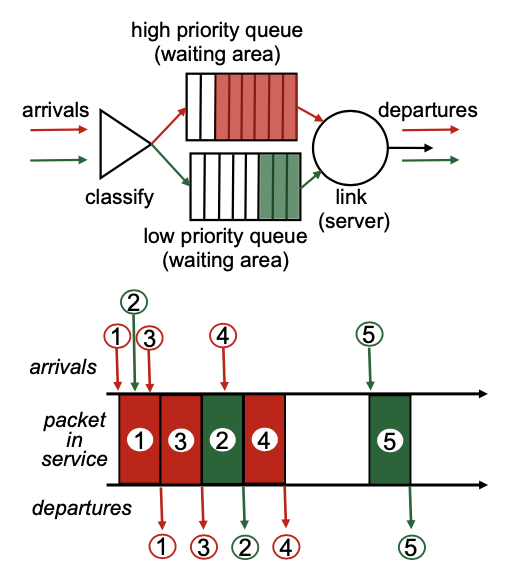
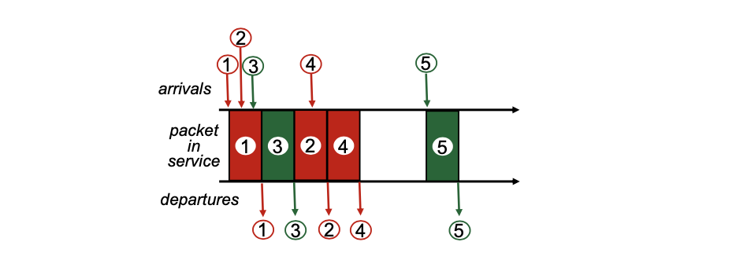

<!-- more -->

## Overview of Network Layer

### Data Plane & Control Plane

**Network-layer Function 1 - forwarding**: move packets from router’s input to appropriate router output

- local,per-router function 
- determines how datagram arriving on router input port is forwarded to router output port
- forwarding function

***

**Network-layer Function 2 - routing**: determine route taken by packets from source to destination

- network-wide logic
- determines how datagram is routed among routers along end-end path from source host to destination host
- two control-plane approaches: 
  - traditional routing algorithms: implemented in routers
  - **software-defined networking (SDN)**: implemented in (remote) servers

### Control Plane Structure

**Per-router control plane** - Individual routing algorithm components in each and every router interact in the control plane

**Logically centralized control plane (SDN)** - A distinct (typically remote) controller interacts with local control agents (CAs)

> SDN has not been put into massive application

### Network service model

## Router

## Input Port Functions

- **line termination**: physical layer, bit level reception
- **link layer protocol**: data link layer, e.g. Ethernet
- **lookup, forwarding, queuing** decentralized switching:
  - using header field values, lookup output port using forwarding table in input port memory (“match plus action”)
  - goal: complete input port processing at ‘line speed’
  - queuing: if datagrams arrive faster than forwarding rate into switch fabric
    > packet loss may happen here

Two forwarding methods:

- **destination-based forwarding**: forward based only on destination IP address (**traditional**)
- **generalized forwarding**: forward based on any set of header field values (SDN)

### Destination-based forwarding

> We can't map each single IP address to a link interface

**longest prefix matching** - when looking for forwarding table entry for given destination address, use longest address prefix that matches destination address.
- usually implemented in **TCAM** (Content addressable memory)

## Switching fabrics

- transfer packet from **input buffer** to appropriate **output buffer**
- switching rate: rate at which packets can be transfer from inputs to outputs
  - often measured as multiple of input/output line rate 
  - N inputs: switching rate N times line rate desirable
- three types of switching fabrics, differing in switching rate
  - memory
  - bus
  - crossbar
> Low switching rate -> long input queuing -> loss of packets

### Switching via memory

first generation routers:
- traditional computers with switching under direct control of CPU
- packet copied to system’s memory
- speed limited by memory bandwidth (2 **bus crossings (->mem->)** per datagram)

### Switching via a bus

- datagram from input port memory to output port memory via a shared bus
  > requires internal solutions to select output port, impl: by adding a label to the packet, only works for internal router
- **bus contention**: switching speed limited by bus bandwidth
- 32 Gbps bus, Cisco 5600: sufficient speed for access and enterprise routers

### Switching via interconnection network

> Switching itself can be a netself

- overcome bus bandwidth limitations
- banyan networks, crossbar, other interconnection nets initially developed to connect processors in multiprocessor
- **advanced design**: fragmenting datagram into fixed length cells, switch cells through the fabric.
  > To further improve switching rate
- Cisco 12000: switches 60 Gbps through the interconnection network

> For bus, only one transimission every time, for interconnection, multiple packets can be transferred if no conflict

### Issue: HOL Blocking

**Head-of-the-Line (HOL) blocking**: queued datagram at front of queue prevents others in queue from moving forward

## Output Ports

> No lookup is needed anymore for output

- **buffering** required when datagrams arrive from fabric faster than the transmission rate
  > Datagram (packets) can be lost due to congestion, lack of buffers
- **scheduling discipline** chooses among queued datagrams for transmission

### Scheduling Mechanisms

- **scheduling**: choose next packet to send on link
- **FIFO (first in first out) scheduling**: send in order of arrival to queue
  - **discard policy**: if packet arrives to full queue: who to discard? 
    - **tail drop**: drop arriving packet
    - **priority**: drop/remove on priority basis
    - **random**: drop/remove randomly

> 
> 
>  The above uses queuing terminologies and notations

#### Priority Scheduling

priority scheduling: send highest priority queued packet
- multiple classes, with different priorities
  - class may depend on marking or other header info, e.g. IP source/dest, port numbers, etc.

> Only after high priorities are sent will low priority be sent

#### Round Robin (RR) scheduling:

- multiple classes
- cyclically scan class queues, sending one complete packet from each class (if available)

#### Weighted Fair Queuing (WFQ):

- generalized Round Robin
- each class gets weighted amount of service in each cycle

## IP: Internet Protocol

### IP datagram format

