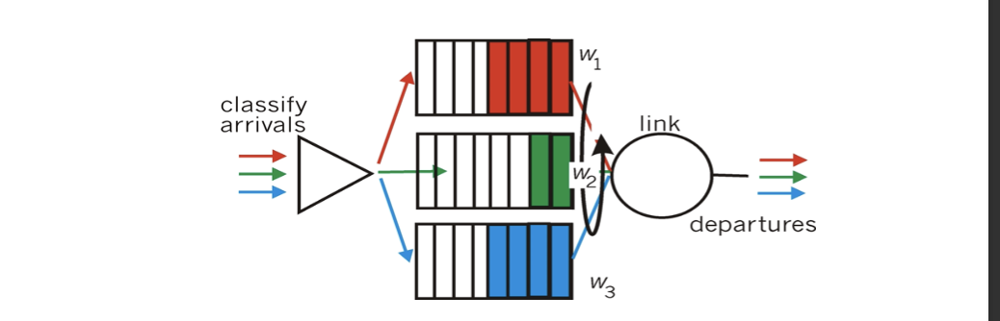

<!-- more -->

## Overview of Network Layer

### Data Plane & Control Plane

**Network-layer Function 1 - forwarding**: move packets from router’s input to appropriate router output

- local,per-router function 
- determines how datagram arriving on router input port is forwarded to router output port
- forwarding function

***

**Network-layer Function 2 - routing**: determine route taken by packets from source to destination

- network-wide logic
- determines how datagram is routed among routers along end-end path from source host to destination host
- two control-plane approaches: 
  - traditional routing algorithms: implemented in routers
  - **software-defined networking (SDN)**: implemented in (remote) servers

### Control Plane Structure

**Per-router control plane** - Individual routing algorithm components in each and every router interact in the control plane

**Logically centralized control plane (SDN)** - A distinct (typically remote) controller interacts with local control agents (CAs)

> SDN has not been put into massive application

### Network service model

## Router

## Input Port Functions

- **line termination**: physical layer, bit level reception
- **link layer protocol**: data link layer, e.g. Ethernet
- **lookup, forwarding, queuing** decentralized switching:
  - using header field values, lookup output port using forwarding table in input port memory (“match plus action”)
  - goal: complete input port processing at ‘line speed’
  - queuing: if datagrams arrive faster than forwarding rate into switch fabric
    > packet loss may happen here

Two forwarding methods:

- **destination-based forwarding**: forward based only on destination IP address (**traditional**)
- **generalized forwarding**: forward based on any set of header field values (SDN)

### Destination-based forwarding

> We can't map each single IP address to a link interface

**longest prefix matching** - when looking for forwarding table entry for given destination address, use longest address prefix that matches destination address.
- usually implemented in **TCAM** (Content addressable memory)

## Switching fabrics

- transfer packet from **input buffer** to appropriate **output buffer**
- switching rate: rate at which packets can be transfer from inputs to outputs
  - often measured as multiple of input/output line rate 
  - N inputs: switching rate N times line rate desirable
- three types of switching fabrics, differing in switching rate
  - memory
  - bus
  - crossbar
> Low switching rate -> long input queuing -> loss of packets

### Switching via memory

first generation routers:
- traditional computers with switching under direct control of CPU
- packet copied to system’s memory
- speed limited by memory bandwidth (2 **bus crossings (->mem->)** per datagram)

### Switching via a bus

- datagram from input port memory to output port memory via a shared bus
  > requires internal solutions to select output port, impl: by adding a label to the packet, only works for internal router
- **bus contention**: switching speed limited by bus bandwidth
- 32 Gbps bus, Cisco 5600: sufficient speed for access and enterprise routers

### Switching via interconnection network

> Switching itself can be a netself

- overcome bus bandwidth limitations
- banyan networks, crossbar, other interconnection nets initially developed to connect processors in multiprocessor
- **advanced design**: fragmenting datagram into fixed length cells, switch cells through the fabric.
  > To further improve switching rate
- Cisco 12000: switches 60 Gbps through the interconnection network

> For bus, only one transimission every time, for interconnection, multiple packets can be transferred if no conflict

### Issue: HOL Blocking

**Head-of-the-Line (HOL) blocking**: queued datagram at front of queue prevents others in queue from moving forward

## Output Ports

> No lookup is needed anymore for output

- **buffering** required when datagrams arrive from fabric faster than the transmission rate
  > Datagram (packets) can be lost due to congestion, lack of buffers
- **scheduling discipline** chooses among queued datagrams for transmission

### Scheduling Mechanisms

- **scheduling**: choose next packet to send on link
- **FIFO (first in first out) scheduling**: send in order of arrival to queue
  - **discard policy**: if packet arrives to full queue: who to discard? 
    - **tail drop**: drop arriving packet
    - **priority**: drop/remove on priority basis
    - **random**: drop/remove randomly

> 
> 
>  The above uses queuing terminologies and notations

#### Priority Scheduling

priority scheduling: send highest priority queued packet
- multiple classes, with different priorities
  - class may depend on marking or other header info, e.g. IP source/dest, port numbers, etc.

> Only after high priorities are sent will low priority be sent

#### Round Robin (RR) scheduling:

- multiple classes
- cyclically scan class queues, sending one complete packet from each class (if available)

#### Weighted Fair Queuing (WFQ):

- generalized Round Robin
- each class gets weighted amount of service in each cycle

## IP: Internet Protocol

### IP datagram format

> how much overhead uptill now?
> - 20 bytes of TCP
> - 20 bytes of IP
> - =40bytes+app layer overhead

### IP fragmentation, reassembly

**Challenges**. network links have MTU (max.transfer size) - largest possible link-level frame
- different link types, different MTUs

large IP datagram divided (“fragmented”) within net
- one datagram becomes several datagrams
- “reassembled” only at final destination
- IP header bits used to identify, order related fragments

### IP addressing

- **IP address**: 32-bit identifier for host, router **interface**
  ::: tip

  To be strict, it is the **interface** not the host/router itself, because a router may have multiple interfaces (e.g. WiFi, physical link)

  :::

- **interface**: connection between host/router and physical link
  - router’s typically have multiple interfaces
  - host typically has one or two interfaces (e.g., wired Ethernet, wireless 802.11)
- **IP addresses associated with each interface**
  
  how are interfaces actually connected will be talked about in later chapters (Ethernet switches/ WiFi base stations)

#### Subnets

- IP address:
  - subnet part - high order bits
  - host part - low order bits
- what’s a subnet ?
  - device interfaces with same subnet part of IP address
  - can physically reach each other **without intervening router**
  > 子网中的设备可以不通过路由器互相通信
- recipe
  - to determine the subnets, detach each interface from its host or router, creating islands of isolated networks
  - each isolated network is called a subnet
  > **subnet mask** 子网掩码
  > - e.g. `223.1.3.0/24` 前24位属于一个子网

> We can count subnets by cutting the network by routers
> 
> 

#### CIDR: Classless InterDomain Routing

> Typically, we have A/B/C class IP, with subnet mask 8/16/24

- **CIDR: Classless InterDomain Routing**
  - subnet portion of address of arbitrary length *(<32)*
  - address format: a.b.c.d/x, where x is # bits in subnet portion of address

#### DHCP: Dynamic Host Configuration Protocol

> Q: How does a host get IP address?

> An **application layer protocol**, but deal with stuffs for Network Layer

- hard-coded by system admin in a file
  - Windows: control-panel->network->configuration- >tcp/ip->properties
  - UNIX: /etc/rc.config
- Advanced: **DHCP: Dynamic Host Configuration Protocol:** dynamically get address from a server 
  - “plug-and-play”

***

**goal**: allow host to dynamically obtain its IP address from network server when it joins network
- can renew its lease on address in use
- allows reuse of addresses (only hold address while connected/“on”)
- support for mobile users who want to join network (more shortly)

**DHCP overview**:
- host broadcasts “DHCP discover” msg (optional)
- DHCP server responds with “DHCP offer” msg (optional) 
- host requests IP address: “DHCP request” msg
- DHCP server sends address: “DHCP ack” msg

![]./(img/04-21-10-42-22.png)

DHCP can return more than just allocated IP address on subnet:
- address of first-hop router for client
- name and IP address of DNS sever
- network mask (indicating network versus host portion of address)

***

#### ISP + ICANN: last step to get address

- Q: how does network get subnet part of IP addr?
  - A: gets allocated portion of its provider ISP’s address space

- how does an ISP get block of addresses?
  - ICANN: Internet Corporation for Assigned
  - Names and Numbers http://www.icann.org/ 
    - allocates addresses
    - manages DNS
    - assigns domain names, resolves disputes

### NAT: network address translation

> Before IPv6 came into use, motivation for NAT

- **motivation**: local network uses just one IP address as far as outside world is concerned:
  - range of addresses not needed from ISP: just one IP address for all devices
  - can change addresses of devices in local network without notifying outside world
  - can change ISP without changing addresses of devices in local network
  - devices inside local net not explicitly addressable, visible by outside world (a security plus)

#### Implementation

NAT router must:
- **outgoing datagrams**: *replace* `(source IP address, port #)` of every outgoing datagram to `(NAT IP address, new port #)` 
  - ... remote clients/servers will respond using (NAT IP address, new port #) as destination addr
  > For all data ?
- **remember** **(in NAT translation table)** every `(source IP address, port #)` to `(NAT IP address, new port #)` translation pair
- **incoming datagrams**: replace `(NAT IP address, new port #)` in dest fields of every incoming datagram with corresponding `(source IP address, port #)` stored in NAT table

#### Remark

- 16-bit port-number field:
  - 60,000 simultaneous connections with a single LAN-side address! 
- NAT is controversial:
  - routers should only process up to layer 3
  > What about IP address in application layer?
  - address shortage should be solved by IPv6
  - violates end-to-end argument
  - NAT possibility must be taken into account by app designers, e.g., P2P applications
  - NAT traversal: what if client wants to connect to server behind NAT?

### IPv6

#### Motivation

- **initial motivation**: 32-bit address space soon to be completely allocated.
- additional motivation:
  - header format helps speed processing/forwarding 
  - header changes to facilitate QoS
- IPv6 datagram format:
  - **fixed-length 40 byte header**
  - **no fragmentation** allowed
  - **priority**: identify priority among datagrams in 
  - **flow flow Label**: identify datagrams in same “flow.” (*However, concept of“flow” not well defined*). 
  - **next header**: identify upper layer protocol for data

- Other changes from IPv4
  - **No checksum**: removed entirely to reduce processing time at each hop
  - options: allowed, but outside of header, indicated by “Next Header” field
  - ICMPv6: new version of ICMP
    - additional message types, e.g. “Packet Too Big” • multicast group management functions

#### Transition from IPv4 to IPv6

- not all routers can be upgraded simultaneously
  - no “flag days”
  - how will network operate with mixed IPv4 and IPv6 routers?
- tunneling: IPv6 datagram carried as payload in IPv4 datagram among IPv4 routers

