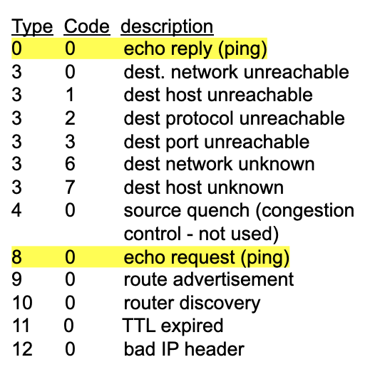

<!-- more -->

Recall: two network-layer functions:
- forwarding: move packets from router’s input to appropriate router output
**data plane**
- routing: determine route taken by packets from source to destination **control plane**

Two approaches to structuring network control plane:
- per-router control (traditional)
- logically centralized control (software defined networking)

## Routing Protocols

**Goal.** determine good paths/routes from sending hosts to receivers, through network of routers

- path: sequence of routers packets will traverse in going from given initial source host to given final destination host
- “good”: least “cost”, “fastest”, “least congested”
- routing: a “top-10” networking challenge!

### Link State

AKA [Dijkstra's Algorithm](../CS222/0928_greedy.md#dijkstra-s-algorithm), omitted, 
- need to have the complete network topology 
- should know all the costs in the network.

> To implement, every node will flood its costs to its neighbors so that everyone in the network can know the topology and link costs.

- computes least cost paths from one node (‘source”) to all other nodes
  - gives forwarding table for that node
- iterative: **after k iterations**, know least cost path to k dest.’s

::: tip Discussion

$O(n\log n)$ complexity for n nodes

> - Initially, all nodes send to their nearest, while c choose randomly between B and D to send
> - "link cost equals amount of carried traffic", We have got a node cost shown in the first figure
> - now the original graph is no longer the shortest path, we have got a shortest path shown in figure 2.

**Issue: osciliation** Now freqeunt switching causes great overhead.

> Tentative solution: async-ly updating forwarding table
:::

### Distance Vector

AKA [Bellman-Ford](../CS222/1019_dp2.md#bellman-ford) equation (dynamic programming)

- $D_{x}(y)=$ **estimate** of least cost from $x$ to $y$
  > in fact, should never be accurate
  - $x$ maintains distance vector $D_{x}=\left[D_{x}(y): y \in N\right]$ 
- node x:
  - knows cost to each neighbor $v: c(x, v)$
  -  **maintains its neighbors' distance vectors**. For each neighbor $\mathrm{v}, \mathrm{x}$ maintains $D_{v}=\left[D_{v}(y): y \in N\right]$
  > also need to store neighbors' distance neighbors
  > - together, a table of (self + neighbors) * all nodes dist vector

key idea:
- from time-to-time, each node sends its own distance vector estimate to neighbors
- when $x$ receives new DV estimate from neighbor, first store it down, then it updates its own DV using B-F equation:
  
  $D_{x}(y) \leftarrow \min _{v}\left\{c(x, v)+D_{v}(y)\right\}$ for each node $y \in N$

  > IF there are changes, the node will also send its own new distance vector estimate to neighbors
- under minor, natural conditions, the estimate $D_{x}(y)$ converge to the actual least cost $\mathrm{d}_{\mathrm{x}}(\mathrm{y})$

::: details Example

:::

**link cost changes:**
- node detects local link cost change 
- updates routing info, recalculates distance vector
- if DV changes, notify neighbors

**“good news travels fast”**

**bad news travels slow** - “count to infinity” problem!

An solution: **poisoned reverse**

- If Z routes through Y to get to X :
  - Z tells Y its (Z’s) distance to X is infinite (so Y won’t route to X via Z)
- will this completely solve count to infinity problem?
  > No
  >
  > 

### Comparison of LS and DV algorithms

|     |  LS     |  DV     |
| ---- |  ---  |  ---  |
| **message complexity** (how many msg to send)    |  with n nodes, E links, O(nE) msgs sent     |  exchange between neighbors only, but convergence time varies, and vulnerable to count-to-infinity      |
| **speed of convergence**    | LS: $O(n^2)$ algorithm requires O(nE) msgs, but may have **oscillations**      | convergence time varies  (*may be routing loops / count-to-infinity problem* )     |
| **robustness**: what happens if router malfunctions?    |   node can advertise incorrect link cost | DV node can advertise incorrect path cost      |
|     |  each node computes only its own table   :)  | each node’s table used by others,  error propagate thru network  :(    |

## intra-AS routing in the Internet: OSPF

> Our routing study so fat is idealized, with identical routers and a flat network
> 
> In practice, we will not store the whole forwarding vector of every host, the network will be overwhelemed by simply exchanging FVs

Solution in the Internet: **administrative autonomy**
- internet = network of networks
- each network admin may want to control routing in its own network

### Making routing scalable

aggregate routers into regions known as **“autonomous systems” (AS) (a.k.a. “domains”)**

> Internet keeps routers in various autonomies - "network of networks"

- intra-AS routing
  - routing among hosts, routers in same AS (“network”)
  - all routers in AS must run same **intra-domain protocol**
  - routers in different AS can run different intra-domain routing protocol
  - gateway router: at “edge” of its own AS, has link(s) to router(s) in other AS’es
- inter-AS routing
  - routing among AS’es
  - **gateways** perform inter- domain routing (as well as intra-domain routing)

> We focus on Intra-routing in this section
> many intro-AS routing protocols availble, we only introduce OSPF

> The design of a forwarding table of a single router involves both intra-AS and inter-AS routing!

Typical Inter-AS algorithms:

- RIP: Routing Information Protocol

- OSPF: Open Shortest Path First

- IGRP: Interior Gateway Routing Protocol

### OSPF (Open Shortest Path First)

- “open”: publicly available
- uses **link-state algorithm**
  - link state packet dissemination
  - topology map at each node
  - route computation using Dijkstra’s algorithm
- router floods OSPF link-state advertisements to all other routers in **entire** AS
  - carried in OSPF messages directly over IP (rather than TCP or UDP)
  - link state: for each attached link

### OSPF “advanced” features

- security: all OSPF messages authenticated (to prevent malicious intrusion)
- **multiple** same-cost **paths** allowed (only one path in RIP)
- integrated uni- and **multi-cast** support:
  - Multicast OSPF (MOSPF) uses same topology data base as OSPF
- **hierarchical** OSPF in large domains.
  > when the domain itself is large
  >
  > Hierarchical OSPF
  >
  >

### Hierarchical OSPF

> Basic idea: divide the autonomous domain again into sub domains

- **two-level hierarchy**: local area, backbone.
  - link-state advertisements only in area
  - each nodes has detailed area topology; only know direction (shortest path) to nets in other areas.
- **area border routers**: “summarize” distances to nets in own area, advertise to other Area Border routers.
- **backbone routers**: run OSPF routing limited to backbone.
- **boundary routers**: connect to other AS’es.

## Internet inter-AS routing

### Inter-AS Tasks

### BGP

- **BGP (Border Gateway Protocol)**: the de facto inter-domain routing protocol
  
  - “glue that holds the Internet together” 
  
- BGP provides each AS a means to:
  - **eBGP**: obtain _subnet reachability_ information from neighboring ASes
  - **iBGP**: propagate reachability information to *all AS-Internal routers*.
  - determine “good” routes to other networks based on reachability information and **policy**
  > Recall, in primitive routers, we only care about cost, but for inter-AS, policy matters a lot!
  
- allows subnet to advertise its existence to rest of Internet: **“I am here”**

### BGP Basics

- **BGP session:** two BGP routers (“peers”) exchange BGP messages *over semi-permanent TCP connection*:
  - advertising **paths** to different destination network prefixes (BGP is a “path vector” protocol)
- when AS3 gateway router 3a advertises path **AS3,X** to AS2 gateway router 2c:
  - AS3 **promises** to AS2 it will forward datagrams towards X
  
    > So BGP is also referred to as **Path Vector Protocol**

### Path attributes and BGP routes

- advertised prefix includes BGP attributes 
  - prefix + attributes = “route”
- two important attributes:
  - `AS-PATH`: list of ASes through which prefix advertisement has passed
  
  - `NEXT-HOP`: IP address of the router interface that begins the AS-PATH
  
    > For simplicity, we won't write out `NEXT-HOP` explicitly in the following examples, but just rememeber that we will store the IP address of the first element in the `AS-PATH` vector for every path attribute
- Policy-based routing:
  - gateway receiving route advertisement uses **import policy** to *accept/decline path* (e.g., never route through AS Y, maybe it charges a lot ... ).
  - AS policy also determines *whether to* **advertise** path to other neighboring ASes
  > determined by AS's own policy

### A running Example

Determined by policy,

- AS2 router 2c receives path advertisement AS3,X (via eBGP) from AS3 router 3a

- Based on AS2 policy, AS2 router 2c accepts path AS3,X, propagates (via iBGP) to all AS2 routers

- Based on AS2 policy, AS2 router 2a advertises (via eBGP) path AS2, AS3, X to AS1 router 1c

gateway router **may learn about multiple paths** to destination: 

- AS1 gateway router 1c learns path *AS2,AS3,X* from 2a

- AS1 gateway router 1c learns path *AS3,X* from 3a

- Based on policy, AS1 gateway router 1c chooses path *AS3,X, and advertises path within AS1* *via iBGP*

### Forwarding Table

`(dest, interface)` for every router.

- `1d`: OSPF intra-domain routing: to get to 1c, forward over outgoing local interface 1

- `1a`: OSPF intra-domain routing: to get to 1c, forward over outgoing local interface 2

### BGP Route Selection

router may learn about more than one route to destination AS, selects route based on:

> Generally, for multiple paths, the selection process will eliminate paths until only one path is left

1. local preference value attribute: policy decision
2. shortest AS-PATH
3. closest NEXT-HOP router: hot potato routing
4. additional criteria

::: tip Hot Potato Routing

Given a net work with OSPF link weights, 2d chooses `2a` to reach `X`  (i.e. table entry `X`, `2a`), 

even though more AS hops to `X`: don’t worry about inter-domain cost!

:::

### Achieving Policy via Advertisements

**Policy Setting:** Suppose an ISP only wants to route traffic to/from its customer networks (does not want to carry transit traffic between other ISPs)

- A advertises path Aw to B and to C 

- B ***chooses not to advertise*** BAw to C:

  > w does not pay B, B would not like to get trafficed by B, B can define its propagate policy

  - B gets no “revenue” for routing CBAw, since none of C, A, w are B’s customers
  - C does not learn about CBAw path

- C will route CAw (not using B) to get to w

> Policy matters a lot, in eliminating long and inefficient paths

- X is *dual-homed:* attached to two networks B and C

- *policy to enforce:* X does not want to route from B to C via X 

  > The client itself can define policy to advertise

  - ..so X will not advertise to B a route to C

### Discussion: Why different Intra-, Inter-AS routing ?

- *policy:*

  - inter-AS: admin wants control over how its traffic routed, who routes through its net.
  - intra-AS: single admin, so no policy decisions needed

-  *scale:*

  - hierarchical routing saves table size, reduced update traffic

    > With OSPF hierachial structure, we can always divide a too large AS into two sub ASs and use inter-AS routing. 

- *performance:*
  - intra-AS: can focus on performance (i.e. prefer fast transmission)
  - inter-AS: policy may dominate over performance

## SDN control plane

Omitted, the genral idea is to import a remote controler.

## ICMP: Internet Control Message Control

- used by hosts & routers to communicate network- level information
  - error reporting: unreachable host, network, port, protocol
  - echo request/reply (used by ping)
- network-layer **“above” IP**:
  - ICMP msgs carried in IP datagrams

- ICMP message: type, code plus first 8 bytes of IP datagram causing error

## Network Management and SNMP

**Motivation.** autonomous systems (aka “network”): 1000s of interacting hardware/software components, 

**network managements** involves many aspects, software or hardware, implementation or deployment, test or monitor, ...

> How to implement the realtime, quality and efficient control?

Typical infrastructure for network management: ***managed devices*** contain ***managed* *objects*** whose data is gathered into a ***Management Information Base (MIB)***

### SNMP protocol

Two ways to convey MIB info, commands:

> Request/Response mode requires managing entity to periodically request status from the managed device
>
> Trap mode, for emergency contingency, the managed device can actively raise trap message to the managing entity

The SNMP messages have two formats. details omitted.

## Summary

- approaches to network control plane
  - per-router control (traditional)
  - logically centralized control (software defined networking)
- traditional routing algorithms
  - implementation in Internet: **OSPF, BGP**
- SDN controllers
- Internet Control Message Protocol 
- network management