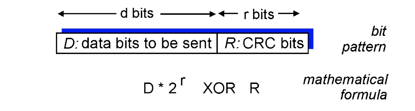

*our goals:*

- understand principles behind link layer services:
  - error detection, correction

    > Recall in TCP, error detection for segment, retransmission on failure
    >
    > For link layer, just correct it! (flip the bit)

  - sharing a broadcast channel: multiple access 

  - link layer addressing

  - local area networks: Ethernet, VL ANs

- instantiation, implementation of various link layer technologies

<!-- more -->

## Introduction

### Terminologies

- any device that runs a link-layer protocol (hosts, routers, switches, wifi access points) : **nodes**
- communication channels that connect adjacent nodes along communication path: **links**
  - wired links
  - wireless links 
  - LANs
- layer-2 packet: **frame**, encapsulates datagram

***data-link layer*** has responsibility of transferring datagram from one node to ***physically adjacent*** node over a link

### Context

- datagram transferred by different link protocols over different links:
  - e.g., Ethernet on first link, 
  - frame relay on intermediate links, 
  - 802.11 on last link
  
- each link protocol provides different services 
  - e.g., may or may not provide rdt over link

### Services

> Link layer will not only add headers, but also trailors!

- **framing, link access:**
	
	- encapsulate datagram into frame, adding header, ***trailer***
	- channel access if shared medium
	- “MAC” addresses used in frame headers to identify source, destination
	  - different from IP address!
	
- *reliable delivery between adjacent nodes*

  - we learned how to do this already (chapter 3)!

  - **seldom used** on low bit-error link (fiber, some twisted pair)

  - wireless links: high error rates

     - *Q:* why both **link-level**(for every link) and **end-end reliability**?

       > pure end-end will bring about great overhead

- *error detection*:
  
  - errors caused by signal attenuation, noise.
  - receiver detects presence of errors:
    - signals sender for retransmission or <u>drops frame</u>
- *error correction:*
  
  - receiver identifies ***and corrects*** bit error(s) without resorting to retransmission

### Implementation

- in each and every host

- link layer implemented in “adaptor” (aka *network interface card* NIC) or on a chip
  - Ethernet card, 802.11 card; Ethernet chipset
  - implements link, physical layer

- attaches into host’s system buses
- combination of hardware, software

- sending side:
  - encapsulates datagram in frame
  - adds error checking bits, rdt, etc.

- receiving side
  - looks for errors, rdt, etc.
  - extracts datagram, passes to upper layer at receiving side

## Error Detection

Pack the datagram into following two parts, **add EDC in trailor parts**

- **EDC**: Error Detection and Correction bits (redundancy)
- **D**: Data protected by error checking, may include header fields
- Error detection not 100% reliable!
  - protocol may miss some errors, but rarely
  - larger EDC field yields better detection and correction

> What are error checking strategies?

### Parity Checking

- **Single bit parity**, detect **single**(not multiple) bit errors (add 1 bit infomation for every d data bits, either even parity or odd parity)

  > X parity means with the extra bit the total number of 1 is X

- **Two dimensional bit parity**, can detect **and correct** single bit errors

  

  > For two errors, can detect but not correct

### Internet Checksum

mentioned in transmission layer.

### Cyclic Redundancy Check

::: warning

Must understand, may appear in exam

:::

- More powerful error-detection coding

- view databits, **D**, as a binary number

- choose `r+1` bit pattern (generator), **G**

- goal: choose r CRC bits, **R**, such that

  - `<D,R>` exactly divisible by G (modulo 2, i.e. when adding, no carry, works like XOR)

  - receiver knows G, divides `<D,R>` by G. If non-zero remainder, error detected.

  - can detect all **burst(continuous) errors** less than r+1 bits 

    > (all?)

- widely used in practice (Ethernet, 802.11 WiFi)

> Note `1010-1001=110` because we are modula 2

## Multiple Access Protocols

- two types of “links”: 
  - point-to-point
    - PPP for dial-up access

- *broadcast (shared wired or wireless medium)* (more common)
  - Ethernet
  - upstream HFC
  - 802.11 wireless LAN

**Problem**. Single shared broadcoast channel but with two or more simultaneous transmissions by nodes will trigger interference

- ***collision*** if node receives two or more signals at the same time

***multiple access protocol***.

- distributed algorithm that determines how nodes share channel, i.e., determine when node can transmit

- communication about channel sharing must use channel itself! 

  - no out-of-band channel for coordination

    > Will cause problems when the scale of the network is large

### Ideal MAP

*given:* broadcast channel of rate R bps

*desiderata of multiple access protocol:*

1. when one node wants to transmit, it can send at rate R.

2. when M nodes want to transmit, each can send at average rate R/M

3. fully decentralized:

   - no special node to coordinate transmissions

   - no synchronization of clocks, slots 
4. simple

### Overview of MAC protocols

- **Channel partitioning**
  - divide channel into pieces, allocate them for exclusive use
  - w.r.t. time slots, frequence or encoding (CDMA, code division multiple access)

- **Random Access**
  - channel not divided, allow collisions
  - recover from collisions

### Channel Partitioning MAC

#### TDMA: Time Division Multiple Access

- each node is assigned access to channel in **fixed** "rounds"

- problem: unused slots go idle

  > violates the first ideal desiderata

#### FDMA: Frequency Division Multiple Access

- channel spectrum divided into **fixed**  frequency bands

- unused transmission time in frequency bands go idle

  > also violates the first ideal desiderata

### Random Access

> We don't assign fixed band/round for a node

- When node has packet to send,
  - transmit at full data rate
  - no a **priori** coordination among nodes
- Two or more transmitting nodes -> collisions
- random access MAC protocol specifies:
  - How to detect collisions
  - how to recover collisions (e.g. via **delayed** retransmissions)

#### Slotted ALOHA

> a conceptual protocol, with a lot of assumptions, not practical

**Assumptions.**

- all frames same size

- time divided into equal size slots ( and. = time to transmit one frame )

- nodes start to transmit only at slot beginning

- nodes are synchronized

- if 2 or mode nodes transmit in slot, all nodes detect collision

  > in pratice, if a node is very far, it may notice the collision very later

**Operations.**

- when node has a fresh frame to send, transmits in next slot
  - if no collisions, node can send next frame in next slot
  - if collision: node retransmits frame in each subsequent slot **with prob. p** until success

**Example.**

*Pros:*

- single active node can continuously transmit at full rate of channel
- highly decentralized: only slots in nodes need to be in sync
- simple

Cons:

- collisions, wasting slots

- idle slots

- nodes may be able to detect collision in less than time to transmit packet

- clock synchronization

> The cons of Slotted ALOHA is such that we present the following analysis

**Inefficiency Analysis.**

**Define. efficiency** is the long run fraction of successful slots

**Suppose**. `N` nodes, each transmit in slot with prob `p`, 

Then prob that given node has success in a slot $=p(1-p)^{N-1}$, prob that any one of the node has a success $= Np(1-p)^{N-1}$

> when a large number of nodes have many frames to transmit, then (at best) only 37 percent of the slots do useful work

**Goal.** maximize $Np(1-p)^{N-1}$ for $p^*$, by taking $N\rightarrow\infty$, $\max=\frac{1}{e} = 0.37$

*at best:* channel used for useful transmissions 37% of time!

#### Pure (unslotted) ALOHA

- unslotted Aloha: simpler, no synchronization 
- when frame first arrives
  - transmit immediately
- collision probability increases:
  - frame sent at $t_0$ collides with other frames sent in $[t_0- 1, t_0+1]$

**Efficiency.**

even worse than slotted Aloha.

#### CSMA (carrier sense multiple access)

> Recall for ALOHA, send (maybe with prob) as long as we need to transmit
>
> For CSMA, listen before transmit. **Carrier Sensing**载波监听

- if channel sensed idle: transmit entire frame

- if channel sensed busy, defer transmission

  > The waiting time may be chosen wisely or randomly

  - human analogy: don’t interrupt others!

- **Collisions can still occur**: propagation delay means two nodes may not hear each other’s transmission

- **collision**: entire packet transmission time wasted

  - distance & propagation delay play role in in determining collision probability

    spatial layout of nodes

> For original CSMA, even if collision has happened, it will still continue broadcasting the entire packet (entire transmission time wasted)

#### CSMA/CD (with collision detection)

> sending and listening, when transmitting, still keep listening for collision

- *CSMA/CD:* carrier sensing, deferral as in CSMA 
  - collisions *detected* within short time
  - colliding transmissions aborted, reducing channel wastage 
- collision detection: **How?**
  -  easy in wired LANs: measure signal strengths, compare transmitted, received signals
  - difficult in wireless LANs: received signal strength overwhelmed by local transmission strength

> Therefore, CSMA/CD is usually adopted by wired Ethernet

**Ethernet CSMA/CD Algorithm Implementation**.

1. if NIC senses idle, starts, else wait until channel idle

2. if NIC transmits entire frame without detecting another transmission, NIC is done

3. if NIC detects another transmission while transmitting, abort

   > When to retransmit?

4. After aborting, NIC enters **binary (exponential) backoff** 二进制指数退避

   - after mth collision, NIC chooses K at random from $\{0,1,2,...,2^{\min(m,thr)}-1\}$ and waits for the time for sending $K\cdot 512$ bits, returns to step2
   -  (likely) longer backoff interval with more collisions

**Efficiency.** long-run fraction of time during which frames being transmitted on the channel without collisions  (many nodes, all with many frames to send) (same as ALOHA)

- $\mathrm{T}_{{prop }}=$ max prop delay between 2 nodes in LAN 

- $\mathrm{t}_{{trans }}=$ time to transmit max-size frame
  
  $$
  efficiency =\frac{1}{1+5 t_{ {prop }} / t_{ {trans }}}
  $$

  > the derivation is complicated, we only give the conclusion
  
- efficiency goes to as $t_{\text {prop }}$ goes to 0

- as $t_{\text {trans }}$ goes to infinity

- better performance than ALOHA: and simple, cheap, decentralized!

> CSMA/CD: collision detection
>
> CSMA/CA: collision avoidance (not mentioned in lecture, on textbook, suitable for mobile networks)

