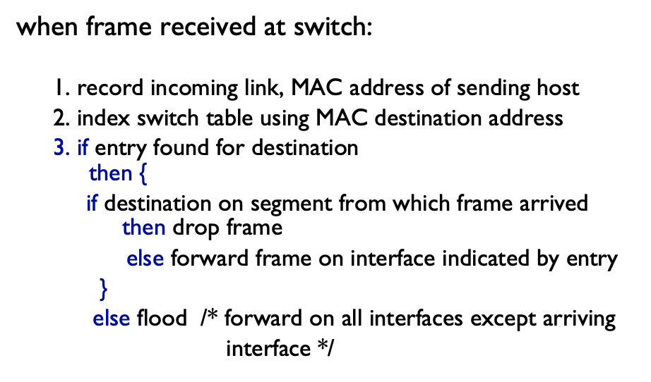
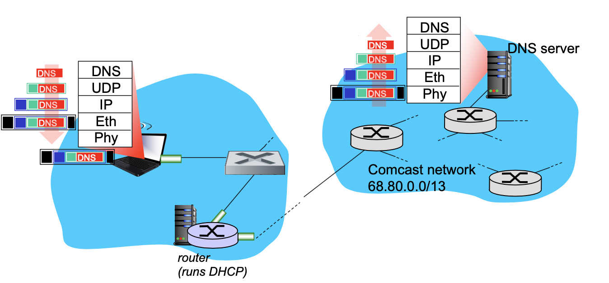

<!-- more -->

## LANS

> Why do we need MAC instead of IP
>
> - With MAC, the receiver can check whether it is receiving the packet (that is sent to him), for those with different MAC address, it does not have to send it upwards (or check the error-sum for every frame ...)
> - Only those MAC-desiginated packets require processing. For other frames, just pass them to others.

## MAC address and ARP

Recall, 32-bit IP address:

- network-layer address for interface
- used for layer 3 (network layer) forwarding

MAC (or LAN or physical or Ethernet) address:

- function: *used ‘locally” to get frame from one interface to another physically-connected interface (same network, in IP- addressing sense)*
- 48 bit MAC address (for most LANs) **burned in NIC ROM**(跟随网卡定死，authorized by IEEE, 从而保证每张网卡物理地址都不同), also sometimes software settable
  - e.g. IA-2F-BB-76-09-AD
- each adapter on LAN has **unique** ***LAN* address**

- MAC address allocation administered by IEEE

- manufacturer buys portion of MAC address space (to assure uniqueness)

- analogy:

  - MAC address: like Social Security Number 

  - IP address: like postal address

    > When you move to another place, your postal address may change, but your id won't change!

- MAC flat address ➜ portability

  - can move LAN card from one LAN to another

- IP hierarchical address *not* portable

  > IP address: dependent on protocol, you have to obtain a new IP when ported to a new network

  - address depends on IP subnet to which node is attached

### ARP: address resolution protocol

> *Question:* how to determine interface’s MAC address, knowing its IP address?

***ARP table:*** each IP node (host, router) on LAN has table

- IP/MAC address mappings for some LAN nodes:

  `< IP address; MAC address; TTL>`

  > The mapping is not persistent. e.g. when you move to another classroom, your old IP may be allocated to another device, so we have TTL

- TTL (Time To Live): time after which address mapping will be forgotten (typically 20 min)

### Routing in same LAN

> Note, every host (local router) has its own ARP table

1.  A wants to send datagram to B
   - B’s MAC address not in A's ARP table
2. A broadcasts ARP query packet, containing B's IP address
   - destination MAC address = `FF-FF-FF-FF-FF-FF`
   - all nodes on LAN receive ARP query

3. B receives ARP packet, replies to A with its (B's) MAC address
   - frame sent to A’s MAC address (unicast)
4. A **caches (saves)** IP-to- A’s ARP table until information becomes old (times out)
   - soft state: information that times out (goes away) unless refreshed

- ARP is “plug-and-play”:
  - nodes create their ARP tables *without intervention from net administrator*

### Routing to another LAN

walkthrough: send datagram from A to B via R

- focus on addressing – at IP (datagram) and MAC layer (frame) 
- assume A knows B’s IP address (e.g. through DNS)
- assume A knows IP address of first hop router, R (how? ARP)
- assume A knows R’s MAC address (how? ARP)

1. A creates IP datagram with IP source A, destination B
   A creates link-layer frame with **R's MAC address** as destination address, frame contains A-to-B IP datagram

   

2. frame sent from A to R
   frame received at R, datagram removed, passed up to IP

3. R forwards datagram with IP source A, destination B
   R creates link-layer frame with B's MAC address as destination address, frame contains A-to-B IP datagram

   

4. B receives!

   

## Ethernet

“dominant” wired LAN technology:

- single chip, multiple speeds (e.g., Broadcom BCM5761) 
- first widely used LAN technology
- simpler, cheap
- kept up with speed race: 10 Mbps – 10 Gbps

### physical topology

- *bus:* popular through mid 90s

  - all nodes in same collision domain (can collide with each other)

- hub: layout like star, but when one interface receives a bit, it will forward this bit to every other interfaces

- *star:* prevails today

  - active *switch* in center

  - each “spoke” runs a (separate) Ethernet protocol (nodes do not collide with each other)

    > Spoke ～ "辐条" link between switch and host, therefore simultaneous sending won't cause collision due to the existence of switch

### Ethernet frame structure

sending adapter encapsulates IP datagram (or other network layer protocol packet) in **Ethernet frame**

- ***preamble:***

  - 7 bytes with pattern 10101010 followed by one byte with pattern 10101011
  - used to synchronize receiver, sender clock rates

- ***addresses**:* 6 byte source, destination MAC addresses

  - if adapter receives frame with matching destination address, or with broadcast address (e.g. ARP packet), it passes data in frame to network layer protocol
  - otherwise, adapter discards frame

- ***type:*** indicates higher layer (i.e. which network layer) protocol (mostly IP but others possible, e.g., Novell IPX, AppleTalk) 

- ***CRC:*** cyclic redundancy check at receiver

  - error detected: frame is **dropped**

    > Because regardless of collision, a wired network has little prob. to cause error

  - No error correction

### Ethernet: unreliable, connectionless

- *connectionless:* no handshaking between sending and receiving NICs

- *unreliable:* receiving NIC doesn't send acks or nacks to sending NIC
  - data in dropped frames recovered only if initial sender uses higher layer rdt (e. g. , TCP), otherwise dropped data lost

- Ethernet’s MAC protocol: unslotted ***CSMA/CD with binary backoff***

## Ethernet Switch

- **link-layer device: takes an *active* role**
  - store, forward Ethernet frames

  - examine incoming frame’s MAC address, **selectively** forward frame to one-or-more outgoing links when frame is to be forwarded on segment, uses CSMA/CD to access segment

    > unlink segment in UDP, segment here refers to link

- **transparent**
  - hosts are unaware of presence of switches

    > To be specifc, Switches in Ethernet **don't have MAC address**

- *plug-and-play, self-learning*
  * switches do not need to be configured

### Switch: *multiple* simultaneous transmissions

-  hosts have dedicated, direct connection to switch
-  switches buffer packets
-  Ethernet protocol used on *each* incoming link, but no collisions; full duplex
  - each link is its own collision domain
- ***switching:*** A-to-A’ and B-to-B’ can transmit simultaneously, without collisions

> Q. How does switch know A' reachable to A via interface 1?
>
> A. each switch has a switch table, for each entry `<MAC address of host, inferface to reach host, timestamp>`, like a routing table
>
> Q. How maintain?
>
> A. No protocol is used, the switch is ***'self-learning'***

### Self-learning

-  switch *learns* which hosts can be reached through which interfaces
  - when frame received, switch “learns” location of sender: incoming LAN segment(link)
  - **records** sender/location pair in switch table

>  Policy: **Selective Sent (on just one link) or Flood**

### Interconnecting switches

*Q:* sending from A to G - how does S1 know to forward frame destined to G via S4 and S3?

*A:* self learning! (works exactly the same as in single-switch case!)

### Switches VS Routers

both are store-and-forward:

- *routers:* network-layer devices (examine network- layer headers)

- *switches:* link-layer devices (examine link-layer headers)

both have forwarding tables:

- *routers:* compute tables using **routing algorithms**, IP addresses

- *switches:* **learn** forwarding table using flooding, learning, MAC addresses

## VLAN

*Consider:*

- CS user moves office to EE, but wants connect to CS switch?

- single broadcast domain:
  - all layer-2 broadcast traffic (ARP, DHCP, unknown location of destination MAC address) must cross entire LAN
  - security/privacy, efficiency issues

### Port-based VLAN

switch(es) supporting VLAN capabilities can be configured to define multiple **virtual** LANS over single physical LAN infrastructure.

> Certain switches have such features...

switch ports grouped (by switch management software) so that ***single*** physical switch operates as **multiple** virtual switches

> Can specify which ports correspond to one LAN

### Benefits of VLAN

- ***traffic isolation:*** frames to/from ports 1-8 can *only* reach ports 1-8

  > avoid useless flooding

- **dynamic membership**: ports can be dynamically assigned among VLANs

  > Can move one computer from EE to CS within Software

- **forwarding between VLANS:** done via routing (just as with separate switches)
  - in practice vendors sell combined switches plus routers

    > i.e. we don't actually need an extra router

### VLANS spanning multiple switches

> What if two switches with VLAN configured are physically linked together?

> naive implementation (every link for every VLAN defined LAN) won't work because we have to support dynamically ports and plug-and-use

- ***trunk port:*** carries frames between VLANS defined over multiple physical switches

  > Simpler physical implementation requires more complicated SW protocol

  - frames forwarded within VLAN between switches can’t be vanilla 802.1 frames (must carry ***VLAN ID*** info)
  - 802.1q protocol adds/removed additional header fields for frames forwarded between trunk ports

### VLAN Format

not discussed in detail

## MPLS

Multiprotocol label switching (MPLS)

omitted

## Data Center Networks

details omitted

- Server Racks
- TOR (top of rack) switch
- Tier-2/Tier-1 switches
- **Load balancer**: application-layer routing
  - receives external client requests
  - directs workload within data center
  - returns results to external client (hiding data center internals from client)
- 

> However, tree-layout makes the network vulnerable, what's the solution?

- rich interconnection among switches, racks:
  - increased throughput between racks (multiple routing paths possible)
  - increased reliability via redundancy

> Therefore, the data center has its own application/transport layer protocol such as data center-TCP, etc.

## Synthesis: a day in life

### DHCP: Connecting to the Internet

- connecting laptop needs to get its own IP address, addr of first-hop router, addr of DNS server: use ***DHCP***
-  DHCP request **encapsulated** in **UDP**, encapsulated in **IP**, encapsulated in **802.3** Ethernet
- Ethernet frame **broadcast** (dest: FFFFFFFFFFFF) on **LAN**, received at router running **DHCP** server
- Ethernet **demuxed** to IP demuxed, UDP demuxed to DHCP

- DHCP server formulates ***DHCP ACK*** containing client’s IP address, IP address of first-hop router for client, name & IP address of DNS server

- encapsulation at DHCP server, frame forwarded (**switch learning**) through LAN, demultiplexing at client
- DHCP client receives DHCP ACK reply

*Client now has IP address, knows name & addr of DNS server, IP address of its first-hop router*

### ARP (before DNS, before HTTP)

- before sending ***HTTP*** request, need IP address of www.google.com: ***DNS***
- DNS query created, encapsulated in UDP, encapsulated in IP, encapsulated in Eth. To send frame to router, need MAC address of router interface: **ARP**
- **ARP query** broadcast, received by router, which replies with **ARP reply** giving MAC address of router interface

*client now knows MAC address of first hop router, so can now send frame containing DNS query*

### Using DNS

- IP datagram containing DNS query forwarded via LAN switch from client to 1st hop router
- IP datagram forwarded from campus network into Comcast network, routed (tables created by **RIP, OSPF, IS-IS** and/or **BGP** routing protocols) to DNS server

- demuxed to DNS server

- DNS server replies to client with IP address of google

### TCP connection carrying HTTP

- to send HTTP request, client first opens TCP socket to web server

- TCP **SYN segment** (step 1 in 3- way handshake) inter-domain routed to web server

- web server responds with **TCP SYNACK** (step 2 in 3-way handshake)

- TCP **connection established**!

### HTTP request/reply

- **HTTP request** sent into TCP socket

- IP datagram containing HTTP request routed to
   www. google. com

-  web server responds with **HTTP reply** (containing web page)
-  IP datagram containing HTTP reply routed back to client

## Summary

- principles behind data link layer services: 
  - error detection, correction
  - sharing a broadcast channel: multiple access
  - link layer addressing
- instantiation and implementation of various link layer technologies
  - Ethernet
  - switched LANS, VLANs
    - *concept, application and implementation*
  - ~~virtualized networks as a link layer: MPLS~~

- synthesis: a day in the life of a web request

