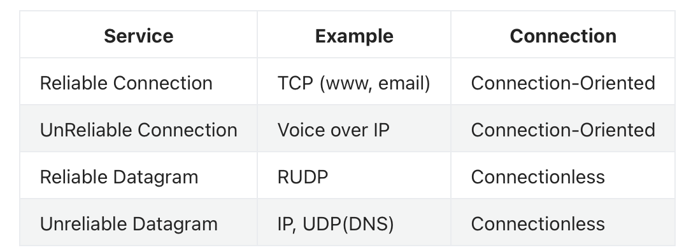

<!-- more -->

1. Introduction (**concepts and calculation**)
    protocol layers; service models; network edge; network core; delay, loss, and throughput
2. Application Layer (**concepts and very light calculation**) sockets; HTTP; cookies; web caches; DNS
3. Transport Layer (**concepts and very light calculation**) UDP; TCP
4. Network Layer (**concepts and calculation**)
    control plane and data plane concepts; IP; routing protocols; intra-AS routing; inter-AS routing; ICMP
5. Link Layer (**concepts and calculation**)
    error detection and correction; multiple access protocols; LANs
6. Security (**concepts**)
    basic objectives; basic concepts of cryptography; authentication

## Chapter 1 Introdution

### Topics

- Internet overview
  - “nuts and bolts” view, a service view,

- what’s a protocol?

  > Concept, application, usage
  >
  > Typical priciples of several protocols

- network edge, core, access network

  > i.e. Components of the network
  >
  > You should master the following concepts, their difference

  - Bandwidth vs Data Rate

    > Bandwidth(Hz), Data Rate(bit/s)
    >
    > what's the relation? - Shannon's Theorem

  - DSL vs Cable Modem

    > Early methods to access the Internet

  - packet-switching versus circuit-switching

    > network core (switching technology)
    >
    > difference, the utility of the two methods w.r.t. network resources
    >
    > e.g. Circuit ~ FDM/TDM, direct multiplexing
    >
    > Packet ~ used as needed, statistical multiplexing
    >
    > Why multiplexing, (recall we have a slide and example calculating how many users will be supported with circuit/packet switching)
  
- Throughput, delay, loss

  > Reason of loss: (majorly) router buffer
  >
  > Components of delay: nodal processing + queuing + transmission + propagation, and their definition

- Internet/ISP structure

  > Another view for the network (ISP, hierachical)
  >
  > Explain how an email from SJTU to USA through ISPs

- protocol layering and service models

  > Layering!
  >
  > OSI-7 layer / 4-layer /  our course (common) ~ 5 layer 
  >
  > The correspondance of service model to applications
  >
  > - e.g. what service model streaming video should use
  > - perspectives: reliable? connection?
  > - 应该要考：
  > - 

### Guidelines

(**concepts and calculation**)
 protocol layers; service models; network edge; network core; delay, loss, and throughput

## Chapter 2 Application Layer

- Application architectures 
  - client-server, P2P, hybrid

    > features, 
  
- application service requirements:
  
  > Typical considerations include:
  
  - reliability, bandwidth, delay
  
- Internet transport service model
  
  - connection-oriented, reliable: TCP
  - unreliable, datagrams: UDP
  
- specific protocols: 
  - HTTP
  
    > concept of different versions
  
  - FTP
  
  - SMTP, POP, IMAP
  
  - DNS
  
    > very important, 
  
- Cookies, Web caches

  > their corresponding utility
  >
  > recall an example of web caches, saving retrival time

- socket programming

### Guidelines

(**concepts and very light calculation**) sockets; HTTP; cookies; web caches; DNS

## Chapter 3 Transport Layer

- principles behind transport layer services: 
  - multiplexing, demultiplexing
  - reliable data transfer
  - flow control
  - congestion control

- instantiation, implementation in the Internet
  - UDP
  - TCP(segmentstructure,reliabledatatransfer,flow control, connection management, congestion control)

## Chapter 4 Network Layer-Data Plane

- Overview of Network layer: data plane and control plane
- What’s inside a router
- IP: Internet Protocol
  - datagram format
  - fragmentation
  - IPv4 addressing
  - NAT
  - IPv6

## Chapter 5 Network Layer-Control Plane

- approaches to network control plane
  - per-router control (traditional)
  - logically centralized control (software defined networking)
- routing protocols
  - link state
  - distance vector
- intra-AS routing: OSPF
- inter-AS routing: BGP
- Internet Control Message Protocol
- network management

## Chapter 6 Link Layer

- principles behind data link layer services: 
  - error detection, correction
  - sharing a broadcast channel: multiple access
    - Time Division
    - Frequency Division
    - Aloha，CSMA，CSMA/CD
  - link layer addressing

- instantiation and implementation of various link layer technologies
  - Ethernet
  - switched LANS, VLANs

## Chapter 8 Security

What is network security?

Principles of cryptography

Message integrity

authentication

Securing e-mail

