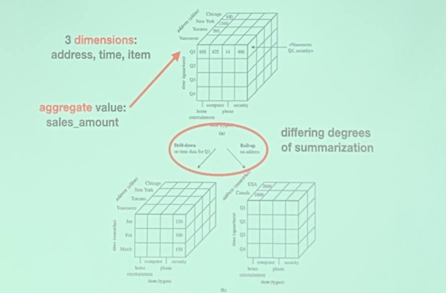
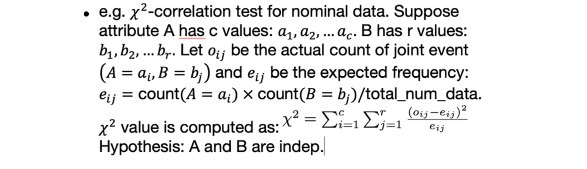
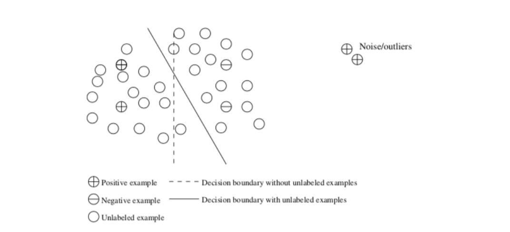

<!-- more -->

## Course Logistics

- 50% Course works, 4 Kaggle-in-Class Competitions
- 10% Assignment
- <10% In-class Quizzes
- 30%~40% Course project, Poster/Demo, IEEE double-column 5-page report (2-3/group)

## What is Data Mining

Knowledge Discovery from Data
1. Data cleaning
2. Data integration
3. Data selection
4. Data transformation 
   > data preprocessing
5. Data mining
   > may interact with user or a knowledge base
6. Pattern Evaluation
   > interesting if
   > 1. easily understood
   > 2. valid on new dataset
   > 3. potentially useful
   > 4. novel
7. Knowledge Presentation

## What kind of data can be mined

data source
- database
  - relational queries
  - aggregate
- **data warehouse**
  - from multiple sources, but with same schema
  - **data cube**: a multidimensional data structure
    - **dimension** is an attribute or a set of attributes
    - each **cell** stores aggregate measure
    - operations include **rill-down, roll-up**
  > 
- transaction data
  - ID + list of items
  - mining **frequent itemsets**
- more...
  - sequence, graph, spatial, ...

::: details difference between database and data warehouse

warehouse has
- a larger amout of data
- unified schema
database has
- dynamic data, usually current status
- diverse schema s

:::

## What kinds of knowledge can be mined

### Characterization

summary the general characteristics of a class of data
- methods: statistical measures and plots, data cube roll-up
- outputs: pie charts, bar charts, curves and data cube

### Discrimination

compare between different types
- e.g. compare the general features of books with 1M+ or 5K- sales
- methods and outputs same as characterization

### Association and Correlation
- e.g. **frequent itemset**, a set of items that frequently appear together in a transactional dataset
- leads to associations
  - `buys (X, "computer") => buys (X, "software")` `[support = 1%, confidence = 50%]`
  - **confidence** like conditional probability
  - **support** in #% of all transactions

### Prediction
> Based on association and correlation analysis, we can ...

1. **Classification** method: predict discrete category, through
   - IF-THEN rules
   - decision trees
   - Neural Networks
2. **Regression** method: predict numerical data
3. **Clustering** method: predict unlabeled
4. **Outlier** e.g., uncover unusual usage of credit cards

## What are the technologies

### Statistical Model

- mean, median, mode, proximity measure
- $\mathcal{X}^2$-correlation **hypothesis test**
  - e.g. $\mathcal{X}^2$-correlation to check A and B are independent if $\mathcal{X}^2$ value is ...
  > 

### Machine Learning

- Supervised learning, unsupervised learning, semi-supervised learning (/w unlabeled examples), ...
  > 
  >
  > We can exploit unlabeled examples to help improve the boundary

::: details difference between data mining and machine learning

- data mining focuses on the workflow, aiming at finding various types of pattern/knowledge, more manual effort
- machine learning is the study of algorithms that are performed automatically, aiming at eliminating human effort

:::

### Database Systems and Data Warehouses

data mining uses scalable database technologies to achieve high **efficiency** and **scalability**

### Information Retrieval

differ from database systems in that:
1. data under search are unstructured
> Are more likely to find information in file systems
2. queries are formed by keywords

method: probabilistic models
- e.g., language model, topic model...

## Applications

1. Frequent Item Set Mining
2. Page Ranking
3. Ads Display
4. Information Extraction
   > extract info from CV
5. Computer Vision
6. Interactive Recommendation
   > exploration and exploitation

