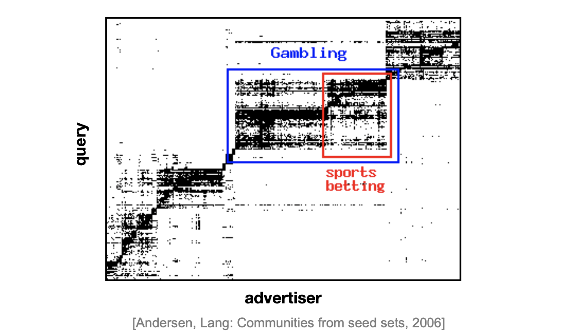
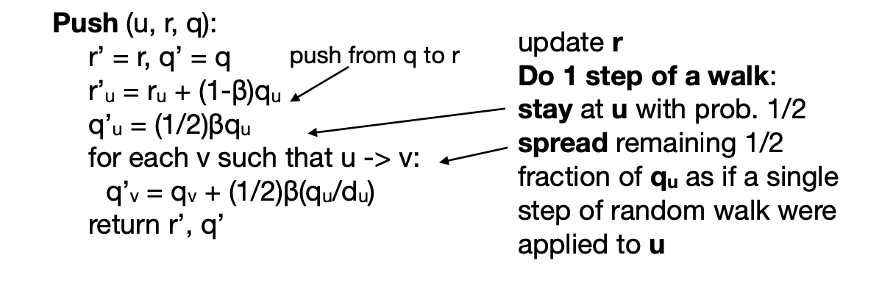
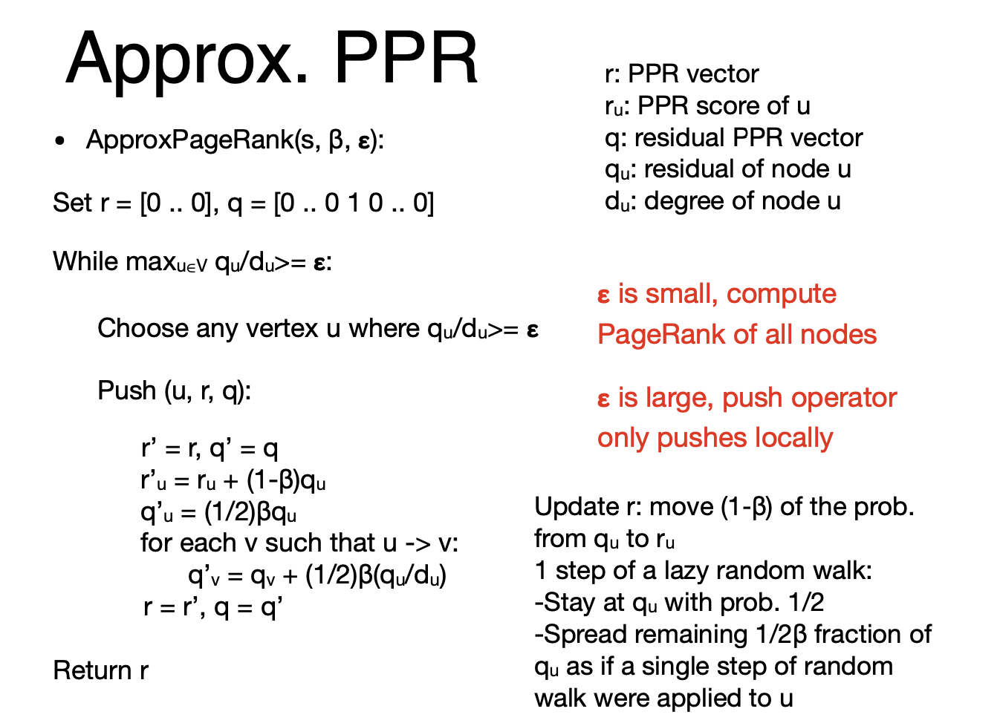
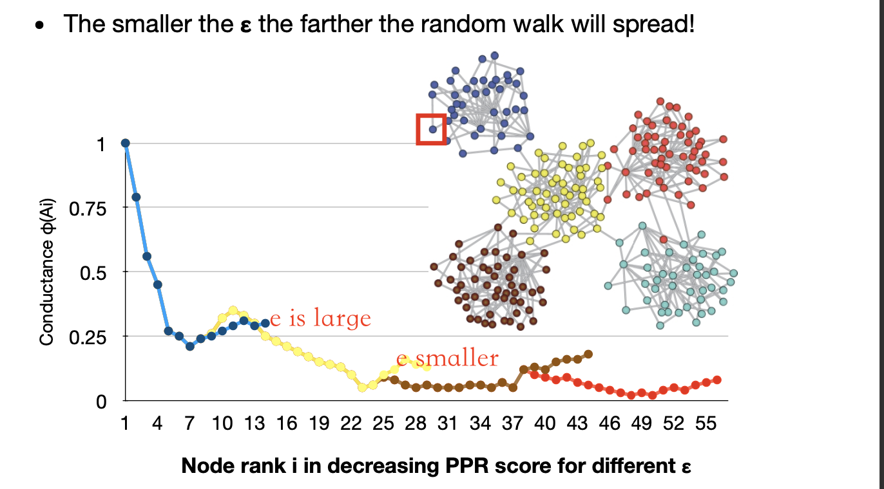
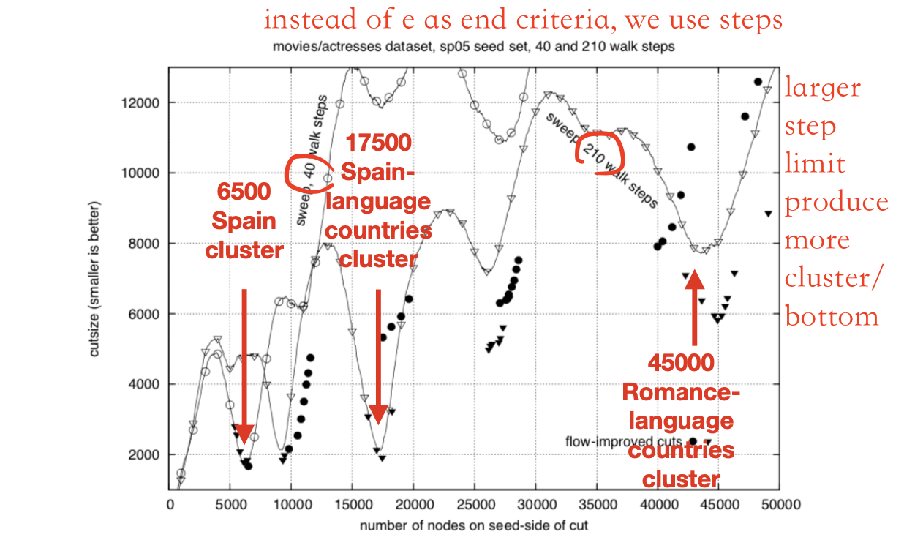
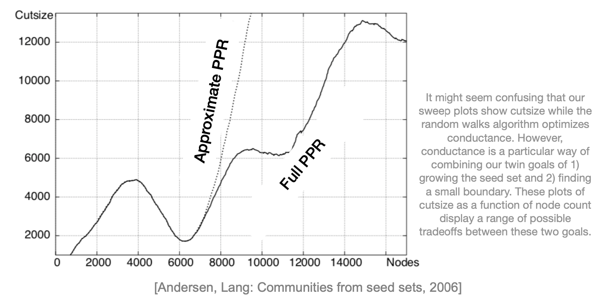
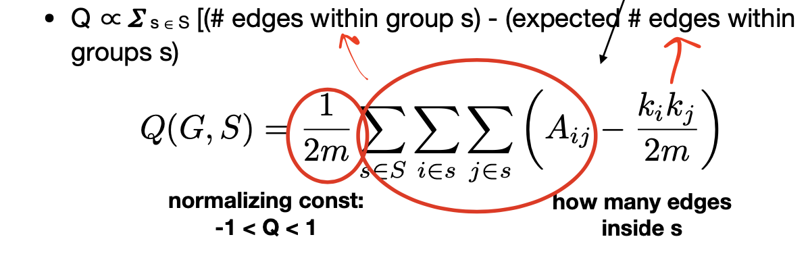
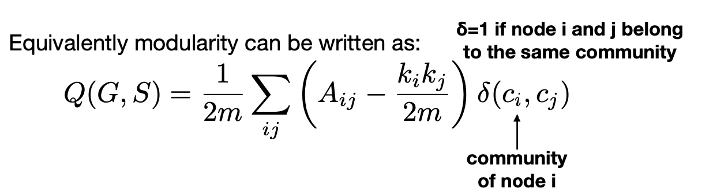
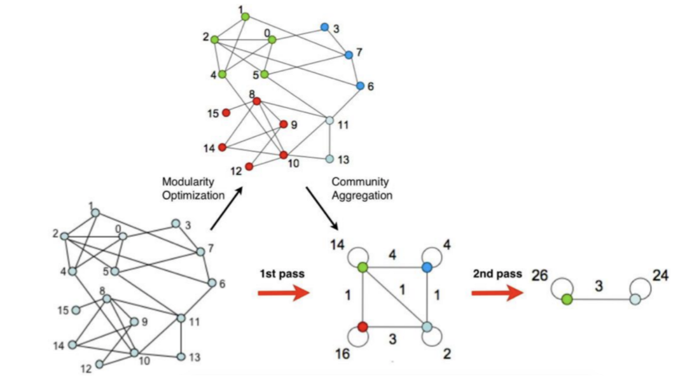

<!-- more -->

Analysis on Graph Strucutre can provide insights into clusters between nodes.

A "brute force" solution: compute proximity for every pair of vertices, partition the columns/rows in the proximity matrix.

## PageRank based Clustering

We will introduce a PageRank based algorithm for finding dense clusters
- Runtime of the algorithm should be proportional to the **cluster size (instead of graph size!)**

### Idea: Seed Nodes
> Within clusters, a jump will be mostly likely to fall within the cluster (**trapped in**), and once it jumps out of the cluster, it will hardly fall back to the cluster(**diffused away in others**)

### Algorithm outline
- Pick a seed node s of interest
- Run **PPR** with teleport set = {s}
- Sort the nodes by the decreasing PPR score
- Sweep over the nodes and find good clusters

> The first **good bottom** in PPR score implies that at this point a good cluster is formed.
>
> Other bottoms may also exist.

### What makes a good cluster?

**Question.** How to measure a "good" cluster

> Recall for clustering, we have cohesion, diameter, ...
> 
> What about on graph?

- Idea: Divide vertices into 2 disjoint groups A, B=V\A
- Maximize the number of within-cluster connections *volume*
- Minimize the number of between-cluster connections *surface*

> Surface is defined as cut, volume is total edge counts, same 量纲

Criterion: **Conductance** - connectivity of the group to the rest of the network relative to the density of the group
$$
\min\phi(A)=\frac{|\{(i, j) \in E ; i \in A, j \notin A\}|}{\min (\mathrm{vol}(A), 2 m-\mathrm{vol}(A))}
$$
- m: number of edges of the graph
- E: edge set of the graph
- di: degree of node
- vol(A): total weight of the edges with at least one endpoint in A:
$$
\mathrm{vol}(A)=\sum_{i \in A} d_{i}
$$
vol(A) $=2^{*}$ #edges inside $A$ + #edges pointing out of $A$

### Algorithm : Sweep

Alg. outline:
  - Pick a seed node s of interest
  - Run PPR w/ teleport={s} 
  - Sort the nodes by the decreasing PPR score
  - Sweep over the nodes and find good clusters

**Sweep.**
- Sort nodes in decreasing PPR score $r_{1}>r_{2}>\ldots>r_{n}$
- For each i compute $\phi\left(A_{i}=\left\{r_{1}, \ldots r_{i}\right\}\right)$
- Local minima of $\phi\left(A_{i}\right)$ correspond to good clusters

The whole Sweep curve can be computed in **linear time**:
> Local Algorithm
- For loop over the nodes
- Keep hash-table of nodes in a set Ai
- To compute $\phi\left(A_{i+1}\right)=\mathrm{Cut}\left(A_{i+1}\right) / \mathrm{Vol}\left(A_{i+1}\right)$
- ${ - } \mathrm{Vol}\left(A_{i+1}\right)=\mathrm{Vol}\left(A_{i}\right)+d_{i+1}$
- $\mathrm{Cut}\left(A_{i+1}\right)=\mathrm{Cut}\left(A_{i}\right)+d_{i+1}-2 \#\left(\right.$ edges of $u_{i+1}$ to $\left.A_{i}\right)$

### Algorithm: PPR

- How to compute Personalized PageRank (PPR) without touching the whole graph?
- Power method won’t work since each single iteration accesses all nodes of the graph:

$$r^{(t+1)} = \beta M \cdot r^{(t)} + (1 - \beta)a$$
  - a is a teleport vector: $a = [0 ...0 1 0 ... 0]^T$
  - r is the personalized PageRank vector

Approximate PageRank [Andersen, Chung, Lang,’ 07]
- A fast method for computing approximate Personalized PageRank (PPR) with teleport set = {s}
- ApproxPageRank (s, $\beta$, $\epsilon$): (seed node, teleportation param., approx. error param.)

### Appriximate PPR
<!--TODO-->

Overview of the approximate PPR
- Lazy random walk: a variant of a random walk that stays put with prob. $1 / 2$ at each time step, and walks to a random neighbour the other half of the time:
$$
r_{u}^{(t+1)}=\frac{1}{2} r_{u}^{(t)}+\frac{1}{2} \sum_{i \rightarrow u} \frac{1}{d_{i}} r_{i}^{(t)}
$$

- Keep track of **residual PPR score**
  $$q_u = p_u - r_u^{(t)}$$
  "true" pagerand - estimate at round t
  - Residual tells us how well PPR score $p_u$ of u is approximated
  - If residual qu of node u is too big: $q_u / d_u \ge \epsilon$ then push the walk further (distribute some residual qu to all u’s neighbours along out-coming edges), else don’t touch the node

::: theorem 
- A different way to look at PageRank: [Jeh\&Widom. Scaling Personalized Web Search, '02]
    $$
    p_{\beta}(a)=(1-\beta) a+\beta p_{\beta}(M \cdot a)
    $$
  - $\mathrm{p}_{\beta}(\mathrm{a})$ is the true PageRank vector with teleport param. $\beta$, and teleport vector a
  - $\mathrm{p}_{\beta}(\mathrm{M} \cdot \mathrm{a})$ is the PageRank vector with teleportation vector $\mathrm{M} \cdot \mathrm{a}$ and teleportation param. $\beta$
    - where $\mathrm{M}$ is the stochastic PageRank transition matrix
    - Notice: $\mathrm{M} \cdot \mathrm{a}$ is one step of a random walk

- Proving $p_{\beta}(a)=(1-\beta) a+\beta p_{\beta}(M \cdot a)$
- Break the prob. into two cases:
  - Walks of length 0
  - Walks of length longer than 0
- The prob. of length 0 walk is $1-\beta,$ and the walk ends where it started, with walker distribution a
- The prob. of walk length $>0$ is $\mathbf{\beta}$, and the walk starts at distribution a, takes a step, (ends in distribution **Ma**), then takes the rest of the random walk to with distribution $\mathrm{p}_{\beta}(\mathrm{M} \cdot \mathrm{a})$
  - By **memoryless nature of the walk**: after we know the location of the 2nd step of the walk has distribution **Ma**, the rest of the walk can forget where it started and behave as if it started at **Ma**

:::

### Push operation

Idea: apply the above theorem into 1 step of lazy random walk from node $u$

**Intuition Behind**.
- If $q_u$ is large, this means that we have underestimated the importance of node u
- Then we want to take some of that residual ($q_u$) and give it away, since we have too much of it
- So we keep $(1/2)\beta q_u$ and then give away the rest to our neighbors to get rid of it corresponding to the spreading of $(1/2)\beta q_u/d_u$ term
- Each node wants to keep giving away this excess PageRank until all nodes have no or a very small gap in excess PageRank

### Algorithm

### Anlaysis

- Runtime:
  - PageRank-Nibble computes PPR in time $\left(\frac{1}{\epsilon(1-\beta)}\right)$ with residual error $<=\boldsymbol{\varepsilon}$
  - Power method would take time $O\left(\frac{\log n}{\epsilon(1-\beta)}\right)$
- Graph cut approx. guarantee:
  - If there exists a cut of conductance $\phi$ and volume $\mathrm{k}$ then the method finds a cut of conductance $\quad O(\sqrt{\phi \log k})$

- The smaller the $\epsilon$ the farther the random walk will spread!

> For a larger community detection, we need smaller $\epsilon$ or more steps

## Modularity Maximization

> Any other measures for community?

**Definition.** Modularity Q
- A measure of how well a network is partitioned into communities
- Given a partitioning of the network into group $s\in S$
- $Q \propto \sum_{s\in S}$ [(# edges within group s) - (**expected** # edges within groups s)]

### Null Model: Configuration Model
> What is expected # of edges?

- Given real G on n nodes and m edges, construct rewired network G’
  - Same degree distribution but random connections
  - Consider G’ as a multigraph (allow multiple edges between a pair of nodes)
  - The expected number of edges between nodes i and j of degrees ki and kj equals to: $k_i \cdot k_j /(2m)$
  > each edge out of i has probability to connect to j, every edge connect to j has probability $k_j/2m$

  

- Modularity values take range [-1, 1]
  - It is positive if the number of edges within groups exceeds the expected number
  - Q greater than 0.3-0.7 means significant community structure

Idea: We identify communities by **maximizing modularity**

### Louvain Method
> local, greedy algorithm

Each pass is made of 2 phases:
- Phase 1: Modularity is **optimized** by allowing only local changes of communities
- Phase 2: The identified communities are **aggregated** in order to build a new network of communities
- Go to Phase 1

The passes are repeated **iteratively** until no increase of modularity is possible!

### Phase 1 Partitioning

- For each node i, the alg. performs two calculations:
  - Compute the modularity gain (ΔQ) when putting node i from its current community into the community of some neighbour j of i
  - Move i to a community that yields the largest modularity gain (ΔQ)
- The loop runs until no movement yields a gain

- What is $\Delta \mathrm{Q}$ if we move node i to community $\mathrm{C} ?$
$$
\Delta \mathrm{Q}(\mathrm{i} \rightarrow \mathrm{C})=\left[\frac{\sum_{i n}+k_{i, i n}}{2 m}-\left(\frac{\sum_{t o t}+k_{i}}{2 m}\right)^{2}\right]-\left[\frac{\sum_{i n}}{2 m}-\left(\frac{\sum_{t o t}}{2 m}\right)^{2}-\left(\frac{k_{i}}{2 m}\right)^{2}\right]
$$
- where:
    - $\Sigma in$ the sum of the weights of the links inside $C$
    - $\Sigma tot$ the sum of the weights of all links to nodes in $C$ 
    - $k i$ the sum of the weights (i.e., degree) of all links to node $i$ 
    - $k i,in,$ the sum of the weights of links from node $i$ to nodes in $C$ 
    - $m$ is the sum of the weights of all edges in the graph
- Also need to compute $\Delta \mathrm{Q}(\mathrm{D} \rightarrow \mathrm{i})$ of taking node i out of community D
$$
\Delta \mathrm{Q}=\Delta \mathrm{Q}(\mathrm{i} \rightarrow \mathrm{C})+\Delta \mathrm{Q}(\mathrm{D} \rightarrow \mathrm{i})
$$

### Phase 2 Restructuring

The partitions obtained in the 1st phase are contracted into super- nodes, and the weighted network is created as follows:
  - Super-nodes are connected if there is at least one edge between nodes of the corresponding communities
  - The weight of the edge between the two super-nodes is the sum of the weights from all edges between their corresponding partitions
The loop runs until the community configuration does not change anymore

> Remember to make a self-loop on the super node

> The number of passes is based on the need of users
