**Idea**: Feature lerning in graphs $f:v \Rightarrow\mathbb{R}^n$, so that the graph can be represented in $|V| \times n$ matrix, instead of $|V|\times|V|$ (e.g. Applications: 2D-embedding)

**Challenges**: 
- Complex topographical structure (no spatial locality like grids)
- But networks are far more complex!
- No fixed node ordering or reference point Often dynamic and have multimodal features

We introduce two meethods (DeepWalk/Node2Vec) to find node embeddings

<!-- more -->

## Setup

- Assume we have a graph G:
  - V is the vertex set
  - A is the adjacency matrix (assume binary)
  - No node features or extra information is used!

Goal is to encode nodes so that **similarity in the embedding space** (e.g., dot product) approximates **similarity in the original network**

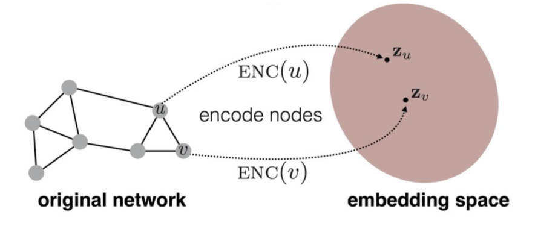

For the similarity in embedding space, we already have
- similarity $(u,v)=z_v^T z_u$ in embedding space (cosine similaritiy, assume normalized)

TODO:
1. Define an **encoder** (i.e., a mapping from nodes to embeddings)
   $$ENC(v)=\mathbf{z}_v$$
   from node in the input graph to a d-dimensional embedding (as small as possible)
2. Define a **node similarity function** (i.e., a measure of similarity in the original network)
3. Optimize the **parameters** of the encoder so that:

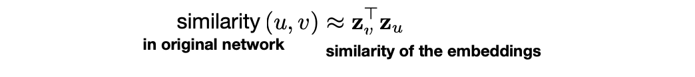

### "Shallow" Encoding

Simplest encoding approach: encoder is just an **embedding-lookup**

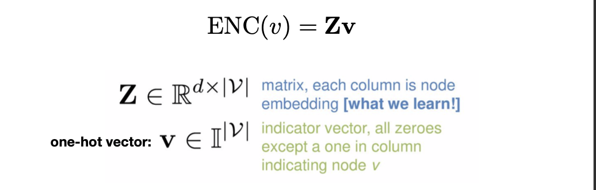

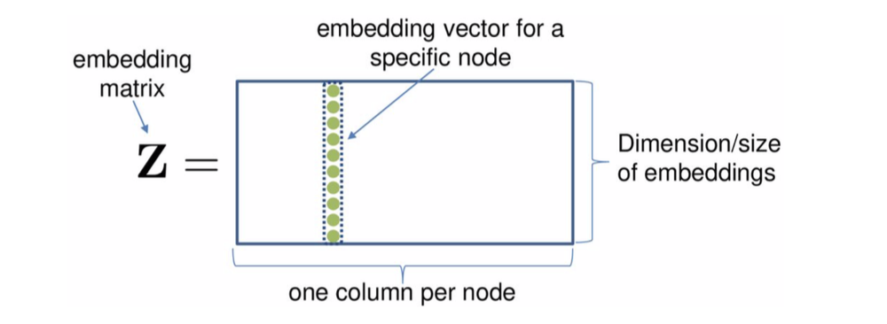

Each node is assigned a unique embedding vector

Many methods: DeepWalk, node2vec, LINE ...

> Too simple, the optimization solution space is still very large

### Define Node Similarity

Key choice of methods is how they define node similarity

E.g., should two nodes have similar embeddings if they ...
- are connected?
- share neighbors?
- have similar “structural roles”?
- ...

## DeepWalk

> Recall in Topic-Specific PageRank, we use random walk instead of power iteration to solve
> 
> We will learn embedding based on random walk statistics

Idea:

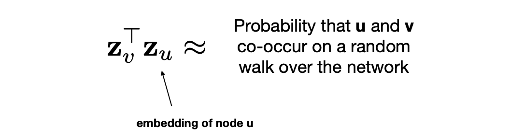

### Solution

1. Estimate probability of visiting node $v_j$ on a random walk starting from node $v_i$ using some random walk strategy $R$

2. Optimize embeddings to encode these random walk statistics:

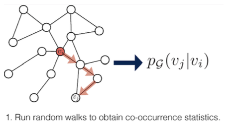

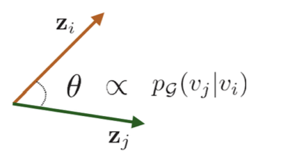

1. Expressivity: Flexible stochastic definition of node similarity that incorporates both **local and higher-order (i.e. neighbor of neighbor)** neighbourhood information
2. Efficiency: Do not need to consider all node pairs when training; only need to consider pairs that co-occur on random walks

### Unsupervised Feature Learning as Optimization

- **Intuition**: Find embedding of nodes to d-dimensional space so that node similarity is preserved
- **Idea**: Learn node embedding such that nearby nodes are close together in the network
- Given a node u, how do we define nearby nodes?
  - $N_{R}(u)$ neighborhood of u obtained by some strategy R

- Given $G=(V, E)$
- Our goal is to learn a mapping $z: u \rightarrow \mathbb{R}^{d}$
- Log-likelihood objective:
    $$
    \max _{z} \sum_{u \in V} \log P\left(N_{R}(u) \mid z_{u}\right)
    $$
  - where $N_{R}(u)$ is neighborhood of node $\mathrm{u}$
- Given node u, we want to learn feature representations predictive of nodes in its neighborhood $N_{R}(u)$

#### Random Walk Optimization

1. Run short fixed-length random walks starting from each node on the graph using some strategy $\mathrm{R}$
2. For each node u collect $N_{R}(u)$, the multiset of nodes visited on random walks starting from $\mathrm{u}$
$N_{R}(u)$ can have repeat elements since nodes can be visited multiple times on random walks
3. Optimize embeddings according to: Given node u, predict its neighbors $N_{R}(u)$
$$
\max _{z} \sum_{u \in V} \log P\left(N_{R}(u) \mid z_{u}\right)
$$

Assumption: Conditional likelihood factorizes over the set of neighbors:
$$
\log P\left(N_{R}(u) \mid z_{u}\right)=\sum_{v \in N_{R}(u)} \log P\left(z_{v} \mid z_{u}\right)
$$
> so that we can work on the embedding space

Softmax parametrization
$$
P\left(z_{v} \mid z_{u}\right)=\frac{\exp \left(z_{v} \cdot z_{u}\right)}{\sum_{n \in V} \exp \left(z_{n} \cdot z_{u}\right)}
$$

> Why softmax? We want node $v$ to be most similar to node $\mathrm{u}$ (out of all nodes). Intuition:
> $$
> \sum_{i} \exp \left(x_{i}\right) \approx \max _{i} \exp \left(x_{i}\right)
> $$
> use softmax to link similarity -> probabilit

Putting it all together:

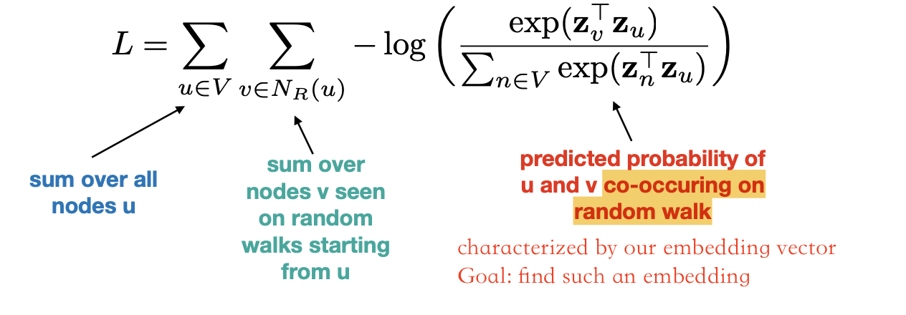

Optimizing random walk embeddings = Finding node embeddings z that minimize L

## Node2Vec

- How Should We Randomly Walk?
  - So far we have described how to optimize embeddings given random walk statistics

- What strategies should we use to run these random walks?
  - Simplest idea: Just run fixed-length, unbiased random walks starting from each node
    > setback: the scope of random walk statistics will be restricted to k-order neighbors
  - This issue is that such notion of similarity is too constrained
  - How can we generalize this?

***

> Node2Vec is an improvement on DeepWalk, **Biased Random Walk**

- **Goal**: Embed nodes with similar network neighborhoods close in the feature space
- We frame this goal as prediction-task independent maximum likelihood optimization problem
- **Key observation**: Flexible notion of network neighborhood $N_{R}(u)$ of node u leads to rich node embeddings
- Develop **biased $2^{nd}$ order** random walk $\mathrm{R}$ to generate network neighborhood $N_{R}(u)$ of node u

### Interpolating BFS and DFS

**Idea**: use flexible, biased random walks that can trade off between local and global views of the network (BFS+DFS)

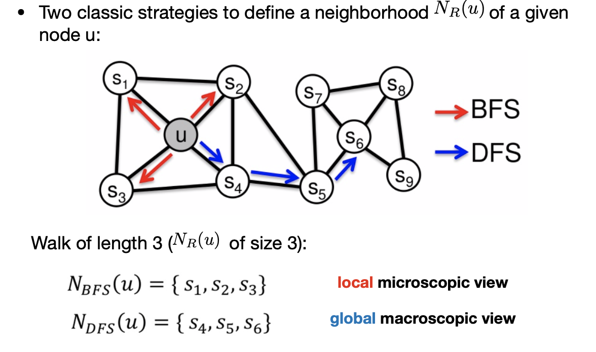

Biased fixed-length random walk $\mathrm{R}$ that given a node u generates neighborhood $N_{R}(u)$
- Two parameter
  - Return parameter ${p}$ : return back to the previous node
  - In-out parameter $q$:
    - Moving outwards (DFS) vs. inwards (BFS)
    - Intuitively, $q$ is the "ratio" of BFS vs. DFS

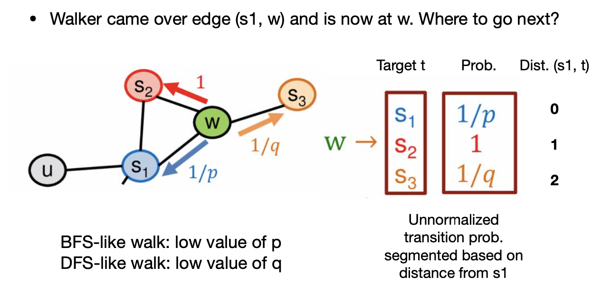

> - prob 1: keep the same (shortest) distance to $s_1$
> - return param: prob $1/p$: walk to the nodes with -1 shortest distance to $s_1$
> - walk-away param: prob $1/q$: walk to the nodes with -1 shortest distance to $s_1$

### Algorithm

1. Compute random walk probabilities
2. Simulate r random walks of length l starting from each node u
3. Optimize the node2vec objective using Stochastic Gradient Descent

> Linear-time complexity,
> 
> All 3 steps are individually parallelizable

### Experiments: Micro VS Macro

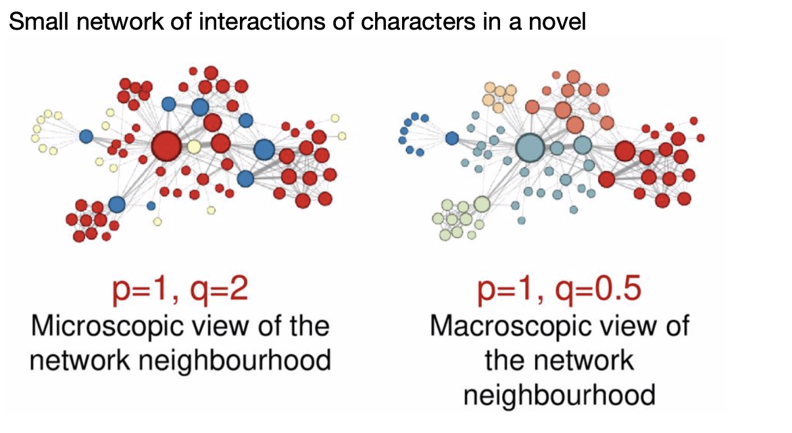

Colors indicate similar characters, colored by the node2vec algorithm.

If $1/p$ is larger, (prefer micro-view, BFS), the algorithm will identify nodes with similar local features (e.g. various red groups) as similar

If $1/q$ is larger, (prefer macro-view, DFS), the algorithm will consider global features, the whole graph will look like a community detection result.

> Depends on the application of embedding
> - For community detection, DFS may be preferred
> - For classification, BFS may be preferred

## Extensions

### Other random walk ideas

- Different kinds of biased random walks:
  - Based on node attributes
  - Based on learned weights
- Alternative optimization schemes:
  - Directly optimize based on 1-hop and 2-hop random walk probbilities (LINE)
- Network preprocessing techniques
  - Run random walks on modified versions of the original network (struct2vec), i.e. restruct the graph

### How to Use Embeddings

How to use embeddings $z_{i}$ of nodes?
1. Clustering/community detection: Cluster nodes based on $z_i$
   > only needs clustering on the embedding space
2. Node classification: Predict label $\mathrm{f}\left(\mathrm{z}_{\mathrm{i}}\right)$ of node i based on $\mathrm{z}_{\mathrm{i}}$
   > predict label for unlabled nodes in the graph
3. Link prediction predict edge (i, j) based on $f\left(z_{i}, z_{j}\right)$, where we can: concatenate, average, product, or take a difference between the embeddings (assume $g$ is the next phase predictor):
   - Concatenate: $f\left(z_{i}, z_{j}\right)=g\left(\left[z_{i}, z_{j}\right]\right)$
   - Hadamard: $f\left(z_{i}, z_{j}\right)=g\left(z_{i}^{*} z_{j}\right)$ (per coordinate product)
   - Sum/Avg: $f\left(z_{i}, z_{j}\right)=g\left(z_{i}+z_{j}\right)$
   - Distance: $f\left(z_{i}, z_{j}\right)=g\left(\left\|z_{i}-z_{j}\right\|_{2}\right)$
  > Sometimes for multi-phase tasks, the loss of the downstream task may also be written in the loss function of the embedding training phase.

### Remark

- No one method wins in all cases ...E.g., 
  - node2vec performs better on node classification while
  - multi-hop methods performs better on link prediction
- Random walk approaches are generally more efficient
- In general: must choose definition of node similarity that matches your application!

### Embedding Entire Graphs

Graph Classification Tasks
- Classifying toxic vs. non-toxic molecules
  > e.g.: 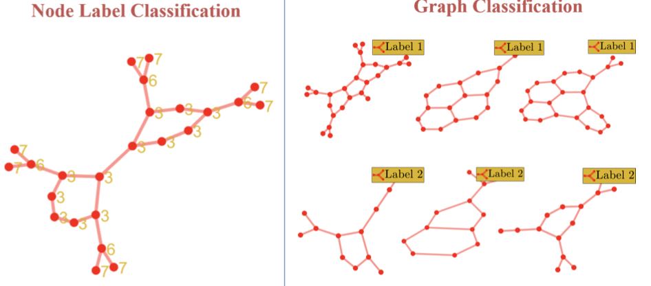
- Identifying cancerogenic molecules 
- Graph anomaly detection 
- Classifying social networks

#### Approach 1

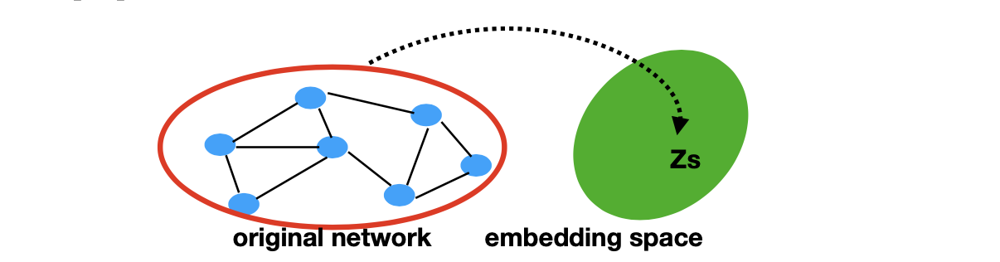

Simple idea:
- Run a standard graph embedding technique on the (sub)graph G
- Sum (or average) the node embeddings in the (sub)graph G
    $$
    z_{G}=\sum_{v \in G} z_{v}
    $$
- Used to classify molecules based on their graph structure

#### Approach 2

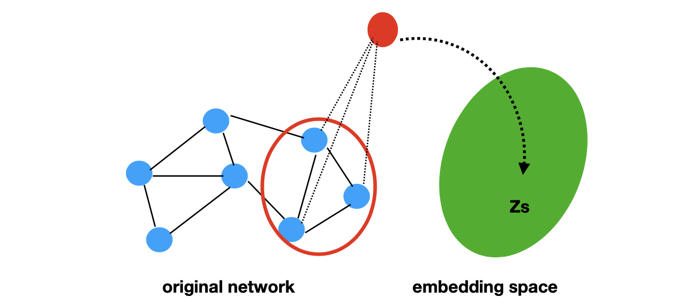

Idea: introduce a “virtual node” to represent the (sub)graph and run a standard graph embedding technique