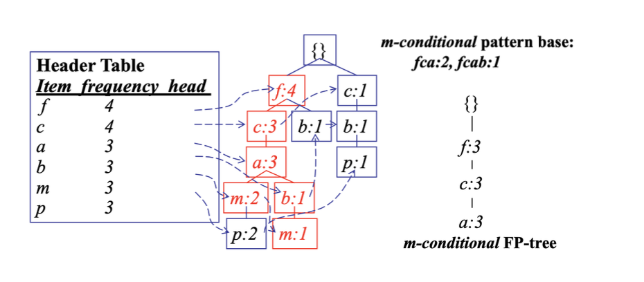
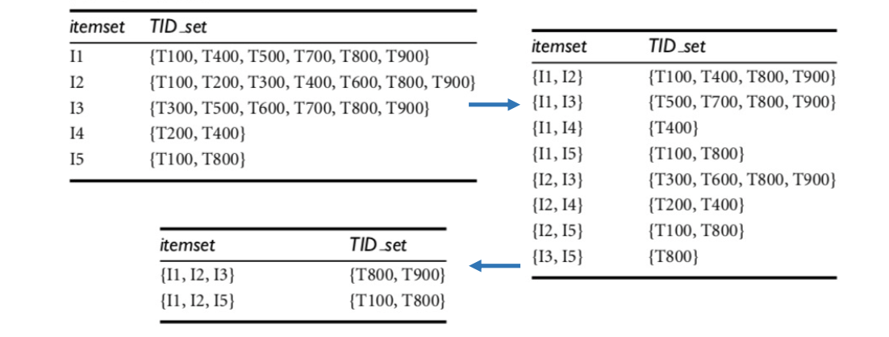

<!-- more -->

## Basic Concepts in Frequent Pattern Mining

**Frequent Pattern**. a pattern (a set of items/subsequences/substructures) that appear frequently in a database
- to further boost the correlations/clustering/classification or revealing other relationships among data

An itemset X is **frequent** if X's **support** is no less than a defined threshold **min_sup**
- absolute support: frequency or occurence of an itemset X
- relative support: fraction of transactions that contains X over all transaction
- **support**: probability that a transaction contains X & Y
  - suppot (X $\Rightarrow Y$) = P(X && Y)
- **confidence**: conditional prob. that a transaction having X also contains Y
  - confidence (X $\Rightarrow$ Y) = P(Y|X)
    $$
    P(Y \mid X)=\frac{{support}(X \& Y)}{{support}(X)}
    $$
- **min_sup**: minimum support threshold
- **min_conf**: minimum support confidence threshold

### Association Rule Mining

1. **Find all frequent itemsets**: frequency of itemsets ≥ min_sup
2. **Generate strong association rules** from the frequent itemsets

> 1 is the major step, but challenging in that there may be a **huge number of itemsets** satisfying min_sup

Note, An itemset is frequent $\Rightarrow$ each of its subsets is frequent

**Solution**: mine **closed frequent itemset** and **maximal frequent itemset**
- **closed frequent itemset** X: X is frequent and there is no super-itemset $Y \supset X$ with the same support count as X
  - closed frequent itemset is a lossless compression of frequent itemset
- **maximal frequent itemset** X: X is frequent and there is no super-itemset $Y \supset X$ which is frequent

::: details Example 

Example: for $a_1,\ldots, a_50$, more elements can be added to make them frequent, thus not maximal

:::

## Frequent Itemset Mining Methods

- Apriori: A Candidate Generation-and-Test Approach
- Improving the Efficiency of Apriori
- FP-Growth: A Frequent Pattern-Growth Approach
- ECLAT: Frequent Pattern Mining with Vertical Data Format

## Apriori

**Foundation**. **Downward Closure Property**: any subset of a frequent itemset must be frequent

Apriori employs a **level-wise search** where k-itemsets are used to explore (k + 1)-itemsets. Steps:

::: theorem

1. Scan database once to get frequent 1-itemsets $L_1$
2. **Join** the k-frequent itemsets $L_k$ to **generate** length (k+1) candidate itemsets $C’_{k+1}$
3. **Prune** $C'_{k+1}$ against the database to get $C_{k+1}$ (*Candidate Set*)
4. Scan (**Test**) database for the count of each candidate in $C_{k+1}$, obtain $L_{k+1}$
5. Terminate when no frequent or candidate set can be generated, otherwise go to step 2

:::

### How to Generate and Prune Candidates

- How to generate candidates? 
  - Step 1: self-joining $L_k$
  - Step 2: pruning
- Example of Candidate-generation
  1. $L_3 = \{abc, abd, acd, ace, bcd\}$
  2. Self-joining $L_3 \otimes L_3$: abcd from abc and abd; acde from acd and ace
     > Only combine when $k-1$-prefix are same, because any $k-1$ subset should be ensured!
  3. Pruning: acde is removed because ade is not in $L_3$
     > Check acde, all its three-elem subsets are in $L_3$
     > Check acde, some of its three-elem subsets are not in $L_3$, **prune early**!
  4. $C_4 = \{abcd\}$

::: details Example

:::

## Improving the Efficiency of Apriori

### Problem with Apriori

For Apriori, although scan of database occurs $k$ times, but the increment may take a lot of time

- How to count supports of each candidate?
  - The total number of candidates can be huge
  - One transaction may contain many candidates
  > Any other efficient way to represent transactions?
  - Support Counting Method:
    - store candidate itemsets in a hash-tree
    - leaf node of hash-tree contains a list of itemsets and counts 
    - interior node contains a hash table

- Challenges:
  - Multiple scans of transaction database 
  - Huge number of candidates
  - Support counting for candidates
- Improving the Efficiency of Apriori
  - Reduce passes of transaction database scans 
  - Shrink number of candidates
  - Facilitate support counting of candidates

### Hash Tree

Build based on prefix structure

### Reduce Scans

- **Partition** (reduce scans): partition data to find candidate itemsets
  - Any itemset that is potentially frequent (relative support $\ge$ min_sup) must be frequent (relative support in the partition $\ge$ min_sup) in at least one of the partition
    - Scan 1: partition database and find local frequent patterns
    - Scan 2: assess the actual support of each candidate to determine the global frequent itemsets (only when needed)
    
    

> We don't have to wait for 1-itemsets to be all found.
> 
> Maybe on the fly, we have already discovered some itemsets that have reached min_sup, we can begin checking their 2-itemsets

- **Dynamic itemset counting** (reduce scans): adding candidate itemsets at different points during a scan
- new candidate itemsets can be added at any start point (rather than determined only before scan)

|  once both A and D are determined frequent, the counting of AD begins     |  once both A and D are determined frequent, the counting of AD begins     |
|  ---  |  ---  |
|       |       |

### Shrink number of candidates

- **Hash-based Technique** (shrink number of candidates): hashing itemsets into corresponding buckets
  - A k-itemset whose corresponding hashing bucket count is below min_sup cannot be frequent
  - Then we scan the database for items still in the bucket

### Facilitate support counting of candidates

- Sampling: mining on a subset of the given data
  - Trade off some degree of accuracy against efficiency
  - Select **sample S of original database**, mine frequent patterns within S (a lower support threshold) instead of the entire database —> the set of frequent itemsets local to $S = L_S$
  - Scan the rest of database once to compute the actual frequencies of each itemset in $L_S$
  - If $L_S$ actually contains all the frequent itemsets, stop; otherwise
  - Scan database again for possible missing frequent itemsets

## Pattern Evaluation Methods

> Recall, for Apriori, the general idea is to find candidates and then scan the database for checking

- Bottlenecks of Apriori
  - Breadth-first (i.e., level-wise) search
  - Candidate generation and test, often generates a huge number of candidates

- FP-Growth
  - Depth-first search
  - **Avoid** **explicit** candidate generation
  - *But Idea Still*: Grow long patterns from short ones using local frequent items
    - “abc” is a frequent pattern
    - Get all transactions having “abc,” i.e., project database D on abc: D | abc
    - “d” is a local frequent item in D | abc —> abcd is a frequent pattern

### A Frequent-Pattern Growth Aproach

1. Scan database once, find frequent 1-itemset
2. Sort frequent items in frequency descending order —> F-list
3. Scan database again, construct FP-tree
   > Represent the original data, and mine on FP-tree
4. Mine FP-tree

### Construct FP-Tree

FP-tree: a **compressed** representation of database. It retains the itemset **association** information.

### Mine FP-Tree

1. Start from each frequent length-1 pattern (**suffix pattern, usually the last item in F-list**) to construct its **conditional pattern base** (**prefix paths** co-occurring with the suffix)

2. Construct the conditional FP-tree based on the conditional pattern base

> Should be based on the value of the leaf, instead of the node, because the tree node may contains other leafs

1. Mining recursively on each conditional FP-tree until the resulting FP-tree is empty, or it contains only a single path — which will generate frequent patterns out of all combinations of its sub- paths

> Another acceleration:

- Suppose a (conditional) FP-tree has a shared single prefix-path 
- Mining can be decomposed into two parts
  - Reduction of the single prefix path into one node
  - Concatenation of the mining results of the two parts
 

### Example

> Assume threshold = 2 

1. first we consider I5, the paths formed are `<I2, I1, I5: 1>` and `<I2, I1, I3, I5: 1>`
   - I5-conditional FP-tree contains only `<I2, I1:2>`
   - I3 is not included since its support count of `1 < min_sup`
   - The single path generates `{I2, I5: 2}`, `{I1, I5: 2}`, `{I2, I1, I5: 2}`

2. Then we consider I4, generates a single-node conditional FP-tree, `<I2: 2>,` and derives one frequent pattern, `{I2, I4: 2}`.

3. I3’s conditional pattern base: `{ {I2, I1: 2}, {I2: 2}, {I1: 2} }`
   - Conditional FP-tree has two branches: `<I2: 4, I1: 2>` and `<I1: 2>`
   - Frequent patterns `{ {I2, I3: 4}, {I1, I3: 4}, {I2, I1, I3: 2}}`

### Scaling FP-Growth

- What if FP-tree cannot fit into memory?
  - **Database projection**: partition a database into a set of projected databases, then construct and mine FP-tree for each projected database
  - **Parallel projection:**
    - project the database in parallel for each frequent item
    - all partitions are processed in parallel
    - space costly
  - **Partition projection:**
    - project a transaction to a frequent item x if there is no any other item after x in the list of frequent items appearing in the transaction
    - a transaction is projected to only one projected database

### Benefits

Benefits of FP-tree
- Completeness
  - Preserve complete information for frequent pattern mining 
  - Never break a long pattern of any transaction
  > Always find a long pattern
- Compactness
  - Reduce irrelevant info — infrequent items are gone
  - Items in frequency descending order: occurs more frequently, the more likely to be shared
  - Never be larger than the original database (not including node- links and the count fields)

Benefits of FP-Growth
- **Divide-and-conquer**:
  - Decompose both the mining task and database according to the frequent patterns obtained so far
  - Lead to focused search of smaller databases 
- Other factors:
  - No candidate generation, no candidate test
  - **Compressed database: FP-tree**
  - *No repeated scan* of the entire database
  - Basic operations: count local frequent items and build sub FP- tree, no pattern search and matching

## ECLAT: Frequent Pattern Mining with Vertical Data Format

> What for non-transaction database?
> 
> Vertical Dataformat? `item - transID`?
> 
> We have a **straightforward** solution!

- Vertical data format: itemset — transID_set
  - transID_set: a set of transaction IDs containing the itemset
- Derive frequent patterns based on the intersections of transID_set

How to reduce cost of set operation?
- Derive frequent patterns based on the **intersections** of transID_set 
- Use **diffset** to reduce the cost of storing long transID_set
  - `{I1} = {T100, T400, T500, T700, T800, T900} `
  - `{I1, I2} = {T100, T400, T800, T900}`
  - `diffset( {I1}, {I1, I2} ) = {T500, T700}`

## Frequent Itemset Mining Methods Summary

- Apriori: candidate generation-and-test
- Improving efficiency of Apriori: partition, dynamic item counting, hash-based technique, sampling
- FP-Growth: depth-first search
- Scaling of FP-Growth: database projection
- Frequent pattern mining with vertical data format

## Pattern Evaluation Methods

### Correlations

- play basketball $\Rightarrow$ eat cereal `[2k/5k = 40%, 2k/3k = 66.7%]` is misleading
  - the overall % of students eating cereal is `75% > 66.7%`
- play basketball $\Rightarrow$ not eat cereal `[1k/5k = 20%, 1k/3k = 33.3%]` is more accurate
> How to make use of results of freqset mining? We need to find the correlation
- Lift: a measure of dependent/correlated event
  $$
  \mathrm{lift}=\frac{P(A, B)}{P(A) P(B)}=\frac{P(B \mid A)}{P(B)}
  $$
  - `<1` negatively related
  - `>1` positively related
  - `=1` independent

### Other methods

- $\mathcal{X}^2$ measure, all_confidence measure, max_confidence measure, Kulczynski measure, ...