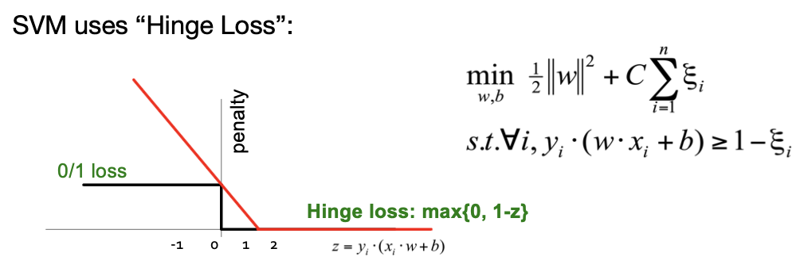
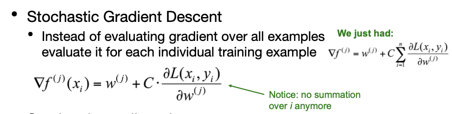

<!-- more -->

## Machine Learning Basics

### Perceptron

- Perceptron: $y^{\prime}=\mathrm{sign}(w \cdot x)$
- How to find parameters w?
  - Start with $\mathbf{w}_{0}=\mathbf{0}$
  - Pick training examples $x_{t}$ one by one
  - Predict class of $x_{t}$ using current $w_{t}$ $\mathrm{y}^{\prime}=\mathrm{sign}\left(\mathrm{w}_{\mathrm{t}} \cdot \mathrm{x}_{\mathrm{t}}\right)$
  - If $\mathrm{y}^{\prime}$ is correct (i.e., $\mathbf{y}_{t}=\mathrm{y}^{\prime}$ )
    - No change: $w_{t+1}=w_{t}$
  - If $\mathrm{y}$ ' is wrong: Adjust $w_{t}$ $w_{t+1}=w_{t}+\eta \cdot y_{t} \cdot x_{t}$

> Though very primitive, but efficient (We only focus on wrong predictions)

- Good: Perceptron convergence theorem:
  - If there exist a set of weights that are consistent (i.e., the data is linearly separable) the Perceptron learning algorithm will converge
- Bad: Never converges:
  
  If the data is not separable weights dance around indefinitely

  
- Bad: Mediocre generalization:
  - Finds a “barely” separating solution
  
  

## SVM

### Problem and Optimal Margin Classifier

SVM with hard margins

$$
\begin{array}{l}
\min _{w} \frac{1}{2}\|w\|^{2} \\
\text { s.t. } \forall i, y_{i}\left(w \cdot x_{i}+b\right) \geq 1
\end{array}
$$

Dual Problem

We write the constraint as:
$$
g_{i}(w)=-y^{(i)}\left(w^{T} x^{(i)}+b\right)+1 \leq 0
$$
Lagrangian:
$$
\mathcal{L}(w, b, \alpha)=\frac{1}{2}\|w\|^{2}-\sum_{i=1}^{m} \alpha_{i}\left[y^{(i)}\left(w^{T} x^{(i)}+b\right)-1\right]
$$
From KKT dual complementarity condition, $\mathbf{\alpha}_{i}>0$  only for $\mathrm{g_i}(\mathrm{w})=0$

> Support Vectors: training examples whose functional margin exactly equal to 1
> 
> We only need to care about the points with the smallest margins to the decision boundary!

Rewrite our problem: 

Solve the dual form of the problem by minimize $\mathcal{L}(w, b, \alpha)$ with respect to $w$ and $b$
Setting derivatives of $L$ w.r.t. $w$ and $b$ to 0
$$
\begin{aligned}
\nabla_{w} \mathcal{L}(w, b, \alpha)&= w-\sum_{i=1}^{m} \alpha_{i} y^{(i)} x^{(i)}=0 \\  \Rightarrow w&=\sum_{i=1}^{m} \alpha_{i} y^{(i)} x^{(i)} \\
\frac{\partial}{\partial b} \mathcal{L}(w, b, \alpha)&=\sum_{i=1}^{m} \alpha_{i} y^{(i)}=0 .\\
\mathcal{L}(w, b, \alpha)&=\frac{1}{2}\|w\|^{2}-\sum_{i=1}^{m} \alpha_{i}\left[y^{(i)}\left(w^{T} x^{(i)}+b\right)-1\right] \\
\mathcal{L}(w, b, \alpha)&=\sum_{i=1}^{m} \alpha_{i}-\frac{1}{2} \sum_{i, j=1}^{m} y^{(i)} y^{(j)} \alpha_{i} \alpha_{j}\left(x^{(i)}\right)^{T} x^{(j)}
\end{aligned}
$$

Dual optimization problem:
$$
\begin{aligned}
\max _{\alpha} & W(\alpha)=\sum_{i=1}^{m} \alpha_{i}-\frac{1}{2} \sum_{i, j=1}^{m} y^{(i)} y^{(j)} \alpha_{i} \alpha_{j}\left\langle x^{(i)}, x^{(j)}\right\rangle \\
\text { s.t. } & \alpha_{i} \geq 0, \quad i=1, \ldots, m \\
& \sum_{i=1}^{m} \alpha_{i} y^{(i)}=0
\end{aligned}
$$
Can check the conditions of "max min" == " "min max" are satisfied (*Here, convex goal+linear conditions*), so solve the dual optimization problem to obtain $\mathbf{\alpha}^{\star}$ instead! substitute into $w=\sum_{i=1}^{m} \alpha_{i} y^{(i)} x^{(i)}$ to get $\mathbf{w}^{*}$

> Thus, we only need to solve $\alpha$ in order to get $\omega$ and b

> Since most $\alpha_i$s are zero, we can reduce the computational scale

### Slack Penalty

If data is not separable introduce penalty:

Introduce slack variables $\xi_{i}$
$$
\begin{array}{l}
\min _{w, b, \xi_{i} \geq 0} \frac{1}{2}\|w\|^{2}+C \cdot \sum_{i=1}^{n} \xi_{i} \\
\text { s.t. } \forall i, y_{i}\left(w \cdot x_{i}+b\right) \geq 1-\xi_{i}
\end{array}
$$
If point $x_{i}$ is on the wrong side of the margin then get penalty $\xi_{i}$

### SGD SVM

- Want to estimate $w$ and $b$! 
  - Standard way: Use a solver!
  - Solver: software for finding solutions to “common” optimization problems
- Use a quadratic solver:
  - Minimize quadratic function 
  - Subject to linear constraints
- Problem: Solvers are inefficient for big data!

- Problem:
  - Computing $\grad f(j)$ takes $O(n)$ time! 
  - $n$ ... size of the training dataset

#### Other Variations of GD

- Batch Gradient Descent
  - Calculates error for each example in the training dataset, but updated model only after all examples have been evaluated (i.e., end of training epoch)
  - **PROS**: few updates, more stable error gradient
  - **CONS**: usually requires whole dataset in memory, slower than SGD
- Mini-Batch Gradient Descent
  > Batch Gradient + GD
  - Like BGD, but using smaller batches of training data. Balance between robustness of SGD, and efficiency of BGD

#### Efficiency VS Effect

fairly good

### Multiclass SVM

> Idea 1: One vs the rest: one classifier for one

Learn 3 classifiers
- `+` vs. $\{\mathbf{0},-\}$
- `-` vs. $\{\mathbf{0},+\}$
- `o` vs. $\{+,-\}$

**Obtain**:
$\mathbf{w}_{+} \mathbf{b}_{+}, \mathbf{w}_{-} \mathbf{b}_{-}, \mathbf{w}_{0} \mathbf{b}_{0}$

How to classify?
- Return class $c$: $\arg \max _{c} \mathbf{w}_{c} \mathbf{x}+\mathbf{b}_{c}$

> Idea 2: one classifer for all

Problem:

$$
\begin{array}{ll}
\min _{w, b} \frac{1}{2} \sum_{\mathrm{c}}\left\|w_{c}\right\|^{2}+C \sum_{i=1}^{n} \xi_{i} & \forall c \neq y_{i}, \forall i \\
w_{y_{i}} \cdot x_{i}+b_{y_{i}} \geq w_{c} \cdot x_{i}+b_{c}+1-\xi_{i} & \xi_{i} \geq 0, \forall i
\end{array}
$$

To obtain parameters $w_c$ , $b_c$ (for each class c) we can use similar techniques as for 2 class SVM

Want the correct class to have highest margin: 
 $w_{y_i, x_i} +b_{y_i} \ge 1+w_c x_i +b_c \forall c \neq y_i ,\forall i$

## Distributed Deep Learning

### Data Parallelism

- Divide training data into a number of subsets and run a copy of the model on each subset
- Model replicas asks the parameter server for an updated copy of model params
- Model replicas run minibatch SGD independently to compute gradients and send gradients to parameter server
- Parameter server applies the averaged gradients to the current model params
  > various average methods, depending on whether the algorithm can converge

**Sync SGD**

> Server has to wait for gradient from worker, only when all gathered can average proceed

> Not very efficient, though

### Model Parallelism

Setting:

- Unsupervised or Supervised Objective
- **Minibatch Stochastic Gradient Descent (SGD)**
- Model parameters sharded by partition
- 10s, 100s, or 1000s of cores per model

Framework

- Divide training data into a number of subsets and run **a copy of the model (model replica)** on each subset
- Model replicas asks the parameter server for an updated copy of model params
- Model replicas run minibatch SGD independently to compute gradients and send gradients to parameter server
- Parameter server applies the gradients to the current model params

> Async SGD: an asynchronous stochastic gradient descent procedure, **non-blocking**

Systems challenges: 
- High bandwidth
- **Convergence**
- Fault tolerance
  > What happens if one worker is down

### Async SGD [HOGWILD]

- Key idea: don’t synchronize, just **overwrite parameters opportunistically** from multiple workers (i.e., servers)
  - Same implementation as SGD, just without blocking!
- In theory, Async SGD converges, but a slower rate than the serial version
- In practice, when gradient updates are sparse (i.e., high dimensional data), same convergence!

> The below algorithm seems casual, but works

### Remarks

- From an engineering view, this is much better than a single model with the same number of total machines:
  - Synchronization boundaries involve fewer machines
  - Better robustness to individual slow machines
  - Makes forward progress even during evictions/restarts