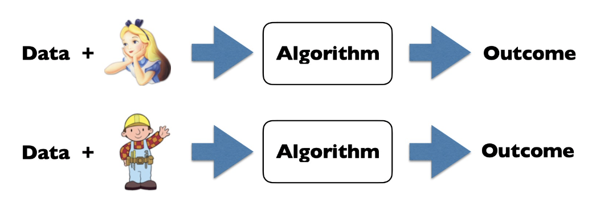

<!-- more -->

## Background

- AOL Search Debacle
- Netflix competition
> **Anonymity is NOT enough! Linkage Attack**
> 
> High-dimensional data is unique

No more dataset, only Release Statistics?
- Not release dataset. How about releasing statistics? 
- Can the statistics be used to track an individual?
  > Statistics on small datasets is unsafe!
  > 
  > 
  > 
  > Correlation among different SNPs, Alice’s DNA reveals: If Alice is in the Cancer set or Healthy set

### Summary

- Anonymization may not work
  - identify an individual by collection of fields, attributes, zip code, date of birth, sex ...
  - A **linkage attack** to match “anonymized” records with non- anonymized records
- Re-Identification may not be the only risk
  - A collection of **medical records** on a given date list a **small number** of diagnoses. Additional information of visiting the facility on the date **narrows range** of possible diagnoses
- Queries over **large sets** may be risky
  - **differencing** attack to two large sets,one w/X,one w/oX

- Summary statistics may be risky
  - Compute frequencies of DNA sequences: AAGGCTAA and ATGGCTAA in a reference population
  - Observe **frequencies differ** for a subpopulation with a disease
  - Given the genome data of an individual, possible to determine if the individual has the disease 
- “Ordinary” facts are not OK
  - Mr. T regularly buys bread over years until suddenly switching to rarely buying bread — most likely be diagnosed with diabetes
- “Just a few” is not OK
  - **Outliers** may be more important!

## Definitions and Properties

**Definition**. Differential Privacy - Participation of a person does not change outcome

> Whoever is Alice or Bob in the dataset won't affect the outcome

**Solution**. Randomness
- **Randomness**: Added by randomized algorithm A 
- **Closeness**: Likelihood ratio at each point bounded
  > so that dataset is still useful

### Basic Terms

> What's our goal?

- A trustworthy **curator** holds data of individuals in database D
  > 值得信任的数据托付源
- Each row corresponds to an **individual**
- Goal: Protect every individual row while permitting statistical analysis of D
  - Non-interactive model: Curator releases *summary statistics*, or “sanitized database” once and for all
  - Interactive model: permit asking queries *adaptively*, decide which query to ask next based on observed responses

- **A privacy mechanism** is an algorithm that takes as input a database, the set of **all possible database rows, random bits, a set of (non/interactive)queries**, and produces **an output string**.

> What's privacy

- Privacy: data analysis *knows no more about an individual* after analysis is completed than before the analysis was begun
- Formally, adversary’s **prior** and **posterior** views about an individual should not be “too different”
- Reminiscent（类比） of **semantic security** for a cryptosystem:

::: details semantic security 语义安全

semantic security says nothing is learned about the plaintext（明文） from the ciphertext（密文）

-  if side information says the ciphertext is an encryption of “dog” or “cat,” the ciphertext leaks nothing about which of “dog” or “cat” has been encrypted
-  Adversary **simulator** has the same odds of guessing as does the **eavesdropper**(窃听者)

Most cypher tools are based upon semantic security

:::

::: tip Difference between semantic security and privacy
- Semantic security
 - 3 parties: message sender, receiver, eavesdropper
- Privacy
 - 2 parties: curator & data analyst
 - **data analyst can be adversary** (at the same time, user)
 - given as auxiliary information the encryption of a secret using random pad, the analyst can decrypt the secret, but the adversary simulator learns nothing
 - need to careful in deciding “reasonable” auxiliary knowledge
> even harder! we need to provide information, while still be adversary
:::

> There goes the definition of privacy

- “Privacy” comes from plausible deniability of any outcome. Report if one has property P by:
  1. Flip a coin
  2. If **tails**, then report truthfully
  3. If **heads**, then flip a second coin and report “Yes” if heads and “No” if tails
- What is the expected number of “Yes”?
  - The expected number of “Yes” is 1/4 × total no. of participants “who do not has P” + 3/4 × total no. of participants “who has P”
  - if p is the true fraction of having P, the expected number of “Yes” is (1/4) + p/2

> Now, it doesn't make sense to infer the P property of a single user from a single observation.
> 
> But globally, we can still have an insight of the group's property P
> 
> "plausible deniability", we can reasonably deny an observation

### Randomized Algorithm

**Probability Simplex**: given a discrete set $\mathrm{B}$, the probability simplex over $\mathrm{B}$, denoted $\Delta(\mathrm{B})$ is defined to be
$$
\Delta(B)=\left\{x \in \mathbb{R}^{|B|}: x_{i} \geq 0 \text { for all } i \text { and } \sum_{i=1}^{|B|} x_{i}=1\right\}
$$

**A randomize alg**. $\mathcal{M}$ with domain $\mathrm{A}$ and discrete range $\mathrm{B}$ is associated with a mapping: $A \rightarrow \Delta(B) .$ On input $a \in A$, alg. $M$ outputs $\mathcal{M}(\mathrm{a})=\mathrm{b}$ with probability $(\mathrm{M}(\mathrm{a})) \mathrm{b}$ for each $\mathrm{b} \in \mathrm{B}$
> Note $b$ can take over $\Delta(B)$

**Distance between databases**: the 11 -norm of a database $\mathrm{X}$ is $\|\mathrm{X}\|_1$. The 11 distance between $X$ and $Y$ is $\|X-Y\|_1$
- a measure of how many records differ between X \& Y
> Other alternative distances are also OK

### Differential Privacy

Assume distr with Alice is $D$, with Bob is $D'$., after the algorithm $A$, we expect ...

For all D, D' that differ in one person's value, If $\mathrm{A}=\epsilon$ -differentially private randomized algorithm, then:
Max-divergence of p(A(D)) and p(A(D')) is 

$$
\left.\sup _{t}\left|\log \frac{p(A(D)=t)}{p\left(A\left(D^{\prime}\right)=t\right)}\right|\right. \leq \epsilon
$$

Sometimes, we loose the condition by limiting the evalutation domain with $\delta$

If $\mathrm{A}=(\epsilon, \delta)$ -differentially private randomized algorithm, then:
$$
\max _{S, \mathrm{Pr}(A(D) \in S)>\delta}\left[\log \frac{\mathrm{Pr}(A(D) \in S)-\delta}{\mathrm{Pr}\left(A\left(D^{\prime}\right) \in S\right.}\right] \leq \epsilon
$$

The choice of $\varepsilon, \delta:$
- $\varepsilon$ should be small that an adversary cannot distinguish which is true database on the basis of observing outputs
- $\delta$ are less than the inverse of any polynomial in the size of the database
  > so that "just a few is not OK"

Given an output $\xi \sim M(x)$, privacy loss is defined as
$$
\mathcal{L}_{\mathcal{M}(x) \| \mathcal{M}(y)}^{(\xi)}=\ln \left(\frac{\mathrm{Pr}[\mathcal{M}(x)=\xi]}{\mathrm{Pr}[\mathcal{M}(y)=\xi]}\right)
$$

- `>0`, if an event is more likely under x than under y
- `<0`, otherwise

> Splitting the definition above, (by taking out $\ln$), we can now formally define differential privacy

**Definition**. A randomized alg. $\mathrm{M}$ with domain $\mathrm{X}$ is $(\varepsilon, \delta)$ -differentially private if for all $\mathrm{O} \subseteq \mathrm{Range}(\mathcal{M})$ and for all $\mathrm{x}, \mathrm{y} \in \mathrm{X}$ such that $\|\mathrm{x}-\mathrm{y}\|_{1} \leq 1$ :
$$
\mathrm{P}[\mathcal{M}(\mathrm{x}) \in \mathrm{O}] \leq \mathrm{e}^{\varepsilon} \mathrm{P}[\mathcal{M}(\mathrm{y}) \in \mathrm{O}]+\mathbf{\delta}
$$

- for every **arbitrary** pair of neighbouring databases x, y, the **posterior** distributions should be close
- $\delta$: residual probability, should be small

### An Intuitive View, Utility of above definition

- Consider differential privacy at a level of **individuals**
  - insensitive to the **addition** or **removal** of any individual
  - e.g., a differentially private movie recommendation system:
    - **Event level**: hiding the rating of a single movie, but not one’s preference for the romantic movies
    - **User level**: hiding an individual’s entire ratings
- Protection against arbitrary risks including re-identification
- Automatic neutralization of linkage attacks
- Quantification of privacy loss, allows comparisons among different techniques
  > w.r.t. semantic security

### Properties

1. Post-Processing:
  Let $\mathcal{M}$ be a randomized alg. that is $(\varepsilon, \delta)$ -differentially private. Let be an arbitrary randomized mapping. Then $f \circ \mathcal{M}$ is $(\varepsilon, \delta)-$ differentially private

  Proof: for any pair of neighboring databases $\mathrm{x}, \mathrm{y}$, and fix any event $S \subseteq R^{\prime} .$ Let $T=\{r \in R: f(r) \in S\} .$ We have
    $$
    \begin{aligned}
    \mathrm{Pr}[f(\mathcal{M}(x)) \in S] &=\mathrm{Pr}[\mathcal{M}(x) \in T] \\
    & \leq \exp (\epsilon) \mathrm{Pr}[\mathcal{M}(y) \in T]+\delta \\
    &=\exp (\epsilon) \mathrm{Pr}[f(\mathcal{M}(y)) \in S]+\delta
    \end{aligned}
    $$

2. Composition:
   - The composition of two $(\varepsilon, 0)$ -differentially private mechanisms is $(2 \varepsilon, 0)$ -differentially private
   - Composition of k differentially-private mechanisms where the i-th mechanism is $\left(\varepsilon_{i}, \delta_{i}\right)$ -differentially private, is $\left( \Sigma \varepsilon_{i},  \Sigma \delta_{i}\right)-$differentially private
3. Group privacy for $(\varepsilon, 0)$ -differentially private mechanisms:
   - Any $(\varepsilon, 0)$ -differentially private mechanism $\mathcal{M}$ is $(\mathrm{k} \varepsilon, 0)-$ differentially private for groups of size $\mathrm{k}$

## Basic Mechanisms

### Example: Coin Flipping (Randomized Response)

- Recall
  1. Flip a coin
  2. If **tails**, then report truthfully
  3. If **heads**, then flip a second coin and report “Yes” if heads and “No” if tails
- The above mechanism is ($\ln 3, 0)$-differentially private
  

Strategies like these are called **Randomized Response**

### Global Sensitivity

**Definition**. Global sensitivity. Given function f, sensitive dataset D

> D' and D only differ in one data sample, f(D) can be the mean data points in D, f should be considered as a query

> Is a differentially-private approximation to f(D)

#### Illustration of Global Sensitivity: Laplace Mechanism

> The sensitivity of f gives an upper bound on **how much we must perturb** output to preserve privacy (最多可能要付出的代价)