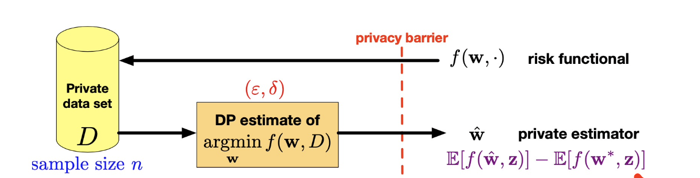
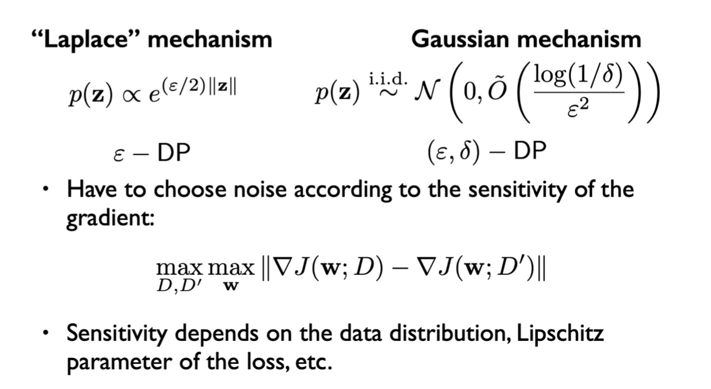

<!-- more -->

## DP in Estimation and Prediction

- Statistical estimation: estimate parameters or a predictor using private data that has good expected performance on future data
- Privacy: differential privacy makes no assumptions on the data distribution: privacy holds unconditionally
- Accuracy: $\mathbb{E}[f(\hat{\mathbf{w}}, \mathbf{z})]-\mathbb{E}\left[f\left(\mathbf{w}^{*}, \mathbf{z}\right)\right]$ accuracy measured w.r.t a “true population distribution”: expected excess statistical risk

$$
\mathbf{w}^{*}={\mathrm{argmin}}_{\mathbf{w}} \frac{1}{n} \sum_{i=1}^{n} \ell\left(\mathbf{w},\left(\mathbf{x}_{i}, y_{i}\right)\right)+\lambda R(\mathbf{w})
$$

- Empirical Risk Minimization (ERM) is a common paradigm for prediction problems

- Produces a predictor $\mathbf{w}$ for a label/response y given a vector of features/covariates $\mathbf{x}$

- Typically use a convex loss function and regularizer to "prevent overfitting"

> ERM is not private! even an operation like "argmin" can reveal privacy of the data set

> Adversary can tell the differrence just by comparing the support vectors of two models

Therefore, ERM is a non-private algorithm

### Privacy is Compatible w/ (Generalization) Learning 

- Good learning alg. generalize to the population distribution, not individuals
- Stable learning alg. generalize
- Differential privacy can be interpreted as a form of stability that also implies generalization
- Two parts of the same story:
  - **Privacy** implies **generalization** asymptotically 
  - Tradeoffs between **privacy-accuracy**

> Some techniques, such as drop-out, can be considered from privacy that it introduces randomness to protect privacy

### Revisting ERM, how DP works in

$$
\mathbf{w}^{*}={\mathrm{argmin}}_{\mathbf{w}} \frac{1}{n} \sum_{i=1}^{n} \ell\left(\mathbf{w},\left(\mathbf{x}_{i}, y_{i}\right)\right)+\lambda R(\mathbf{w})
$$

- Learning using (convex) optimization uses three steps:
  1. read in the data **input perturbation**
  2. form the objective function **objective perturbation**
  3. perform the minimization **output perturbation**
- We can try to introduce privacy in each step!

#### Input/Output Perturbation

|  Input Perturbation     | Local Privacy      | Output Perturbation      |  
|  ---  |  ---  |  ---  | 
| add noise to the input data      |  data contributors sanitize data before collection (variant of input pert.) e.g. perturb at user host then collect    | Compute the minimizer and add noise      |       |
|       |       |       |
| easy to implement, results in reusable sanitized dataset      | Classical technique: randomized response      |  Does not require re-engineering baseline algorithms     |      
|       |  Interactive variant can be minimax optimal    |  Difficulty: Noise depends on the sensitivity of the argmin (we don't know!)  |      

#### Objective Perturbation

 
 
$$
J(\mathbf{w})=\frac{1}{n} \sum_{i=1}^{n} \ell\left(\mathbf{w},\left(\mathbf{x}_{i}, y_{i}\right)\right)+\lambda R(\mathbf{w})
$$

A. Add a random term to the objective:

$$
\hat{\mathbf{w}}_{\text {priv }}={\mathrm{argmin}}_{\mathbf{w}} \left(J(\mathbf{w})+\mathbf{w}^{\top} \mathbf{b}\right)
$$

B. Do a randomized approximation of the objective:

$$
\hat{\mathbf{w}}_{\text {priv }}={\mathrm{argmin}}_{\mathbf{w}} \hat{J}(\mathbf{w})
$$

Randomness depends on the sensitivity properties of $J(\mathrm{w})$.

$$
\hat{\mathbf{w}}_{p r i v}=\arg \min _{\mathbf{w}}\left(J(\mathbf{w})+\mathbf{w}^{\top} \mathbf{b}\right)
$$
Non-private optimization solves $\nabla J(\mathbf{w})=0 \Longrightarrow \mathbf{w}^{*}$
Generate vector analogue of Laplace: $\mathbf{b} \sim p(\mathbf{z}) \propto e^{-\varepsilon / 2\|\mathbf{z}\|}$
Private optimization solves $\nabla J(\mathbf{w})=-\mathbf{b} \Longrightarrow \mathbf{w}_{\text {priv }}$
Have to bound the sensitivity of the gradient.

### Theoretical Bounds on Excess Risk

### Typical Empirical Results

### Summary

- Training does not guarantee privacy
- There are many ways to incorporate DP into prediction and learning using ERM
- Good DP alg. should generalize since they learn about populations, not individuals
- (ε, δ)-DP alg. have better accuracy than ε-DP alg. at the cost of a weaker privacy guarantee

## DP and Optimization Alg.

> What if the dataset are large?
>
> Good news: larger dataset implies greater privacy (as has been mentioned in last lecture)

- Large data sets are challenging for optimization: 
  - $\Rightarrow$ batch methods not feasible
- Using more data can help our trade-offs look better:
  - $\Rightarrow$better privacy and accuracy
- Online learning involves multiple releases: 
  - $\Rightarrow$potential for more privacy loss
- Goal: guarantee privacy using the optimization algorithm.

> How to make use of optimization and avoid its drawbacks in training and privacy preserving

### SGD

Is SGD private?
- Yes: randomness
- No: but not in our expected way, and since optimization is iterative, intermediate results leak information (trainig data may be revealed through composition)

| Non-Private SGD      |  Private SGD w/ Noise     |
|  ---  |  ---  |
|       |       |
| select random data point      |  select random data point + add noise to gradient    |

### Choosing a Noise Distribution

**Choosing a Noise Distribution**. with *Global Sensitivity Method*

> We still need to pay attention to sensitivity, so our sensitivity is based on the "maximal change of gradients"

***

**Choosing a Noise Distribution**. with *Randomized Selection*

> Why randomly select unbiased gradient estimate?

- Need to have control of gradient norms: $||g|| \le L$
- Keep some probability of going in the wrong direction

- Both methods:
  - Guarantee DP at each iteration
  - Ensure **unbiased estimate** of g to guarantee convergence (in multiple iterations, sampling)

### Making DP-SGD More Practical

> **“SGD is robust to noise”** - the truth may not be so ideal

- True up to a point — for small $\varepsilon$ (more privacy), the gradients can become too noisy.
  - Solution 1: more iterations (\[BST14\]: need $O(n^2)$ )
  - Solution 2: use standard tricks: mini-batching, etc. \[SCS13\]
  - Solution 3: use better analysis to show the privacy loss is not so bad \[BST14\]\[ACG+16\]

An exampling trick can be ***Randomly Sampling Amplifies Privacy***

- Suppose we have an algorithm A which is $\varepsilon$-differentially private for $\varepsilon \le 1$
- Sample γn entries of D uniformly at random and run A on those
- Randomized method guarantees 2γε-differential privacy \[BBKN14,BST14\]

### Summary

- Stochastic gradient descent can be made differentially private by randomizing the gradient
- Keeping gradient estimates unbiased will help ensure convergence
- Standard approach for variance reduction/stability (minibatching) can help with performance
- Random subsampling of the data can amplify privacy guarantees