**Key problem**. 

- How to detect whether the data we have mined are effective and not attacked? 
- Will the data mining process be attacked by adversarials?

<!-- more -->

## Motivation

Are the learning algorithm ready for deployment?

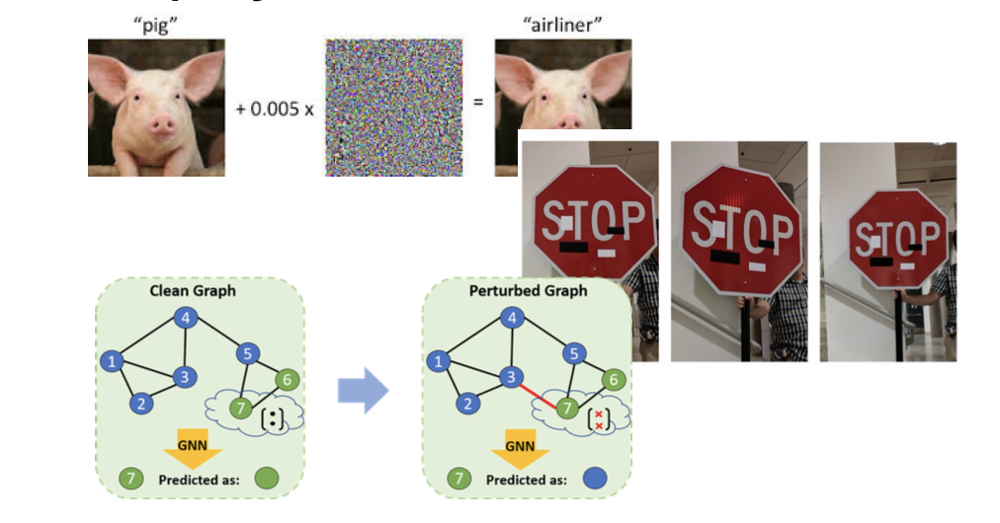

- attackers may add noise to the images, resulting in wrong prediction
- attackers may modify the target a little, leading to failure in recognizing
- attackers may modify a little of the graph, but the result may be changed a lot, no longer correct

### Limitation of Learning Algorithm

**Measure of performance:** Fraction of mistakes during testing

- **But:** In reality, the distributions we **use** ML on are NOT the ones we **train** it on

  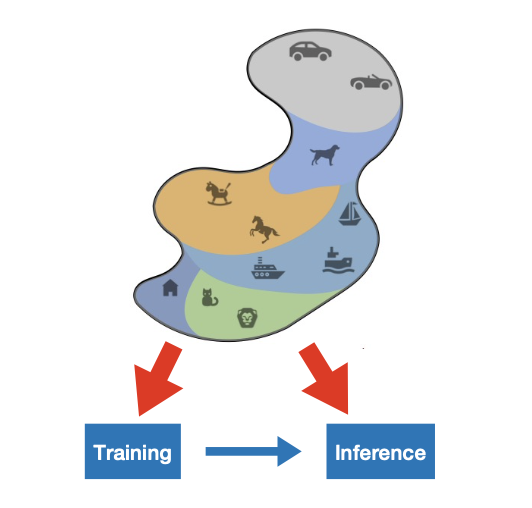

  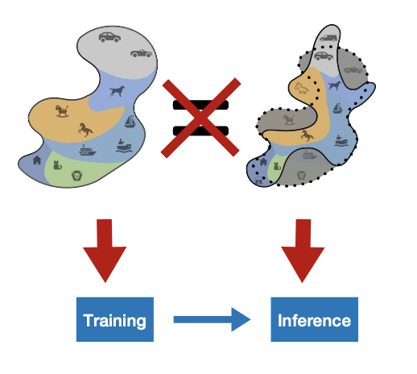

### Why Is This Brittleness a Problem?

- Security (Assume with evail attackers)
  - Voice commands that are unintelligible to humans (by adding a noise)
  - Glasses that fool face recognition (by wearing a glass)
- Safety (The model itself in application, the internal flaw of the model)
  - Tesla crashed into a barrier
- Misalignment with human understanding

### Does Limited Access Give Security?

No, For typical AI services, users will not see the model itself, but only the input and output after forward propagation.

In fact, the attack can happen anywhere, leading to failure of the system

- on input physical domain (when collecting data, inject false signals)
- on digital domain (modify the stream)
- on model domain (manipulate the model behavior)
- on output physical domain (steal/change the output result)

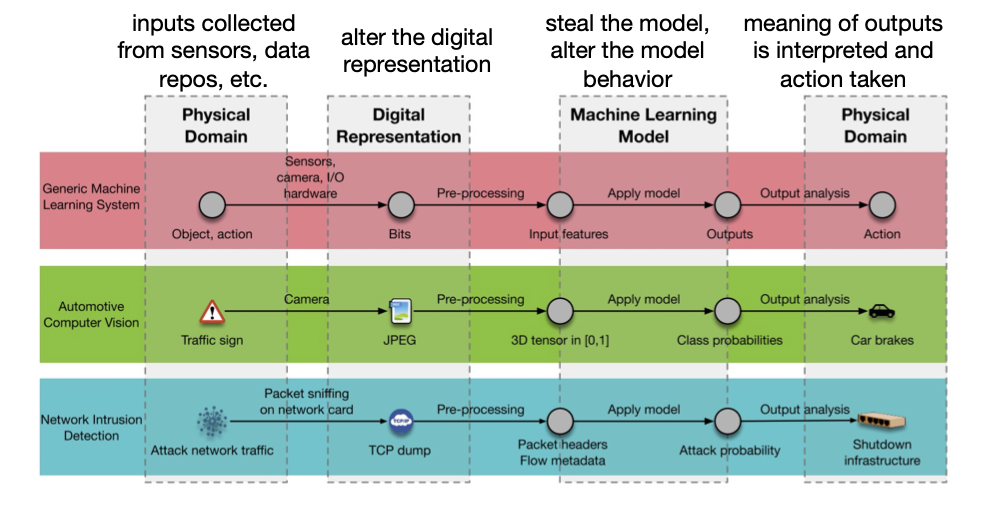

### Background

#### Adversary Capabilities

Adversarial capabilities are different: some may have access to internal model, some can only eaves-dropping data, both on training and inference phases

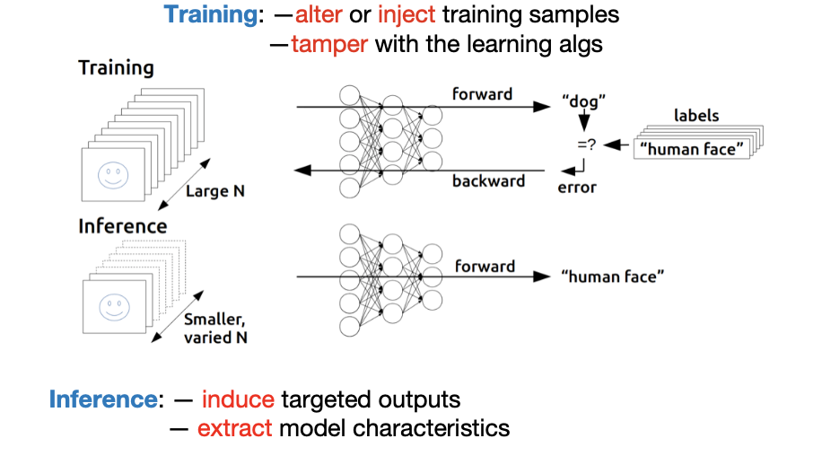

#### Adversary Goals

Attackers may try to violate confidentiality (of data or model parameter)

Alternatively, they may try to violate integraty and availablility (induce particular outputs, reduce quality, performance, or access)

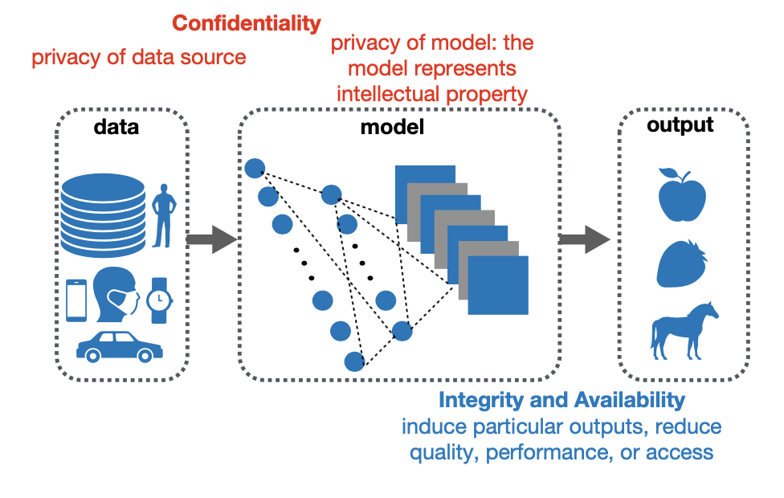

#### Adversarial Settings

-  Adversary capabilities: whether they have access to the deployed **model’s internals**

| Black-box Adversary                                          | White-box Adversary                                          |
| ------------------------------------------------------------ | ------------------------------------------------------------ |
| issue **queries** to the model or collect a **surrogate** training dataset | possess the knowledge of the **techniques** used or the **parameters** learned (easier than black-box) |
| 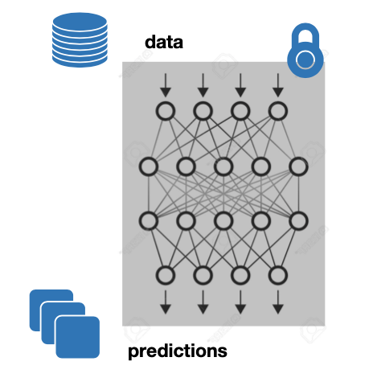 | 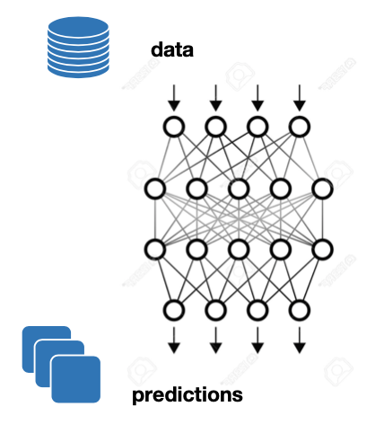 |
| e.g., an adversary seeking to penetrate a computer network can often observe how the intrusion detection system responds to network events | e.g., ML models trained on data centers are compressed and deployed to smartphones |

## Adversarial Attacks

### Adversarial Examples

A trained model has a minimizing $\theta$ 

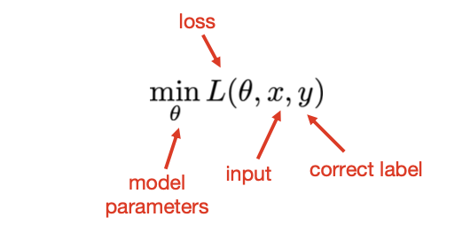

Direct manipulation of model inputs: **adversarial example** — adversary alters the inputs and have it assign a wrong class

**Non-target Attack**. to reduce the performance of the model

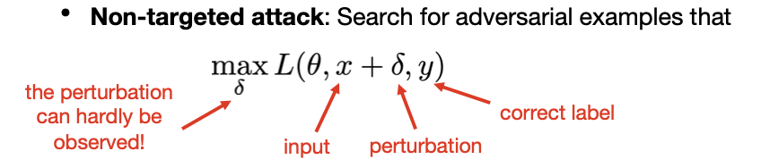

$\delta$  should be in the **input domain** and **small** (w.r.t. Lp-norm/ Rotation and/or translation/ VGG feature perturbation/ ...)

**Targeted Attack**. would like to reduce performance for ceratin inputs

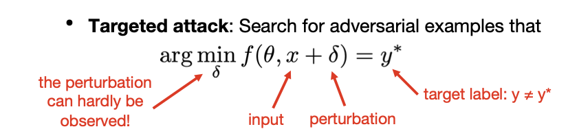

>  An above example serves as an instance of the targeted attack
>
> 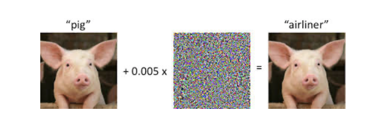

#### Non-Target Attacks

**Non-targeted attack: solve the inner maximization**

- **Fast gradient sign method (FGSM):**

  > we only need to know the "sign" of the gradient and assign a manual noise $\varepsilon$, simple to implement, but the attacking success rate may not be very high

  - compute the gradient $g:=\nabla_{\delta} \ell\left(h_{\theta}(x+\delta), y\right)$
  - adjust $\mathbf{\delta}$ in the direction of its gradient $\delta:=\delta+\alpha g$
    - how big of a step size should we take? The relative sizes of the entries of $g$ won't matter
  - simply take $\mathbf{\delta}$ to be either $+\mathbf{\varepsilon}$ or $-\mathbf{\varepsilon}\left(\mathrm{L}_{\infty}\right.$ -norm) depending on the sign of $g$

$$
\delta:=\epsilon \cdot \mathrm{sign}(g)
$$

- **Projected gradient descent (PGD) method:**
  - *iterate* FGSM with a smaller step size
  - Repeat:

$$
\delta:=\mathcal{P}\left(\delta+\alpha \nabla_{\delta} \ell\left(h_{\theta}(x+\delta), y\right)\right)
$$
P denotes the projection on the ball of interest

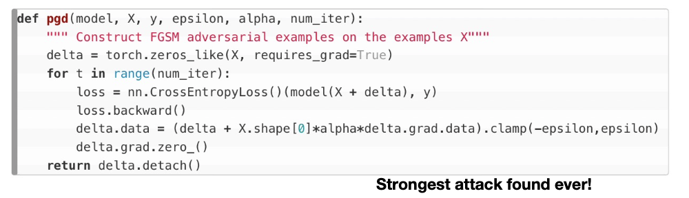

- $\varepsilon$ limits the step size within a range
- $\alpha$ is the learning rate

#### Targeted Attacks

- Jacobian-based method:

  $$
  \arg \min _{\delta_{\mathbf{X}}}\left\|\delta_{\mathbf{X}}\right\| \text { s.t. } \mathbf{F}\left(\mathbf{X}+\delta_{\mathbf{X}}\right)=\mathbf{Y}^{*}
  $$
  - $\mathbf{Y}^*$ is the targeted label
  - adversarial example: $\mathbf{X}^{*}=\mathbf{X}+\delta_{\mathbf{X}} \quad$ 
  - search for small perturbations of the input that leads to a modification of the output
  
  1. Calculate **forward derivative** 
  
     focus on features corresponding to **larger** forward derivative values
  
  $$
  \nabla \mathbf{F}(\mathbf{X})=\frac{\partial \mathbf{F}(\mathbf{X})}{\partial \mathbf{X}}=\left[\frac{\partial \mathbf{F}_{j}(\mathbf{X})}{\partial x_{i}}\right]_{i \in 1 . . M, j \in 1 . . N}
  $$
  
  - 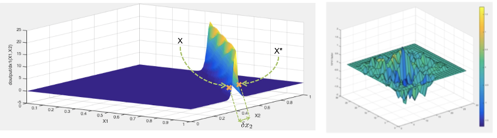
  
- 2. Construct a **saliency map** based on derivative

     high values correspond to input features that either **increase the target class**, or **decrease other classes significantly**
     $$
     S(\mathbf{X}, t)[i]=\left\{\begin{array}{c}
     0 \text { if } \frac{\partial \mathbf{F}_{t}(\mathbf{X})}{\partial \mathbf{X}_{i}}<0 \text { or } \sum_{j \neq t} \frac{\partial \mathbf{F}_{j}(\mathbf{X})}{\partial \mathbf{X}_{i}}>0 \\
     \left(\frac{\partial \mathbf{F}_{t}(\mathbf{X})}{\partial \mathbf{X}_{i}}\right)\left|\sum_{j \neq t} \frac{\partial \mathbf{F}_{j}(\mathbf{X})}{\partial \mathbf{X}_{i}}\right| \text { otherwise }
     \end{array}\right.
     $$

  > difficulty in jacobian-based: the constraint that "increase target, decrease other classes" is hard to formalize and optimize (non-linear)

  3. Modify $\mathbf{X}_{i_{m a x}}^{*}$ by $\theta$ s.t. $\quad i_{\max }=\arg \max _{i} S\left(\mathbf{X}, \mathbf{Y}^{*}\right)[i]$

- **Carlini \& Wagner (C \& W):** L2 attack, Lo attack and L $_{\infty}$ attack

  - Challenge: constraint $\mathrm{C}(\mathrm{x}+\delta)=\mathrm{t}$ is highly non-linear
  - Solution: define (a class of) objective functions $f(x+\delta) \leq 0$ iff $C(x+\delta)=t$

    $$
    \begin{array}{l}
    f_{1}\left(x^{\prime}\right)=-\mathrm{loss}_{F, t}\left(x^{\prime}\right)+1 \\
    f_{2}\left(x^{\prime}\right)=\left(\max _{i \neq t}\left(F\left(x^{\prime}\right)_{i}\right)-F\left(x^{\prime}\right)_{t}\right)^{+} \\
    f_{3}\left(x^{\prime}\right)=\mathrm{softplus}\left(\max _{i \neq t}\left(F\left(x^{\prime}\right)_{i}\right)-F\left(x^{\prime}\right)_{t}\right)-\log (2) \\
    f_{4}\left(x^{\prime}\right)=\left(0.5-F\left(x^{\prime}\right)_{t}\right)^{+} \\
    f_{5}\left(x^{\prime}\right)=-\log \left(2 F\left(x^{\prime}\right)_{t}-2\right) \\
    f_{6}\left(x^{\prime}\right)=\left(\max _{i \neq t}\left(Z\left(x^{\prime}\right)_{i}\right)-Z\left(x^{\prime}\right)_{t}\right)^{+} \\
    f_{7}\left(x^{\prime}\right)=\mathrm{softplus}\left(\max _{i \neq t}\left(Z\left(x^{\prime}\right)_{i}\right)-Z\left(x^{\prime}\right)_{t}\right)-\log (2)
    \end{array}
    $$

  >  use the range of $\delta = \tanh(\omega)$ to limit the perturbation in a small range, making the problem easier to optimize
  
  Perturbation $\delta$ is defined in terms of w: Optimize over w:
  $$
  \min _{\omega}\left\|\frac{1}{2}(\tanh (\omega)+1)-x\right\|_{2}^{2}+\text { cf }\left(\frac{1}{2} \tanh (\omega)+1\right)
  $$
  where $\quad f(x)=\max \left(\max \left\{Z(x)_{i}: i \neq t\right\}-Z(x)_{t},-\kappa\right)$
  
  We convert the restricted perturbation to a unrestricted perturbation to reduce the number of changed pixels

### Attack Approaches

- **White-box attack**: we construct a new loss function based on the original loss function, and generate adversarial examples

  > All the adversarial example problems introduced above

  - Difficulty: construct a differentiable loss function that can generate adversarial examples (so that we can perform gradient ascent over)

- **Black-box attack**: attacker trains a **substitute** model in the same way as the original model, but on a separate training set, then performs a white-box attack on the substitute

  - most difficult threat model
  - rely on **transferability** property

## Detection and Defence

### Adversarial Training (Defence)

Training a model that is robust to adversarial attacks

- **min-max problem**: ensure the model cannot be attacked even if the adversary has full knowledge of the model

$$
\underset{\theta}{\mathrm{minimize}} \frac{1}{|S|} \sum_{x, y \in S} \max _{\|\delta\| \leq \epsilon} \ell\left(h_{\theta}(x+\delta), y\right)
$$
1. Optimize $\theta$ by stochastic gradient descent
$$
\theta:=\theta-\alpha \frac{1}{|B|} \sum_{x, y \in B} \nabla_{\theta} \max _{|\delta| \leq \epsilon} \ell\left(h_{\theta}(x+\delta), y\right)
$$
2. Compute the (sub)gradient of a function containina a max term
   1. find the maximum $\delta^{\star}(x)=\underset{\|\delta\| \leq \epsilon}{\mathrm{argmax}} \ell\left(h_{\theta}(x+\delta), y\right)$
   2. compute the normal gradient evaluated at this point

$$
\nabla_{\theta} \max _{\|\delta\| \leq \epsilon} \ell\left(h_{\theta}(x+\delta), y\right)=\nabla_{\theta} \ell\left(h_{\theta}\left(x+\delta^{\star}(x)\right), y\right)
$$

Key of adversarial training is to incorporate a **strong** attack (PGD attack) into the inner maximization procedure

> The stronger the attack (inner max), the stronger the defence (outer min)

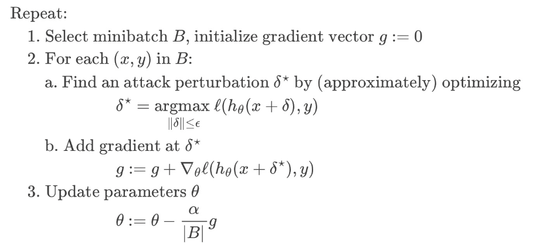

### Detection of Adversarial Examples

> detect whether the input sample is adversarial

#### Adversarial Retraining

> Idea: train a binary classifier for adversarial and normal examples

introduce a new class for adversarial examples, and train the network to detect adversarial examples

1. Train a model $F_{\text {base }}$ on the training data $X_{0}=X$.
2. Generate adversarial examples on model $F_{\text {base }}$ for each $\left(x_{i}, y_{i}\right) \in X .$ Call these examples $x_{i}^{\prime}$.
3.  Let $\mathcal{X}_{1}=\mathcal{X}_{0} \cup\left\{\left(x_{i}^{\prime}, N+1\right): i \in|\mathcal{X}|\right\}$ where $N+1$ is the new label for adversarial examples.
4. Train a model $F_{\text {secured }}$ on the training data $X_{1}$.

If the defense and model parameters are known to the adversary, the defense is invalid!

> Such method can fail, because adversarial examples may be re-generated for $F_{secured}$

#### Density Estimation

> Check the distance of the adversarial examples with normal examples, by estimating the density

> For example, here we use the output of the final hidden layer, to evaluate the density

Density Estimation: model outputs from the final hidden layer of a neural network, and argue that adversarial examples belong to a different distribution
$$
K D E(x)=\frac{1}{\left|X_{t}\right|} \sum_{s \in\left(X_{t}\right)} \exp \left(\frac{\left|F^{n-1}(x)-F^{n-1}(s)\right|^{2}}{\sigma^{2}}\right)
$$
where s ranges over training instances with label t and $F^{n-1}$ is the output of the final hidden layer on inputs.

report x as adversarial if KDE(x) is larger than a threshold

Intuition: the later hidden layers of a neural network capture high- level semantic information about the input

#### Dropout Randomization

**Dropout Randomization:** a valid input will have the same (correct) label regardless of the random values chosen, while adversarial examples are not always predicted with the same label

sum of variances of the output:
$$
U(x)=\left(\frac{1}{L} \sum_{i=1}^{L}\left\|F_{r}(x)\right\|\right)-\left\|\frac{1}{L} \sum_{i=1}^{L} F_{r}(x)\right\|
$$
where $F_r(x)$ is the randomized network with dropout

report x as adversarial if U(x) is larger than a threshold

### Benchmark Library

- CleverHans: a Python library to benchmark machine learning systems’ vulnerability to adversarial examples

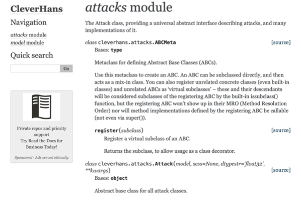

## Privacy Attacks

> Above, we have introduced attacks and defence w.r.t. the input level. We now focus on attacks target

