<!-- more -->

## Data Streams

- Data stream: sequence of signals

  - infinite
  - non-stationary (不稳定) (may not conform to iid)

- The stream model

  - elements/tuplesat a rapid rate
  - the system cannot store the entire stream

  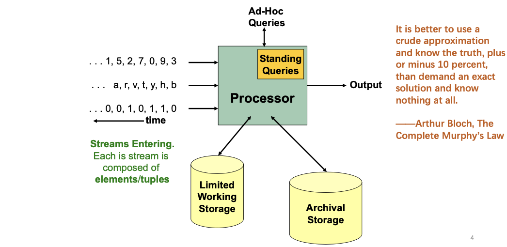

- Query

  - Standing queries: system internal

  - Adhoc queries: required by users

    > Murphy: minor error can be tolerated, better than working for a long time for nothing

- Storage

  - Archival Storage (Disk)

    > long accessing time, 
    >
    > for offline data processing, if the query is not very urgent, so that map-reduce can be used

  - Limited Working Storage (Memory)

### Applications

- **Mining Network Streams**

  - finding abnormal patterns

  - filtering out spam calls

  - detect denial-of-service attacks in IP packet streams

    > "DOS" attacks. attackers flood the server by sending a lot of requests

- **Mining Internet**

  - Query Systems: frequent trend today
  - Click Systems: detect unusual number of hits in past hour
  - Social Network News Feeds: Weibo trending topics

### Requirements

1. Types of queries one wants on answer on a data stream (element):
   - Sampling data from a stream, to construct a random sample
   - Filtering a data stream, select elements with property X
2. Types of queries one wants on answer on a data stream (statistics):
   - Queries over sliding windows, e.g. number of items of type X
   - Counting distinct elements, e.g. number of distinct items in last k elements
   - Finding frequent elements, e.g. estimate most frequent items in last k
   - Estimating moments, e.g. estimate avg./std. dev. of last k elements.

> Complicated queries can be handled over to offline systems, and users may expect a longer latency

## Sampling a fixed-size sample

**Suppose** we need to maintain a random sample S of size exactly s tuples

**Goal**: sample each item  in the sample S seem so far with *equal prob.* $s/n$.

**Problem**. at which prob to sample and at which prob to replace

::: theorem

**Algorithm**.

1. Store all the first s elements of the stream to S
2. Suppose we have seen n-1 elements, and now the nth element arrives (n **>** s)
3.  With probability s/n, keep the nth element, else discard it
4. If we picked the nth element, then it replaces one of the s elements in the sample S, picked uniformly at random

:::

### Proof

**Claim.** After n elements, the sample contains each element seen so far with probability s/n

1. Base case: After we see **n=s** elements the sample **S** has the desired property 
   - Each out of **n=s** elements is in the sample with probability s/s = 1
2. **Inductive hypothesis:** After n elements, the sample S contains each element seen so far with prob. s/n
3. **Inductive step:** For new element, clearly prob.= $s/(n+1)$
   For elements already in S, probability that the algorithm keeps it in S is: $Pr(a\in S_{n+1} | a\in S_n) =$
   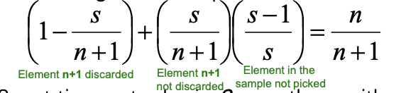
   - so at time n, tuples in S were there with prob s/n
   - time n->n+1, tuple stay with prob n/n+1
   - so at time n+1, tuple in S prob = s/n+1

## Filtering Data Streams

### Applications

- Spam filtering
- Publish-subscribe systems

> know whether the new element satisfies a condition

### First Cut Solution

- $O(1)$ algorithm to determine whether a new element is in the set
  - constant time, error may occur
- **Solution:**
  - Given a set of keys $S$ we want to filter
  - Create a bit array B of n bits, initially all 0s.
  - Choose a hash function h with range [0,n]
  - Hash each member of $s\in S$ to one of the n buckets, and set that bit to 1. i.e. `B[h[s]]:=1`
  - Hash each element a of the stream and output only those that hash to bit that was set to 1, i.e. Output `a` if `B[h[a]]==1`

- Creates **false positives** but **no false negatives**
  - If the item is in S we surely output it, if not we may still output it

- **Example**.

  - |S|= 1 billion email addresses

  - |B|= 8 billion bits = 1GB, for the hash values

  - **NO FN:** If the email address is in S, then it surely hashes to a bucket that has the big set to **1**, so it always gets through

  - **FP**:  Approximately 1/8 of the bits are set to 1, so about 1/8 of the addresses not in S get through to the output

    > Might less than 1/8 because the hash process itself may cause duplicate hits to same bucket

- **Analysis**. more accurate analysis for FP (rate of hashed bucket) using *throwing darts* as example

  - Consider: If we throw m darts into n equally likely targets, what is

    the probability that a target gets at least one dart?

    - Analogy: target ~ bits/buckets, darts ~ hash value of items

  - We have m darts (emails), n targets (buckets)

  - What is the probability that **a target gets at least one dart**?

    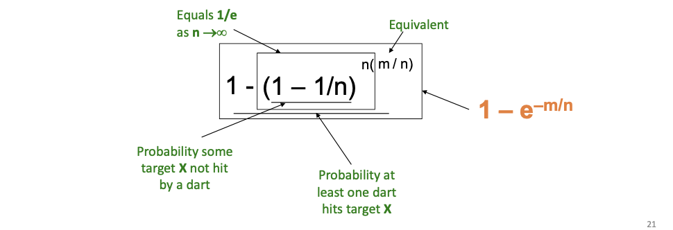

  - $\rightarrow 1 - e^{-m/n}$

  - For the above example $1-e^{-1/8} = 0.1175$

    >  How to further **improve** this false positive probability? 

    >  Similar to LSH: Bloom Filter.
    >
    > Idea: making the Jaccard similarity curve from a straight line to curve by repeating

### Bloom Filter

> Intuition: throw the dart for k times, filter only if k hash values match

- **Solution:**
  - Given a set of keys $|S| = m$ we want to filter
  - Create a bit array $|B| = n$ bits, initially all 0s.
  - Choose $k$ hash function h with range [0,n]
  - Hash each member of $s\in S$ to one of the n buckets, and set that bit to 1. i.e. `B[h_i[s]]:=1`(for each i=1,...,k)
  - Hash each element a of the stream and output only those that hash to bit that was set to 1, i.e. Output `a` if `B[h_i[a]]==1` for all i = 1,...k

- **Analysis.**

  - Throwing $k\cdot m$ darts at $n$ targets

  - So fraction of 1s is $(1-e^{-km/n})$

    > The k here seems to making the prob higher
    >
    > Note, this is not the FP rate we want! Because the judging criteria is also higher.

  - But we have $k$ independent hash functions, so FP prob.is $(1-e^{-km/n})^k$

  - 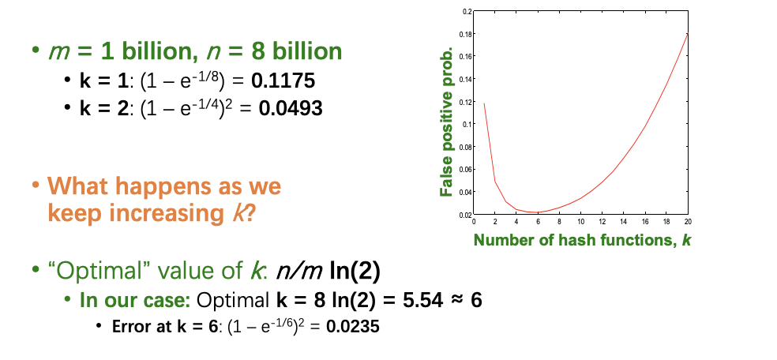

  - For the above case, we can minimize the FP rate using 6 functions to 2.3% FP rate

- **Summary.**

  - Bloom filters guarantee **no false negatives**, and use limited memory
    - Great for pre-processing before more expensive checks
  - Suitable for **hardware implementation (even faster)**
    - Hash function computations can be parallelized
  - Is it better to have **1** big **B** or k small **B**s? 
    - **It is the same:** $(1 – e^{-km/n})^k$ vs. $(1 – e^{-m/(n/k)})^k$
    - But keeping **1 big B** is **simpler**
  - Disadvantage: only insertion, no deletion from Bloom Filter.
    - Deleting bucket may cause FN!

## Count-Min Sketch

- Faced with big data streams, storing all elements and corresponding frequencies is **impossible**.
  - **Approximate** counts are acceptable. 
  - We can use **hashing** again.

> Unlink filtering, now we need to count the elements

- Simple Solution:
  - **Initialization:** `count[i] = 0` for all `i=1,...,w`
  - **Increment**: `count[h(a)] += 1`
  - **Retrieve** `return count[h(a)]`
  - 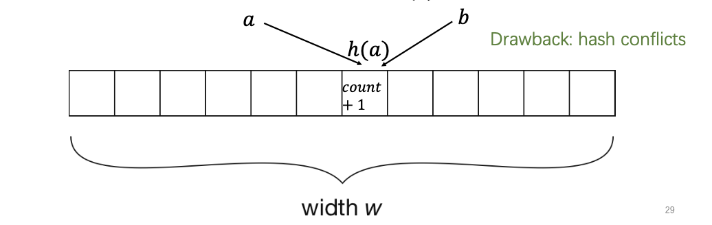
- More Hash functions
  - We use d pairwise independent hash functions
  - **Increment** count of element a `count[i,h_i(a)] += 1` for all `i=1,...,d`
  - **Retrieve** `return min(count[i,h_i(a)])`
  - 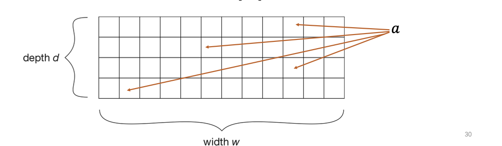

- Guarantees

  - Theorem[1]: with probability $1-\delta$, the error is at most $\varepsilon *$ count . Concrete values for these error bounds can be chosen by setting $w=\left[\frac{e}{\varepsilon}\right]$ and $\mathrm{d}=\left[\ln \left(\frac{1}{\delta}\right)\right], \mathrm{e} \approx 2.718$

  - Adding another **hash** function **exponentially** decreases the chance of hash conflicts

    > corresponds to repeated experiments

  - Increasing the **width** helps spread up the counts with a **linear** effect

## Queries over a Sliding Window

### Sliding Windows

- The range of query must falls in the N-length sliding window
- 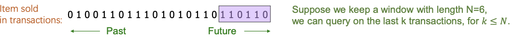

- **Problem**:
  * Given a stream of **0**s and **1**s
  * **How many 1s are in the last** k **bits?** where k ≤ N

- **Obvious solution:** Store the most recent N bits
  - When new bit comes in, discard the N**+1st** bit
  - **Not feasible** when N is so **large** that the data cannot be stored in memory and cannot answer in short time

- **Approximate solution**:

  > If the data comes in pattern, we may sample a smaller window?
  >
  > - however, violates our assumption of stream (that is unsteady)

### DGIM Method

**DGIM(Datar-Gionis-Indyk-Motwani) Algorithm**

- Does **not** have *assumptions* on data distribution
- Only stores $O\left(\log ^{2} N\right)$ bits per stream
- Solution gives **approximate** answer, **never off** by more than $50 \%$
- Error factor can be reduced to any fraction $>0$, with more complicated algorithm and proportionally more stored bits

### An early work: Exponential Windows

**First Trial.**

- Summarize exponentially increasing regions of the stream, looking backward, to answer queiries over last k items ($k\le N $)

  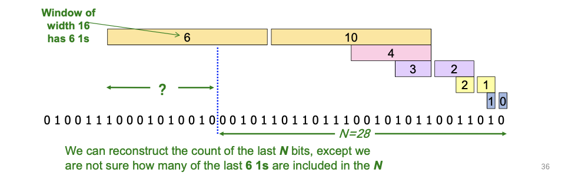

- **Drop** small regions if there are **more than two** on the same level (keep the leftmost)

  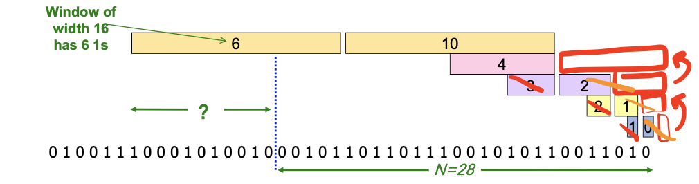

> - For size `1,2,3,5,7,11,15,..` - can provide accurate answer
> - The total number of windows $O(\log N)$
> - every windows uses one counter, stores only $O(\log^2 N)$ bits

**Remark with first trial.**

- **Easy update** as more bits enter

- **Error** in count no greater than the number of **1s** in the “**unknown**” area

- **The relative error could be unbounded!**
  -  **Relative error=error/true count** (can be zero or infinity!)
  - Consider the case that all the **1s** are in the unknown area("**?**" part) and the rest are all 0s. Here the relative error is infinite.
  - 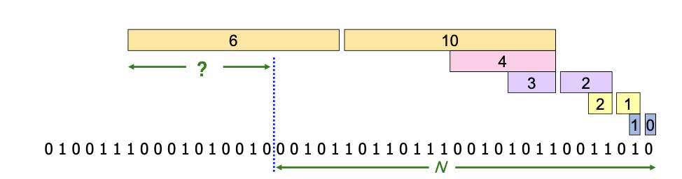

### Fixup: DGIM Method

- **Idea:** Instead of summarizing fixed-length blocks, summarize blocks with specific number of **1s**:
  - Let the block **sizes** (number of **1s**) increase exponentially 
  - **Data dependent**
- When there are few 1s in the window, block sizes stay small, so errors are small

> - The true count in a window can never be zero
> - We can keep less number of blocks in N-length window, so errors are small

#### Timestamps

> We may choose only to record the ending timestamp to complete our task (which saves a number)

- Each bit in the stream has a timestamp, starting **1**, **2,** ...
- Trick: Record timestamps modulo N (**the window size**), so we can represent any **relevant** timestamp in $O(\log_2 N)$ bits

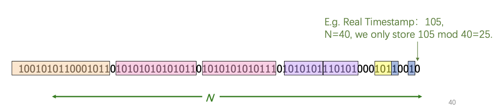

#### Buckets

- A *bucket* in the DGIM method is a record consisting of:
  -  **The timestamp of its end** **[$O(\log N)$ bits]**
  -  **The $2^n$ number of 1s between its beginning and end** **[$O(\log\log N)$bits]**

- **Constraint on buckets:**
  - a trick: Number of **1s** must be a power of **2**
  - That explains the **O(log log** N)

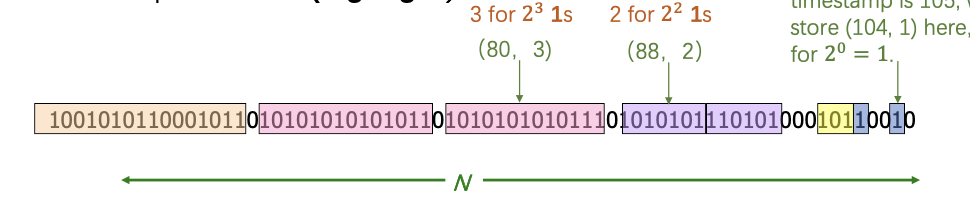

- Either **one** or **two** buckets with the same **power-of-2 number** of **1s**
- Buckets **do not overlap** in timestamps
- Buckets are **sorted** by **size**
  - Earlier buckets are not smaller than later buckets
- Buckets **disappear** when their end-time is **>** N time units in the past

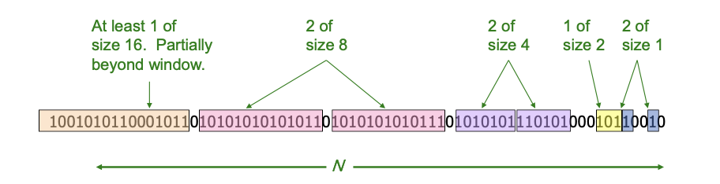

#### Updating Buckets

**If the current bit is 1:**

1. Create a new bucket of size **1**, for just this bit 
   - **End timestamp = current time**

2. If there are now three buckets of size 1, combine the oldest two into a bucket of size 2

3. If there are now three buckets of size 2, combine the oi ldest two into a bucket of size 4
4. Continue until there are at most two buckets of size $2^i$

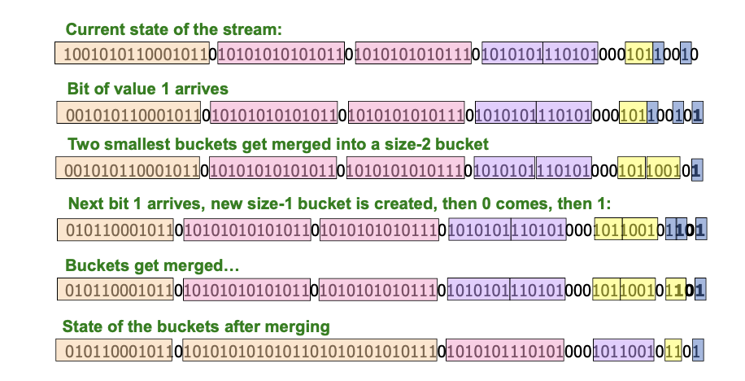

#### How to Query

- To estimate the number of 1s in the most recent N bits:

  1. Sum the sizes of **all** buckets **but the last partially overlapping with**

  **the query**

  2. Add **half** the size of the last bucket

- **Remember:** We do not know how many **1s** of the last bucket are still within the wanted window

#### Error Bound: Proof

- Suppose the last bucket has size 2 '
- Then by assuming $2^{r-1}$ (i.e., half) of its 1 s are still within the window, we make an error of at most $\mathbf{2}^{\boldsymbol{r}-1}$
- Since there is at least one bucket of each of the sizes less than $\mathbf{2}^{r}$, the true sum is at least $1+2+4+. .+2^{r-1}=2^{r}-1$
- Thus, relative error at most $50 \%$

### Further reducing the error

- Instead of maintaining **1** or **2** of each size bucket, we allow either s**-1** or s buckets (s **> 2**)
  - Except for the largest size buckets, where we can have any number between **1** and s of those.

  

- Error is at most $\frac{2^{\mathrm{r}-1}}{(s-1)\left(2^{r}-1\right)}=\mathrm{O}(1 / \mathrm{s})$
- By picking $s$ appropriately, we can tradeoff between number of bits we store and the error

### Extensions

- Can we handle the case where the stream is not bits, but integers, and we want the sum of the last $k$ elements?

- We want the sum of the last $k$ elements

- Amazon: Avg. price of last $\mathbf{k}$ sales

- Solution: If you know all have at most $m$ bits

  - Treat $m$ bits of each integer as a separate stream
  - Use DGIM to count $1 \mathrm{~s}$ in each integer
  - The sum is $=\sum_{i=0}^{m-1} c_{i} 2^{i}$

  

## Counting Distinct Elements

- **We often ask questions like:** 
  - How many distinct people visit the website?
  - How many distinct products have we sold in the last week?

- **Problem:** 
  - Data stream consists of a universe of elements chosen from a set of size N 
  - Maintain a count of the number of **distinct elements** seen so far

### Using Small Storage

- **Obvious approach:** 
  Maintain the set of elements seen so far

- **Real problem:**
  What if we do not have space to maintain the set of elements seen so far?

- **Same philosophy as previous:**
  - Estimate the count in an unbiased way
  - Accept that the count may have a little error, but limit the probability that the error is large

### Flajolet-Martin Approach

- Pick a hash function $h$ that maps each of the $N$ elements to at least $\log _{2} N$ bits
- For each stream element $a$, let $r(a)$ be the number of trailing 0 s in $h(a)$
$\mathrm{r}(\mathrm{a})=$ position of first 1 counting from the right
E.g., say $h(a)=12$, then 12 is 1100 in binary, so $r(a)=2$
- Record $R=$ the maximum $r(a)$ seen
- $\mathrm{R}=\max _{\mathrm{a}} \mathrm{r}(\mathrm{a})$, over all the items $a$ seen so far
- Estimated number of distinct elements $=2^{R}$

### Why it works

**Rough and heuristic intuition**.

- $h(a)$ hashes a with equal prob. to any of $N$ values

- Then $h(a)$ is a sequence of $\log _{2} \mathbf{N}$ bits, where $2^{-r}$ fraction of all as have a tail of $r$ zeros
  - About $50 \%$ of as hash to $* \star \star 0$
  - About $25 \%$ of as hash to $\star \star 00$
  - So, if we saw the longest tail of $r=2$ (i.e., item hash ending $* 100$ ) then we have probably seen about 4 distinct items so far
- **So, it takes to hash about $2^{r}$ items before we see one with zero-suffix of length $r$**

**A (half-)formal proof**.

- What is the probability that a given $h(a)$ ends in at least $r$ zeros is $2^{-\prime}$
  - $\mathrm{h}(\mathrm{a})$ hashes elements uniformly at random
  - Probability that a random number ends in at least $r$ zeros is $\mathbf{2}^{-r}$
- Then, the probability of NOT seeing a tail of length $r$ among $m$ elements:

- Note: $\left(1-2^{-r}\right)^{m}=\left(1-2^{-r}\right)^{2^{r}\left(m 2^{2-r}\right)} \approx e^{-m 2^{-r}}$
- **Prob. of NOT finding a tail of length $r$ is**:
  - If $m<<2^{r}$, then prob. tends to 1 
    - $\cdot\left(1-2^{-r}\right)^{m} \approx e^{-m 2^{2 r}}=1 \quad$ as $\mathrm{m} / 2^{2} \rightarrow 0$
    - So, the probability of finding a tail of length $r$ tends to 0 
  - If $m>>2^{r}$, then prob. tends to 0
    -  $\left(1-2^{-r}\right)^{m} \approx e^{-m 2^{-r}}=0 \quad$ as $\mathrm{m} / 2^{r} \rightarrow \infty$
    - So, the probability of finding a tail of length $r$ tends to 1
- Thus, $2^{R}$ will almost always be around $m !$

### Issue to fix

- $\mathrm{E}\left[2^{R}\right]$ is actually **infinite**
  - Probability halves when $R \rightarrow R+1$, but value doubles
  - Limit the bits of hashing values to $L$
- The estimation is **biased**
  - Estimated with $2^{R} / \Phi$, where $\Phi=0.77351$ is a correction factor.
- Problems of **high variance**. Improve accuracy.
  - Use many hash functions with samples of $R$
  - Partition your samples into small groups
  - **potential soultion: Take the median of groups**
  - Then take the average of the medians

## Computing Moments

### Moments

- Suppose a stream has elements chosen from a set $A$ of $N$ values (say 1 to $\mathrm{N}$ )

- Let $m_{j}$ be the number of times value $i$ occurs in the stream
- The $k^{\text {th }}$ moment is

$$
\sum_{i \in A}\left(m_{i}\right)^{k}
$$

### Special Cases

- $0^{\text {th }}$ moment $=$ number of distinct elements(Flajolet-Martin Approach)
- $1^{\text {st }}$ moment $=$ count of the numbers of elements $=$ length of the stream
- $2^{\text {nd }}$ moment $=$ surprise number $S=$ a measure of how uneven the distribution is
  E.g. Stream of length 100,11 distinct values
  - Item counts: $10,9,9,9,9,9,9,9,9,9,9$ Surprise $S=910$
  - Item counts: 90, 1, 1, 1, 1, 1, 1, 1,1,1,1 Surprise $S=8,110$

### AMS Method

- AMS method works for all moments
- Gives an unbiased estimate
- We will just concentrate on the $2^{\text {nd }}$ moment $S$
- We pick and keep track of some variables $X$ :
  - For each variable $X$ we store $X$.el and $X$.val
    -  $X$.el corresponds to the item $i$ 
    - $x$.val corresponds to the count of item $i$
  - Note this requires a count in main memory, so number of $X_{\mathrm{s}}$ is limited
- Our goal is to compute $S=\sum_{i} m_{i}^{2}$

### One Random Variable

- How to set $X$.val and X.el?
  - Assume stream has length $n$
  - Pick some random time $t(t<n)$ to start, so that any time is equally likely
  - Let at time $t$ the stream have item i. We set $X$.el $=i$
  - Then we maintain count $c(X . v a l=c)$ of the number of is in the stream starting from the chosen time $t$
- Then the estimate of the $2^{\text {nd }}$ moment $\left(\sum_{i} m_{i}^{2}\right)$ is:
$$
S=f(X)=n(2 \cdot c-1)
$$
- ​	Note, we will keep track of multiple $\mathrm{Xs}_{\mathrm{s}}\left(\mathrm{x}_{1}, \mathrm{x}_{2}, \cdots \mathrm{X}_{\mathrm{k}}\right)$ and our final estimate will be $S=1 / k \sum_{j}^{k} f\left(X_{j}\right)$

### Expectation Analysis

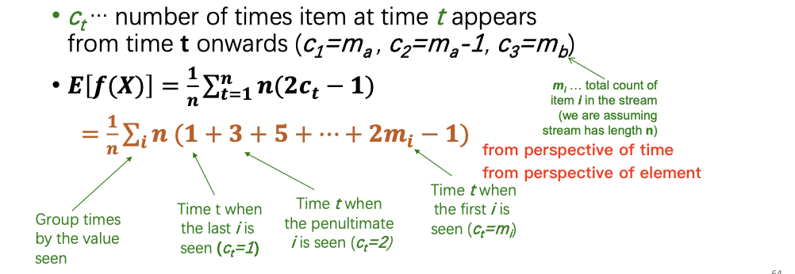

- $E[f(X)]=\frac{1}{n} \sum_{i} n\left(1+3+5+\cdots+2 m_{i}-1\right)$
- calculation: $\left(1+3+5+\cdots+2 m_{i}-1\right)=\sum_{i=1}^{m_{i}}(2 i-1)=$
  $\quad 2 \frac{m_{i}\left(m_{i}+1\right)}{2}-m_{i}=\left(m_{i}\right)^{2}$
- Then $\mathbf{E}[\mathbf{f}(\mathbf{X})]=\frac{1}{n} \sum_{i} \boldsymbol{n}\left(\boldsymbol{m}_{i}\right)^{2}$
- So, $\mathbf{E}[\mathbf{f}(\mathbf{X})]=\sum_{i}\left(\boldsymbol{m}_{i}\right)^{2}=\boldsymbol{S}$
- **We have the second moment (in expectation)!**

### Higher-order Moments

- **For estimating $\mathrm{k}^{\text {th }}$ moment we essentially use the same algorithm but change the estimate:**
- For $\mathrm{k}=2$ we used $n(2 \cdot \mathrm{c}-1)$
- For $\mathrm{k}=3$ we use: $n\left(3 \cdot c^{2}-3 c+1\right) \quad$ (where $\mathbf{c}=\mathrm{X} .$ val $)$
- Why?

  - For $\mathrm{k}=2$ : Remember we had $\left(1+3+5+\cdots+2 m_{i}-1\right)$ and we showed terms $2 c-1$ (for $\mathbf{c = 1 , \cdots , m}$ sum to $m^{2}$ $\sum_{c=1}^{m} 2 c-1=\sum_{c=1}^{m} c^{2}-\sum_{c=1}^{m}(c-1)^{2}=m^{2}$
    So: $2 c-1=c^{2}-(c-1)^{2}$
  - For $k=3: c^{3}-(c-1)^{3}=3 c^{2}-3 c+1$
- **Generally: Estimate $=n\left(c^{k}-(c-1)^{k}\right)$**

### Combining Samples

**In practice**.

- Compute $f(X)=n(2c-1)$ for as many variables X as you can fit in memory

- Average them in groups
- Take median of averages (To reduce variance)

**Problem: Streams never end**

> How to sample uniformly from timestamp?

- We assumed there was a number n, the number of positions in the stream
- But real streams go on forever, so n is a variable – the number of inputs seen so far

**Fixups**

1. The variables $X$ have $n$ as a factor keep $n$ separately; just hold the count in $X$
2. Suppose we can only store $k$ counts. We must throw some $X_{S}$ out as time goes on:

- Objective: Each starting time $t$ is selected with probability $k / n$
- Solution: (fixed-size (Reservoir) sampling!)
- Choose the first $k$ times for $k$ variables
- When the $n^{\text {th }}$ element arrives $(n>k)$, choose it with probability $k / n$ If you choose it, throw one of the previously stored variables $\mathrm{X}$ out, with equal probability

## Summary

- Queries
  - Filtering a data stream
  - Queries over a sliding window 
  - Counting distinct elements
  - Estimating moments

- Key techniques
  - Hashing functions
  -  Approximation with sketch/summarization 
  - Theoretical analysis