**Outline**:
- Data Objects and Attribute Types
- Measuring Central Tendency, Dispersion
- Data Visualization
- Measuring Data Similarity and Dismilarity

**Keypoints**:
- (A)symmetric Binary Dissimilarity
- Boxplot and its construction in $O(n)$
- Approximate mean/mode/median in unimodal data
- Approximate median by group frequency

<!-- more -->

## Data Objects and Attribute Types

### Data Objects

- Data sets are made up of **data objects**.
- A data object represents an entity. Also called **samples, examples, instances, data points**.
- In a database, **objects** are stored as data tuples (**rows**). Attributes correspond to **columns**.

### Attributes

**Attribute** (or dimensions, features, variables): a data field, representing a characteristic or feature of a data object.

**Values** for a given attribute is called **observations**.

**Types**:
- **Nominal** (categorical, no meaningful order)
- **Binary** a nominal attribute with 0 or 1 states (Boolean if the states are true or false)
- **Ordinal** with order, but unclear magnitude between sucessive values
  - e.g. grades = {A+, A-, ...}
> Nominal, binary, and ordinal attributes are **qualitative**. Their values are typically words (or codes) representing **categories**.
- **Numeric**, quantitative
  - **interval-scaled**, measured on a scale of equal-size units, can **compare** and **quantify**
    - e.g. temperature, no true zero, no ratios
  - **ratio-scaled**, can multiply or divide, with an inherent zero-point

::: details How to deal with tuples with missing values for some attributes?
- Ignoring the tuple: not effective unless the tuple contains several attributes with missing values
- Manually filling in the missing value: not reasonable when the value to be filled in is not easily determined
- Using a global constant to fill in the missing value: “unknown,” “-∞.” But may form an interesting concept
- Using the global attribute mean for quantitative values or global attribute mode for categorical values
- Using the class-wise attribute mean for quantitative values or class- wise attribute mode for categorical values
- Using the most probable value to fill in
:::

## Basic Statistical Descriptions of Data

- **Central Tendency**
  - mean, median, mode, midrange
- **Dispersion**
  - range, quartiles(四分距), interquartile range, five-number summary, boxplots, variance, standard deviation
- **Graphic Display**
  - bar, pie, charts
  - line graphs
  - quantile, quantile-quantile, scatter plots
  - histogram

### Measuring Central Tendency

- **mean**
  - **weighted average**
  > Problem: a small number of extreme values can corrupt the mean
  - **trimmed mean**: dropping off values at extremes

- **median**
  - for even N, median can be **any** in between
  - a better measure of the centre of skewed (asymmetric) data
  - also works with **ordinal** data
  > Problem: expensive if large number of observations

  ::: tip
  **Approximate Median**

  Assume we know the intervals and frequency, first find the median interval, then we locate the "middle" value as an approximation 

  $$median = L_1 + \left(\frac{N/2 - (\sum freq)_{l<median}}{freq_{median}} \right) width $$
  :::

- **Midrange**, average of largest and smallest
- **Mode**, ( 众数 )
  - unimodal, bimodal, trimodal, multimodal
  > For unimodal data that are moderately skewed, mode can be **approximated**
  >  $$mean - mode \approx 3 \times (mean - median)$$
  >
  > 

### Dispersion of Data

- **Quantile** ( 等分位 )
  -  $k$th $q$-quantile is the value $x$ s.t. $k/q$ of the data $< x$, and $(q - k) /q$ of the data are more than $x$.
  - median = 2-quantile, quantile = 4-quantile, percentile = 100-quantile
  
  

- **Outliers**: values falling at least $1.5\times IQR$ above $Q_3$ or below $Q_1$
- **Five-Number Summary**: Max, $Q_1$, Median, $Q_3$, Maximum
- **Boxplots**:
  
  

> Note, the bottom or top should be either max/min **or 1.5*IQR**

> For boxplots, takes ~~$O(n\log n)$~~ ($O(n)$ using median selection), for approximating the boxplots, takes $O(N)$ or sublinear time
 

- **Variance and Standard Deviation**
  - $\sigma^2 = \frac{1}{N} \sum_{i=1}^N (x_i-\bar{x})^2$
  - At least $\left((1-\frac{1}{k^2})\times 100\right)\%$ of data are within $k\sigma$ from the mean
  > By Chebyshev's inequality
  > $$\Pr(|x-\bar{x}| \geq k \sigma) \leq \frac{1}{k^{2}}$$

### Graphics Displays

- **Quantile plot**: Each value $x_{i}$ is paired with $f_{i}$ indicating approximately $\left(100 f_{i}\right) \%$ of the data are $\leq x_{i}$
  
  

- **Quantile-Quantile Plot**: graphs the quantiles of **one** univariate distribution against the corresponding quantiles of **another**

  

  > We can read from the plot that branch1 is generally lower than branch2

- **Histograms**: a chart of bars of which the height indicates frequency
  ::: details Histograms tells more than boxplots
  
  The two histograms may have the same boxplot representation: min, Q1, median, Q3, max

  | Graph1 | Graph2 |
  | -- | -- |
  |  |  |

  But they have rather different distributions

  :::

- **Scatter Plot**, show the correlation relationships, find clusters of points, find clusters

### Other Measures

- mean deviation $=\frac{\sum_{i=1}^{n}|x-\bar{x}|}{n}$ (absolute deviations from means) - measure of skewness$=\frac{\bar{x}-mode}{\mathrm{STD}}$ (how far, in STD, the mean is from the mode)
- coefficient of variation $=\frac{\mathrm{STD}}{\bar{x}} \times 100$ (STD expressed as a percentage of the mean)

For large database, measures can be efficiently calculated by **partitioning** the database, computing the values for each partition, and then **merging** these values into an equation to calculate the value for the entire database.

## Data Visualization

### Geometric projection

To understand distribution of data in a multidimensional space, we should visualize a high-dimensional space on a 2-D display.
- **Direct**
- **Scatter point**
  - use different shapes of scatters to represent another dimension
- **Scatter Plot Matrices**
  - $n^2$ grid of 2-D scatter plots for n-dimensional dataset
  > 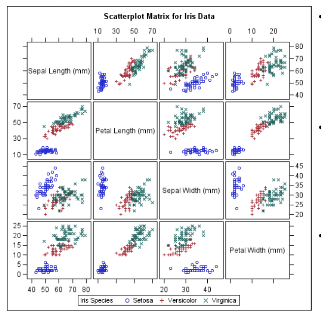
  - less effective when dimensions are high
- **Parallel Coordinates**
  - k equally spaced axes, one for each dimension
  - A data record is represented by a polygonal line that intersects each axis at the corresponding value
  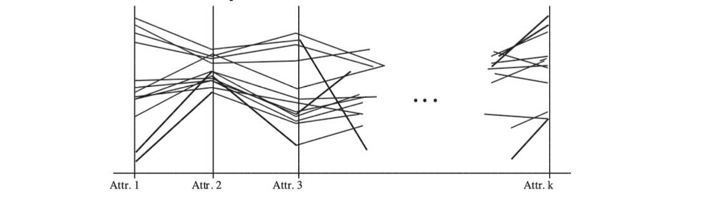
  - cannot show many data records
- **Landscapes** (地形图)

### Pixel-Oriented Visualization

> Every window is a dimension, the same object is at the same location of every window. Use the grey value to represent attributes.
> 
> 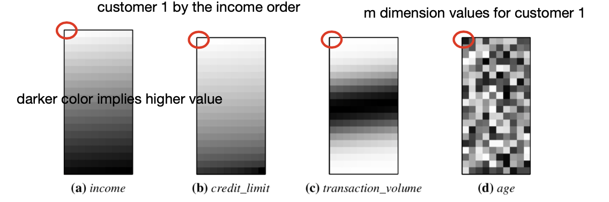

**Problem**. pixels separated far apart should be next to each other in the global order, or the other around
> e.g. Customer 1 and 11 are next to each other (vertically) in the window, but they are actually far in the real sequence

**Solution**. 1. arrange data along the space-filling curves; 2. circle segment

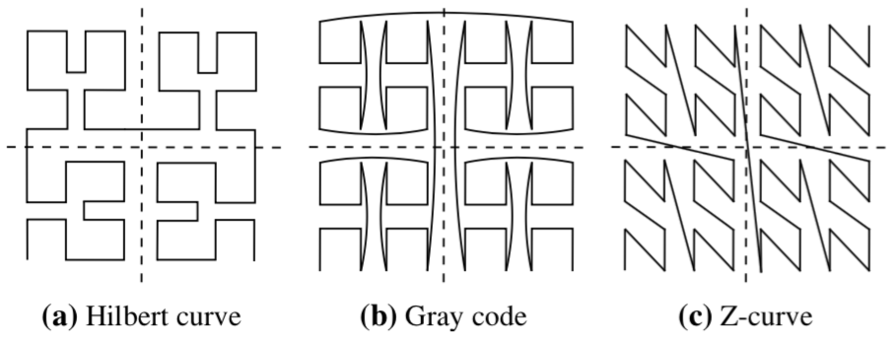

> The shape of the windows can also vary
> 
> 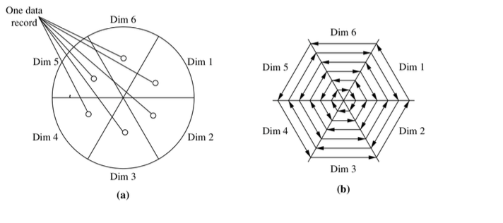

### Icon-Based Visualization

- Chernoff faces
- Stick Figure

### Hierarchical Visualization

Visualization of data using a hierarchical partitioning into subspaces

#### Dimensional Stacking

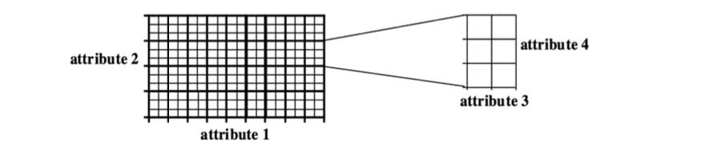

1. Group (ordered) dimensions into groups of 2, 
2. begin with the lowest dimension, divide the virtual screen into $m\times n$ sections (Assume $m$ values for attribute 1 and $n$ values for attribute 2), 
3. then divide every section into subsections according to the next dimension group.

#### Worlds-within-Worlds

fix 3 dimensions to be a inner-world, leaving others at the outer world.

A user can change the origin of the inner world/outer world and view the resulting changes.

#### Tree-Map

e.g., disk space usage. nested block structured graph

### Visualizing Non-Numeric Data

e.g. Tag Cloud, acemap

## Measuring Data Similarity and Dissimilarity

### Why measures of proximity

or measures of similarity, for **clustering**, **outlier analysis**, and **nearest-neighbour classification**

will use 
- Data Matrix (to store data objects)
- and dissimilarity matrix (store dissimilarity values)
  - usually symmetric or represented as a down-triangle matrix

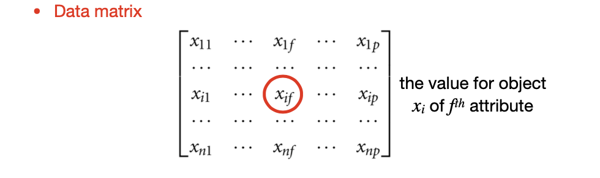

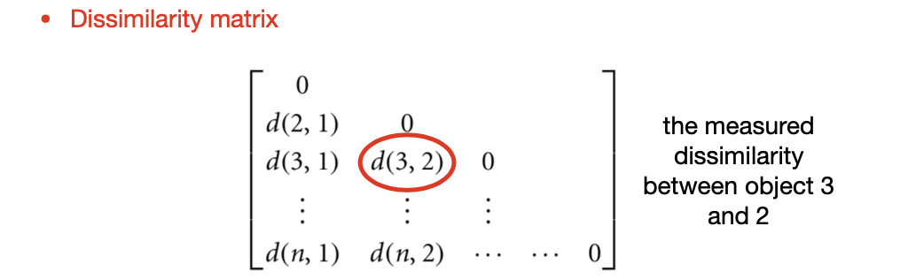

**Def.** Measures of similarity (assume dissimilarity is normalized) $sim(i,j)=1-d(i,j)$

### Proximity Measures for Nominal Data

$$
d(i,j) = \frac{p-m}{p}
$$

where $m$ is the number of matched attributes, $p$ is the total number of attributes. i.e. What is the proportion of attributes that don't match.

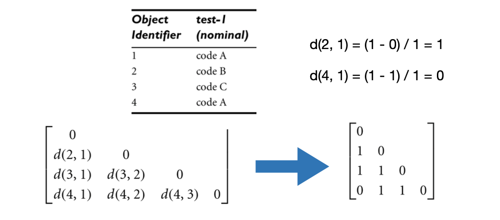

### Proximity Measures for Binary Data

**Contigency Table** for Binary Attributes

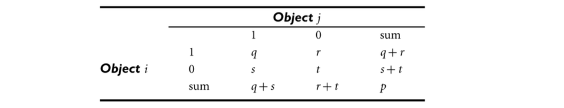

::: warning

Choose the right measure!

:::

> Recall, different interpretations of binary data
> - Equally important for 1/0 e.g. Male/Female
> - Not equally important for 1/0 e.g. positive/negative for AIDS test
>   - in which case, (negative,negative) cases can take up the majority, will hinder the differences in the numerator

**Symmetric** Binary Dissimilarity:
$$d(i,j) = \frac{r+s}{q+r+s+t}$$

**Asymmetric** Binary Dissimilarity, _omitting negative matches_:
$$d(i,j) = \frac{r+s}{q+r+s}$$

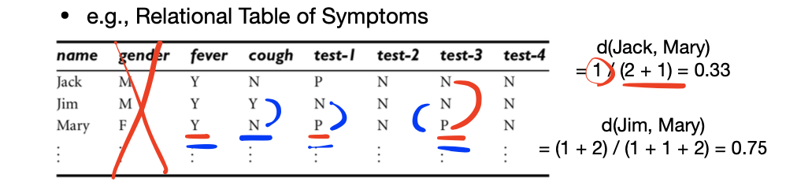

### Proximity Measures for Numeric Data

**Lp-norm (Minokowski distance)**

$$
d(i, j)=\left(\sum_{f=1}^{h}\left|x_{i f}-x_{j f}\right|^{p}\right)^{\frac{1}{p}}
$$

### Proximity Measure for Ordinal Data

> Mapping ordinal values to $[0.0,1.0]$

- Attribute $f$ for object $i$ has $M_{f}$ ordered states: $1, \ldots, M_{f}$
- Ranking $r_{i f} \in\left\{1, \ldots, M_{f}\right\}$. Map the ranking onto $[0.0,1.0]$ by
  $$
  z_{i f}=\frac{r_{i f}-1}{M_{f}-1}
  $$
- Dissimilarity is computed by $\mathrm{L}_{\mathrm{p}}$ norm

### Proximity Measure for Mixed-Typed Data

> Use Weighted Sum

Dissimilarity between object i and j:
$$
d(i, j)=\frac{\sum_{f=1}^{p} \delta_{i j}^{(f)} d_{i j}^{(f)}}{\sum_{f=1}^{p} \delta_{i j}^{(f)}}
$$
- $\delta_{i j}^{(f)}=0 \quad$ if 
  - $x_{i f}$ or $x_{jf}$ is missing or 
  - they are negative matches when $f$ is asymmetric binary
- $\delta_{i j}^{(f)}=1 \quad$ otherwise

Remember to **normalize numeric data** by 
$$d_{i j}^{(f)}=\frac{\left|x_{i f}-x_{j f}\right|}{\max _{h} x_{h f}-\min _{h} x_{h f}}$$

> Example
> 
> 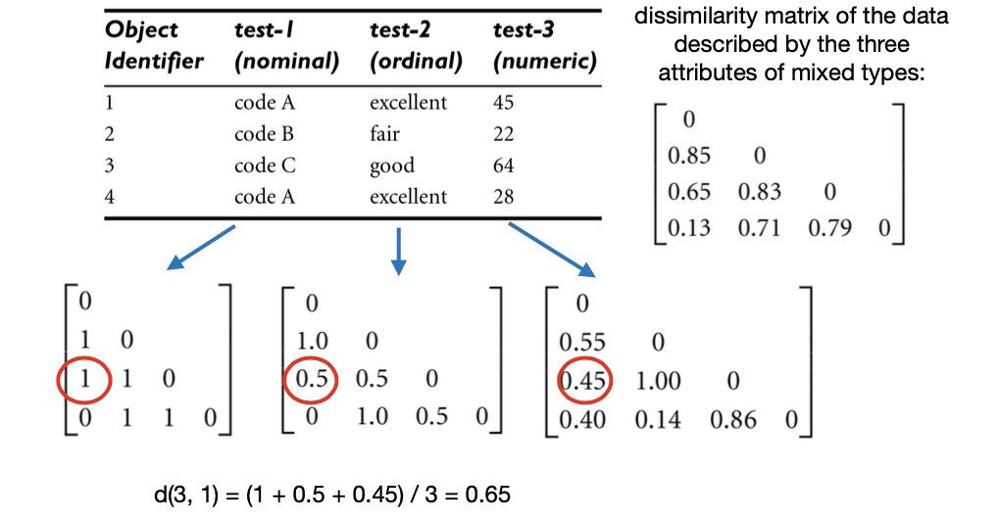

### Metric

Metric（测度）: a measure with the following properties
- Non-negativity $\mathrm{d}(\mathrm{i}, \mathrm{j}) \geq 0$
- Identity of indiscernible $\mathrm{d}(\mathrm{i}, \mathrm{i})=0$
- Symmetry $\mathrm{d}(\mathrm{i}, \mathrm{j})=\mathrm{d}(\mathrm{j}, \mathrm{i})$
- Triangle inequality $\mathrm{d}(\mathrm{i}, \mathrm{j}) \leq \mathrm{d}(\mathrm{i}, \mathrm{k})+\mathrm{d}(\mathrm{k}, \mathrm{j})$

> e.g. Cosine similarity is metric

All proximity measures up to now are metrics.