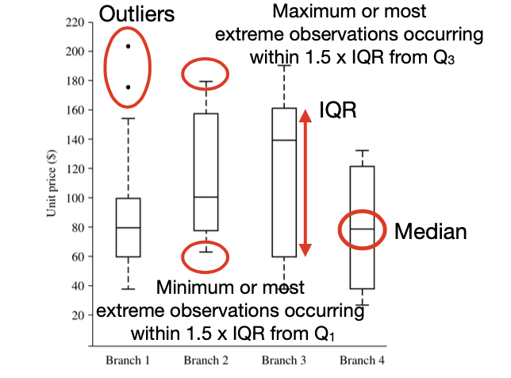

<!-- more -->

## Data Objects and Attribute Types

### Data Objects

- Data sets are made up of **data objects**.
- A data object represents an entity. Also called **samples, examples, instances, data points**.
- In a database, **objects** are stored as data tuples (**rows**). Attributes correspond to **columns**.

### Attributes

**Attribute** (or dimensions, features, variables): a data field, representing a characteristic or feature of a data object.

**Values** for a given attribute is called **observations**.

**Types**:
- **Nominal** (categorical, no meaningful order)
- **Binary** a nominal attribute with 0 or 1 states (Boolean if the states are true or false)
- **Ordinal** with order, but unclear magnitude between sucessive values
  - e.g. grades = {A+, A-, ...}
> Nominal, binary, and ordinal attributes are **qualitative**. Their values are typically words (or codes) representing **categories**.
- **Numeric**, quantitative
  - **interval-scaled**, measured on a scale of equal-size units, can **compare** and **quantify**
    - e.g. temperature, no true zero, no ratios
  - **ratio-scaled**, can multiply or divide, with an inherent zero-point

::: details How to deal with tuples with missing values for some attributes?
- Ignoring the tuple: not effective unless the tuple contains several attributes with missing values
- Manually filling in the missing value: not reasonable when the value to be filled in is not easily determined
- Using a global constant to fill in the missing value: “unknown,” “-∞.” But may form an interesting concept
- Using the global attribute mean for quantitative values or global attribute mode for categorical values
- Using the class-wise attribute mean for quantitative values or class- wise attribute mode for categorical values
- Using the most probable value to fill in
:::

## Basic Statistical Descriptions of Data

- **Central Tendency**
  - mean, median, mode, midrange
- **Dispersion**
  - range, quartiles(四分距), interquartile range, five-number summary, boxplots, variance, standard deviation
- **Graphic Display**
  - bar, pie, charts
  - line graphs
  - quantile, quantile-quantile, scatter plots
  - histogram

### Measuring Central Tendency

- **mean**
  - **weighted average**
  > Problem: a small number of extreme values can corrupt the mean
  - **trimmed mean**: dropping off values at extremes

- **median**
  - for even N, median can be **any** in between
  - a better measure of the centre of skewed (asymmetric) data
  - also works with **ordinal** data
  > Problem: expensive if large number of observations

  ::: tip
  **Approximate Median**

  Assume we know the intervals and frequency, first find the median interval, then we locate the "middle" value as an approximation 

  $$median = L_1 + \left(\frac{N/2 - (\sum freq)_{l<median}}{freq_{median}} \right) width $$
  :::

- **Midrange**, average of largest and smallest
- **Mode**, ( 众数 )
  - unimodal, bimodal, trimodal, multimodal
  > For unimodal data that are moderately skewed, mode can be **approximated**
  >  $$mean - mode \approx 3 \times (mean - median)$$
  >
  > 

### Dispersion of Data

- **Quantile** ( 等分位 )
  -  $k$th $q$-quantile is the value $x$ s.t. $k/q$ of the data $< x$, and $(q - k) /q$ of the data are more than $x$.
  - median = 2-quantile, quantile = 4-quantile, percentile = 100-quantile
  
  

- **Outliers**: values falling at least $1.5\times IQR$ above $Q_3$ or below $Q_1$
- **Five-Number Summary**: Max, $Q_1$, Median, $Q_3$, Maximum
- **Boxplots**:
  
  

> Note, the bottom or top should be either max/min **or 1.5*IQR**

> For boxplots, takes $O(n\log n)$, for approximating the boxplots, takes $O(N)$ or sublinear time
 

- **Variance and Standard Deviation**
  - $\sigma^2 = \frac{1}{N} \sum_{i=1}^N (x_i-\bar{x})^2$
  - At least $\left((1-\frac{1}{k^2})\times 100\right)\%$ of data are within $k\sigma$ from the mean
  > By Chebyshev's inequality
  > $$\Pr(|x-\bar{x}| \geq k \sigma) \leq \frac{1}{k^{2}}$$

### Graphics Displays

- **Quantile plot**: Each value $x_{i}$ is paired with $f_{i}$ indicating approximately $\left(100 f_{i}\right) \%$ of the data are $\leq x_{i}$
  
  

- **Quantile-Quantile Plot**: graphs the quantiles of **one** univariate distribution against the corresponding quantiles of **another**

  

  > We can read from the plot that branch1 is generally lower than branch2

- **Histograms**: a chart of bars of which the height indicates frequency
  ::: details Histograms tells more than boxplots
  
  The two histograms may have the same boxplot representation: min, Q1, median, Q3, max

  | Graph1 | Graph2 |
  | -- | -- |
  |  |  |

  But they have rather different distributions

  :::

- **Scatter Plot**, show the correlation relationships, find clusters of points, find clusters

### Other Measures

- mean deviation $=\frac{\sum_{i=1}^{n}|x-\bar{x}|}{n}$ (absolute deviations from means) - measure of skewness$=\frac{\bar{x}-mode}{\mathrm{STD}}$ (how far, in STD, the mean is from the mode)
- coefficient of variation $=\frac{\mathrm{STD}}{\bar{x}} \times 100$ (STD expressed as a percentage of the mean)

For large database, measures can be efficiently calculated by **partitioning** the database, computing the values for each partition, and then **merging** these values into an equation to calculate the value for the entire database.

## Data Visualization

## Measuring Data Similarity and Dissimilarity