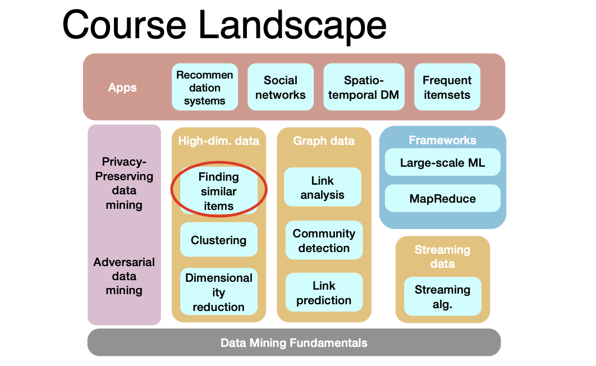
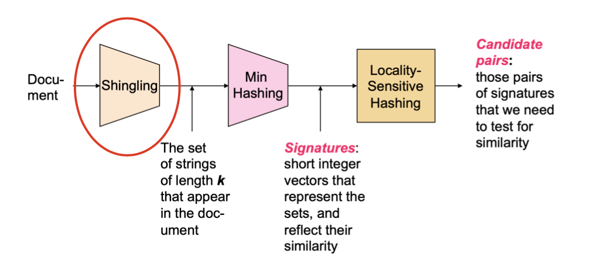

**Outline**:
- Locality-Sensitive Hashing
- Applications of Locality-Sensitive Hashing 
- Distance Measures
- Locality-Sensitive Functions
  - view LSH techniques from a theoretic perspective
- Methods for High Degrees of Similarity

<!-- more -->

**Problem Definition**. Given a large number (N in the millions or billions) of documents, find `near duplicate’ pairs

**Applications**:
- Mirror websites, or approximate mirrors
  - Don’t want to show both in search results
- Similar news articles at many news sites
  - Cluster articles by `same story’

**Problems**:
- Many small pieces of one document can appear out of order in another
- Too many documents to compare all pairs
- Documents are so large or so many that they cannot fit in main memory

## Locality-Sensitive Hashing

- Focus on pairs that are likely to be similar
- **Idea**: hash items using many different hash functions
  - similar pairs wind up in the same bucket
  - examine only the candidate pairs 
- **Example**: finding similar documents
  - **Shingling**: convert documents into sets
  - **Min-Hashing:** Convert large sets to short signatures, while preserving similarity
  - **Locality-Sensitive Hashing**

## Shingling

- Convert documents into sets
- Simple approaches:
  - Document = set of words appearing in document?
  > too many 'a', 'the',...
  - Document = set of 'important' words
  > don't work well, because we can't discriminate between articles and advertisements
- Solution: need to account for **ordering** of words
- A **k-shingle (or k-gram)** for a document is a sequence of k tokens that appears in the doc
  > E.g. for D1 = `abcab`, its 2-shingles `S(D1)={ab,bc,ca}`

### Compressing Shingles

- To compress long shingles, we can **hash them** to a few bytes
- Represent a document by the set of **hash values** of its k-shingles
  > E.g. `S(D1)={ab,bc,ca}` => `h(D1)={1,5,7}`

- Save Space!
  > E.g. for 9-shingles, if we map them to $2^32$, then each shingle will be represented by 4 bytes instead of 9
- Why not use shorter shingles?
  > Because 4-shingles have only $k^4$ probabilities, where $k$ is the characters that are frequently used
  >
  > 9-shingles are much more expressive

### Documents represented by Shingles

> Use bit-vector to represent the relation of documents and shingles

- Each document is a 0/1 vector in the space of k-shingles 
  - Each unique shingle is a dimension
  - Vectors are very sparse
- Documents that have lots of shingles in common have similar text, even if the text appears in different order
- Choice of k:
  - k = 5 is OK for short documents
  - k = 10 is better for long documents

### Shingles built from words

> A technique to discrminate advertisements from articles

- Find web pages that had the same articles, regardless of the surrounding elements
- Need to bias the set of shingles in favor of the article
  - e.g., pages with the same article but different surrounding material have higher similarity
- News articles, prose have many stop words: “and,” “you,” “to,”... 
  - Not contribute to the topic
  - But useful to distinguish from the surrounding elements
- Define a shingle to be **a stop word followed by the next two words**

> Our next question is, how to compare between pairs of set(shingles)

## Min Hashing

### Background: Set Similarity

**Jaccard similarity/distance**
- Jaccard similarity of two sets is the size of their intersection divided by the size of their union:
- $\mathrm{sim}\left(\mathrm{C}_{1}, \mathrm{C}_{2}\right)=\left|\mathrm{C}_{1} \cap \mathrm{C}_{2}\right| /\left|\mathrm{C}_{1} \cup \mathrm{C}_{2}\right|$
- **Jaccard distance**: $d\left(\mathrm{C}_{1}, \mathrm{C}_{2}\right)=1-\left|\mathrm{C}_{1} \cap \mathrm{C}_{2}\right| /\left|\mathrm{C}_{1} \cup \mathrm{C}_{2}\right|$

### Motivation

Compute pairwise similarities for every pair of docs is too exhausting!

We should reformulate the problem as **finding subsets that have significant intersection**, solution:
- encode sets using 0/1 (bit, boolean) vectors
- interpret set intersection as **bitwise AND**, and set union as **bitwise OR**