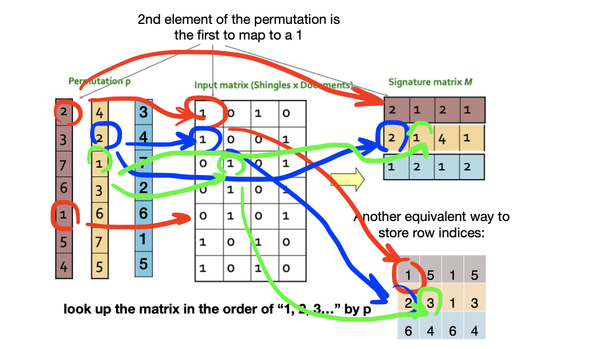
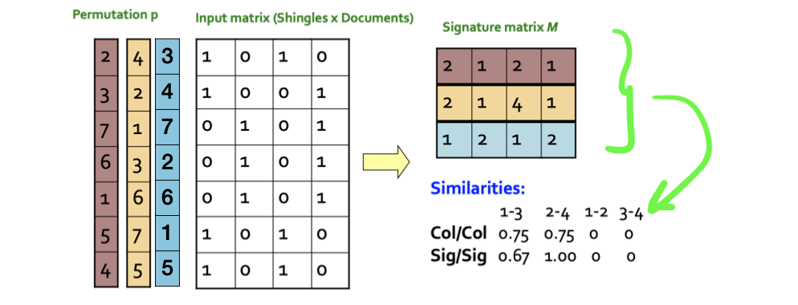
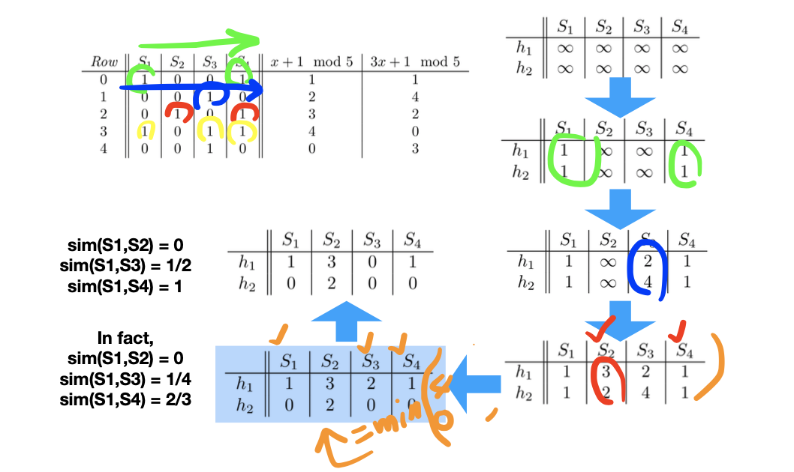
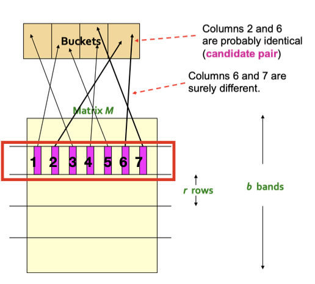
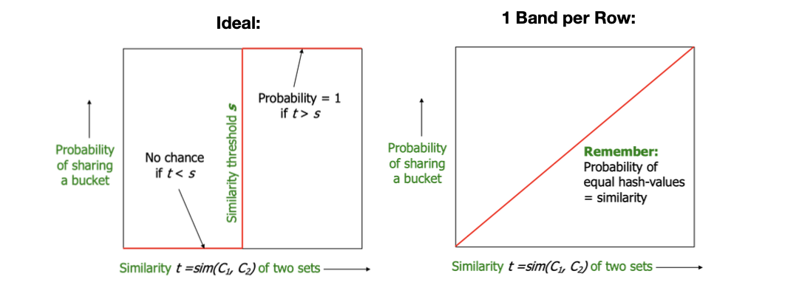
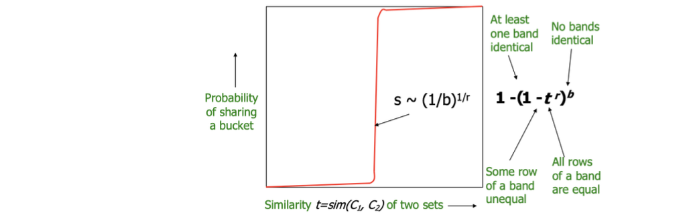
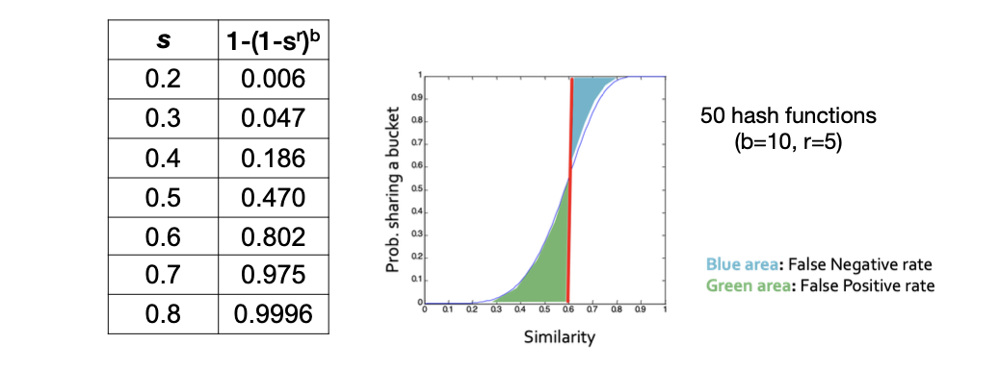

**Outline**:
- Locality-Sensitive Hashing
- Applications of Locality-Sensitive Hashing 
- Distance Measures
- Locality-Sensitive Functions
  - view LSH techniques from a theoretic perspective
- Methods for High Degrees of Similarity

<!-- more -->

**Problem Definition**. Given a large number (N in the millions or billions) of documents, find `near duplicate’ pairs

**Applications**:
- Mirror websites, or approximate mirrors
  - Don’t want to show both in search results
- Similar news articles at many news sites
  - Cluster articles by `same story’

**Problems**:
- Many small pieces of one document can appear out of order in another
- Too many documents to compare all pairs
- Documents are so large or so many that they cannot fit in main memory

## Locality-Sensitive Hashing

- Focus on pairs that are likely to be similar
- **Idea**: hash items using many different hash functions
  - similar pairs wind up in the same bucket
  - examine only the candidate pairs 
- **Example**: finding similar documents
  - **Shingling**: convert documents into sets
  - **Min-Hashing:** Convert large sets to short signatures, while preserving similarity
  - **Locality-Sensitive Hashing**

## Shingling

- Convert documents into sets
- Simple approaches:
  - Document = set of words appearing in document?
  > too many 'a', 'the',...
  - Document = set of 'important' words
  > don't work well, because we can't discriminate between articles and advertisements
- Solution: need to account for **ordering** of words
- A **k-shingle (or k-gram)** for a document is a sequence of k tokens that appears in the doc
  > E.g. for D1 = `abcab`, its 2-shingles `S(D1)={ab,bc,ca}`

### Compressing Shingles

- To compress long shingles, we can **hash them** to a few bytes
- Represent a document by the set of **hash values** of its k-shingles
  > E.g. `S(D1)={ab,bc,ca}` => `h(D1)={1,5,7}`

- Save Space!
  > E.g. for 9-shingles, if we map them to $2^32$, then each shingle will be represented by 4 bytes instead of 9
- Why not use shorter shingles?
  > Because 4-shingles have only $k^4$ probabilities, where $k$ is the characters that are frequently used
  >
  > 9-shingles are much more expressive

### Documents represented by Shingles

> Use bit-vector to represent the relation of documents and shingles

- Each document is a 0/1 vector in the space of k-shingles 
  - Each unique shingle is a dimension
  - Vectors are very sparse
- Documents that have lots of shingles in common have similar text, even if the text appears in different order
- Choice of k:
  - k = 5 is OK for short documents
  - k = 10 is better for long documents

### Shingles built from words

> A technique to discrminate advertisements from articles

- Find web pages that had the same articles, regardless of the surrounding elements
- Need to bias the set of shingles in favor of the article
  - e.g., pages with the same article but different surrounding material have higher similarity
- News articles, prose have many stop words: “and,” “you,” “to,”... 
  - Not contribute to the topic
  - But useful to distinguish from the surrounding elements
- Define a shingle to be **a stop word followed by the next two words**

> Our next question is, how to compare between pairs of set(shingles)

## Min Hashing

### Background: Set Similarity

**Jaccard similarity/distance**
- Jaccard similarity of two sets is the size of their intersection divided by the size of their union:
- $\mathrm{sim}\left(\mathrm{C}_{1}, \mathrm{C}_{2}\right)=\left|\mathrm{C}_{1} \cap \mathrm{C}_{2}\right| /\left|\mathrm{C}_{1} \cup \mathrm{C}_{2}\right|$
- **Jaccard distance**: $d\left(\mathrm{C}_{1}, \mathrm{C}_{2}\right)=1-\left|\mathrm{C}_{1} \cap \mathrm{C}_{2}\right| /\left|\mathrm{C}_{1} \cup \mathrm{C}_{2}\right|$

### Motivation

Compute pairwise similarities for every pair of docs is too exhausting!

We should reformulate the problem as **finding subsets that have significant intersection**, solution:
- encode sets using 0/1 (bit, boolean) vectors
- interpret set intersection as **bitwise AND**, and set union as **bitwise OR**

More efficiently, sparse matrix, to make use of that feature, we need to ...
- signatures of columns: small summaries of columns
- relate similarities of signatures and columns: examine pairs of signatures to find similar columns

Idea, hash can make small signatures of a column, can we find a hash function so that `sim(C1, C2)` is the same as the 'similarity' of signatures `h(C1)` and `h(C2)`
- if `sim(C1, C2)` is high, then with high prob. `h(C1) = h(C2)`
- if `sim(C1, C2)` is low, then with high prob. `h(C1) ≠ h(C2)`

> Clearly, the hash function depends on the similarity metric: not all similarity metrics have a suitable hash function

### Min-hashing for Jaccard Similarity

1. rows of the boolean matrix permuted under random permutation p
2. Define a “hash” function $h_\pi(C)$ = the index of the first (in the permuted order p) row in which column C has value 1:
   
   $h_\pi (C) = \min_\pi \pi(C)$
3. Use several (e.g., 100) independent hash functions (that is, permutations) to create a signature of a column

> Both representations are equivalent, as long as they are uniformed, and permutation is used
> 
> i.e. Table 2 is just applying the mapping on Table 1

### The Minhash Property

Choose a random permutation $\mathrm{p}$

::: theorem

**Claim**. $\Pr\left[h_{\pi}\left(\mathrm{C}_{1}\right)=h_{\pi}\left(\mathrm{C}_{2}\right)\right]=\mathrm{sim}\left(\mathrm{C}_{1}, \mathrm{C}_{2}\right) .$ Why?

**Sktech Proof**.
- Let $\mathbf{X}$ be a doc (set of shingles), $\mathbf{y} \in \mathbf{X}$ is a shingle
- Then: $\mathrm{Pr}[\pi(y)=\min (\pi(X))]=1 /|X|$
  - It is equally likely that any $y \in X$ is mapped to the $\mathbf{m i n}$ element
- Let $\mathbf{y}$ be s.t. $\pi(\mathrm{y})=\min \left(\pi\left(\mathrm{C}_{1} \cup \mathrm{C}_{2}\right)\right)$. Then either:
  - $\pi(\mathrm{y})=\min \left(\pi\left(\mathrm{C}_{1}\right)\right)$ if $\mathrm{y} \in \mathrm{C}_{1},$ or
  - $\pi(\mathrm{y})=\min \left(\pi\left(\mathrm{C}_{2}\right)\right)$ if $\mathrm{y} \in \mathrm{C}_{2}$
- So the prob. that both are true is the prob. $\mathbf{y} \in \mathrm{C}_{1 \cap} \mathrm{C}_{2}$
- $\mathrm{Pr}\left[\min \left(\pi\left(C_{1}\right)\right)=\min \left(\pi\left(C_{2}\right)\right)\right]=\left|C_{1} \cap C_{2}\right| /\left|C_{1} \cup C_{2}\right|=\mathrm{sim}\left(C_{1}, C_{2}\right)$

:::

In this way, we can form a **signature matrix** from the constructed **minhash signature** $S: [h_1(S),\ldots,h_n(S)]$

**Conclusion**. the **expected number of rows** in which **two columns agree** equals the **Jaccard similarity** of the corresponding sets

more rows in the signature matrix, the smaller the error of estimating the Jaccard similarity

### Similarity for Signatures

Now generalize to multiple hash functions 
- The similarity of two signatures is **the fraction of the hash functions in which they agree**
- Because of Min-Hash property, the similarity of columns is the same as the expected similarity of their signatures.

### Analysis and Implementation

Using min-hash as signature, then the signature of document will be very small (just $n\times N$, where $n$ is number of hash functions, $N$ is the total number of documents, or expected largest index of document index)

> We **compressed** long bit vectors into short signatures! However, ...

- Pick a random permutation of millions or billions of rows is **time-consuming**!
- Simulate the effect of a random permutation by **a random hash** function that maps row numbers to buckets

**Solution**. **Row hashing** instead of permutation!

> Choose a hash function that avoids collision, mapping one row number to the other

> We still need to find the minimum value,
> - we want to avoid brute searching/permutation($>O(n)$)
> - otherwise there is no sense for the row hashing

::: theorem Solution

1. initialize all $sig(C)[i] = \infty$
2. scan rows looking for `1`s
   - suppose row j has 1 in column C 
   - for each $k_i$ :
     - If $k_i(j) < sig(C)[i]$, then $sig(C)[i] \leftarrow k_i(j)$

:::

> **Example**
> 
> 

> Now that we can efficiently compare between two shinglings, how can we find those pairs? Since the accuracy of signatures are not high enough (as shown in the example before), the signature matrix should be very large, which poses a challenge for querying similar pairs

## Locality-Sensitive Hashing

> We want to choose certain pairs (instead of all), to query for similar pairs

- **Goal**: Find documents with Jaccard similarity at least `s` (e.g. `s=0.8`) 
- **Idea**: Use a function `f(x, y)` that tells whether x and y is a **candidate pair**— a pair of elements whose similarity must be evaluated 
- For Min-Hash matrices:
  - Hash columns of signature matrix `M` to many buckets. Each pair of documents that hashes into the same bucket is a **candidate pair**
  - Pick a similarity threshold s (0 < s < 1)
  - Columns x and y of M are a **candidate pair** if their signatures agree on at least fraction s of their rows: `M(i, x) = M(i, y)` for at least fraction `s` values of `i`
  - We expect `x` and `y` to have the same Jaccard similarity as their signatures

> Note, here we may put one element in more than one bucket

- Idea: Hash columns of signature matrix M **several times**
- Arrange that **similar columns** are likely to **hash to the same bucket**, with high probability
- **Candidate pairs** are those that hash to the same bucket

### Partition M into Bands

- Divide matrix M into b bands of r rows
- For each band, hash its portion of each column to a hash table with k buckets
- **Candidate column pairs** are those that hash to the same bucket for >= 1 band
- **Tune b and r** to catch similar pairs, but few non- similar pairs
- 
Assume: there are enough buckets that columns are unlikely to hash to the same bucket unless they are identical in a band; “same bucket” means “identical in that band”

::: details Examples for tuning b and r

- Suppose
  - 100,000 columns of M (100k docs)
  - Signatures of 100 integers (rows), 40MB in total
  - Choose `b=20` bands for `r=5` integers/band
  - Goal: Find pairs of documents that are at least **s=0.8** similar
- If `sim(C1, C2)>=s`, we want C1, C2 to be a candidate pair — want to hash them to at least 1 common bucket (at least 1 band identical)
  - Prob. C1, C2 identical in one particular band? 
    - $(0.8)^5=0.328$
  - Prob. C1, C2 are not similar in all of the 20 bands? 
    - $(1-0.328)^{20}=0.00035$
  - about 1/3000th of the 80%-similar column pairs are **false negatives**
  - we would find 99.965% pairs of truly similar documents

:::

::: details Examples for tuning b and r
- Suppose
  - 100,000 columns of M (100k docs)
  - Signatures of 100 integers (rows), 40MB in total
  - Choose `b=20` bands for `r=5` integers/band
  - Goal: Find pairs of documents that are at least **s=0.3** similar
- If `sim(C1, C2)<s`, we want C1, C2 to hash to NO common buckets (all bands should be different)
  - Prob. C1, C2 identical in one particular band?
    - $0.3^5=0.00243$
  - Prob. C1, C2 are identical in at least 1 of 20 bands?
    - $1-(0.00243)^20=0.0474$
  - about 4.74% pairs of docs with similarity 30% end up becoming candidate pairs (**false positives**). We will have to examine them but their similarity < s

:::

### Tradeoff on choices of b and r

- To balance false positives/negatives, we should pick: 
  - The number of Min-Hashes (rows of M)
  - The number of bands b
  - The number of rows r per band

- Columns C1 and C2 have similarity t 
- Pick any band (r rows)
  - Prob. that all rows in band equal = $t^r$
  - Prob. that some row in band unequal = $1- t^r$ 
- Prob. that no band identical = $(1- t^r)^b$
- Prob. that at least 1 band identical = $1- (1- t^r)^b$

> By adjusting the threshold s, we can decide our preference over FN/FP

## Combining the Techniques

::: theorem

1. Pick a value of k and construct from each document the set of **k-shingles**
2. Sort the document-shingle pairs to order them by shingle
3. Pick a length n for the minhash signatures. Compute the **minhash signatures** for all the documents (sorted lists)
4. Choose a threshold t that defines how similar documents have to be in order for them to be regarded as “similar pair.” Pick a number of of bands b and a number of rows r such that $br = n$, and the threshold t is approximately $(1/b)^{1/r}$.
5. Construct candidate pairs by applying the **LSH** technique
6. Examine each candidate pair’s signatures and determine whether the fraction of components in which they agree is at least t

:::
