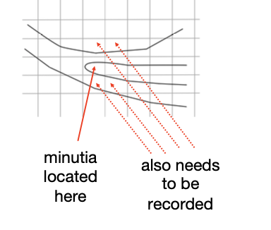
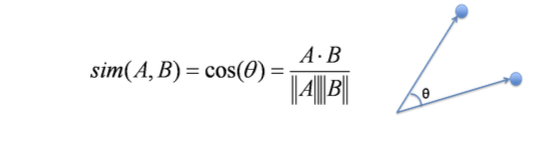
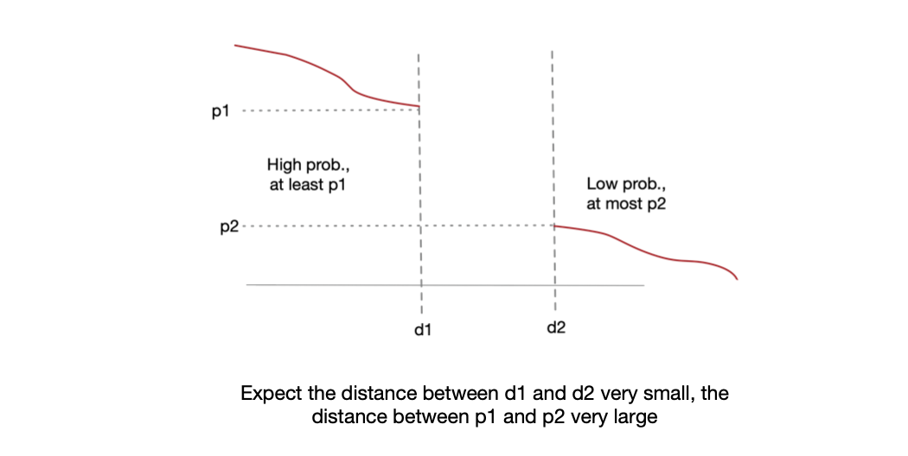
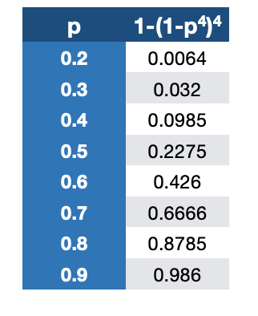
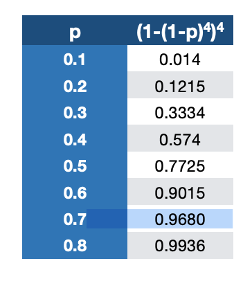
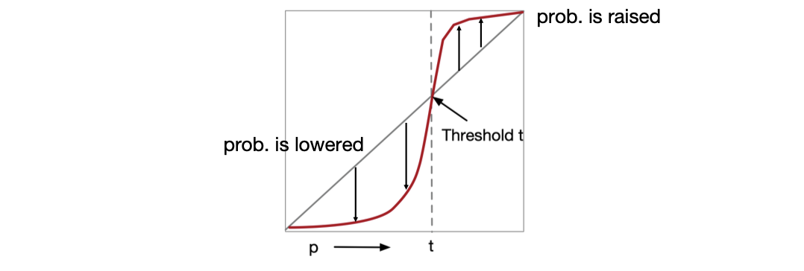
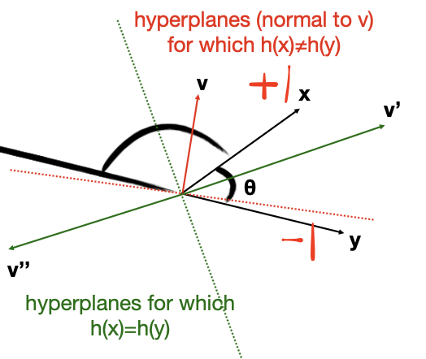
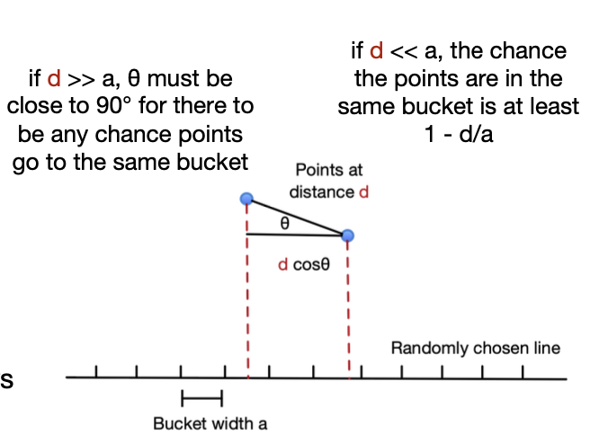

<!-- more -->

## Applications of Locality-Sensitive Hashing

### Matching Newspaper Articles 

- **Problem**: the same article, say from associated press, appears on the web site of many newspapers, but looks quite different
  - each newspaper surrounds the article with logos, ads, links to other articles ...
  - a newspaper may also `crop’ the article

- **Tricks**:
  - LSH substitute: candidates are articles of **similar length**
  - **Stop Words** to discriminate between news and ads 

### Entity Resolution

- **Problem** The **entity-resolution problem** is to examine a collection of records and determine which refer to the same entity
  > To make sure what we crawled corresponds to the same entity
  - Entities could be people, events, etc.
  - We want to merge records if their values in corresponding fields are similar
  - E.g.  Company A and B want to find out what customers they share
    - Each company had about 1 million records
    - Records had name, address, and phone.
    > Could be different for the same person ((un)simplified Chinese / alias for addresses)

- **Solution**.
  1. Design a measure ('score') of how similar records are
     e.g., deduct points for small misspellings ('Jeffrey' vs. 'Jeffery') or same phone with different area code
     > Largely dependent on the actual data/needs
  2. Score all pairs of records that the LSH scheme identified as candidates; report high scores as **matches**
     > LSH for each field 
     - 3 hash functions: exact values of name, address, phone
     - compare iff identical in at least one
     - but may miss similar records with a small differences in all three fields

- How to hash field strings into **one bucket for each**?
  - Idea: **sort** the strings instead
  - Another option was to use a few million buckets, and compare all pairs of records within one bucket

- **Validation** of results
  1. Time stamp
     - identical records has a **creation date difference** of 10 days
     > as an aux criteria
     - only looked for records created within 90 days of each other, so bogus matches has a 45-day average
     - looking at the pool of matches with a fixed score, compute the average time-difference x, fraction (45 - x)/35 of them were valid matches
  2. Any field not used in the LSH could be used to validate, provided corresponding values were closer for true matches than false
     - if records has a height field, we would expect true matches to be close, false matches to be the **average difference for random people**
     ::: tip Don't know whether to judge false matching?
      **use the random sampled difference as a baseline for false matching**
     ::: 

### Matching Fingerprints

**Background**. Represent a fingerprint by the set of positions of **minutiae** (features of a fingerprint, e.g., points where two ridges come together or a ridge ends)

Note, Set of grid squares where minutiae are located represents the fingerprint
- Possibly, treat minutiae near a grid boundary as if also present in adjacent grid points

**Problem**. Typically, we place a grid on a fingerprint. finding similar sets of grid squares that have minutiae
- rows: grid squares; columns: fingerprints sets. **Not sparse**!
> Challenge, non sparse feature vector
> Good news, No need to minhash, since the number of grid squares is not too large

**Solution**.

1. 1 in only those positions whose squares have minutiae
2. Pick 1024 sets of 3 grid squares randomly
   > Works like random permutation
3. For each set of three squares, two fingerprints that each have 1 for all three squares are **candidate pairs**
   - each set of **three squares creates one bucket**
   > one fingerprint belongs to one bucket iff it has three 1's 
   - fingerprints can be in many buckets

**Analysis**.

- Suppose typical fingerprints have minutiae in `20%` of the grid squares
- Suppose fingerprints from the same finger agree in at least `80%` of their squares
- Prob. two random fingerprints each have 1’ in three given squares = $((0.2)(0.2))^3 = 0.000064$
  > six independent event that a grid square has a minutia
- Prob. two fingerprints from the same finger each have 1’s in three given squares = $((0.2)(0.8))^3 = 0.004096$

> The two probabilities above may seem not very large in difference
>
> But we have 1024 buckets!

- Prob. for at least one of 1024 sets of three points,
  - the prob of two fingerprints from the same person in a same bucket = $1 - (1-0.004096)^{1024} = 0.985$ 
    - $\Rightarrow 1.5\%$ False Negatives
  - the prob of two fingerprints from two random persons in a same bucket = $1 - (1-0.000064)^{1024} = 0.063$ 
    - $\Rightarrow 6.3\%$ False Positives

## Distance Measures

> Up till now, we are comparing between documents (abstracted as sets, using set similarity as distance measure), what if we are comparing between two strings/points/... ?
> 
> Can we use other measures to evaluate the distance between two data records?

> Recall distance measure requirements: nonneg, symmetry, triangle, zero, 

### Jaccard Distance

::: theorem Jaccard Distance is metric

1. $d(x, y) \ge 0$ since $|x\cup y| \ge |x\cap y|$
2. $d(x,y)=0$ iff $x=y$,because $x\cup x = x \cap x = x$
3. $d(x, y) = d(y, x)$ since union and intersection are symmetric
4. triangle inequality
   - $d(x,y) = 1 - \Pr(h(x) = h(y))$
   - We can show $\Pr(h(x)\neq h(y)) \le \Pr (h(x) \neq h(z)) + \Pr (h(z) \neq h(y))$
   - because whenever $h(x) \neq h(y)$, at least one of $h(x)$ and $h(y)$ must be different from $h(z)$
:::

### Cosine Distance

::: theorem Cosine distance is metric

1. $d(x,y)$ is in the range of 0 to 180
2. $d(x, y) = 0$ iff two vectors are the same direction
3. the angle between x and y is the same as the angle between y and x
4. one way to rotate from x to y is to rotate to z and then to y. Sum of the two rotations $\ge$ rotation directly from x to y

:::

### Edit Distance

E.g., the edit distance between `x = abcde` and `y = acfdeg` is 3. To convert `x` to `y`:
1. Delete `b`
2. Insert `f` after `c`
3. Insert `g` after `e`

**Definition**. Edit distance = number of inserts and deletes to change one string into another:

::: theorem Edit distance is a metric

1. no edit distance can be negative
2. two identical strings have an edit distance of 0
3. a sequence of edits can be reversed, with each insertion becoming a deletion, and vice versa
4. one way to turn a string s to t is to turn s into u and then turn u into t

::: 

### Hamming Distance

Hamming distance = number of positions in which two bit vectors differ

E.g., Hamming distance between `10101` and `11110` is 3

::: theorem Hamming distance is a metric

1. cannot be negative
2. d(x, y) = 0 iff vectors are identical
3. symmetric
4. if x and z differ in m components, and z and y differ in n components, then x and y cannot differ in more than m + n components

:::

## Locality-Sensitive Functions

> Recall, with Jaccard Distance, we use min-hash functions to show that we can shrink the vector while preserving the distance measure (similarity)
> 
> Can we design a hash function for each metric? Yes

### Hash Functions Decide Equality

- **Denote**. `h(x) = h(y)` means h returns yes for the pair of x and y, where `h` computes hash values and returns yes if they are the same

- Suppose we have a space S of points with a distance measure d
- A family H of hash functions is said to be $(d_1, d_2, p_1, p_2)$-sensitive if for any x and y in S:
  - if $d(x, y) \le d_1$, prob. over all $h$ in $H$ that $h(x)=h(y)$ is at least p1 
  - if $d(x, y) \ge d_2$, prob. over all $h$ in $H$ that $h(x)=h(y)$ is at most p2

> We expect in the ideal case, the "middle" area doesn't exist, i.e. $d_1$ and $d_2$ are small enough in difference
> And we want $p_1$ and $p_2$ are large enough in difference

::: tip MinHash - Jaccard Distance as an example

- $\mathrm{S}=$ sets, $\mathrm{d}=$ Jaccard distance, $\mathrm{H}$ is formed from minhash functions for all permutations
- $\Pr(h(x)=h(y))=1-d(x, y)=\mathrm{sim}(x, y)$
- $H$ is a $(1 / 3,2 / 3,2 / 3,1 / 3)$ -sensitive family for $S$ and $d$
  > if distance <=1/3 (similarity >= 2/3), then minhash values agree with prob. >= 2/3

**Conclusion**. For Jaccard similarity, minhashing gives us a $(d_1, d_2, (1-d_1), (1-d_2))$-sensitive family for any $d_1 < d_2$

> Recall what we are doing in LSH phase?

> Steepen the S-curve with “bands” technique! 
> - **AND** construction like “rows in a band.” 
> - **OR** construction like “many bands.”

:::

::: theorem

Given family $\mathbf{H}$, construct family $\mathbf{H'}$ whose members each consist runctions from $\mathbf{H}$ 
> r rows in a single band!

- **AND**: For ${h}=\left\{{h}_{1}, \ldots, {h_r}\right\}$ in $\mathbf{H}^{\prime}, {h}({x})={h}({y})$ iff ${h}_{{i}}({x})={h_i}({y})$ for all ${i}$
  - Theorem: if ${H}$ is $(d_1, {d}_2, {p} _1, {p}_ 2)$ -sensitive, then $\mathbf{H}$ ' is $({d}_ 1, {d}_ 2,({p}_ 1)^{r},({p}_ 2)^{r})$ -sensitive. 
  > each member of ${H}$ is independently chosen

**AND** makes all prob. **shrink**, but by choosing r correctly, we can make the lower prob. (p2) approach 0 while the higher does not

- **OR**: For ${h}=\left\{{h}_{1}, \ldots, {h_b}\right\}$ in $\mathbf{H}^{\prime}, {h}({x})={h}({y})$ iff ${h}_{{i}}({x})={h_i}({y})$ for some $i$
  > combining b bands 
  - Theorem: if ${H}$ is $({d}_ 1, {d}_2, {p} _1, {p} _2)$ -sensitive, then ${H}^{\text {'is }}({d}_ 1, {d}_ 2,1-(1-p _1)^{b}, 1-(1-p _2)^{b})$ -sensitive. 
  > at least one band say yes

**OR** makes all prob. **grow**, but by choosing b correctly, we can make the upper prob. (p1) approach 1 while the lower does not

:::

> In practice, we are **combing** **and** and **or**!

As for the signature matrix, we can use the AND construction followed by the OR construction
- or vice-versa
- or any sequence of AND’s and OR’s alternating

| AND-OR Composition      |  OR-AND Composition     |
|  ---  |  ---  |
| Each of the two prob. p is transformed into $1-(1-p^r)^b$      | Each of the two prob. p is transformed into $(1-(1-p)^b)^r$      |
|  “S-curve”     |   mirrored horizontally and vertically    |
|   r=4,b=4    |  r=4,b=4     |
|       |       |
|   E.g., Transforms a $(0.2,0.8,0.8,0.2)$-sensitive family into a $(0.2,0.8,0.8785,0.0064)$-sensitive family |  E.g., Transforms a $(0.2,0.8,0.8,0.2)$- sensitive family into a $(0.2,0.8,0.9936,0.1215)$-sensitive family     |

> When should be use different alternations?
> 
> It depends on the curve w.r.t the original curve!

- For each S-curve $1-(1-p)^{b},$ there is a threshold $t,$ for which $1-(1-$ $\left.t^{r}\right)^{b}=t$
- Above t, prob. are increased, below t, they are decreased
- You improve the sensitivity (by AND-OR construction) as long as the low prob. (p2) is less than t, and the high prob. (p1) is greater than t

**Cascading Construction**.

E.g.,apply the (4,4) OR-AND construction followed by the (4,4) AND-OR construction
- 256 minhash functions
- Transforms a (0.2,0.8,0.8,0.2)-sensitive family into a (0.2,0.8,0.9999996,0.0008715)-sensitive family

### LSH Family for Cosine Distance

> Designed based on a hyperplane

For cosine distance, there is a technique analogous to minhashing for generating a $(d_1, d_2, (1-d_1/180),(1-d_2/180))$-sensitive family for any d1 and d2 — random hyperplanes

Each vector v determines a hash function $h_v$, with *two buckets*
$$h_v(x) = sign(v^Tx)$$

> Note, we are deciding w.r.t. the hyperplane instead of the vector (because a hyperplane has two vectors)

LS-family **H** = set of all functions derived from any vector

Claim: $\Pr[h(x)=h(y)]=1 - (x - y)/ 180$

**Signatures for Cosine Distance**
- Pick some number of vectors, and hash your data for each vector
- The result is a signature (sketch) of +1’s and -1’s that can be used for LSH like the minhash signatures for Jaccard distance
- The existence of the LSH-family is sufficient for amplification by AND/OR
- We need not pick from among all possible vectors v to form a component of a sketch
- It suffices to consider only vectors v consisting of +1 and -1 components

### LSH Family for Euclidean Distance

- Idea: hash functions correspond to randomly chosen lines
- Partition the line into buckets of size a
- Hash each point to the bucket containing its projection onto the line
- Nearby points are always close; distant points are rarely in same bucket

> Intuition: if two points are close, then no matter how we project the line segment between them, they are likely to be mapped into the same bucket

**Analysis**.
- If points are >= 2a apart, 60<=θ<=90 for there to be a chance that the points go in the same bucket
- at most 1/3 prob. that the randomly chosen hash function returns yes
- If points are <= a/2 apart, there is at least 1/2 chance they share a bucket
- Yields a (a/2, 2a, 1/2, 1/3)-sensitive family of hash functions

## Methods for High Degree of Similarity

> What if our data are already similar enough, is there any strict methods (instead of approx like LSH) to eliminate records that are not similar enough. We will introduce some tricks in this section

> Until now, LSH technique works well when the Jaccard similarity <= 80%. When sets are at a very high Jaccard similarity, we have other techniques with **no false negatives**.

### Setting: Sets as Strings

- Represent sets by strings (lists of symbols):
  - order the universal set
  - represent a set by the string of its elements in sorted order
  - if the universal set is k-shingles, there is a natural lexicographic order
  - think of each shingle as a single symbol
    - e.g., the 2-shingling of `abcad` {ab, bc, ca, ad} is represented by the list [ab, ad, bc, ca]
  - a **better** way: order words lowest-frequency-first
    - index documents based on the early words in their lists
      > so that efficiency can be improved
      > The lowest frequency words can mostly illustrate the feature of a document

> How to relate set to its string representation?

### Jaccard and Edit Distance

**Theorem.** Suppose two sets have Jaccard distance J and are represented by strings s1 and s2. Let the **LCS (least common sequence)** of s1 and s2 have length C and the edit distance be E. Then $1 - J = C/(C+E)$, or equivalently $J = E/(C+E)$.
> Intuition, remain the same and edit the difference

> works because these strings never repeat a symbol, and symbols appear in the same order, otherwise, the formula can only be an estimation

#### Length-Based Indexes

> Given length, we can already erase out a lot of candidates