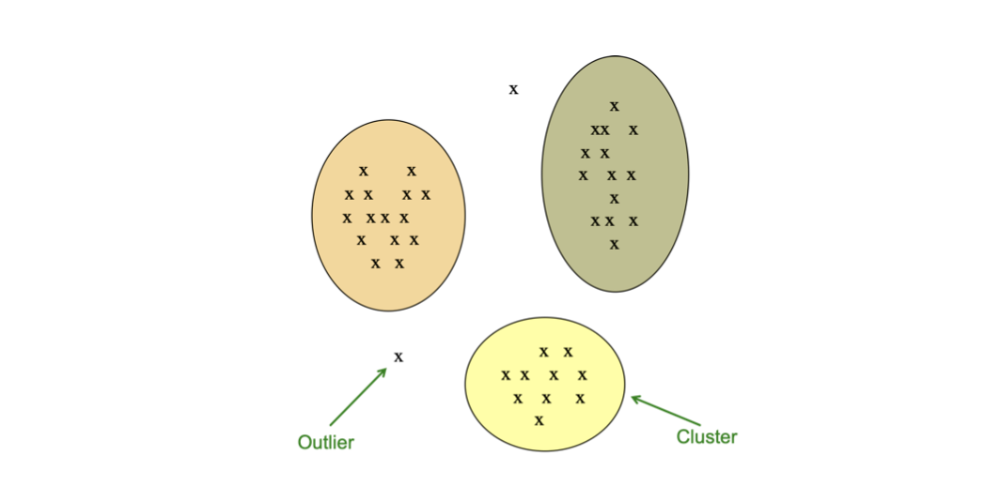
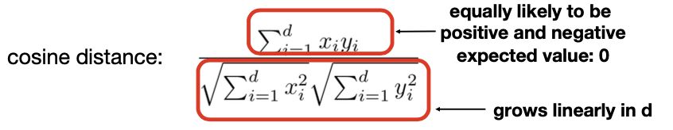
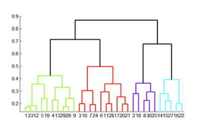
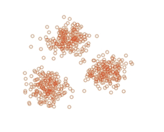
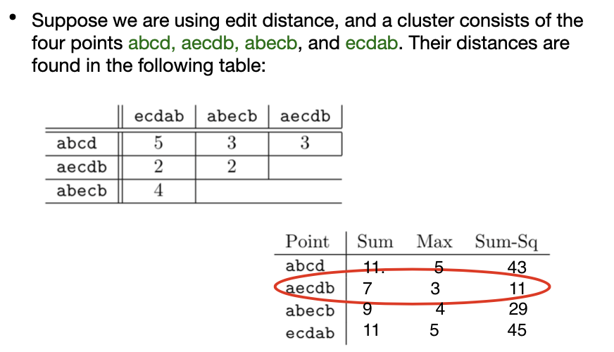
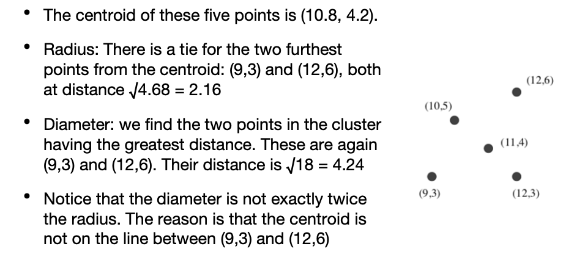

<!-- more -->

> Usually by referring to **cluster**, we means unlabeled-samples (by contrast to **class**)

## Introduction to Clustering

- Given a set of points, with a notion of distance between points, group the points into some number of clusters, so that
  - members of a cluster are close/similar to each other
  - members of different clusters are dissimilar 
- Usually:
  - points are in a high-dimensional space
  - similarity is defined using a distance measure
    - **sets as vectors**: measure similarity by cosine distance
    - **sets as sets**: measure similarity by Jaccard distance
    - **sets as points**: measure similarity by Euclidean distance

> Cluster & Outliers
>
> 

### Why hard

**High-dimensional spaces look different**: almost all pairs of points are at about the same distance
- n random points in the unit cube, i.e., points [x1, x2, . . . , xd], where each xi is in the range 0 to 1
- if `d = 1`: we are placing random points on a line of length 1, **average distance between a pair** of points is 1/3
- if `d` is very large, the upper limit should be $\sqrt{d}$, but almost all are **NOT** close to that, most will have a distance close to the average distance

**Curse of Dimensionality**
- `A=[x1,x2,...,xd], C=[y1,y2,...,yd], B=origin`
- 
- For large d, the cosine angle between any two vectors is almost certain to be close to 0!

### Methods of Clustering

> In this section, we will introduce two main categories of clustering

| Hierarchical  | Point Assignment  |
|---|---|
|   |    |

- **Hierarchical:**
  - **Agglomerative (bottom up):**
    - Initially, each point is a cluster
    - Repeatedly combine the two “nearest” clusters into one
  - **Divisive (top down):**
    - Start with one cluster and recursively split it
- **Point assignment:**
  - Maintain a set of clusters
  - Points belong to “nearest” cluster

## Hierarchical Clustering 

Key operation: **Repeatedly combine two nearest clusters**
- Three important questions:
  1. How do you represent a cluster of more than one point?
    
    > Euclidean case: each cluster has a **centroid** = average of its (data)points

  2. How do you determine the “nearness” of clusters?

    > Measure cluster distances by **distances of centroids**

  3. When to stop combining clusters?

::: details Hierarchical Clustering for Euclidean Case

 point **“closest”** to other points
2. How do you determine the “nearness” of clusters?
   - Treat clustroid as if it were centroid, when computing inter-cluster distances

#### Cluster Representation

What is closet?, possible meanings include
- Smallest maximum distance to other points
- Smallest average distance to other points
- Smallest sum of squares of distances to other points
  - For distance metric $\mathbf{d}$ clustroid $\mathbf{c}$ of cluster $\mathbf{C}$ is: $\min _{c} \sum_{x \in C} d(x, c)^{2}$

::: details Example

:::

#### Nearness of Clusters

- Approach 1: **Intercluster distance** = minimum of the distances between any two points, one from each cluster
- Approach 2: Pick a notion of “**cohesion**”(紧凑度) of clusters, e.g., **radius** — maximum distance from the clustroid
  - Merge clusters **whose union is most cohesive**
  - Approach 2.1: Use the **diameter (!= 2*radius)** of the merged cluster = maximum distance between points in the cluster
  - Approach 2.2: Use the **average distance** between points in the cluster 
  - Approach 2.3: Use a density-based approach
    - Take the diameter or avg. distance, e.g., and *divide by the number of points* in the cluster

::: details Example

:::

### When to stop

- Approach 1: Pick a number k upfront, and stop when we have k clusters
  - Makes sense when we know that the data falls into k classes
- Approach 2: Stop when the next merge would create a cluster with low “**cohesion**,” i.e., a “bad” cluster
  - Stop if the diameter of the cluster that results from the best *merger exceeds a threshold*
  - Stop if the density of the cluster that results from the best merger is below some threshold
  - Stop when the average diameter will take a sudden jump

### Implementation

## K-means Clustering

## EM Algorithm

## The BFR Algorithm
