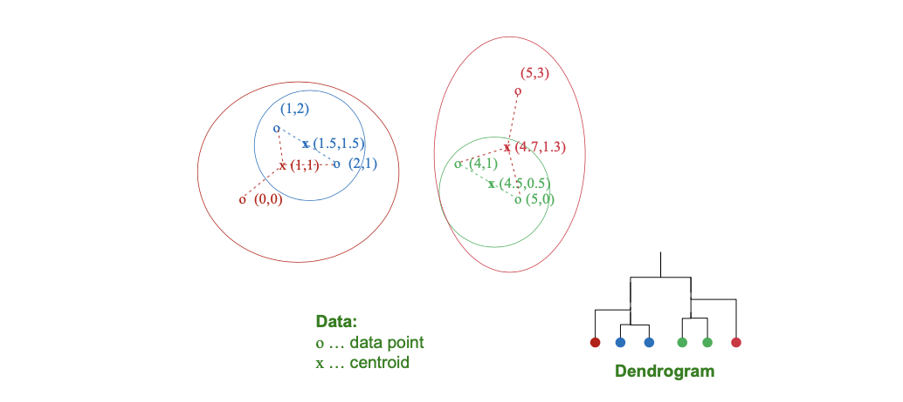
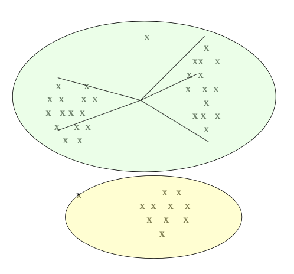
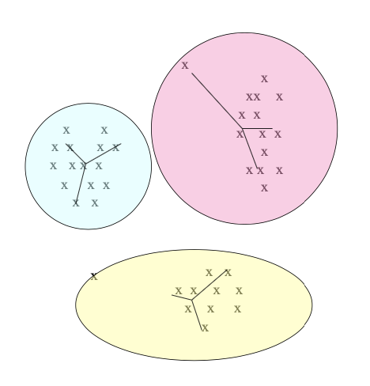
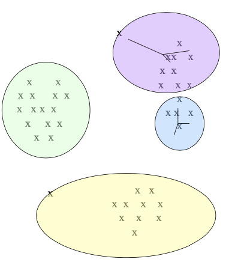
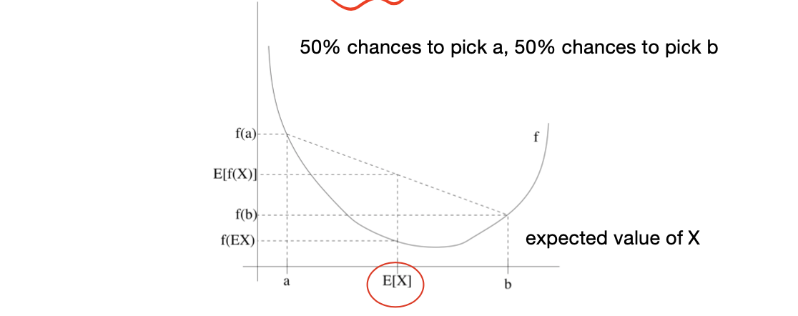
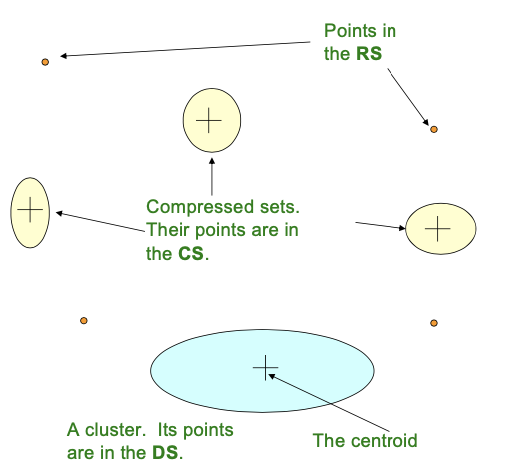

- Hierarchical Clustering
  - idea: repeatedly combine nearest pairs
  - Three important issues: how to represent a cluster / how to determine cluster nearness / when to stop
  - For Euclidean, trivial. 
  - For non-euclidean, use **clustroid** as representation, alternatives for nearness are diameter/avg dist./min inter dist./...
  - Can pick k clusters as goal, or use cohesion measure until bad cluster will be generated for further iterations
- K-means Clustering
- EM Algorithm
  - based on normal distribution assumption
  - Jensen Inequality, lower bound techniques are used to find the solution
- BFR Algorithm
  - Efficient representation for massive data, by storing the statistical measures

<!-- more -->

> Usually by referring to **cluster**, we means unlabeled-samples (by contrast to **class**)

## Introduction to Clustering

- Given a set of points, with a notion of distance between points, group the points into some number of clusters, so that
  - members of a cluster are close/similar to each other
  - members of different clusters are dissimilar 
- Usually:
  - points are in a high-dimensional space
  - similarity is defined using a distance measure
    - **sets as vectors**: measure similarity by cosine distance
    - **sets as sets**: measure similarity by Jaccard distance
    - **sets as points**: measure similarity by Euclidean distance

> Cluster & Outliers
>
> 

### Why hard

**High-dimensional spaces look different**: almost all pairs of points are at about the same distance
- n random points in the unit cube, i.e., points [x1, x2, . . . , xd], where each xi is in the range 0 to 1
- if `d = 1`: we are placing random points on a line of length 1, **average distance between a pair** of points is 1/3
- if `d` is very large, the upper limit should be $\sqrt{d}$, but almost all are **NOT** close to that, most will have a distance close to the average distance

**Curse of Dimensionality**
- `A=[x1,x2,...,xd], C=[y1,y2,...,yd], B=origin`
- 
- For large d, the cosine angle between any two vectors is almost certain to be close to 0!

### Methods of Clustering

> In this section, we will introduce two main categories of clustering

| Hierarchical  | Point Assignment  |
|---|---|
|   |    |

- **Hierarchical:**
  - **Agglomerative (bottom up):**
    - Initially, each point is a cluster
    - Repeatedly combine the two “nearest” clusters into one
  - **Divisive (top down):**
    - Start with one cluster and recursively split it
- **Point assignment:**
  - Maintain a set of clusters
  - Points belong to “nearest” cluster

## Hierarchical Clustering 

Key operation: **Repeatedly combine two nearest clusters**
- Three important questions:
  1. How do you represent a cluster of more than one point?
    
    > Euclidean case: each cluster has a **centroid** = average of its (data)points

  2. How do you determine the “nearness” of clusters?

    > Measure cluster distances by **distances of centroids**

  3. When to stop combining clusters?

::: details Hierarchical Clustering for Euclidean Case

:::

### Non-Euclidean Case

- The only “locations” we can talk about are the points themselves
  - i.e., there is no “average” of two points
1. How to represent a cluster of many points?
   - **clustroid** = (data) point **“closest”** to other points
2. How do you determine the “nearness” of clusters?
   - Treat clustroid as if it were centroid, when computing inter-cluster distances

#### Cluster Representation

What is closet?, possible meanings include
- Smallest maximum distance to other points
- Smallest average distance to other points
- Smallest sum of squares of distances to other points
  - For distance metric $\mathbf{d}$ clustroid $\mathbf{c}$ of cluster $\mathbf{C}$ is: $\min _{c} \sum_{x \in C} d(x, c)^{2}$

::: details Example

:::

#### Nearness of Clusters

- Approach 1: **Intercluster distance** = minimum of the distances between any two points, one from each cluster
- Approach 2: Pick a notion of “**cohesion**”(紧凑度) of clusters, e.g., **radius** — maximum distance from the clustroid
  - Merge clusters **whose union is most cohesive**
  - Approach 2.1: Use the **diameter (!= 2*radius)** of the merged cluster = maximum distance between points in the cluster
  - Approach 2.2: Use the **average distance** between points in the cluster 
  - Approach 2.3: Use a density-based approach
    - Take the diameter or avg. distance, e.g., and *divide by the number of points* in the cluster

::: details Example

:::

### When to stop

- Approach 1: Pick a number k upfront, and stop when we have k clusters
  - Makes sense when we know that the data falls into k classes
- Approach 2: Stop when the next merge would create a cluster with low “**cohesion**,” i.e., a “bad” cluster
  - Stop if the diameter of the cluster that results from the best *merger exceeds a threshold*
  - Stop if the density of the cluster that results from the best merger is below some threshold
  - Stop when the average diameter will take a sudden jump

### Implementation

- Naive implementation of hierarchical clustering
  - At each step, compute pairwise distances between all pairs of clusters, then merge
  - $O(N^3)$
- Careful implementation using priority queue can reduce time to $O(N^2 \log N)$
  - Still **too expensive** for really big datasets that do not fit in memory
  > Memory may not fit!

## K-means Clustering

- Point Assignment. Assume Euclidean space/distance
- Start by picking $\mathbf{k}$, the number of clusters
- Initialize clusters by picking one point per cluster
  > Can random choose, but the best practice is
  - Example: Pick one point at random, then $\mathfb{k}-1$ other points, each as far away as possible from the previous points
1. For each point, place it in the cluster whose current centroid it is nearest
2. After all points are assigned, update the locations of centroids of the $k$ clusters
3. Reassign all points to their closest centroid
   - Sometimes moves points between clusters
4. Repeat 2 and 3 until convergence
   - **Convergence**: Points don't move between clusters and centroids stabilize

### How to select k?

- Try different k, looking at the change in the average distance to centroid as k increases
- Average falls rapidly until right k, then changes little

|  Too few     |  Just Right     |   Too many    |
|  ---  |  ---  |  ---  |
|       |       |       |
| many long distances to centroid.      |  distances rather short.     |  little improvement in average distance.     |

### How to pick initial k points?

- Approach 1: Sampling
  - Cluster a sample of the data using hierarchical clustering, to obtain k clusters
  - Pick a point from each cluster (e.g., point closest to centroid)
  - Sample fits in main memory
- Approach 2: Pick “dispersed” set of points
  - Pick 1st point at random
  - Pick the next point to be the one whose minimum/average distance from the selected points is as large as possible
  - Repeat until we have k points

### Algorithm

Given a training set $\{x^{(1)}, ..., x^{(m)}\}$ and want to group the data into a k clusters; no labels

1. Initialize cluster centroids $\left(\mu_{1}, \mu_{2}, \ldots, \mu_{k} \in \mathbb{R}^{n}\right)$ randomly.
2. Repeat until convergence
   1. For every i, set (for every data sample)
      $$
      c^{(i)}:=\arg \min _{j}\left\|x^{(i)}-\mu_{j}\right\|^{2}
      $$
   2. For each j, set (for every centroid)
      $$
      \mu_{j}:=\frac{\sum_{i=1}^{m} 1\left\{c^{(i)}=j\right\} x^{(i)}}{\sum_{i=1}^{m} 1\left\{c^{(i)}=j\right\}}
      $$

### Convergence

- Distortion function
  $$
  J(c, \mu)=\sum_{i=1}^{m}\left\|x^{(i)}-\mu_{c^{(i)}}\right\|^{2}
  $$
- K-means is exactly **coordinate descent** on J. Inner loop -> repeatedly minimizes J w.r.t. c; outer loop -> minimizes J w.r.t.
- J: **non-convex**. Susceptible to local optima
- Run k-means many times and pick the one with the lowest J

### Complexity

- In each round, we examine each input point exactly once to find closest centroid
- Each round is O(kN) for N points, k clusters
- But the number of rounds to convergence can be very large!

> Still not close to satisfactory

## EM Algorithm

Expectation-Maximazation Algorithm

> Very much like K-means, can be used for clustering, can also be used for density estimation

- **Assumes** that clusters **are normally distributed around a centroid** in a Euclidean space
  - Standard deviations in different dimensions may vary
  - Clusters are axis-aligned ellipses
> To enable efficient expression of clusters under constrained memory

- Efficient way to summarize clusters (want memory required O(clusters) and not O(data))

### Model: Mixtures of Gaussians

> Introduce a latent random variable $z^{(i)}$

Given a training set $\left\{x^{(1)}, \ldots, x^{(m)}\right\}$ and model the data by a joint distribution $\mathrm{p}\left(\mathrm{x}^{(i)}, \mathrm{z}^{(i)}\right)=\mathrm{p}\left(\mathrm{x}^{(\mathrm{i})} \mid \mathrm{z}^{(i)}\right) \mathrm{p}\left(\mathrm{z}^{(i)}\right)$ where:

- $z^{(i)} \sim$ Multinomial( $\left.\phi\right) . \phi_{\mathrm{j}}=\mathrm{p}\left(z^{(i)}=j\right)$ and
- $x^{(i)} \mid z^{(i)}=j \sim N\left(\mu_{j}, \Sigma_{j}\right)$

Since $x(i)$s are independent, we can product them together, and Maximize the likelihood of data over parameters: $\Phi, \mu, \Sigma$

$$\begin{aligned} \ell(\phi, \mu, \Sigma) &=\sum_{i=1}^{m} \log p\left(x^{(i)} ; \phi, \mu, \Sigma\right) \\ 
&= \sum_i \log P(x^{(i)}| z^{(i)},\mu,\Sigma) \cdot P(z^{(i)};\Phi)\\
&=\sum_{i=1}^{m} \log \sum_{z^{(i)}=1}^{k} p\left(x^{(i)} \mid z^{(i)} ; \mu, \Sigma\right) p\left(z^{(i)} ; \phi\right) . \end{aligned}$$

If we knew what $z^{(i)}$s are, maximizing the likelihood of 

$$
\ell(\phi, \mu, \Sigma)=\sum_{i=1}^{m} \log p\left(x^{(i)} \mid z^{(i)} ; \mu, \Sigma\right)+\log p\left(z^{(i)} ; \phi\right)
$$

gives the parameters

$$
\begin{aligned}
\phi_{j} &=\frac{1}{m} \sum_{i=1}^{m} 1\left\{z^{(i)}=j\right\} \\
\mu_{j} &=\frac{\sum_{i=1}^{m} 1\left\{z^{(i)}=j\right\} x^{(i)}}{\sum_{i=1}^{m} 1\left\{z^{(i)}=j\right\}} \\
\Sigma_{j} &=\frac{\sum_{i=1}^{m} 1\left\{z^{(i)}=j\right\}\left(x^{(i)}-\mu_{j}\right)\left(x^{(i)}-\mu_{j}\right)^{T}}{\sum_{i=1}^{m} 1\left\{z^{(i)}=j\right\}}
\end{aligned}
$$

- But what if $z^{(i)}$’s are not known?
- EM algorithm. 
  - E-step: guess the values of $z^{(i)}$’s. 
  - M-step: update the parameters based on our guesses

### EM Algorithm

- Repeat Until Convergence {
  1. (E-step) For each i, j set,
     $$
     w_{j}^{(i)}:=p\left(z^{(i)}=j \mid x^{(i)} ; \phi, \mu, \Sigma\right)
     $$
  2. (M-step) Update the parameters
     $$
     \begin{aligned}
     \phi_{j} &:=\frac{1}{m} \sum_{i=1}^{m} w_{j}^{(i)}, \\
     \mu_{j} &:=\frac{\sum_{i=1}^{m} w_{j}^{(i)} x^{(i)}}{\sum_{i=1}^{m} w_{j}^{(i) },} \\
     \Sigma_{j} &:=\frac{\sum_{i=1}^{m} w_{j}^{(i)}\left(x^{(i)}-\mu_{j}\right) \left(x^{(i)}-\mu_{j}\right)^{T}}{\sum_{i=1}^{m} w_{j}^{(i)}}
     \end{aligned}
     $$
  }

**Remark.**
- $w_{j}^{(i)}:=p\left(z^{(i)}=j \mid x^{(i)} ; \phi, \mu, \Sigma\right)$ viewed as **posterior probability**, evaluating the density of a Gaussian at $x^{(i)}$
- Compared to$\phi_{j}=\frac{1}{m} \sum_{i=1}^{m} 1\left\{z^{(i)}=j\right\}$, Here  $\phi_{j} &:=\frac{1}{m} \sum_{i=1}^{m} w_{j}^{(i)}$ is a **soft guess** for the values of $z^{(i)}$
- Note, the algorithm may be susceptible to local optima!

### Jensen's Inequality

$\mathrm{f}$ is a convex function, $\mathrm{X}$ is a random variable. Then:
$$
\mathrm{E}[f(X)] \geq f(\mathrm{E} X)
$$
$\mathrm{E}[f(X)]=f(\mathrm{E} X)$ holds true iff $X=\mathrm{E}[X] \mathrm{w} /$ prob. $1,$ i.e., $X$ is $\mathrm{a}$ contant.

### EM Alg. (General)

Given a training set $\left\{x^{(1)}, \ldots, x^{(m)}\right\}$ and fit the parameters of a mode $\mathrm{p}(\mathrm{x}, \mathrm{z})$ to the data, where likelihood is given by
$$
\begin{aligned}
\ell(\theta) &=\sum_{i=1}^{m} \log p(x ; \theta) \\
&=\sum_{i=1}^{m} \log \sum_{z} p(x, z ; \theta)
\end{aligned}
$$

Maximizing $l(\theta)$ might be difficult! So we repeatedly **construct a lower-bound on l (E-step)**, and **optimize the lower-bound (M-step)**

> Goal: move sum out of log, using Jensen

> Here, $\theta$ is just a shorthand for $\phi,\Sigma,\mu$

> log x is a concave function, can use Jensen's Inequality

$$
\begin{aligned}
\sum_{i} \log p\left(x^{(i)} ; \theta\right) &=\sum_{i} \log \sum_{z^{(i)}} p\left(x^{(i)}, z^{(i)} ; \theta\right) \\
 &=\sum_{i} \log \sum_{z^{(i)}} Q_{i}\left(z^{(i)}\right) \frac{p\left(x^{(i)}, z^{(i)} ; \theta\right)}{Q_{i}\left(z^{(i)}\right)} \\
& \geq \sum_{i} \sum_{z^{(i)}} Q_{i}\left(z^{(i)}\right) \log \frac{p\left(x^{(i)}, z^{(i)} ; \theta\right)}{Q_{i}\left(z^{(i)}\right)}
\end{aligned}
$$

> To maximize, we want the lower-bound be equal to LHS, i.e. equality holds, $X = C$

- Which $Q_i$ should we choose?
If we have some current guesses $\theta,$ we should try to make the lower-bound tight at $\theta$
- To make the lower-bound tight at $\theta,$ we should let the Jensen's inequality holds with equality:
  $$
  \frac{p\left(x^{(i)}, z^{(i)} ; \theta\right)}{Q_{i}\left(z^{(i)}\right)}=c
  $$
- Since $\sum_{z} Q_{i}\left(z^{(i)}\right)=1,$ we set $Q_{i}$ be the posterior distribution of $z^{(i)}$ s given $x^{(i)}$ and $\theta:$
  $$
  \begin{aligned}
  Q_{i}\left(z^{(i)}\right) &=\frac{p\left(x^{(i)}, z^{(i)} ; \theta\right)}{\sum_{z} p\left(x^{(i)}, z ; \theta\right)} \\
  &=\frac{p\left(x^{(i)}, z^{(i)} ; \theta\right)}{p\left(x^{(i)} ; \theta\right)} \\
  &=p\left(z^{(i)} \mid x^{(i)} ; \theta\right)
  \end{aligned}
  $$

::: tip EM Summary

- E-step: $\sum_{i} \sum_{z^{(i)}} Q_{i}\left(z^{(i)}\right) \log \frac{p\left(x^{(i)}, z^{(i)} ; \theta\right)}{Q_{i}\left(z^{(i)}\right)}$ gives the lower-bound of $\mathrm{l}(\theta)$
- M-step: Maximize the lower-bound w.r.t. $\theta$
- Repeat until convergence {
  1. (E-step) For each $i$, set
     $$
     Q_{i}\left(z^{(i)}\right):=p\left(z^{(i)} \mid x^{(i)} ; \theta\right)
     $$
  2. (M-step) Set
     $$
     \theta:=\arg \max _{\theta} \sum_{i} \sum_{z^{(i)}} Q_{i}\left(z^{(i)}\right)  \log \frac{p\left(x^{(i)}, z^{(i)} ; \theta\right)}{Q_{i}\left(z^{(i)}\right)}
     $$
  }
:::

### Correctness

Assume $\theta^{(t)}$ and $\theta^{(t+1)}$ are parameters from two successive iterations. We show $I\left(\theta^{(t)}\right) \leq l\left(\theta^{(t+1)}\right)$
- The choice of $Q_{i}^{(t)}\left(z^{(i)}\right):=p\left(z^{(i)} \mid x^{(i)} ; \theta^{(t)}\right)$ ensures Jensen's inequality holds with equality:
  $$
  \ell\left(\theta^{(t)}\right)=\sum_{i} \sum_{z^{(i)}} Q_{i}^{(t)}\left(z^{(i)}\right) \log \frac{p\left(x^{(i)}, z^{(i)} ; \theta^{(t)}\right)}{Q_{i}^{(t)}\left(z^{(i)}\right)}
  $$
- $\theta^{(t+1)}$ are obtained by maximizing the right hand side of the above $ \quad$ Jensen inequality for
  $$
  \begin{array}{ll}
  \ell\left(\theta^{(t+1)}\right) &\geq \sum_{i} \sum_{z^{(i)}} Q_{i}^{(t)}\left(z^{(i)}\right) \log \frac{p\left(x^{(i)}, z^{(i)} ; \theta^{(t+1)}\right)}{Q_{i}^{(t)}\left(z^{(i)}\right)} \\
  &\geq \sum_{i} \sum_{z^{(i)}} Q_{i}^{(t)}\left(z^{(i)}\right) \log \frac{p\left(x^{(i)}, z^{(i)} ; \theta^{(t)}\right)}{Q_{i}^{(t)}\left(z^{(i)}\right)} \\
  &=\ell\left(\theta^{(t)}\right)
  \end{array}
  $$
  - Jensen's Inequality for concave functioon
  - Maximization Step
  - the choice of $Q_i$

> What about convergence?

- Convergence criteria: the increase of $I(\theta)$ between two successive iterations is smaller than some tolerance
- If we define
  $$
  J(Q, \theta)=\sum_{i} \sum_{z^{(i)}} Q_{i}\left(z^{(i)}\right) \log \frac{p\left(x^{(i)}, z^{(i)} ; \theta\right)}{Q_{i}\left(z^{(i)}\right)}
  $$
  - EM alg. can be viewed as a coordinate ascent on $J$, in which the E-step maximize it w.r.t. $\mathrm{Q}$ and M-step maximizes it w.r.t. $\theta$
> Similar to K-means

### Mixture of Gaussians Revisited

- Fitting parameters $\Phi, \mu, \Sigma$ in a mixture of Gaussians
- E-step: $w_{j}^{(i)}=Q_{i}\left(z^{(i)}=j\right)=P\left(z^{(i)}=j \mid x^{(i)} ; \phi, \mu, \Sigma\right)$
- M-step:
  $$
  \begin{array}{l}
  \sum_{i=1}^{m} \sum_{z^{(i)}} Q_{i}\left(z^{(i)}\right) \log \frac{p\left(x^{(i)}, z^{(i)} ; \phi, \mu, \Sigma\right)}{Q_{i}\left(z^{(i)}\right)} \\
  \quad=\sum_{i=1}^{m} \sum_{j=1}^{k} Q_{i}\left(z^{(i)}=j\right) \log \frac{p\left(x^{(i)} \mid z^{(i)}=j ; \mu, \Sigma\right) p\left(z^{(i)}=j ; \phi\right)}{Q_{i}\left(z^{(i)}=j\right)} \\
  =\sum_{i=1}^{m} \sum_{j=1}^{k} w_{j}^{(i)} \log \frac{\frac{1}{(2 \pi)^{n / 2}\left|\Sigma_{j}\right|^{1 / 2}} \exp \left(-\frac{1}{2}\left(x^{(i)}-\mu_{j}\right)^{T} \Sigma_{j}^{-1}\left(x^{(i)}-\mu_{j}\right)\right) \cdot \phi_{j}}{w_{j}^{(i)}}
  \end{array}
  $$
- M-step (fitting $\mu$ i):
  $$
  \begin{aligned}
  \nabla_{\mu l} & \sum_{i=1}^{m} \sum_{j=1}^{k} w_{j}^{(i)} \log \frac{\frac{1}{(2 \pi)^{n / 2}\left|\Sigma_{j}\right|^{1 / 2}} \exp \left(-\frac{1}{2}\left(x^{(i)}-\mu_{j}\right)^{T} \sum_{j}^{-1}\left(x^{(i)}-\mu_{j}\right)\right) \cdot \phi_{j}}{w_{j}^{(i)}} \\
  &=-\nabla_{\mu_{l}} \sum_{i=1}^{m} \sum_{j=1}^{k} w_{j}^{(i)} \frac{1}{2}\left(x^{(i)}-\mu_{j}\right)^{T} \Sigma_{j}^{-1}\left(x^{(i)}-\mu_{j}\right) \\
  &=\frac{1}{2} \sum_{i=1}^{m} w_{l}^{(i)} \nabla_{\mu} {2 \mu_{l}^{T} \Sigma_{l}^{-1} x^{(i)}-\mu_{l}^{T} \Sigma_{l}^{-1} \mu_{l}} \\
  &=\sum_{i=1}^{m} w_{l}^{(i)}\left(\Sigma_{l}^{-1} x^{(i)}-\Sigma_{l}^{-1} \mu_{l}\right)
  \end{aligned}
  $$
  - Set the derivative to 0 and solve for $\mu \mathrm{i}$ : $\mu_{l}:=\frac{\sum_{i=1}^{m} w_{l}^{(i)} x^{(i)}}{\sum_{i=1}^{m} w_{l}^{(i)}}$
- M-step (fitting $\Phi \mathrm{j})$ 
  - We only need to maximize $\sum_{i=1}^{m} \sum_{j=1}^{k} w_{j}^{(i)} \log \phi_{j}$
  - Consider $\sum_{j} \phi_{j}=1,$ we construct the Lagrangian
    $$
    \mathcal{L}(\phi)=\sum_{i=1}^{m} \sum_{j=1}^{k} w_{j}^{(i)} \log \phi_{j}+\beta\left(\sum_{j=1}^{k} \phi_{j}-1\right)
    $$
  - Taking derivative w.r.t. $\Phi$ j and set to 0
    $$
    \begin{aligned}
    \frac{\partial}{\partial \phi_{j}} \mathcal{L}(\phi)=\sum_{i=1}^{m} \frac{w_{j}^{(i)}} {\phi_{j}} +\beta=0 &\Rightarrow \phi_{j}=\frac{\sum_{i=1}^{m} w_{j}^{(i)}}{-\beta} \\
    \sum_{j} \phi_{j}=1 &\Rightarrow \phi_{j}:=\frac{1}{m} \sum_{i=1}^{m} w_{j}^{(i)}
    \end{aligned}
    $$

  > Similarly, the expression of sigma can also be derived

## The BFR Algorithm

> Recall, in EM algorithm, we assume the data are normally distributed w.r.t. their centroid. 

- BFR is a variant of k-means designed to handle **very large** datasets
- Assumes that clusters are **normally distributed** around a centroid in a Euclidean space
- Points are read from disk one main-memory-full at a time
- Most points from previous memory loads are summarized by **simple statistics**
- To begin, from the initial load we select the initial k centroids by some sensible approach:
  - Take k random points
  - Take a small random sample and cluster optimally
  - Take a sample; pick a random point, and then k–1 more points, each as far from the previously selected points as possible

We explore different expressions of points in memory

### Three Classes of Points

- **Discard set (DS)**: Points close enough to a centroid to be summarized
- **Compression set (CS)**: Groups of points that are close together but not close to any existing centroid. These points are summarized, but not assigned to a cluster
- **Retained set (RS)**: Isolated points waiting to be assigned to a compression set

### Summarizing Sets of Points

- For each cluster, the discard set (DS) is **summarized** by:
  - The number of points `N`
  - The vector `SUM`, whose ith component is the sum of the coordinates of the points in the ith dimension
  - The vector `SUMSQ`: ith component = sum of squares of coordinates in ith dimension
- `2d + 1` values represent any size cluster, where `d` = number of dimensions
- Average in each dimension (the centroid) can be calculated as `SUM[i] / N`
  > Efficient to update
- Variance of a cluster’s discard set in dimension i is: `(SUMSQ[i] / N) – (SUM[i] / N)^2`
  > Recall $D(X) = E(X^2) - E^2(X)$
  
### “Memory-Load” of Points

1. Find those points that are **“sufficiently close”** to a cluster centroid and add those points to that cluster and the `DS`
   - These points are so close to the centroid that they can be summarized and then discarded
2. Use any main-memory clustering algorithm to cluster the remaining points and the old `RS`
   - Clusters go to the `CS`; outlying points to the `RS`
3. DS set: Adjust statistics of the clusters to account for the new points
   - Add Ns, SUMs, SUMSQs
4. Consider merging compressed sets in the `CS`
5. If this is the last round, merge all compressed sets in the `CS` and all `RS` points into their nearest cluster

### Implementation Issues

1. How do we decide if a point is “close enough” to a cluster that we will add the point to that cluster? Two methods (same principle, higher probability w.r.t normal distribution)
   1. High likelihood of the point belonging to currently nearest centroid
   2. The **Mahalanobis distance (MD)** is less than a threshold 
      - MD: Normalized Euclidean distance from centroid
      - For point $(x _1, \ldots, x _d)$ and centroid $\left(c _1, \ldots, c_{d}\right)$, $d(x, c)=\sqrt{\sum_{i=1}^{d}\left(\frac{x_{i}-c_{i}}{\sigma_{i}}\right)^{2}}$

2. How do we decide whether two compressed sets (CS) deserve to be combined into one?
   - Compute the variance of the combined sub-cluster
    - N, SUM, and SUMSQ allow us to make that calculation quickly 
    - Combine if the combined variance is below some threshold
   - Many alternatives: Treat dimensions differently, consider density