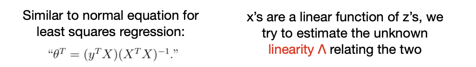

SVD itself is not a dimensionality reduction method. It is just an accurate algorithm **minimizing the reconstruction error** of k-dim data. By taking the top-k singular value and their corresponding left/right sigular vectors, the dimenisonality reduction can be achieved.
- Usually finding the best low rank approximation

PCA can be considered as seeking the **major axis of projection variation**. The next seeked axis should be orthogonal to the found axes. PCA and SVD are same if the matrix is zero-decentralized.
- Finding how data varies in relationship to its mean

<!-- more -->

- In practice, Data lies on or near a low d-dimensional subspace
- Axes of the subspace are effective representation of the data
- **Goal:** Discover the axis of data

## Singular Value Decomposition

$$
A_{m\times n} = U_{m \times r} \Sigma_{r\times r}  (V_{n \times r})^T
$$

- $A$: Input Data matrix
  - m documents, n terms
  - m users, n ratings
- $U$: Left Singular Vectors 左奇异阵
  - m documents, r concepts
  - m users, r preferences
  - $U^T U = I$
- $\Sigma$: Singular Values, diagonal
  - r, strength of each concept
  - r, strength of each preference to the rating
  - ***Diagonal, positive, in increasing order***
- $V$: Right Singular Vectors，右奇异阵
  - n terms, r concepts
  - n ratings, r preferences
  - $V^T V = I$ Column Orthonormal

$$
\mathbf{A} \approx \mathbf{U} \mathbf{\Sigma} \mathbf{V}^{T}=\sum_{i} \sigma_{i} \mathbf{u}_{i} \circ \mathbf{v}_{i}^{\top}
$$

### Example: Users to Movies

::: tip

introduce another set of dimensions "concept", and project the samples-features into samples-concept-features.

:::

### SVD-Another View

- **Observation.** The first singular vector - the projection direction with maximum variance
  
  - Instead of using two coordinates $(x,y)$ to describe point locations, let’s use only one coordinate $(z)$
  - Point’s position is its location along vector $V_1$
- **Observation.** Linear combinations of movies’ ratings form a concept!
  
- **Observation.** $U\Sigma$ gives the coordinates of the points in the projection axis
  
- **Statement** (without rigorious proof): **SVD gives `best’ axis to project on minimizing the sum of reconstruction errors**
  $$
  \sum_{i=1}^{N} \sum_{j=1}^{D} \| x_{i j}-z_{i j}\|^{2}
  $$
  

### SVD in Dimensionality Reduction

Set the smallest singular values to zero!

**B approximates A!**
- i.e. B is a solution to $\min_{B} ||A-B||_F$ when rank(B) = k

How many $\sigma$s to keep?
- Rule-of-a-thumb: keep 80% to 90% of the 'energy' = $\sum_i \sigma_i^2$

### How to Compute SVD

By decompoing $A^TA$ and $AA^T$

> A is not symmetric, so we work on $A^TA$ and $AA^T$

How to do Eigen-Decomposition efficiently?

::: theorem

1. Start with any "guess eigenvector" $x_0$
2. Construct $x_{k+1} = \frac{Mx_k}{||Mx_k||}$ for $k=0,1,\ldots$, where $|| ... ||$ denotes the Frobenius norm
3. Stop when consecutive $x_k$ changes little
:::

### Complexity

- To compute SVD:
  - $O(nm^2)$ or $O(n^2m)$ (whichever is less)
- But:
  - Less work, if we just want singular values
  - if we want first k singular vectors
  - if the matrix is sparse
- Implemented in linear algebra packages like LINPACK, Matlab, SPlus, Mathematica ...
> Pay attention to the format of the return value in practice

### Case Study: Recommendation

**Idea**: **Map query into a 'concept space'**, and find similar users whose projection of ratings in the concept space is similar to the query.

If we want to find users who like Movie 1,
1. map query into concept space
   
2. For a fresh user d,
   
> User $d$ that rated 2 and 3 will be similar to query $q$ that rated movie 1, although their have zero ratings in common (may differ a lot in the original Euclidean space)

::: tip 

Convention: the right singular matrix should represent the bases of the concept space

:::
### SVD Drawbacks

- Interpretability problem:
  - A singular vector specifies a linear combination of all input columns or rows
- Lack of sparsity:
  - Singular vectors are dense

## CUR Decomposition

CUR = Column + Upper + Row

- **Sample** Columns in A to construct C
  
  > Note this is a randomized algorithm, same column can be sampled more than once
- **Sample** Rows in A to construct R (*sample WITH replacement*), similar as above
  > Intuition: minimize the reconstruction error
- U is the pseudo-inverse of the intersection of C & R
  1. Let $W$ be the intersection of sampled columns C and rows R. Let SVD of $W = XZY^T$
  2. Let $U = W^+ = YZ^+XT$ ($Z^+_{ii} = \frac{1}{Z_{ii}}$)
  > Why pseudo? if $W$ is nonsigulaar, pseudoinverse is the true inverse

**Conclusion**. CUR can approximate the reconstruction error, with a constant gap to SVD

### CUR Pros & Cons

Pros
- Easy interpretation 
- Sparse basis
  - Basis vectors are actual columns and rows

Cons
- Duplicate columns and rows
  - Columns of large norms will be sampled many times
- CUR produce **non-orthogonal** basis
  > But sometimes may also produce interpretable results, can be a merit!
  >
  > 
  >
  > SVD dimensions are orthogonal CUR finds two clouds!

### SVD vs. CUR

A little demanding the accuracy (reconstruction error) poses will cause a great burden on time and space for SVD.

> CUR can also produce good results

- Reduce dimensionality for a sparse author-conference matrix: 428K authors (rows), 3659 conferences (columns)
  - Accuracy = 1 – relative sum squared errors
  - Space ratio = #output matrix entries / #input matrix entries
  - CPU time

### SVD Application - PCA

> From the algorithm's perspective, the two methods make no difference, but can provide us with a new point of view to understand SVD

**Prequisite.** Pre-process the data so that the features have the same mean (zero) and variance

Renormalization **rescales** the different attributes to make them more **comparable**

**Goal.** find the **principal** direction of **variation of the data**
- One way is to find the unit vector u such that the **variance** of the **projected** data to u is **maximized**.

### Solution

The length of the projection is given by $\mathrm{x}^{\top} \mathrm{u} .$ We would like to choose a unit-length u so as to maximize
$$
\begin{aligned}
\frac{1}{m} \sum_{i=1}^{m}\left(x^{(i)^{T}} u\right)^{2} &=\frac{1}{m} \sum_{i=1}^{m} u^{T} x^{(i)} x^{(i)^{T}} u \\
&=u^{T}\left(\frac{1}{m} \sum_{i=1}^{m} x^{(i)} x^{(i)^{T}}\right) u
\end{aligned}
$$

Maximizing the above subiect to $\|\mathrm{ul}\|_{2}=1$ gives the principal eigenvector of $\Sigma=\frac{1}{m} \sum_{i=1}^{m} x^{(i)} x^{(i)^{T}}$

Why principal? $\Sigma \mathrm{u}=\lambda \mathrm{u} \Leftrightarrow \mathrm{u}^{\top} \Sigma \mathrm{u}=\lambda \mathrm{u}^{\top} \mathrm{u}=\lambda$

We have found a 1-dimensional subspace to approximate the data!

### SVD & PCA

SVD: picking basis that minimizes the approximation error arising from projecting the data onto the k- dimensional subspace spanned by them

PCA: seeking the “major axis of variation” (the direction on which the data approximately lies)

> - Same if the matrix is **zero-centered**
> - Both **minimize reconstruction error**/**maximize projected variance**
> - Application differs
>   - SVD: Find the best low rank approximation
>   - PCA: Find how data varies in relationship to its mean

### PCA: Another View

- The principal direction of variation of the data is the first dimension $\mathrm{x}_{\text {rot }, 1}$ of this rotated data
  $$
  \tilde{x}^{(i)}=x_{\mathrm{rot}, 1}^{(i)}=u_{1}^{T} x^{(i)} \in \Re
  $$
- $\mathrm{x}_{\text {rot }}$ is an n dimensional vector, where the first few components are likely to be large, and the later components are likely to be small
- PCA drops the later components of $\mathrm{x}_{\text {rot }}$ and just approximates them with 0's
  $$
  x^{\sim}=\left[\begin{array}{c}
  x_{\mathrm{rot}, 1} \\
  \vdots \\
  x_{\mathrm{rot}, \mathrm{k}} \\
  0 \\
  \vdots \\
  0
  \end{array}\right] \approx\left[\begin{array}{c}
  x_{\mathrm{rot}, 1} \\
  \vdots \\
  x_{\mathrm{rot}, \mathrm{k}} \\
  x_{\mathrm{rot}, \mathrm{k}+1} \\
  \vdots \\
  x_{\mathrm{rot}, \mathrm{n}}
  \end{array}\right]=x_{\mathrm{rot}}
  $$

## Factor Analysis

> The above methods all work on matrix, aiming to find a low-rank matrix that approximate the original data, other methods?
>
> Now we adopt a generative idea

**Challenge.** Consider a setting that the data dimension n >> number of training examples m.
- $\Sigma$ is singular if m << n, **cannot compute $\Sigma-1$**
  > Quick Linear Algebra: every term $\left(x^{(i)}-\mu\right)\left(x^{(i)}-\mu\right)^{T}$ has rank 1 (because all columns are linear dependent). summing them together get a rank of at most $m$

If we model the data as Gaussian, and estimate the mean and covariance by
$$
\begin{aligned}
\mu &=\frac{1}{m} \sum_{i=1}^{m} x^{(i)} \\
\Sigma &=\frac{1}{m} \sum_{i=1}^{m}\left(x^{(i)}-\mu\right)\left(x^{(i)}-\mu\right)^{T}
\end{aligned}
$$

We may place some restrictions on $\Sigma$ to obtain non-singular $\Sigma$
- Fit a diagonal matrix $\Sigma: \Sigma_{j j}=\frac{1}{m} \sum_{i=1}^{m}\left(x_{j}^{(i)}-\mu_{j}\right)^{2}$

> Other descent solutions?

**Assumption**.Each data point $\mathrm{x}$ is generated by sampling a k-dimensional multivariate Gaussian $z$, and map it to n-dimensional space $(k<n)$

- Factor analysis model:
$$
z \sim \mathcal{N}(0, I)
$$
$$
\epsilon \sim \mathcal{N}(0, \Psi)
$$
$$
x=\mu+\Lambda z+\epsilon
$$
- $\mathrm{z}$ and $\varepsilon$ are independent
- Consider joint Gaussian distribution $\left[\begin{array}{c}z \\ x\end{array}\right] \sim \mathcal{N}\left(\mu_{z x}, \Sigma\right)$

::: theorem

**Marginals and Conditionals of Gaussians**

- $\mathrm{x}_{1}$ and $\mathrm{x}_{2}$ are jointly multivariate Gaussian
- $\mathbf{X}=\left(\mathbf{x}_{1}, \mathbf{x}_{2}\right)^{\top},$ suppose $x \sim \mathcal{N}(\mu, \Sigma)$ where $\mu=\left[\begin{array}{c}\mu_{1} \\ \mu_{2}\end{array}\right], \quad \Sigma=\left[\begin{array}{cc}\Sigma_{11} & \Sigma_{12} \\ \Sigma_{21} & \Sigma_{22}\end{array}\right]$
- What is the marginal distribution of $\mathrm{x}_{1}$ ?
  $\mathrm{E}\left[x_{1}\right]=\mu_{1}$

  $\mathrm{Cov}\left(x_{1}\right)=\mathrm{E}\left[\left(x_{1}-\mu_{1}\right)\left(x_{1}-\mu_{1}\right)\right]=\Sigma_{11}$
  $$
  x_{1} \sim \mathcal{N}\left(\mu_{1}, \Sigma_{11}\right)
  $$
- What is the conditional distribution of $\mathrm{x}_{1}$ given $\mathrm{x}_{2}$ ?
  $\mu_{1 \mid 2}=\mu_{1}+\Sigma_{12} \Sigma_{22}^{-1}\left(x_{2}-\mu_{2}\right)$
  
  $x_{1} \mid x_{2} \sim \mathcal{N}\left(\mu_{1 \mid 2}, \Sigma_{1 \mid 2}\right)$

  $$\Sigma_{1 \mid 2}=\Sigma_{11}-\Sigma_{12} \Sigma_{22}^{-1} \Sigma_{21}$$

:::

<!-- TODO -->

### Factor Analysis Model

- Consider joint Gaussian distribution $\left[\begin{array}{c}z \\ x\end{array}\right] \sim \mathcal{N}\left(\mu_{z x}, \Sigma\right)$
$$
\begin{aligned}
\bullet \quad \mathrm{E}[z] &=0 \\
\mathrm{E}[x] &=\mathrm{E}[\mu+\Lambda z+\epsilon] \\
&=\mu+\Lambda \mathrm{E}[z]+\mathrm{E}[\epsilon] \\
&=\mu
\end{aligned} \quad \mu_{z x}=\left[\begin{array}{l}
\vec{0} \\
\mu
\end{array}\right]
$$
Joint Gaussian distribution $\left[\begin{array}{c}z \\ x\end{array}\right] \sim \mathcal{N}\left(\left[\begin{array}{c}\vec{0} \\ \mu\end{array}\right],\left[\begin{array}{cc}I & \Lambda^{T} \\ \Lambda & \Lambda \Lambda^{T}+\Psi\end{array}\right]\right)$
> How?
> 
> 

Marginal distribution of $\mathbf{X} \sim \mathcal{N}\left(\mu, \Lambda \Lambda^{T}+\Psi\right)$
- log likelihood:
$$
\ell(\mu, \Lambda, \Psi)=\log \prod_{i=1}^{m} \frac{1}{(2 \pi)^{n / 2}\left|\Lambda \Lambda^{T}+\Psi\right|^{1 / 2}} \exp \left(-\frac{1}{2}\left(x^{(i)}-\mu\right)^{T}\left(\Lambda \Lambda^{T}+\Psi\right)^{-1}\left(x^{(i)}-\mu\right)\right)
$$

### EM for Factor Analysis

Conditional distribution of a Gaussian
$$
\begin{array}{c}
\mu_{z^{(i)} \mid x^{(i)}}=\Lambda^{T}\left(\Lambda \Lambda^{T}+\Psi\right)^{-1}\left(x^{(i)}-\mu\right) \\
\Sigma_{z^{(i)} \mid x^{(i)}}=I-\Lambda^{T}\left(\Lambda \Lambda^{T}+\Psi\right)^{-1} \Lambda \\
Q_{i}\left(z^{(i)}\right)=\frac{1}{(2 \pi)^{k / 2}\left|\Sigma_{z^{(i)} \mid x^{(i)}}\right|^{1 / 2}} \exp \left(-\frac{1}{2}\left(z^{(i)}-\mu_{z^{(i)} \mid x^{(i)}}\right)^{T} \sum_{z^{(i)} \mid x^{(i)}}^{-1}\left(z^{(i)}-\mu_{z^{(i)} \mid x^{(i)}}\right)\right)
\end{array}
$$

M-step: need to maximize $\sum_{i=1}^{m} \int_{z^{(i)}} Q_{i}\left(z^{(i)}\right) \log \frac{p\left(x^{(i)}, z^{(i)} ; \mu, \Lambda, \Psi\right)}{Q_{i}\left(z^{(i)}\right)} d z^{(i)}$ w.r.t. $\mu, \Lambda, \Psi$ :
$$
\begin{array}{l}
\sum_{i=1}^{m} \int_{z^{(i)}} Q_{i}\left(z^{(i)}\right)\left[\log p\left(x^{(i)} \mid z^{(i)} ; \mu, \Lambda, \Psi\right)+\log p\left(z^{(i)}\right)-\log Q_{i}\left(z^{(i)}\right)\right] d z^{(i)} \\
=\sum_{i=1}^{m} \mathrm{E}_{z^{(i)} \sim Q_{i}}\left[\log p\left(x^{(i)} \mid z^{(i)} ; \mu, \Lambda, \Psi\right)+\log p\left(z^{(i)}\right)-\log Q_{i}\left(z^{(i)}\right)\right]
\end{array}
$$

M-step (fitting $\Lambda$ ): need to maximize
$$
\begin{array}{l}
\sum_{i=1}^{m} \mathrm{E}\left[\log p\left(x^{(i)} \mid z^{(i)} ; \mu, \Lambda, \Psi\right)\right] \\
=\sum_{i=1}^{m} \mathrm{E}\left[\log \frac{1}{(2 \pi)^{n / 2}|\Psi|^{1 / 2}} \exp \left(-\frac{1}{2}\left(x^{(i)}-\mu-\Lambda z^{(i)}\right)^{T} \Psi^{-1}\left(x^{(i)}-\mu-\Lambda z^{(i)}\right)\right)\right] \\
=\sum_{i=1}^{m} \mathrm{E}\left[-\frac{1}{2} \log |\Psi|-\frac{n}{2} \log (2 \pi)-\frac{1}{2}\left(x^{(i)}-\mu-\Lambda z^{(i)}\right)^{T} \Psi^{-1}\left(x^{(i)}-\mu-\Lambda z^{(i)}\right)\right]
\end{array}
$$
Setting the derivative to 0 and we get:
$$
\Lambda=\left(\sum_{i=1}^{m}\left(x^{(i)}-\mu\right) \mathrm{E}_{z^{(i)} \sim Q_{i}}\left[z^{(i)^{T}}\right]\right)\left(\sum_{i=1}^{m} \mathrm{E}_{z^{(i)} \sim Q_{i}}\left[z^{(i)} z^{(i)^{T}}\right]\right)^{-1}
$$

### Summary

By computing out $\mu$ and $\Lambda$, we can use $X = \mu + \Lambda z + \epsilon$ to decrease the dimension, i.e. all the traning/testing/evalutation can be performed on $z$ now. i.e. the data can now be explained by the latent variable $z$

> Recall. Each data point x is generated by sampling a k-dimensional multivariate Gaussian z, and map it to n-dimensional space (k < n)
> 
> e.g. z is the features of movies, x is a user's rating for every movie. With $X = \mu + \Lambda z + \epsilon$, we can generate a series of ratings for an new user, based on other users' rankings on movies. **collaborative filtering recommendation**