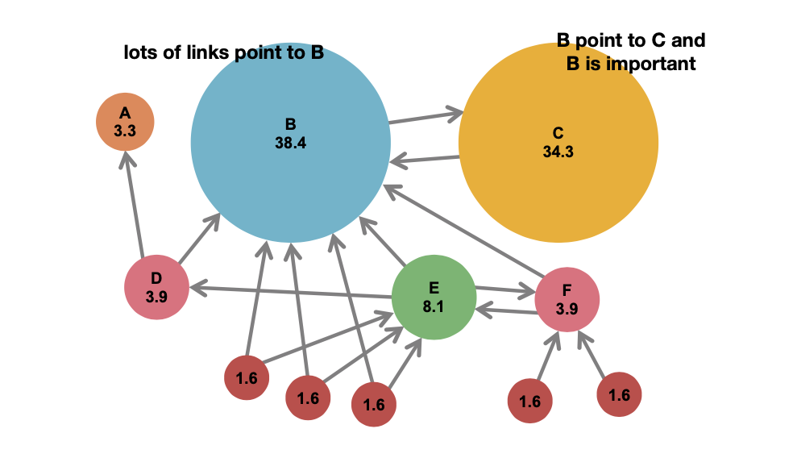
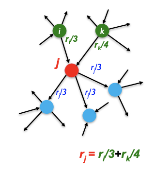
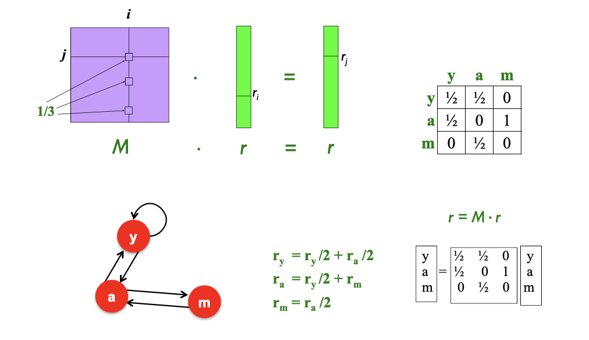

<!-- more -->

## PageRank

### Intuition
1. Idea: Links as votes
   - Pages is more important if it has more links
2. In-links have weights
   - Links from important pages count more
   - Recursive Question!
3. Web Pages are important if people visit them a lot
   - **Random Surfer** model
   - Start a random page and follow random outlinks repeatedly
   - PageRank = limiting probability of being at a page

### Problem Model
- Solve the **recursive equation**: importance of a page = its share of the importance of each of its predecessor pages
  - Equivalent to the random surfer definition of PageRank
- Technically, importance = the **principal eigenvector** of the transition matrix of the Web
  - A few fix-ups needed

**Challenges**.
1. how to deal with extermely large transition matrix
2. why correct

### Flow Formulation

- Each link's vote is proportional to the importance of its source page
- If page $j$ with importance $r_{j}$ has $n$ out-links each link gets $r_{j} / n$ votes
- Page $j$ 's own importance is the sum of the votes on its in-links
- A "vote" from an important page is worth more
- A page is important if it is pointed to by other important pages - Define a "rank" $r_{j}$ for page $j: r_{j}=\sum_{i \rightarrow j} \frac{r_{i}}{\mathrm{~d}_{\mathrm{i}}}$

> Problem: Gaussian elimination method works for small examples, but we need a better method for large web-size graphs

### Matrix Formulation

- Stochastic adjacency matrix $M$
- Let page $i$ has $d i$ out-links
  - If $i \rightarrow j,$ then $M j i=\frac{1}{d i}$ else $M j i=0$
  - $\mathbf{M}$ is a column stochastic matrix. Columns sum to 1
- Rank vector $r:$ vector with an entry per page
  - $\mathbf{r}_{\text {i is the importance score of page } i}$
    $$
    \sum_{i} r_{i}=1 \quad r_{j}=\sum_{i \rightarrow j} \frac{r_{i}}{\mathrm{~d}_{\mathrm{i}}}
    $$
- The flow equations can be written $\mathbf{r}=\mathbf{M} \cdot \mathbf{r}$

> row ~ in, column ~ out

### Eigenvector Formulation

- rank vector $r$ is an eigenvector of the stochastic web matrix $M$ with eigenvalue 1
- In fact, the first or principal eigenvector of column stochastic (with non-negative entries) matrix is **exactly 1**.
  - We know $r$ is unit length and each column of $M$ sums to one, so $Mr \le \vec{1}$
- We can now efficiently solve for $r$, **power iteration** *(Recall, introduced in SVD)*

### Power Iteration method

::: theorem

- Suppose there are $N$ web pages
- Initialize: $\mathbf{r}^{(0)}=[1 / \mathrm{N}, \ldots ., 1 / \mathrm{N}]^{\top}$
- Iterate: $\mathbf{r}^{(t+1)}=\mathbf{M} \cdot \mathbf{r}^{(t)}$
- Stop when $\left|\mathbf{r}^{(t+1)}-\mathbf{r}^{(t)}\right|_{1}<\epsilon$

:::

::: warning

Recall in SVD $X^TX$ must have eigenvector. so the SVD powere iteration algorithm can stop.

In Real Field, every matrix must have an eigenvector, and will always have one principal eigenvector, so here the iteration algorithm can also stop

:::

**Claim**: Sequence $\mathbf{M} \cdot \mathbf{r}^{(\mathbf{0})}, \mathbf{M}^{\mathbf{2}} \cdot \mathbf{r}^{(\mathbf{0})}, \ldots \mathbf{M}^{\mathbf{k}} \cdot \mathbf{r}^{(\mathbf{0})}, \ldots$ approaches the
principal eigenvector of $\mathbf{M}$

**Proof**:
- Assume $M$ has $n$ linearly independent eigenvectors, $x_{1}, x_{2}, \ldots, x_{n}$ with corresponding eigenvalues $\lambda_{1}, \lambda_{2}, \ldots, \lambda_{n},$ where $\lambda_{1}>\lambda_{2}>\ldots>\lambda_{n}$
- Vectors $x_{1}, x_{2}, \ldots, x_{n}$ form a basis and thus we can write:
    $$
    \begin{array}{l}
    r^{(0)}=c_{1} x_{1}+c_{2} x_{2}+\ldots+c_{n} x_{n} \\
    M r^{(0)}=M\left(c_{1} x_{1}+c_{2} x_{2}+\ldots+c_{n} x_{n}\right) \\
    \quad=c_{1}\left(M x_{1}\right)+c_{2}\left(M x_{2}\right)+\ldots+c_{n}\left(M x_{n}\right) \\
    \quad=c_{1}\left(\lambda_{1} x_{1}\right)+c_{2}\left(\lambda_{2} x_{2}\right)+\ldots+c_{n}\left(\lambda_{n} x_{n}\right)
    \end{array}
    $$
- Repeated multiplication on both sides produces
    $$
    M^{k} r^{(0)}=c_{1}\left(\lambda_{1}^{k} x_{1}\right)+c_{2}\left(\lambda_{2}^{k} x_{2}\right)+\ldots+c_{n}\left(\lambda_{n}^{k} x_{n}\right)
    $$
    $$
    M^{k} r^{(0)}=\lambda_{1}^{k}\left[c_{1} x_{1}+c_{2}\left(\frac{\lambda_{2}}{\lambda_{1}}\right)_{\lambda_{2}}^{k} x_{2}+\ldots+c_{n}\left(\frac{\lambda_{2}}{\lambda_{1}}\right)^{k} x_{n}\right]
    $$
- Since $\lambda_{1}>\lambda_{2}$ then fractions $\frac{\lambda_{2}}{\lambda_{1}}, \frac{\lambda_{3}}{\lambda_{1}} \ldots<1$
- and so $\left(\frac{\lambda_{i}}{\lambda_{1}}\right)^{k}=0$ as $k \rightarrow \infty$ (for all $\left.i=2 \ldots n\right)$.
- Thus: $\mathbf{M}^{k} \mathbf{r}^{(\mathbf{0})} \approx c_{1}\left(\lambda_{1}^{k} \mathbf{x}_{1}\right)$
- Note if $c_{1}=0$(i.e. no principal eigenvector exists) then the method won't converge

::: warning

We only prove the convergeness. Later we will see in some cases, some $M$ can produce extreme $r$'s

:::

## Topic-Specific PageRank 

## Hubs and Authorities 

## Web Spam