<!-- more -->

## PageRank

### Intuition
1. Idea: Links as votes
   - Pages is more important if it has more links
2. In-links have weights
   - Links from important pages count more
   - Recursive Question!
3. Web Pages are important if people visit them a lot
   - **Random Surfer** model
   - Start a random page and follow random outlinks repeatedly
   - PageRank = limiting probability of being at a page

### Problem Model
- Solve the **recursive equation**: importance of a page = its share of the importance of each of its predecessor pages
  - Equivalent to the random surfer definition of PageRank
- Technically, importance = the **principal eigenvector** of the transition matrix of the Web
  - A few fix-ups needed

**Challenges**.
1. how to deal with extermely large transition matrix
2. why correct

### Flow Formulation

- Each link's vote is proportional to the importance of its source page
- If page $j$ with importance $r_{j}$ has $n$ out-links each link gets $r_{j} / n$ votes
- Page $j$ 's own importance is the sum of the votes on its in-links
- A "vote" from an important page is worth more
- A page is important if it is pointed to by other important pages - Define a "rank" $r_{j}$ for page $j: r_{j}=\sum_{i \rightarrow j} \frac{r_{i}}{\mathrm{~d}_{\mathrm{i}}}$

> Problem: Gaussian elimination method works for small examples, but we need a better method for large web-size graphs

### Matrix Formulation

- Stochastic adjacency matrix $M$
- Let page $i$ has $d i$ out-links
  - If $i \rightarrow j,$ then $M j i=\frac{1}{d i}$ else $M j i=0$
  - $\mathbf{M}$ is a column stochastic matrix. Columns sum to 1
- Rank vector $r:$ vector with an entry per page
  - $\mathbf{r}_{\text {i is the importance score of page } i}$
    $$
    \sum_{i} r_{i}=1 \quad r_{j}=\sum_{i \rightarrow j} \frac{r_{i}}{\mathrm{~d}_{\mathrm{i}}}
    $$
- The flow equations can be written $\mathbf{r}=\mathbf{M} \cdot \mathbf{r}$

> row ~ in, column ~ out

### Eigenvector Formulation

- rank vector $r$ is an eigenvector of the stochastic web matrix $M$ with eigenvalue 1
- In fact, the first or principal eigenvector of column stochastic (with non-negative entries) matrix is **exactly 1**.
  - We know $r$ is unit length and each column of $M$ sums to one, so $Mr \le \vec{1}$
- We can now efficiently solve for $r$, **power iteration** *(Recall, introduced in SVD)*

### Power Iteration method

::: theorem

- Suppose there are $N$ web pages
- Initialize: $\mathbf{r}^{(0)}=[1 / \mathrm{N}, \ldots ., 1 / \mathrm{N}]^{\top}$
- Iterate: $\mathbf{r}^{(t+1)}=\mathbf{M} \cdot \mathbf{r}^{(t)}$
- Stop when $\left|\mathbf{r}^{(t+1)}-\mathbf{r}^{(t)}\right|_{1}<\epsilon$

:::

::: warning

Recall in SVD $X^TX$ must have eigenvector. so the SVD powere iteration algorithm can stop.

In Real Field, every matrix must have an eigenvector, and will always have one principal eigenvector, so here the iteration algorithm can also stop

:::

**Claim**: Sequence $\mathbf{M} \cdot \mathbf{r}^{(\mathbf{0})}, \mathbf{M}^{\mathbf{2}} \cdot \mathbf{r}^{(\mathbf{0})}, \ldots \mathbf{M}^{\mathbf{k}} \cdot \mathbf{r}^{(\mathbf{0})}, \ldots$ approaches the principal eigenvector of $\mathbf{M}$

**Proof**:
- Assume $M$ has $n$ linearly independent eigenvectors, $x_{1}, x_{2}, \ldots, x_{n}$ with corresponding eigenvalues $\lambda_{1}, \lambda_{2}, \ldots, \lambda_{n},$ where $\lambda_{1}>\lambda_{2}>\ldots>\lambda_{n}$
- Vectors $x_{1}, x_{2}, \ldots, x_{n}$ form a basis and thus we can write:
    $$
    \begin{array}{l}
    r^{(0)}=c_{1} x_{1}+c_{2} x_{2}+\ldots+c_{n} x_{n} \\
    M r^{(0)}=M\left(c_{1} x_{1}+c_{2} x_{2}+\ldots+c_{n} x_{n}\right) \\
    \quad=c_{1}\left(M x_{1}\right)+c_{2}\left(M x_{2}\right)+\ldots+c_{n}\left(M x_{n}\right) \\
    \quad=c_{1}\left(\lambda_{1} x_{1}\right)+c_{2}\left(\lambda_{2} x_{2}\right)+\ldots+c_{n}\left(\lambda_{n} x_{n}\right)
    \end{array}
    $$
- Repeated multiplication on both sides produces
    $$
    M^{k} r^{(0)}=c_{1}\left(\lambda_{1}^{k} x_{1}\right)+c_{2}\left(\lambda_{2}^{k} x_{2}\right)+\ldots+c_{n}\left(\lambda_{n}^{k} x_{n}\right)
    $$
    $$
    M^{k} r^{(0)}=\lambda_{1}^{k}\left[c_{1} x_{1}+c_{2}\left(\frac{\lambda_{2}}{\lambda_{1}}\right)_{\lambda_{2}}^{k} x_{2}+\ldots+c_{n}\left(\frac{\lambda_{2}}{\lambda_{1}}\right)^{k} x_{n}\right]
    $$
- Since $\lambda_{1}>\lambda_{2}$ then fractions $\frac{\lambda_{2}}{\lambda_{1}}, \frac{\lambda_{3}}{\lambda_{1}} \ldots<1$
- and so $\left(\frac{\lambda_{i}}{\lambda_{1}}\right)^{k}=0$ as $k \rightarrow \infty$ (for all $\left.i=2 \ldots n\right)$.
- Thus: $\mathbf{M}^{k} \mathbf{r}^{(\mathbf{0})} \approx c_{1}\left(\lambda_{1}^{k} \mathbf{x}_{1}\right)$
- Note if $c_{1}=0$(i.e. no principal eigenvector exists) then the method won't converge

::: warning

We only prove the convergeness. Later we will see in some cases, some $M$ can produce extreme $r$'s

:::

### Dead-ends and spider traps

> Existence and Uniqueness of solution in Power Iteration?

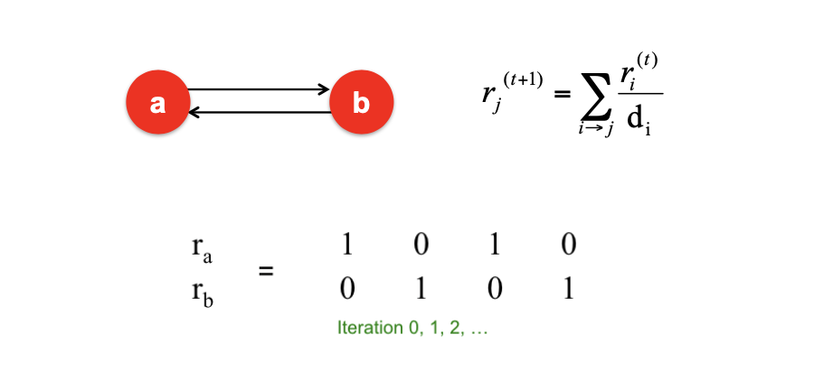

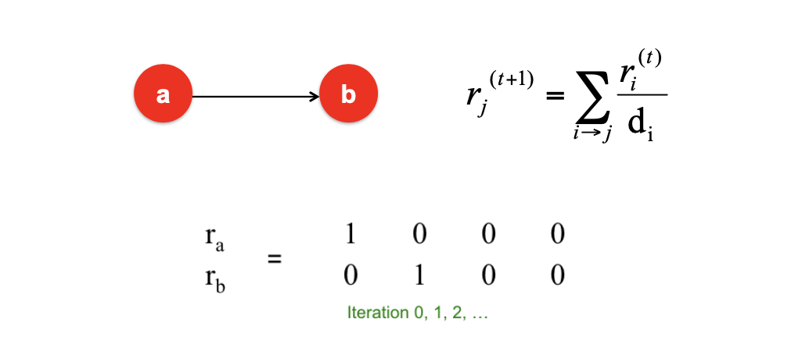

**dead ends (have no out-links)**
- Random walk has no where to go
- Such pages cause importance to “leak out”

**Spider Traps**
- Random walked get "stuck" in a trap
- And eventually spider tranps absort all imoprtance
- No Stationary distribution 

**Solution. Teleports** Surfer will teleport out of spider trap within a few time steps

- The Google solution for spider traps: At each time step, the random surfer has two options
  - With prob. β, follow a link at random
  - With prob. 1- β, jump to some random page
  - Common values for β are in the range 0.8 to 0.9
- Follow random teleport links with probability 1.0 from dead ends
  - Adjust natridx accordingly

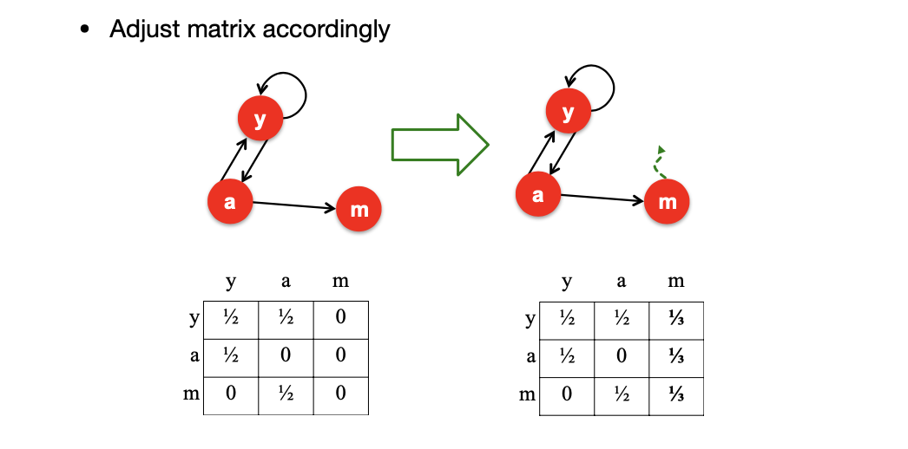

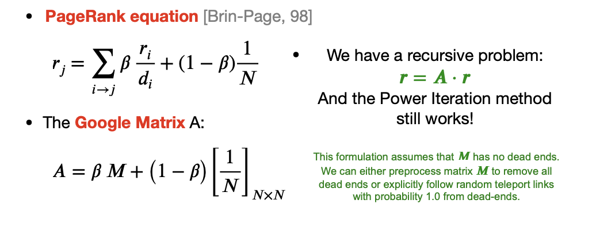

### Read-world PageRank
**Problem.** The introduciton of constant item makes the matrix dense ratber than sparse(many 0's)

- $\mathbf{r}=\mathbf{A} \cdot \mathbf{r},$ where $\mathbf{A}_{j i}=\mathbf{\beta} \mathbf{M}_{j i}+\frac{\mathbf{1}-\mathbf{\beta}}{\mathbf{N}}$
$$
\begin{aligned} r_{j} &=\sum_{\mathrm{i}=1}^{N} A_{j i} \cdot r_{i} \\ r_{j} &=\sum_{i=1}^{N}\left[\beta M_{j i}+\frac{1-\beta}{N}\right] \cdot r_{i} \\ &=\sum_{i=1}^{N} \beta M_{j i} \cdot r_{i}+\frac{1-\beta}{N} \sum_{\mathrm{i}=1}^{N} r_{i} \\ &=\sum_{\mathrm{i}=1}^{N} \beta M_{j i} \cdot r_{i}+\frac{1-\beta}{N} \quad \text { since } \sum r_{i}=1 \end{aligned}
$$
So we get: $r=\beta M \cdot r+\left[\frac{1-\beta}{N}\right]_{N}$

**Analysis**
- We just rearranged the PageRank equation
  $$
  \mathbf{r}=\mathbf{\beta} \mathbf{M} \cdot \mathbf{r}+\left[\frac{\mathbf{1}-\mathbf{\beta}}{\mathbf{N}}\right]_{\mathbf{N}}
  $$
  where $[(1-\beta) / N]_{N}$ is a vector with all $N$ entries $(1-\beta) / N$
- $\mathrm{M}$ is a sparse matrix! (with no dead-ends)
- 10 links per node, approx $10 \mathrm{~N}$ entries
- So in each iteration, we need to:
- Compute rnew $=\beta \mathrm{M} \cdot$ rold
- Add a constant value $(1-\beta) / \mathrm{N}$ to each entry in $\mathrm{rnew}$
  - Note if M contains dead-ends then $\sum_{j} r_{j}^{n e w}<1$ and we also have to renormalize rnew so that it sums to 1

**PageRank: The Complete Alg.**

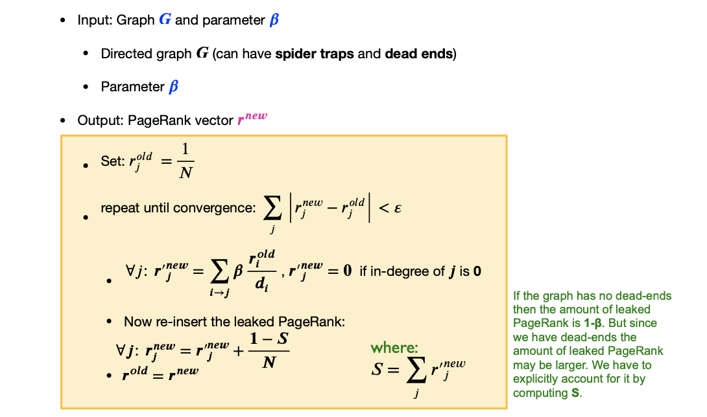

> The essence is still random walk, we simplify the compiting process
> 
> S represents the probabilitiy "drained"

### Sparse Matrix Encoding

Space proportional roughly to number of links
- Encode sparse matrix using only nonzero entries
- Say 10N, or 4\*10\*1 billion = 40GB
- Still won’t fit in memory, but will fit on disk

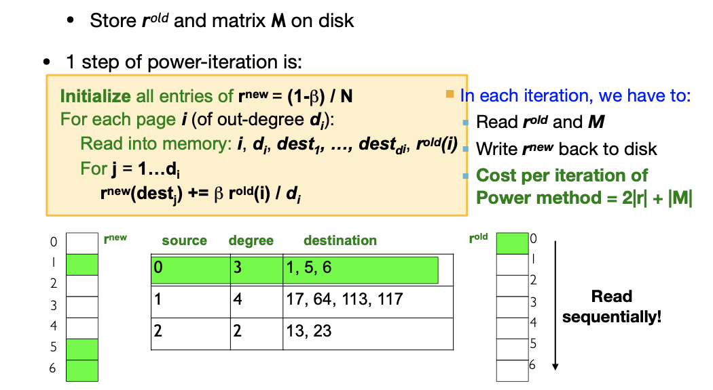

#### Blocked Based Update

Note, when we visit destination(s), we have to load all the $r^{new}$, What if can't fit?

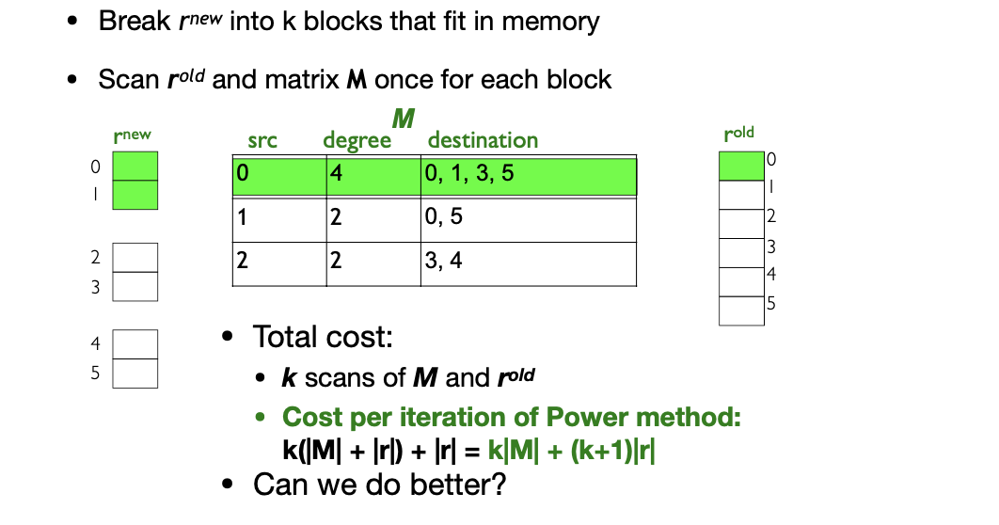

#### Block-Stripe Update

> But  M is large, can we not always read the whole `src-dest` Matrix? split them to stripes

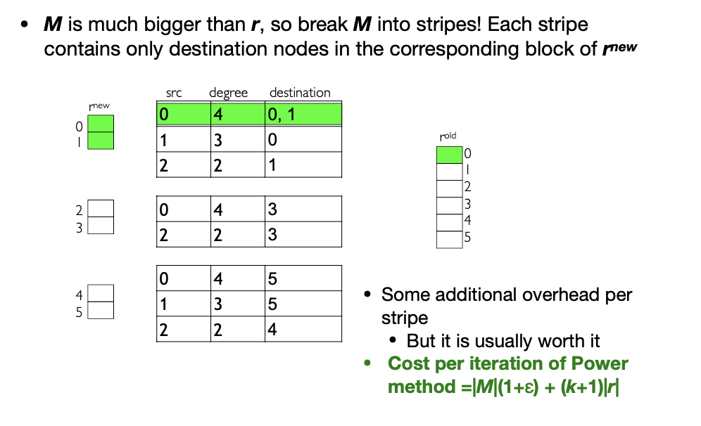

### Problem with PageRank

- Biased against topic-specific authorities
  - Measures generic popularity of a page
  - Solution: Topic-Specific PageRank 
  > Page Rank is too general, we want a topic-oriented search service
- Uses a single measure of importance
  - Other models of importance
  - Solution: Hubs-and-Authorities 
- Susceptible to Link spam
  - Artificial link topographies created in order to boost page rank
  - Solution: TrustRank

## Topic-Specific PageRank 

**Goal**: Evaluate Web pages not just according to their popularity, but by how close they are to a particular topic, e.g. “sports” or “history”

- Teleport set
  - Recall in **Standard PageRan**k: Any page with equal probability: to avoid dead-end and spider-trap problems
  - **Topic Specific PageRank**: A topic-specific set of “relevant” pages **(teleport set)**
  > Random walk with restart

- Idea: Bias the random walk
- When walker teleports, she pick a page from a set $\mathbf{S}$
- $S$ contains only pages that are relevant to the topic
- E.g., Open Directory (DMOZ) pages for a given topic/query
- For each teleport set $\mathbf{S}$, we get a different vector $r_{s}$
- To make this work all we need is to update the teleportation part of the PageRank formulation:
$$
A_{i j}=\left\{\begin{array}{ll}
\mathbf{\beta} \mathbf{M}_{i j}+(1-\mathbf{\beta}) /|S| & \text { if } \mathbf{i} \in \mathbf{S} \\
\mathbf{\beta} \mathbf{M}_{\mathbf{i} \mathbf{j}}+\mathbf{0} & \text { otherwise }
\end{array}\right.
$$
- $A$ is stochastic!
- We weighted all pages in the teleport set $S$ equally
- Could also assign different weights to pages!

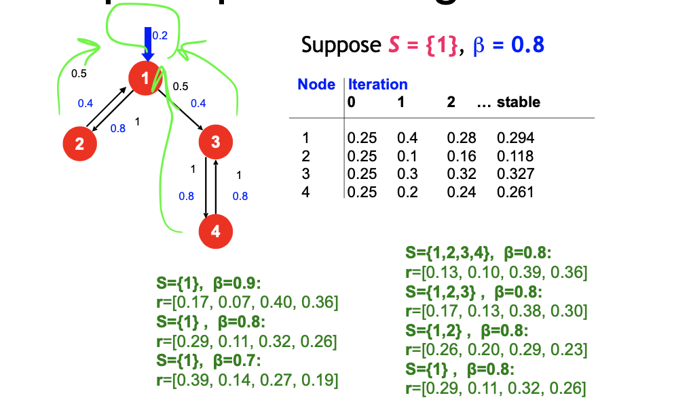

> The standard PageRank is just taking the teleport set to be all nodes

> How to **select teleport set**? and How close are nodes to the teleport set?

::: theorem

**Proximity on Graphs**

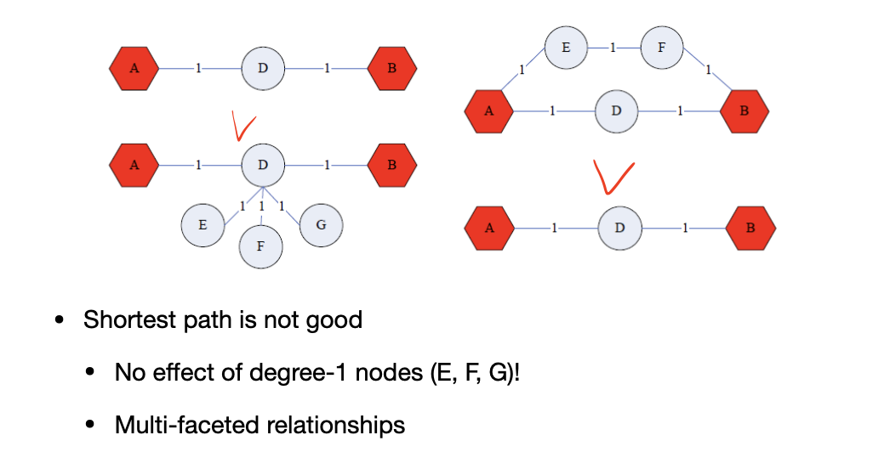

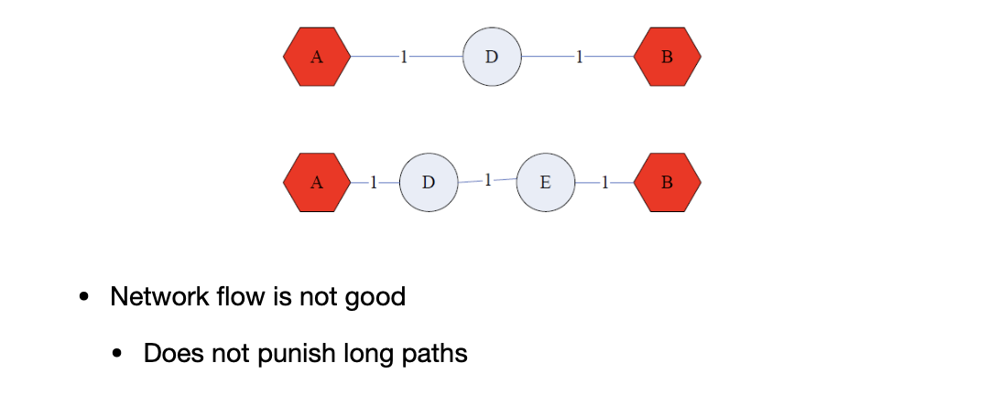

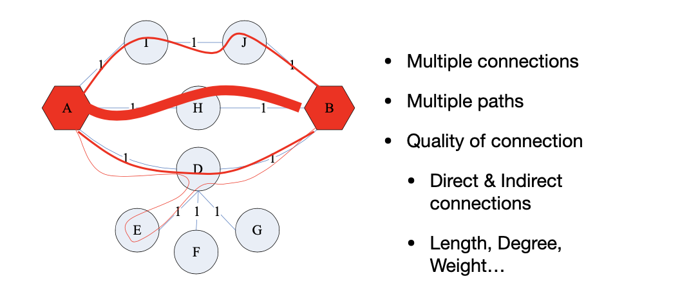

:::

### SimRank
- SimRank: Random walks from a fixed node on k-partite graphs
- Setting: k-partite graph with k types of nodes
  - E.g.: Authors, Conferences, Tags
- Topic Specific PageRank from node u: teleport set S = {u}
- Resulting **scores measures similarity to node u**
> But to get simrank in this way, we have to perform $rM=r$ every time
- Problem:
  - Must be done once for each node u
  - Suitable for sub-Web-scale applications

#### Example: Pins to Pins Recommendation

Pin: things you add favourite

Boards: collection of pins, every user has one

Bipartite Pin and Board Graph

- Every node has some importance
- Importance gets evenly split among all edges and pushed to the neighbors
- Given a set of query nodes Q, simulate a random walk

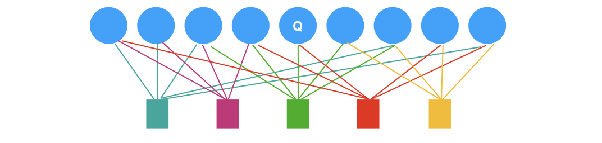

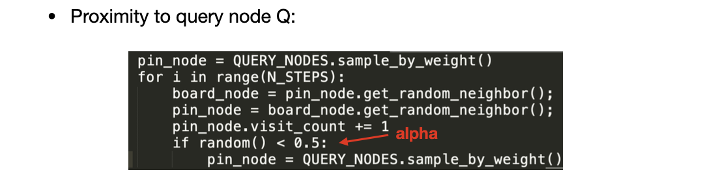

**Pixie Random Walks** (Compared to SimRank + PageRank)
> Use visit count to replace proximity, instead of a large vector.
> A local Algorithm, only depends on neighbours

## Hubs and Authorities 

## Web Spam