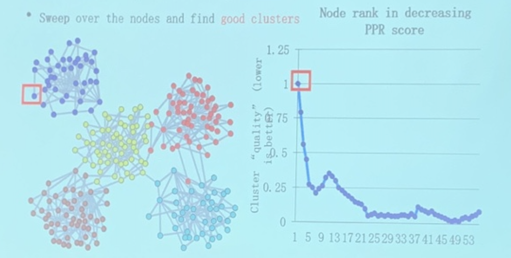

<!-- more -->

Analysis on Graph Strucutre can provide insights into clusters between nodes.

A "brute force" solution: compute proximity for every pair of vertices, partition the columns/rows in the proximity matrix.

We will introduce a PageRank based algorithm for finding dense clusters
- Runtime of the algorithm should be proportional to the **cluster size (instead of graph size!)**

Idea: Seed Nodes
> Within clusters, a jump will be mostly likely to fall within the cluster (**trapped in**), and once it jumps out of the cluster, it will hardly fall back to the cluster(**diffused away in others**)

Algorithm outline
- Pick a seed node s of interest
- Run **PPR** with teleport set = {s}
- Sort the nodes by the decreasing PPR score
- Sweep over the nodes and find good clusters

> The first **good bottom** in PPR score implies that at this point a good cluster is formed.
>
> Other bottoms may also exist.

**Question.** How to measure a "good" cluster

> Recall for clustering, we have cohesion, diameter, ...
> 
> What about on graph?

- Idea: Divide vertices into 2 disjoint groups A, B=V\A
- Maximize the number of within-cluster connections *volume*
- Minimize the number of between-cluster connections *surface*