# 1 Introduction

<!-----
title: 【Computer Composition】1 Introduction
url: cc-intro
date: 2020-03-02 14:04:45
tags: 
- Computer Composition

categories:
- Computer Composition
- Courses
----->

Week 1 of 2020 Spring. An Introduction to Computer Composition.

**Keywords**: 计算机组成，计算机架构

<!--more-->

[[toc]]

## Programs

### Levels of Program Code 程序的三个层次

计算机真正理解的一定是二进制的程序，对人来说，在不同层次上能够看到不同的表现。

> 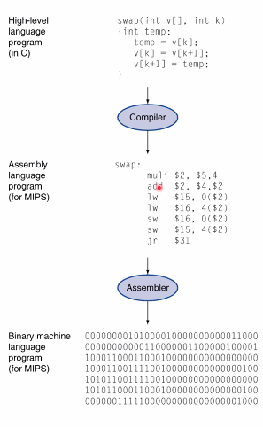
> 注：汇编指令中，$1 代表寄存器

- *High-Level Language* 尽管是抽象表达，但和解决的问题相对比较接近，能够理解，让我们更有效地设计程序，具有可移植性。
- *Assembly Language* 汇编语言，更加接近计算机操作的语言，由许多指令组成。
- *Hardware Representation* 纯二进制编码

## Below Your Program
- Application Software 应用程序，面向问题，通常用高级语言写。
- System Software 系统软件，包含如下两个成分，仅和Application Software做接口
    + Compiler 把高阶语言（HLL）转换成机器码
    + Operating System
- Hardware 仅和System Software做接口


relation 调用关系
```
applications ----> os ----> hardware : 借助操作系统运行的应用
       |----------------------↑      
 应用直接操控硬件,多见于嵌入式系统（bare system）
```

## What is Computer Architecture 计算机架构

应用如何操控硬件达到目的？

- 计算机架构：抽象层的设计
    > the design of abstraction layers to implement information processing applications efficiently using available manufacturing technologies. 

- Modern System Abstraction Layers
    - Application
    - Algorithm
    - Programming Language
    - OS/VM (CS)
    - **Instruction Set Architecture**
    - **Microarchitecture** (Our Course)
    - Gates/Register-Transfer Level
    - Circuits
    - Devices
    - Physics (EE)

- ISA 指令集
    - 指令集随着计算机的发展不断变化，将底下硬件的所有变化反映到指令集上，是架构最直观的体会。
    - Architecture continually changing，对changing辩证认识
    > 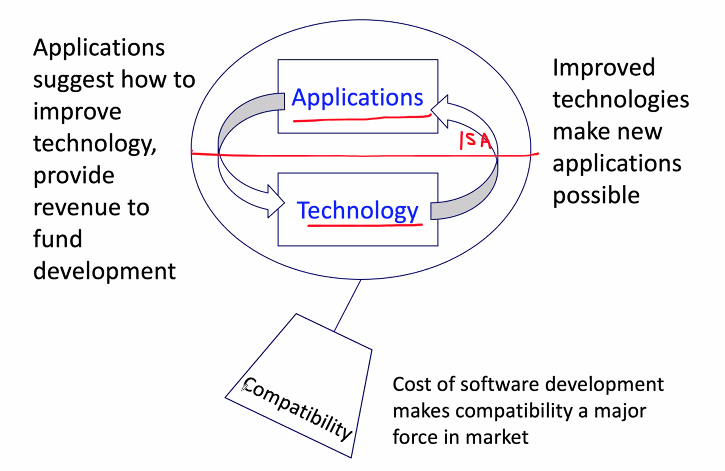
    > 技术的提高和进步给应用实现的可能
    > 应用的发展为技术提出要求和动力
    > Compatibility matters!

    > Example : 摩尔定律
    > 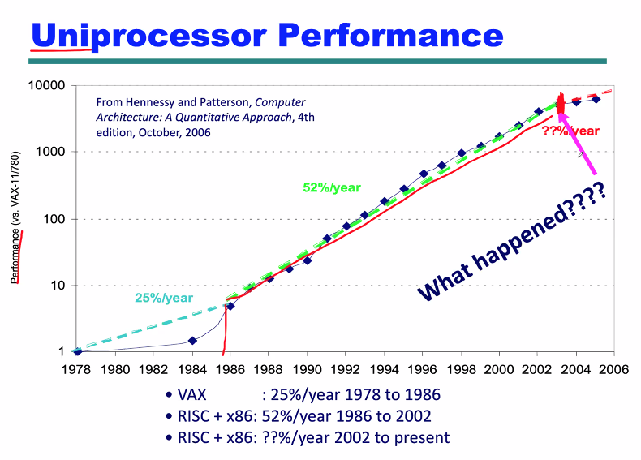
    > Fig1 单核CPU的瓶颈


### Understanding Performance

- Algorithm
    - 决定了程序运行过程中操作（operation）的多少
- Programming language, compiler and architecture
    - 决定指令的多少（instruction per operation）
- **Processor and memory system**（内存组织结构）
    - 主频高低
    - GPU/CPU
    - 内存主频...
- **I/O system (including OS)** 端口速度 (this course)
    - SSD VS HDD


### Architecture: Conceptual Design
> Architecture is those attributes visible to the programmer. 对编程者能够看到硬件可用的属性/规范。
- Instruction Set
- Number of Bits used for data
- I/O mechanism
- addressing techniques (寻址方式:如何获得操作、保存数据)


## Organization（组成）
> Organization is how features are **implemented**.
- Control Signals
- Interfaces
- Memory technology

e.g. 乘法是用硬件实现还是用加法的循环实现

### Architecture VS. Organization

| | Architecture | Organization|
|-- |--------------|-------------|
| Contents |Instruction set design, performance evaluation, pipelining, vector machine, SMP, clusters, parallel processing | Arithmetic Operations, Memory Organization, Instruction Set and addressing,I/O,bus, CU|
| Examples | Intel x86 Family/IBM System/370 family | CPU个数，硬件加速功能，数学运算协处理器 |
| Explanation | 同样的架构共享同样的指令集 | Opening the box |

Remark
- Same Architecture gives code compatibility (at least 向后兼容)
- 相同架构的芯片可能提供不同的版本（性能/组成）

### Components of a Computer
> BIG PICTURE (Architecture)
> 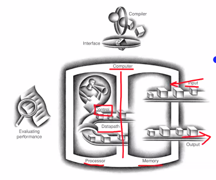
> 左侧：processor处理器，右侧memory，用于输入输出。
> CPU中有control unit和datapath
- Same components for all kinds of computer
- Input/Output includes
    - User-interface devices (embedded system usually doesn't have much)
        - display, keyboard, mouse, button
    - Storage devices
        - hard disk, CD/DVD, flash
    - Network adapters
        - for communicating with other computers

### Inside the Processor (CPU)
- Datapath: performs operations on data 决定从哪里获得数据（哪个通道开/关）
- Control：sequences datapath，CPU各部件按照什么样的时序运作，给数据通道做定时
- Cache memory （过去不存在，是提升CPU运行速度的一大工具）
    + small fast SRAM memory for immediate access to data 小而快的静态RAM，提供快速数据存储的内存部件。
> AMD Barcelona: 4 processor cores
> 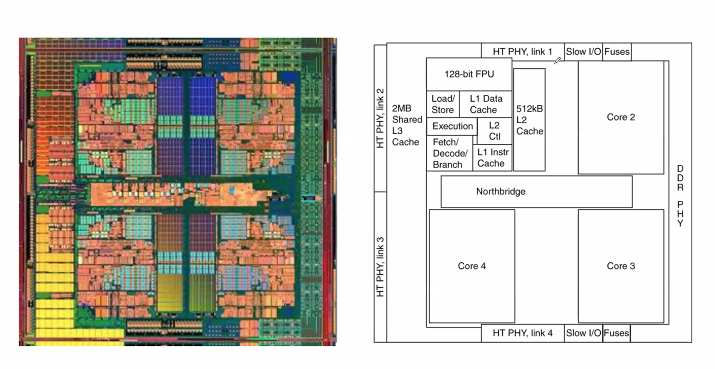
> FPU: 浮点运算
> Execution: 执行运算 datapath
> Fetch/Decode/Branch: 对应Control Unit
> load/L1/L2/L1...: cache

### Structure & Function 计算机的结构和功能

- Structure is the way in which components relate to each other 内部各部分的连接
    - How different components, like ALU, contro, I/O, memory are *connected*? 连接
    - How they *interface* with each other? 通信

- Function is the operation of individual components as part of the structure.
    - data processing
    - data storage
    - data movement
    - control

> 计算机功能控制逻辑示例（Function）
> 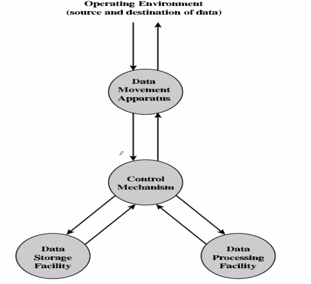
> |数据移动|外部、内部数据的交换|对内部数据的处理|Processing from Storage to I/O|
> |-------|-------|----------|-------|
> |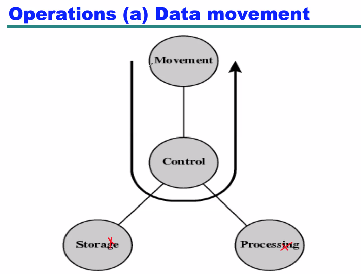|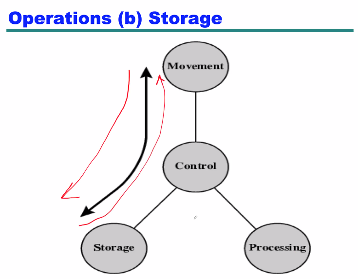|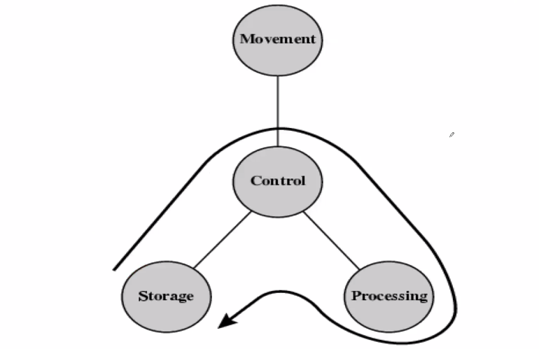|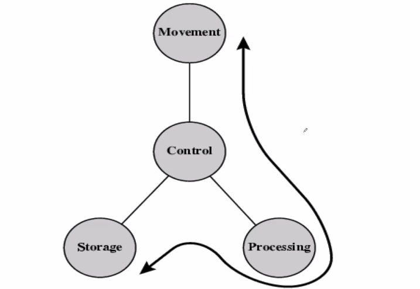|
> 注： 此处的storage指的是计算机内部的存储（RAM）
> 显示屏、鼠标、硬盘等在MOVEMENT线之外


> CPU/COMPUTER结构图
> 
> |Computer|CPU|Control Unit|
> |-------|-------|----------|
> |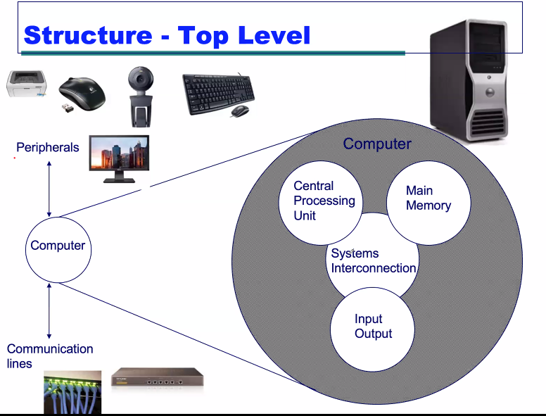|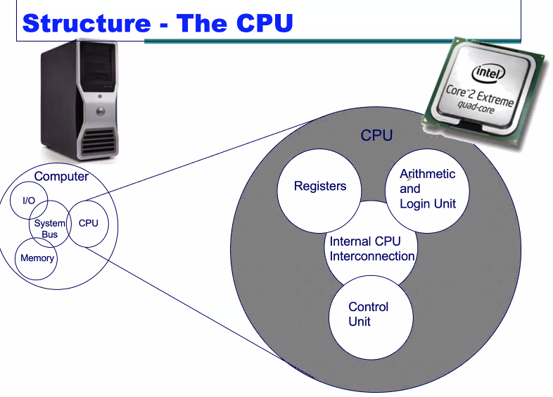|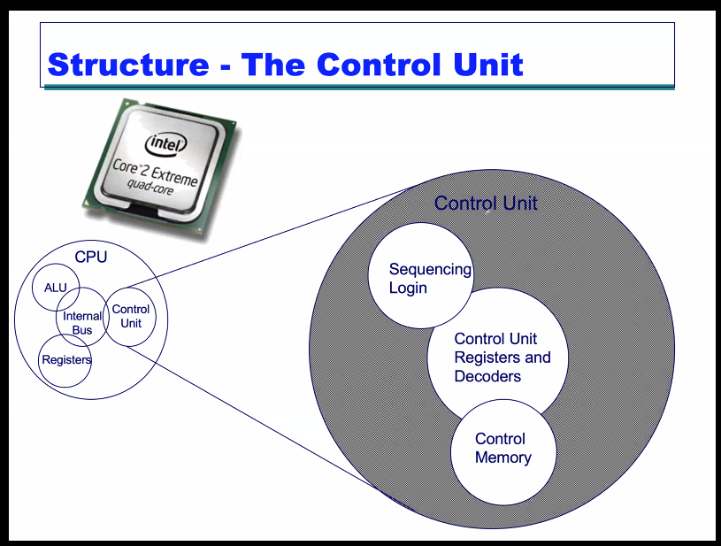|
> 注：CONTROL UNIT = 定时控制 + 寄存器、命令的解码器 +  内存控制
> 即对做什么样的事进行decode，对产生什么样的部件做sequence（时序电路）


## Outline of the Course

- Computer Evolution and Performance
- Computer Interconnection Structures
- Internal Memory
- External Memory
- Input/Output
- Operating Systems Support
- Computer Arithmetic
- Instruction Sets
- CPU Structure and Function (LAB required)
- Control Unit Operation
- Reduced Instruction Set Computers (RISC) 精简指令系统电脑
- Superscalar Processors超标量处理器
- Microprogrammed Control
- Multiprocessors and Vector Processing

> 数电复习：时序逻辑设计
> ftp://public.sjtu.edu.cn
> username: xzfang