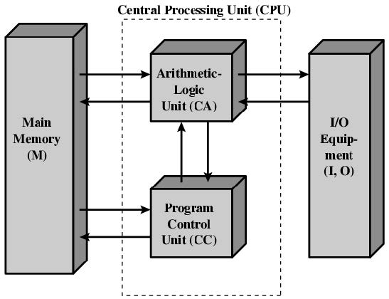

Week1 of 2020 Spring. Evolution of Computers

**KeyWords**: Computer Composition, von Neumann, 

<!--more-->

## Traditional Computers

> Case: Details of ENIAC
> - Decimal (not binary)
> - Programmed manually by switches

### 冯诺依曼计算机架构
- Stored Program Concept, 存储程序
- 数据和程序共享同一块内存
- 程序存储在Memory中，无特殊声明的情况下顺序执行
- ALU operating on binary data 通过二进制操作
- Control Unit从内存中_取出指令_，按照指令的要求进行操作
- I/O equipment同样由Control Unit来操作
- implemented in IAS by Princeton
> 
> 指令存在Memory中，与Control Unit、ALU交换
> I/O和ALU在Control Unit的控制下交换数据
> 定位外部数据的方法？CPU如何找到内存中的某个单元？
> - 每个内存单元都有独特的地址
> - 对I/O设备，也是用地址的值进行标定，通常数量远远小于内存地址的数量

### IAS - details
我们通过观察IAS的细节内容来说明详细内容。
- 1000*40 bit words
    - binary number
    - 一个words包含2个20bit指令
        - 作为数 1符号+39num
        - 作为指令，分左右指令
        - 0~7、20~27 Opcode:所执行的指令 $2^8=256$种指令
        - 8~19、28~39 Address：表明执行指令时数据的来源

- Structure
    - Memory Buffer Register 内存缓存单元
        - 维护和其他设备data port交互（读/写）的数据
        - 具有锁存的功能
        - Memory to CPU: input, vice versa,从CPU角度决定
    - Memory Address Register 内存地址单元（寄存器）
        - 保存Address并送到M
        - Register：用于暂时存储数据的地方
        > 
        - 对Memory的操作：传入Address（一段n位二进制的值），内存将激活内部（可看成一位数组）某一个单元，该单元将被连接到Data Port，由Control Port决定读还是写
    - Instruction Register
    - Instruction Buffer Register
    - Program Counter：程序计数器
    - Accumulator (AC)
    - Multiplier Quotient

    > e.g. MM中的指令如何work？
    > PC->MAR锁存，送到->MM激活指定单元->MBR锁存->IBR->IR->Control circuits...

    - 注意，MBR有两条线下来，一条给IR/IBR指令，另一条用于MAR取值，传回IR/IBR，迭代完成指令。

## Commercial Computers
- 1st vacuum tube 真空管
    - in 1950s，computers are used for specific work
- 2nd generation: transistors(晶体管)
    - Transistor Based Computers
    - 此时，存储单元由磁环实现
- 3rd generation: Microelectronics
    - 由门电路，内存单元构成
    - 存储单元，所有部件用半导体芯片实现

### Moore's Law
- 1970~2000s原因：Increased density on a chip
    - 更短的传输通道
    - increased flexibility
    - Reduced power and _cooling_ requirements
    - fewer interconnection increases reliability (of the system)

### IBM 360 series
- first planned "family" of computers
    - similar/identical ISA/OS
    - increasing speed/ports/memory/cost
    - 企业标准得以成为工业标准

### DEC PDP-8
- first minicomputer
- BUS structure
> Central Control vs. BUS
> | Multiplexed Switch Structure 复用的开关结构 | Bus Structure |
> |---------| ---------|
> |||
> | 通过_专用_的data channel连接到multiplexer再连到CPU|omnibus扩展性好,低成本,但容易形成阻塞,影响高速设备发挥|

### Intel
- 4004(1971),8008(1972) 专用
- 8080(1974) Intel's first general purpose microprocessor
> 
> 新增属性:Addressable memory,允许放入内存中执行的指令数目将增加.
> WHY? 我们放在硬盘上的程序是不能执行的.
> Recall **所有可执行的程序都必须在内存中**
> - 一方面,更多指令,更多功能.
> - 另一方面,更大容量,更多程序,允许同时执行的程序越多.

> 
> Addressable/Virtual Memory/Cache 都是组成上的概念

## Why Moore Fails

### Performance Gap Between Processor & Memory

> 
> - Memory capacity increased
> - But Memory speed lages behing processor speed

- Change DRAM interface
    - Cache
- Reduce _frequency of memory access_ 减少内存存取频率
    - More Complex cache and cache on chip
- Increase _number of bits_ retrieved at one time
    - 8 bit to 64 bit, 提高每次存取的数目
    - Make DRAM "wider"
- Increase interconnection bandwidth 总线优化
    - high speed buses
    - hierarchy of buses

### I/O Devices
> Problem: Peripherals with intensive I/O demands
> - 在processor和peripheral(IO设备)传输数据的速度
> - 如,给显卡设置专用通道

- Caching 硬件自动操作, 临时存储, 不能计算容量, 对程序员不可见
- Buffering 软件可以控制, 类似一个队列
- Higher-speed buses
- Multiple-processor configurations

> Key is Balance. 要设计一台高性能电脑, 我们要平衡所有部件的性能.

## 提高性能

再平衡后我们如何进一步提高各组分性能

### Speeding Microprocessor Up

- Clock rate 提高主频
- Logic Density 提高部件密度
- Pipelining 流水线架构
- On board L1 L2 Cache 分层cache
- Branch Prediction 预测分支
- Data Flow Analysis
- Speculative execution 预测执行