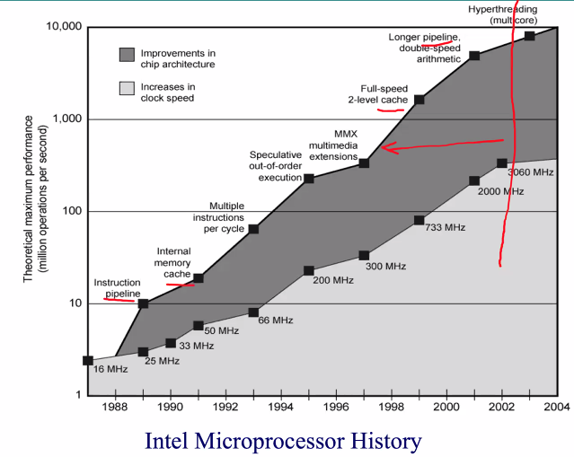
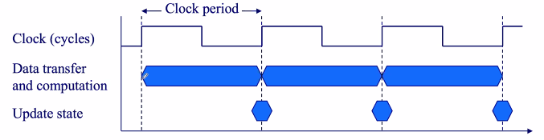
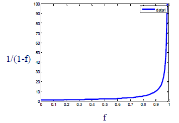

Week 2 of 2020 Spring. Performance of Computers

**KeyWords**: Computer Composition, Performance

<!-- more -->

## 提高性能

要提高计算机的性能, 我们要保持各组分的平衡. 接下来我们讨论如何进高各组分性能

- Clock rate 提高主频
- Logic Density 提高部件密度
- Pipelining 流水线架构
- On board L1 L2 Cache 分层cache
- Branch Prediction 执行方面,预测分支
- Data Flow Analysis 数据流分析
- Speculative execution 预测执行

### Speeding Microprocessor Up 微处理器的速度
要提高芯片速度, 
1. 放上更多芯片, 可以有更多的门(density of logic) 
   **RC Delay** 变大(低通滤波器)
   逻辑密度增加了, 但电容值增加了, 线细了之后, 电阻值也增加了, RC值的增加导致了频率进一步的降低
2. increase clock rate, 传输速度增加. 
  但副作用是, 我们对CPU的散热除了更高的要求. 
  > ***Relasing Power = 容性负载(Capacitive Load) * 电压^2 * 频率***
  > in fact, 大部分CPU的电压都不是单一的, 外部/内部各模块电压分别设计, 以降低CPU的电压
  电压?
  - 电压高: 抗噪能力好
  - 电压降低: 降低power, 基底噪声将对正常工作产生影响
  **POWER WALL**
  - can't reduce voltage further
  - can't remove more heat

因此, 我们将难以在芯片本身工艺上做更多成果. 我们将把提高性能的方法转移到组成与结构上去.
> 
> 在clock speed达到上限后, 更多的提高性能的方法体现在architecture上 如pipeline, cache, 多指令, 乱序执行, **多核**...
> 红线处, **power wall**和**RC delay**标志着单核时代的结束,多核时代的到来.

1. **Increased Cache Capacity**
   CPU中, Cache的占比越来越显著
   - 层次数: 在处理器与主存之间,通常有2 or 3 levels of cache
   - 密度: chip density, more cache memory on chip, faster access
   - 占比: 10% of chip -> 50% chip (Pentium 4末代单核)

2. **Pipeline**
   实现并行执行
   - pipeline 类似流水线, 各个工位同时工作, 为同一个对象服务
   - superscalar 超标量, 允许multiple pipeline on single processor, 不具有依赖的指令可以并行执行
   - 分析:
     - 逻辑密度的提高facilitates并行化
     - 但另一方面, 进一步通过物理密度/处理器复杂度提升带来性能提高的收益将越发降低(square root)
     - 此外, Cache的提升空间也达到了局限
     - 单核的穷途末路

3. New Approch **Multiple Cores**
   We have to use multiple processors on a single chip, with **large shared cache**
   挑战: Explicitly parallel programming
   - Compared with instruction level parallelism
     - where hardware executes multiple instructions at once
     - hidden from the programmer
   - Hard to do
     - Programming for performance
     - load balancing
     - optimizing communication and synchronization(同步)

### Way To Multi-Core
x86 Evolution
- 8080: first general purpose, 8-bit daa path
- 8086: 16-bit
- 8088: internal 16-bit but with 8-bit external bus
- 80286
  - 16 MByte memory addressale(寻址空间)
- _**80386**_ (+ external 387 for maths)
  - 32 bit
  - first support for multitasking
- 80486
  - sophisticates powerful cache and instruction _**pipeline**_
  - built-in maths co-processor 首次集成
- Pentium
  - **Superscalar**
- Pentium Pro
  - data flow analysis
  - **speculative execution**
- Pentium II
  - **MMX technology** 针对多媒体的指令 multimedia 
- Pentium III
  - Additional floating point instructions for 3D graphics
- **Pentium 4**
  - Further floating point and multimedia enhancements
  - _Last generation of **uni processor**_
- _**Core**_ (2004~2006)
  - First x86 with dual core
- **Core 2**
  - _**64 bit**_ architecture
...
> x86 占据了嵌入式系统以外所有的应用场合
> 在这过程中间, 组成和技术都经历了巨大的变化
> 但所有的CPU都提供了向后/向上兼容, 即旧CPU指令可在新CPU中执行
> 指令集以每月平均1条的速度增加, 目前有500条available指令

### Embedded Systems & ARM
ARM evolved from RISC design(精简指令集)
Used mainly in embedded systems
- used within product
- not (necessarily) general purpose computer
- dedicated function
- e.g. ABS (anti-lock brakes in car)

Definition of Embedded systems: A combination of computer hardware and software, and perhaps additional mechanical or other parts, designed to perform a dedicated function.

ARM Systems Categories
- Embedded real time (R...)
- Application platform (A...)
  - Linux, Palm OS, Symbian OS, Windows Mobile
- Secure applications (M...)

## Computer Assessment 性能评估

- Response time: 完成某项任务的时间(包含提交到结果)
- Throughput: Total Work(tasks/transaction) per hour
- Affected by
  - replacing the processor with a faster version?
  - adding more processors?

Relative Performance - response time
$$Performance = \frac{1}{Execuion Time}$$
"X is n times faster than Y" means
$$\frac{Performance_{x}}{Performance_{y}} = \frac{Execution Time_{y}}{Execution Time_{x}} = n$$
(no +1 issue)

### Measuring Execution Time
Elapsed Time (total response time)
- Processing, I/O, OS overhead操作系统消耗的时间, idle time任务等待时间
- Determines **system performance**
CPU Time
- processing a given job
- I/O time, other jobs' shares discounted
- Comprises _user CPU time_ and _system CPU time_ 两部分
- **Different programs are affected differently by CPU and system performance** (测量方法上的提示)

### CPU Clocking
Operation of digital hardware governed by a constan-rate clock
> CPU Clock
> 
> 一个周期 = 处理+保存结果,以上升沿为边界
> usually measured in ns/ps
> e.g. 250ps = 0.25ns = $250 \times 10^{-12}$s
> 4.0 GHz = 4000 MHz = $4.0 \times 10^{9}$Hz

晶体固件+A/D转换 = oscilator 振荡器/System Clock
Clock can't be arbitrarily fast
- Signals in CPU take time to settle down to 1 or 0
- Signals may be change at different speeds
- Operations need to be synchronized

### CPU Time
$$
\begin{aligned}
\text{CPU Time} &= \text{CPU Clock Cycles} \times \text{Clock Cycle Time} \\
&= \frac{\text{CPU Clock Cycles}}{\text{Clock Rate}}
\end{aligned}
$$
- 降低一个操作的clock cycles数
- 提升clock rate
- 但降低clock数,往往增加周期数(各类指令的需求平衡)
- 硬件设计师往往trade off clock rate against cycle count

### Instruction Count and CPI
$$
\begin{aligned}
\text{CPU Time} &= \text{CPU Clock Cycles} \times \text{CPI} \times \text{Clock Cycle Time} \\
&= \frac{\text{CPU Clock Cycles}\times \text{CPI}}{\text{Clock Rate}}
\end{aligned}
$$

### CPI = Cycle per instruction, 提升方式
- 减少指令数
  - Program(算法优化), ISA(指令架构), Compiler(合适的编译器)
- 减少每条指令的平均时间(average cycles per instruction)
  - 由CPU决定
  - 由不同指令的CPI决定(+不同指令的数目/混合)
- 因此Cycle Time, CPI,... 都不能单独决定CPU的Performance.

### CPI in more detail
- If different instruction classes take different numbers of cycles (for a particular program/sequence)
$$
\text{Clock Cycles} = \sum_{i=1}^{n} (\text{CPI}_i\times\text{instruction count}_i)
$$ 
  其中i指CPI数目相同的某类指令.
$$
\text{Avg.CPI} = \frac{\text{Clock Cycles}}{\text{Total Instruction Count}}
$$

### CPU Time Summary
$$
\text{CPU Time} = \frac{\text{Instructions}}{\text{Program}}\times \frac{\text{Clock Cycles}}{\text{Instruction}}\times \frac{\text{Seconds}}{\text{Clock Cycle}}
$$
- Algorithm: affects IC, possibly CPI
- Programming Language: affects IC, CPI
- Compiler: affects IC, CPI
- Instruction Set Architecture: affects IC, CPI, $T_C$

### Instruction Execution Rate
Instructions executed per second
- MIPS: millions of instructions per second (一般评估CPU的定点性能)
- MFLOPS: millions of floating point instructions per second (CPU在没有硬件加速模块下, 浮点运算只能由模拟完成, 在DSP(数字信号处理)方面应广泛)
- dependent on instruction set/compiler design/**processor implementation**/**cache & memory hierarchy**(影响运算时操作对象取得的方式)

## Benchmarks
针对MIPS的难以衡量,我们提出了Benchmarks这一衡量基准
本质是一系列程序
- Programs designed to test performance
- Written in high level language (**Portable**)
- Represents style of task: systems/numerical/commercial/IO/network
- Easily measured
- Widely distributed
e.g. System Performance Evaluation Corporation(SPEC)
- CPU2006 for computation bound
  - 17 floating point programs in C, C++, Fortran
  - 12 integer programs in C, C++
  - other different sets ...
  - 3 million lines of code
- 测试结果: ratio of reference time to system run time, 对Single Task
  $$r_i=\frac{\text{Tref}_i}{\text{Tsut}_i}$$
  对整体,Throughput, 我们采用**几何平均**, 使各个值的参考意义更为准确
  $$r_G = (\prod_{i=1}^{n} r_i)^{\frac{1}{n}}$$

## Amdahl's Law
多核处理器的加速可能性?
- 代码需要能够并行化
- 加速比是有界的, 边际效益递减
- For program running on a single processor
  - $f$ 程序支持无限并行处理的部分
  - $1-f$ 不可并行(inherently serial)
  - 增加$N$CPU,对原本$T$execution time的程序:
  $$
  \begin{aligned}
  \text{Speedup} &= \frac{\text{time On a Single Processor}}{\text{Time On N Parallel Processors}} \\
  &= \frac{T(1-f)+Tf}{T(1-f)+\frac{Tf}{N}} =  \frac{1}{(1-f)+\frac{f}{N}} \rightarrow \frac{1}{1-f}
  \end{aligned}
  $$
> 

