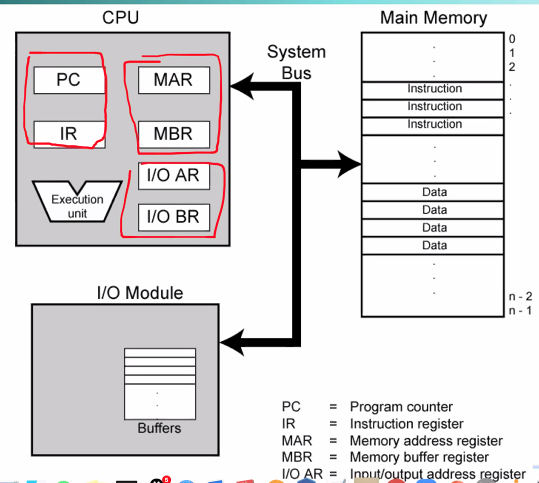
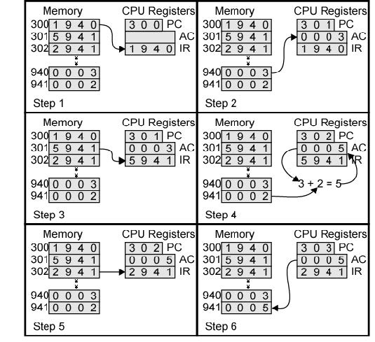
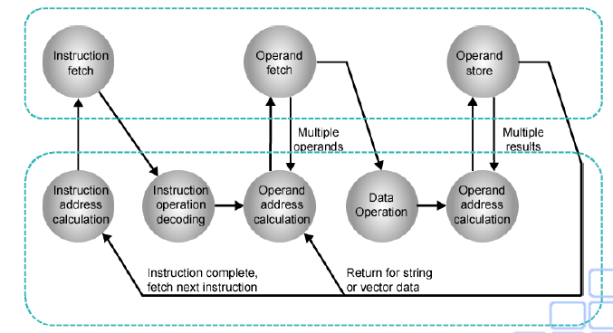
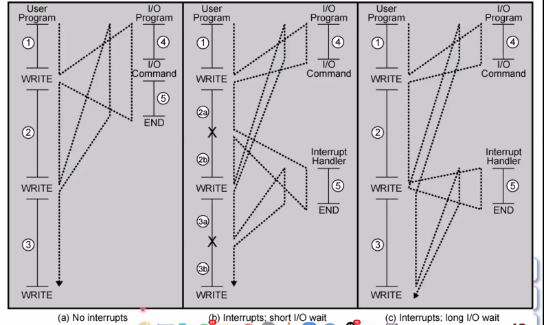
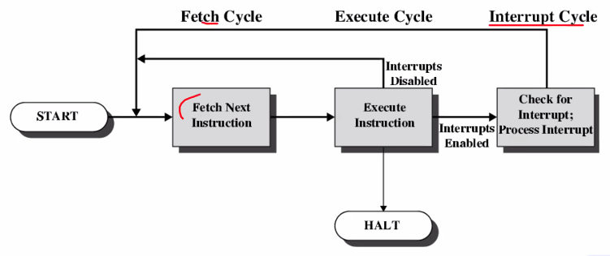
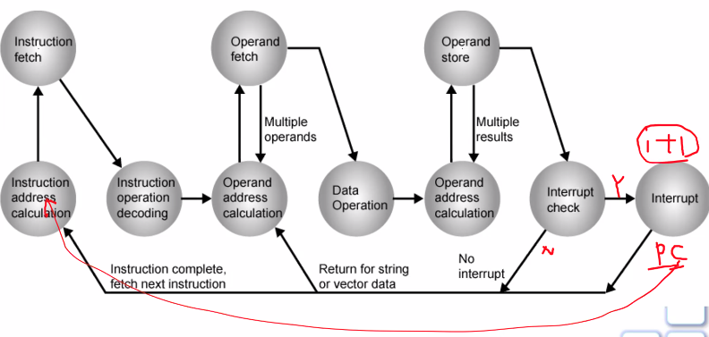

Week 2 of 2020 Spring. Performance Evaluation (cont'd) + Computer Function

**KeyWords**: Computer Composition

<!--more-->

[toc]

## Program Concept
- Hardwired systems are inflexible
- General purpose hardware can do different **(simple)** tasks **(sequentially)**, given correct control signals
  Instead of rewiring, supply a new set of control signals.

Program = A sequence of steps
step = arithmetic/logical operation
operation = a set of control signals identified by **a unique code**

A hardware segment accepts the code and **issues(produces) the control signals.**

## Components
Central Processing Unit (CPU)
- The Control Unit (将Control Signal转化为控制信号)
- The Arithmetic and Logic Unit
Input/Output: Data and instructions need to get into the system and results out
Main memory: Temporary storage of code and results is needed


> CPU通过Address/Data/Control三条总线向外连接
> AR 寻址
> BR 寄存
> 为什么需要分组?
> - recall: 我们对外部单元的寻址,是用唯一的ID标识的
> - MAR, I/OAR 共用一根总线,通常用 IO/negM 信号线标识
> - **但I/O模块不能存储"指令和数据", 这是因为Main Memory可以保证指令和数据后, 对同一个地址的值, 除非有其他指令, 否则不会改变. 但I/O Module不具有这样的特性**, 即便是硬盘, 也不具备"存储能力".(对硬盘而言, "存储数据"这是控制命令, "执行文件"对硬盘而言只是data, 这是由应用文件/操作系统决定的)
> - 地址总线, 确定IO还是M, CPU再控制指定单元, 完成数据的输出和写入.

### Instruction Cycle
分为Fetch 和Execute两步.
```
start --> fetch _next_ instr. --> execute instr. ---> halt (等待状态)
      ↑                           ↓
      -----------------------------
      fetch cycle      execute cycle
```

Fetch Next 取指操作:
- **next**的含义当前的指令在执行时, PC(program counter)就会指向下一条指令了.
- Processor从PC指向的指令(的第一个字节), 供interpretation
- Increment PC(自增)
  - 区分`+1`, 加上的是当前指令的长度, 即指到下一个指令的头一个字节
  - 实现了普林斯顿架构中的指令顺序执行
  - Unless told otherwise (如JMP)
- 被PC所指向的单元的内容取过来会存到IR(Instruction Register), 保存的**指令的值**, 从而生成信号驱动CPU其他部件(->Control Unit -> Control Signal)
- **一定是从PC取到的地址对应的值才能被认为是instruction进入IR寄存器**, 其他都不行, 在instruction意义上, IR与PC一定是一一对应的.

Execute 执行操作, 是以下操作的**组合**
- 三总线: 处理器和主存数据的传输
- 三总线: 处理器和IO的数据传输
- CPU内部: 数据处理(ALU/Logic)
- CPU内部: 指令顺序的改变, 如JUMP

> Example: 940 <- 940 + 941
> 
> 顺序执行
> 假设程序存在3xx, 需要处理9xx的数据
> 1/3/5 ~ Fetch
> 2/4/6 ~ Execute, 尽管执行的是301, 但当前PC已经是302了

More Insight: State Diagram
> 
> 上半部分的操作用到了三总线, 下半部分是CPU内部.
> - 第一步从instruction address calculation开始(即Update PC), 随后我们执行Instructon fetch, 进行insr decoding(in IR), decoding通过control unit生成
> - 从Operand address calculation开始算Execute部分, 看我们是不是需要到外部取得操作数, 如果需要, 那还要对操作数进行计算,(如果多次存取, 可能存在multiple operands), 进行Data Op后, 此时的Operand address calculation是为了结果地址的计算.
> - 完成一次Instruction Cycle后, 我们需要获得下一次操作的地址, 形成闭合操作
> - Return for string or vector data? 这是为了一串指令的操作. 允许不再fetch, 在Execute上做闭环操作(当然, 这样的Execution有限制的, **因为这里的instruction是一个**) "都是在执行同一个指令，不过指令的执行周期非常长", 是作为一条指令来执行的
>   - 案例: 内存中有一个字符串(单位8bit)"Hello World", 我们将l放在寄存器中, 返回偏移量offset=2. 这是一条指令, 但需要多次执行.


CPU与I/O通讯的方式
1. polling 查询: 看IO准备好了吗
2. interrupt 中断: IO完成了一个任务后, 主动告诉CPU, 完成了(INT), 可以使上升沿/下降沿/H/L, 需要软硬件配合
3. DMA: direct memory access直接内存存取, 设想USB摄像头不停产生图像数据, 我们需要将其送入内存中去, 这时CPU需要做的动作是I/O buffer, 传入MBR, 写入Memory. 该传输动作需要两条甚至更多. DMA可以做到, 不通过CPU做中间转换, 直接将I/O的视频数据放入M中, 此时CPU必须释放对总线的控制. 在这种情况下, 外部设备上将会生成一个DMA controller, 对传输情况加以控制.
三种传输方式, 速度依次递增.


### Interrupts
中断是一个机制, 严格而言不是数据传输的方式. 应该理解为某一事件发生的通知. 能够让我们的**IO**设备(其他设备也可以) 中断通常的程序(与IO无关的, 任何normal sequence of instructions)执行.

在FEFEFE的顺序执行中, 我们要打断这一过程, 去执行我们希望的操作. (把CPU的资源用在我们需要的地方, 提高处理的效率)

会用的Interrupt的Source
内部原因:
- In Program (like unpredictable error)
  - overflow
  - div by zero
- Timer
  - generated by internal processor timer used in **pre-emptive**(抢占式) multi-tasking
    - 抢占式pre-emptive: 如word在执行时, 暂停, ppt执行一会, 暂停,换回word (常用的multi-tasking机制in Linux, Windows...)
    - 协作式operative: word长时间不动(等待用户输入), 将控制权交给OS, OS分配. 问题是, 一旦某个程序不肯交出控制权, 就会产生宕机, 影响到整个系统的性能
  - 由CPU的定时装置产生的周期性的定时信号, 如间隔1微秒的脉冲, 产生time-slicing **实现多任务处理** (like a pause not stop)
外部原因:
- I/O controller
  - 控制打印机, 如缺纸
- Hardware failure
  - memory parity error 内存校验发生错误
    在内存单元中写入的内容和读出的内容不一致, 我可以得知内存发生了改变.
其他等等.

### Program Flow Control

假设我们的程序中, 有两次写入硬盘的操作, 4表示发出写入命令, 5表示等待硬盘完成写入工作后返回,(4和5之间是硬盘自身的读写操作) 虚线代表CPU执行的flow
- Case1: 如果没有中断(polling方式, 查询完了吗? 等等等)
  - 1->4 CALL子程序
  - 此处, 我们的程序必须要等待IO操作全部完成, 才能执行2,3
  - 所有竖线都是执行时间的叠加
  - 由于包含了等待IO的控制时间, 挂起时间非常长(想象一个行式打字机)
- Case2: interrupt机制
  - 1->4 call(sub-routine) 完成对外围设备命令的准备并发送数据后, 回到主程序继续运行, 在2a阶段, 硬盘读写和程序是并行的.
  - 2a->5 (硬盘)call中断处理程序(interrupt handler/ISR:interrupt service routine), CPU得知后告诉硬盘调用5程序, 完成清理
  - 同样的,3a和HD写入也是并行处理的
  - 我们发现, 原有4和5之间撑开的I/O command时间(往往较长)和CPU操作并行了.
- Case3: Long IO interrupt
  - 硬盘太旧, 执行时间过长, 以至于在下一次IO操作时还没有好. 把2运行时间给足都不够.
  - 当下一次写时, 上一次还没写完, 我们就等吧, 直到HD准备好, (硬盘)调用中断处理程序告诉CPU准备好了, 再执行5, 善后, 再立马接上下一次write, ...
  - 在case2中,等待的动作时间为0, 是一个无感的操作
在程序的设计上, 显然polling更简单, 右边除了编程外, 还要求为硬件中断设计中断请求号.. (软硬结合), 但效率高多了.

### Implement interrupt cycle

- add interrupt to instruction cycle
- processor checks for interrupt
  - 一般用一根信号线(physically), 标定一个信号
- If no interrupt: fetch the next instruction
- If interrupt pending:
  1. 暂停当前程序的执行
  2. 保存上下文(当前程序运行的所有的里里外外方方面面, 包括环境, **CPU寄存器状态(PC)**, **正在执行程序的运算结果状态PSW**(processor status word: CARRY进位, ZERO, 结果, 溢出O, 奇偶校验位等标志 ...), 是不是允许外部中断的状态)
  3. set PC to the start address of interrupt handler routine
  4. 运行handler对应的程序 _Different Handlers for different IOs_
  5. restore context, 继续原有程序.
- 软硬件如何配合?
  - 硬件: 1 2 3 (一气呵成,由CPU的中断机制完成) 5 (RET FROM RTI: 再一气呵成 restore)
  - 软件: 4 (编程得到)

在存在中断的情况下, 我们很难有效衡量程序的效率/时间. 需要在测量时尽可能避免.

> Refined Instruction Cycle
> 
> "Instruction First", 我们可以选择disable探测中断的功能.
> 但外部总是允许发送中断信号的

中断程序一般不能写的很长.
> 
> 我们要在interrupt中更新PC, 存储原有PC = i+1.
