Week 3 of 2020 Spring. Computer Function (cont'd)

**KeyWords**: Computer Composition

<!--more-->

[toc]

## Interrupts

### Multiple Interrupts
对同时发生多个中断事件, 我们希望紧急的事件优先处理 快速响应(如外部断电, 内部网卡/显卡过热, 硬插拔), (网卡/显卡数据包(seperate bytes)的时间先后不一, polling是不可行的, 必须用inteerupt)


Sequential | Nested |
---------|----------|
 |  |
 Disable Interrupts | Define Priority |


1. Disable Interrupts
   - Processor will **ignore further** interrupts whilst processing one interrupt, 在CPU中设立Interrupt Enable, 
   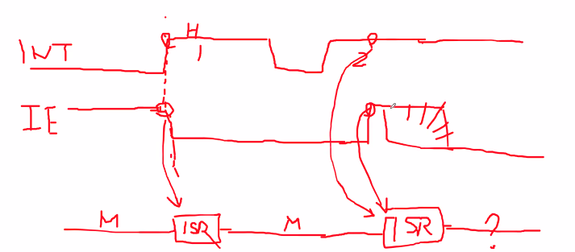
     - 一旦外部来了中断, IE关闭/ 或者IE也可能由其他信号控制.
     - CPU开始处理中断请求后(一旦进入ISR), 自动将IE拉低.
     - ISR结束/发出恢复指令/中断事件结束, 都可以设计成使IE拉高, 总之, 回到main的时候, IE一定是拉高
     - 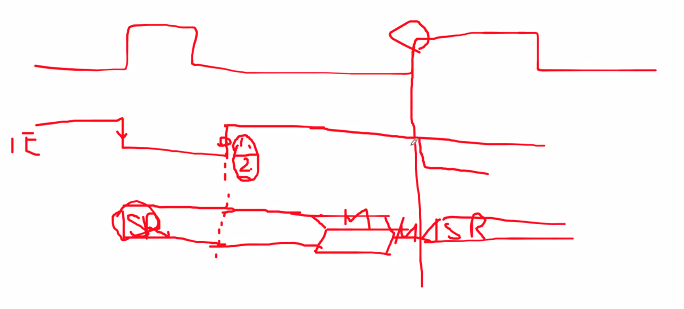
     -  中断请求+IE高电平-->处理中断.
   - Interrupts **remain pending**(继续请求,被记录,等待) and are checked after first interrupt has been processed
   - Interrupts handled in sequence as they occur
2. Define Priorities
   - Low priority interrupts can be interrupted by higher priority interrupts
   - When higher priority interrupt has been processed, processor returns to previous interrupt
   - 如果存在nested机制, 一定存在一个中断请求控制器(Interrput Controller), 对不同的信号线进行排序
   - 软件配合: CPU内的程序写作也要服从一定的规范, 即在进入ISR后, 要立刻把IE拉高, 否则嵌套是做不到的, 
   - 一般单条IE, 用堆栈存储PSW(IE作为寄存器状态是PSW的一部分),PC, 存储堆栈的大小由操作系统规约


> EXAMPLE: Multiple Interrupts
> 假设网卡的优先级最高, 硬盘次之, 打印机次之. 即网卡可以打断打印机.
> 
> t=25时, 虽然t=20已经有了disk中断, 但不能打断网卡的中断执行.


## Interconnection
All the units must be connected, Different type of connection for different type of unit (Memory/Input/Output/CPU)


Memory | CPU | I/O
---------|----------|---------
   | 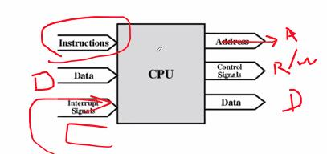 | 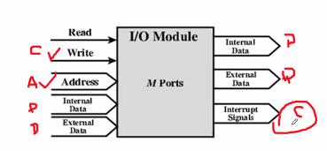

all-together
- cpu<->memory 传输的是控制命令,数据
- cpu<->IO 传输的是控制命令,地址
- 区分memory和IO, 是否有保存的义务(读写一致性)


### Memory Connection
- Receives and sends data
- Receives addresses (of locations)
- Receives control signals
  - Read
  - Write
  - Timing(时序)
- memory的每一个地址都与data bus双向连接,**芯片内部的data bus**贯穿所有单元
- 要激活一个单元, 我们必须要有decoder/selector, 从而按照输入address的编码(74LS138), 激活每一个单元. 如对1M内存, 需要20根线输入.
- 当单元被激活时, 才有权读写data bus的内容
- 无论是输入还是输出, 都针对激活单元有效, 激活单元来源于address bus, 经过decode.
- 一维数组的构造通常只适用于规模较小的静态RAM
- 二维数组可以避免数据线过多的问题
  ```
  Address Bus                    ----->  Decoder --> 2^10 row
  RAS/neg(CAS)(row address select)  -->          ---> 2^10 column
  10 bit address --------------------->
  ```
  从而也达到了1M的地址量. 然而, 寻址速度慢一些


### I/O module

Control - I/O Adaptor ---| 主板|存储设备 |--- 硬盘/光驱/SSD/..

Recall I/O定义:
- Output
  - Receive data from computer
  - Send data to peripheral
- Input
  - Receive data from peripheral
  - Send data to computer

功能特性
- Receive control signals fromcomputer
- Send control signals to peripherals
  - e.g. spin disk
- Receive **addresses** from computer (address bus上传递的都是地址信号)
  - e.g. **port number** to identify peripheral (换一种称呼, 表明这是专门用于peripheral的端口地址)
- Send interrupt signals (control)

### CPU
根据普林斯顿架构, **Instructions是接data bus**

- 从内存中读取指令和数据
- (处理后)向内存/IO写入数据
- 将控制信号发送给其他单元(不仅包括IO,Memory,**还包括bus**(即外部的interconnection))
  - 电脑是一个**同步的时序逻辑系统**, 必须要提供一个时钟源, 应当把时钟源的输入放在电路的CPU模块中
- receive (& act on) interrupts
  - 外部设备向CPU发送intr
  - cpu向外部设备发送ACK(握手信号/响应response), 从而向CPU发出准备好的数据

### Interconnection BUS
通常有多种互联系统同时存在, 但single and multiple buses是最常见的 
BUS: A communication pathway connecting two or more devices


- 通常是广播型的, 所有设备都可以收到, 不指定地址(不同于点对点,点对多)
- 里面的信号通常是成组的
  - 每一组信号往往都有相似的性质(如data bus, address bus)
  - 如 32 bit data bus is 32 separate single bit channels
- 电源线通常是忽略的, 并不是表示不需要

#### data bus
作用: 承载数据
- **REMEMBER THAT there is NO difference between data and instruction at this level**
- 即, data bus没有办法区分现在传送的是数据还是指令
- 我们希望数据总线越宽越好, 但也不能太宽, 否则复杂度太高, 内存性能也跟不上
- **WIDTH** is a key determinant of performance

#### Address Bus
作用: 在总线上传输数据的(来源或目标)的地址, 或者说, 正在被CPU寻找的单元的地址.
CPU也是用这种方法读取内存上的Location的.

**BUS WIDTH**总线宽度决定了**CPU所组成的系统最大的能够存取的内存的容量**, 如20个地址线, 有$2^20$个内存单元(**8 bit**)可以被CPU存取.

RECALL: 串在内存上的地址总线

> EXAMPLE: 用8bit数据总线遍历$2^20$个内存空间, 需要读写多少次?
> KEY: $2^20$次
> 用16bit数据总线, 遍历$2^20$个内存空间, 需要读写多少次?
> KEY: $2^19$次
> 用32bit数据总线, 遍历$2^20$个内存空间, 需要读写多少次?
> KEY: $2^18$次, 每次读写4个Byte

#### Control Bus
Control and timing information
- Memory read/write signal
- Interrupt request
- Clock signals
> EXAMPLE:
> 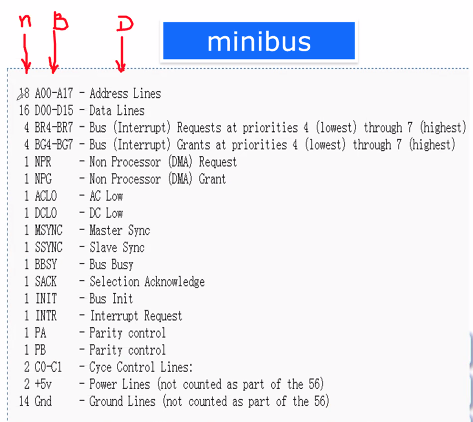
> 第一列表示线数, 第二列表示信号线的缩写, 第三列是信号线的说明
> CPU的寻址范围? $2^18$ 256kB
> 每次读多少数据? 2 Bytes
> BUS BUSY: 表示总线有没有在用

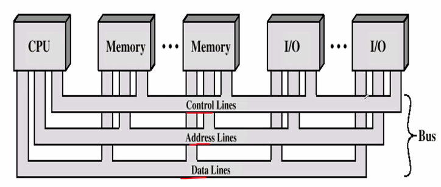

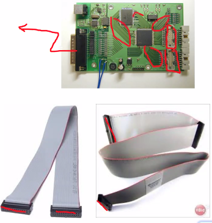
物理形态: ribbon line(编织线), 在主板上以平行线形态分布.


industry standard architecture 工业标准总线, 优点, 易拆卸, 缺点, 成本高

#### Single Bus Problems
我们对bus提出性能要求, 首先分析single bus

low performance
1. propagation delays: 总嫌太长, 传输慢, 限制了时钟周期不能太快
2. aggregate data transfer approaches bus capacity Devices have very different speeds 占用带宽
3. (具有不同传输需求的)低速设备放在总线上会拖慢总线速度.
   即, 同样传输的一个时钟, 低速在一个周期里能发送的bit和高速设备发送的bit

Most systems use multiple buses to overcome these problems
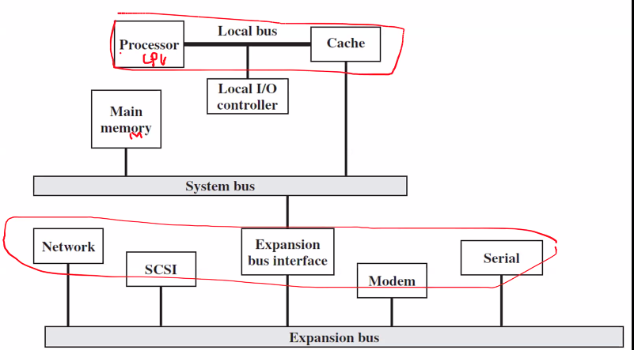
Expansion bus interface也被称为Bus Bridge, 是对不同速度bus的缓存和扩充.
一般在ISA架构下, 我们一般将显卡通过local IO controller 接到local bus上.

再进一步.
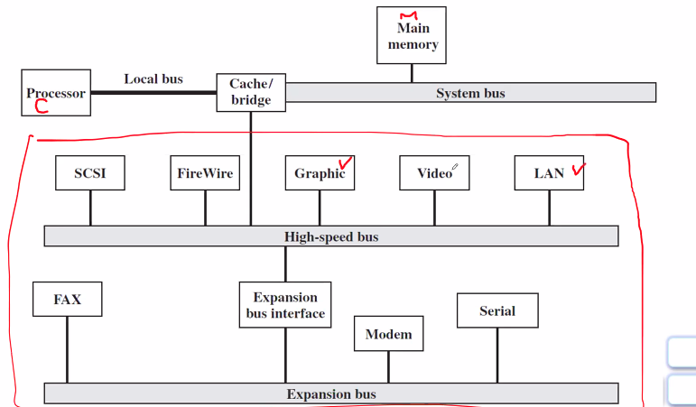
graphic一般对应显示器(数字信号), video一般对应光驱(模拟信号).
SCSI连接HD, FireWire连接HD/Display

一般在主板上, High-speed bus会被称为North Bridge, Expansion bus会被称为South Bridge. CPU板是processor+local bridge+cache.

#### Bus Design
总线分为: dedicated/multiplexed(针对数据和地址总线是否共享), 
- 专用总线表明能连接的设备是指定的, 用于高速传输. 
- 复用总线(shared lines/存在control信号)中, 地址线数据线共享同一根物理数据线, 区分专用总线.
  - 优势: 数据线少
  - 劣势: 复杂control, ultimate performance
- 设计:
  - local bus: DEDICATED 高速总线
  - system bus: DEDICATED 与memory连接
  - expansion bus: 一般MULTIPLEXED 低速设备

仲裁方式method of arbitration: centralized/distributed. 在一条总线上我们会放上多种设备, 对centralized, 任何一个设备在用时其他设备都不能用(recall busy signal) 那么当多条信号线同时提出请求, 应该如何判断?
- 原则: 任何时刻, 只有一个设备可以控制总线
- CPU and DMA Controller, 如摄像头与显卡中的(图像专用)RAM, 用DMA controller直接将图形信息映射到显卡中, 如HD与Memory之间可执行文件的传输.
  - DMA与CPU通过request, acknowledge两根信号线连接.
  - 当视频信息需要发到Memory和显卡时, DMA请求CPU暂时放弃对总线的控制
  - 获得CPU的ACK信号后, 此时三总线由DMA直接控制.
  - 此时CPU就可以继续(基于内部Cache)运行程序, 而不用操作数据的传输.
  - 如果将DMA关闭, 系统启动时间将大大加长
- centralized: 由统一的器件决定, 如CPU
- distributed: 协商决定

Timing时序/定时: 同步/异步
- The way in which events are coordinated on the bus
- 总线上事件发生的协调关系
- 假设所有设备都能够遵从同样一个时钟(一般CPU提供)
- 同步(多用于高速)
  - 总线上所有信号传输由时钟定义
  - 控制总线包括了时钟线
  - 一个0-1周期形成了总线周期(bus clock/bus cycle)
  - 通常以上升沿同步/标记为一个周期的开始
  - 通常一个周期一个事件
  > 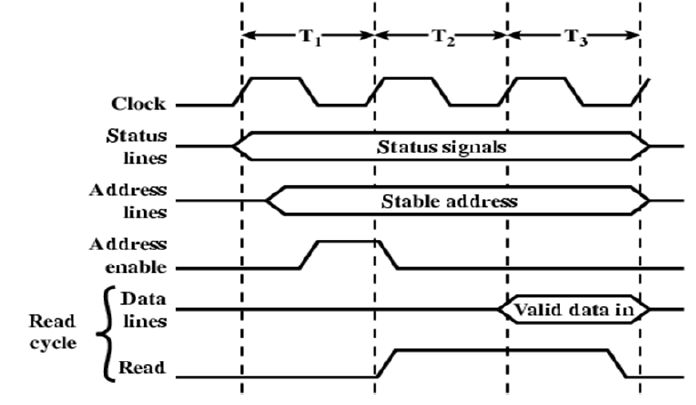
  > 一般至少三个周期可以完成一件工作
  > control = clock + status lines + read
  > address, data
  > 以CPU从内存单元中读取数据为例
  > 1. 告诉memory对哪个单元读取, 发出地址 T1~address event
  >    若address enable 在T2开始时被采样, 此后地址就会被锁存
  > 2. 告诉读还是写, T2~order event
  >    若read enable 在T3开始时被采样, 数据就进来了.
  > 3. 读写, T3~ data event
  > 三个event的连续发生完成了读写工作
  > data line 在T3, 由memory驱动, 写入CPU, 在此前, 它处于floating状态/high impendence高阻抗态, 不受任何驱动, 不清楚它的状态.
  > 每一个读写周期可以接替运作(T1~3:总线的busy状态), 如果停止周期, 总线就是空闲状态(available)
  > recall data/lines有时CPU驱动,有时memory驱动,有时其他驱动, 平时处于float状态, 驱动时由数据源驱动, 但有些设备的valid-data-in状态可能存在延后, 此时如果有新的T1驱动了data lines, 就会发生下面所说的击穿管子的危险. 因此有时我们会设置一个T4, 使设备放弃对datalines的控制.
  - in detail, 用BJT做一个反相器, 提供电流输出, 这是一个"驱动"作用. 总线上的设备通过这种机制驱动总线.
  - 当两个设备的驱动线同时接在一起.
    - 如果存在一个H,一个L, 一头截止,一头导通, 电流会太大, 出问题, 管子被击穿
    
  - 这也说明了, 总线上多个的驱动器, 在任意时刻, 只有一个处于工作状态. 真正在接的时候, 我们必须要有隔离器. 即控制端是L, 才允许接通. 如果是H, 从右端往左端看, 阻抗无穷大, 实现了总线的隔离
    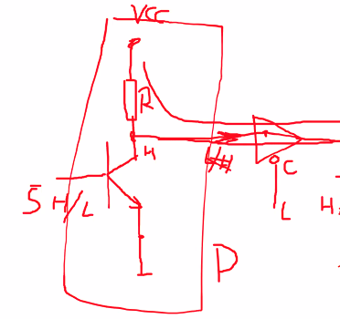
  - 实际中, 使用双向隔离器, H和L 决定哪个方向导通.
    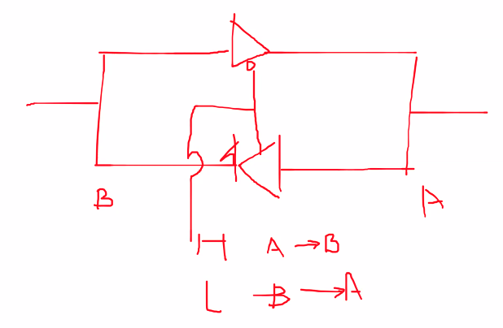

- 异步
  - 异步不存在时钟了, 它使用控制线控制.(握手信号)
  - CPU负责status line, address line的有效设置, 随后发出read下降沿
  - 此时外围设备发现这个沿, 发现address line处于自己的范围, 首先将有效点的信号驱动到data line上.
  - cknowledge信号由memory module驱动, 告知CPU完成数据的提供. 
  - CPU发现后, 锁存数据总线上的信息, 再拉高read线, 用上升沿告诉外围设备读完了. memory得知后, 释放data lines, acknowledge信号.
  - 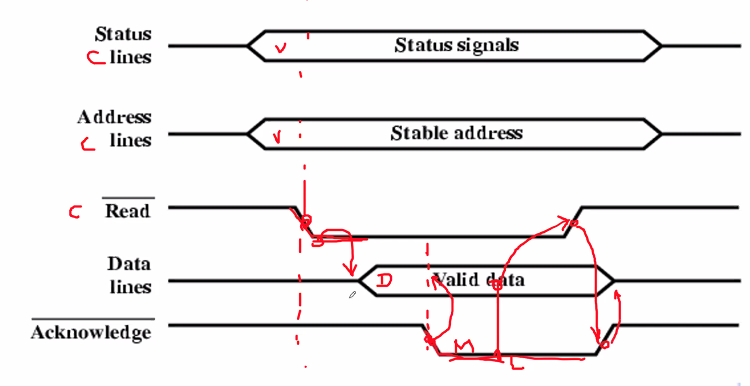
  - 对写的过程, CPU要将数据写到外部设备
  - CPU负责准备好status, address, data有效
  - CPU准备好后, write下降沿表示all ready
  - 外部设备检查address是否在自己范围内, 如果在, 则锁存
  - 写完后, acknowledge下降沿, 表示写完了
  - CPU上调write, 从而外部设备也将acknowledge关掉.
  - 异步没有明确规定各单元区间有多长, 效率主要取决于设备. 不同于同步的情况, where接入的设备必须要达到一定的效率标准.
  - 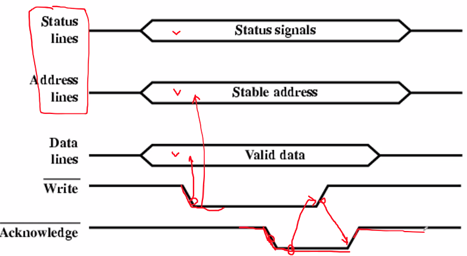

Bus Width: address width+data width

Data Transfer type:
- read: CPU读某一个地址...
- write: CPU...
- read-modify-write 读过来写进去(三个动作不可分割)
- read-after-write 写之后读回来(三个动作不可分割)
- block 总线不让别人去用

#### PCI BUS
Peripheral Component Interconnection (为扩展而生成的)
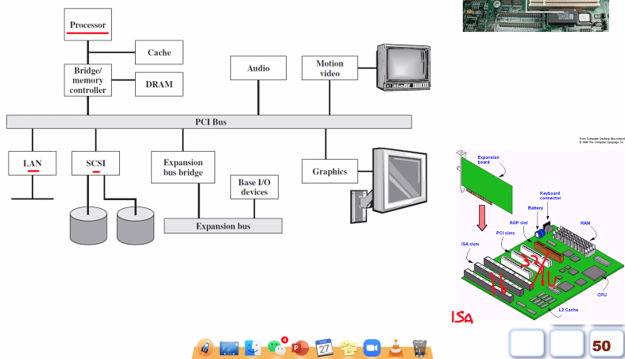
- 1990
- Intel released to
- public domain
- 64 bit(data bus宽度) @ 66Mhz(时钟周期)
- 50 lines
- Synchronous timing
- Centralized arbitration (由PCI controller判断给哪个部件用)
PCI中必有的bus lines
- Systems lines
  - Including clock and reset(用于初始化, 帮助程序可靠运行)
- Address & Data
  - 32 time multiplex lines for address/data
  - Interrupt & validate(标明哪些lines上有数据传输) lines
- Arbitration
  - Not shared
  - Direct connection to PCI bus arbiter
- Error lines
- Interface Control
- 下表中, type主要指针对PCI上的插卡而言是输入还是输出
  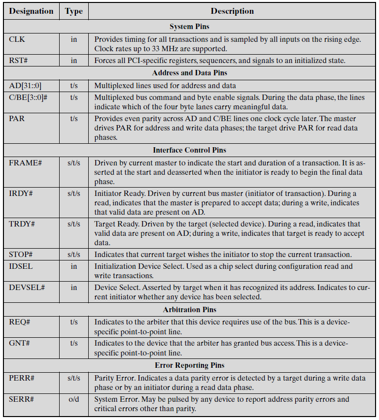
  - \# 表示低电平有效
  - C/BE# 表示分别对应8根线,哪个Byte上传输数据

PCI Optional Bus Lines
- Interrupt lines
  - Not shared(dedicated) for every 插卡
- Cache support
- 64-bit Bus Extension
  - Additional 32 lines
  - Time multiplexed
  - 2 lines to enable devices to agree to use 64-bit transfer
- JTAG/Boundary Scan 对所有连接设备进行检查,看是否工作良好
  - For testing procedures
    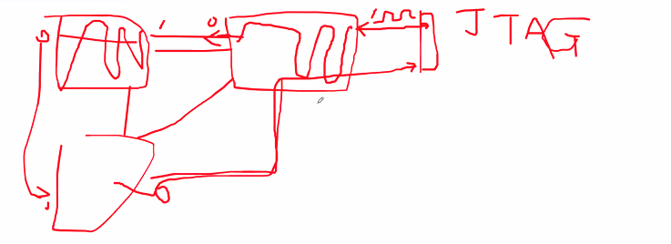
  - 将预定义的脉冲和收到的脉冲作比较, 看是否工作正常
  - 也可以将某一时刻, 芯片内部寄存器的状态读回来

PCI Commands
- 主设备和目标设备的关系
- 主设备能够要求使用总线, 也可以决定现在传输的是memory或IO 读还是写, 也被称为initiater
- 目标设备是被寻址的设备, 一旦主设备申请总线被允许, 借助PCI就可以开始通信
- IRDY# = initiate ready, TRDY# = target ready
- 如果一方ready另一方没有, AD中就会插入等待周期/维持数据

PCI对数据传输的优化:FRAME
- RECALL: 之前的同步机制中, 带T4的情况下, 真正传输时间是25%周期.
- FRAME的下降沿表明了一个周期的开始, 此时我们对ADDRESS COMMAND进行采样.
  
  实际中flip-flop的使用.
- 此处, T2给了准备时间, 可以给定一个地址, 连续读取之后的所有连续排列数据. 之后3~6一直在读.
  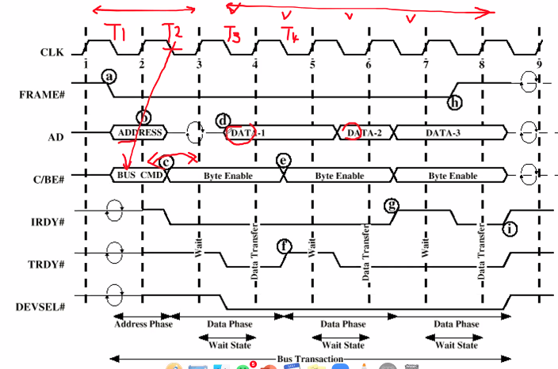
- 给一个地址, 读多个数据, 需要外围设备支持连续读.

PCI Arbiter
每个设备都有grant, request单独两条线.
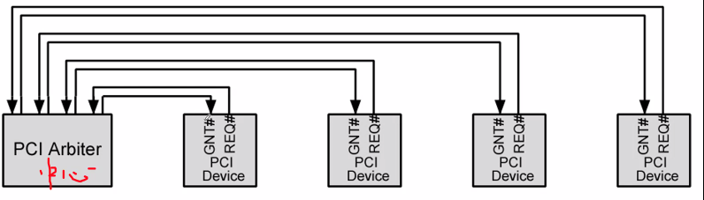