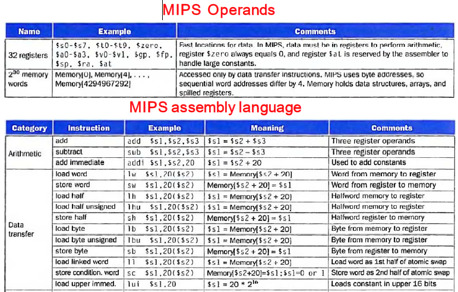
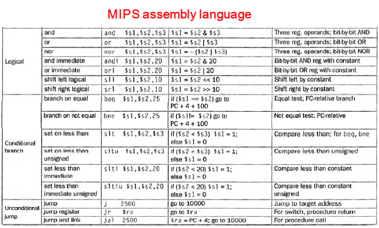
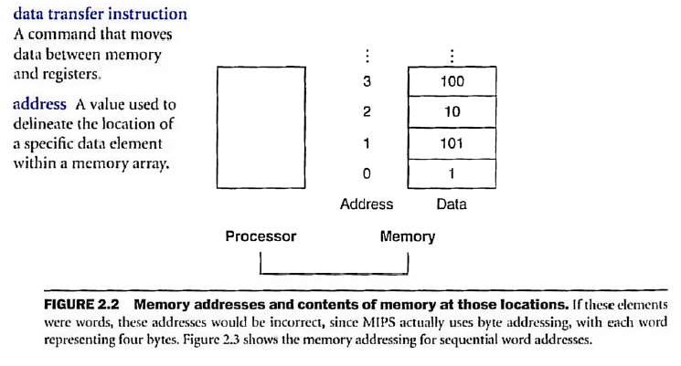
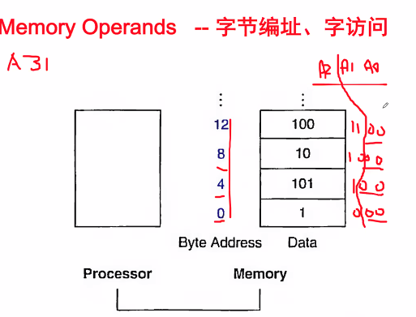
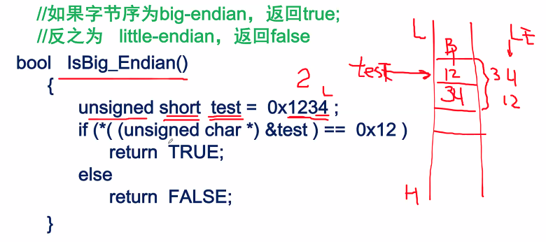
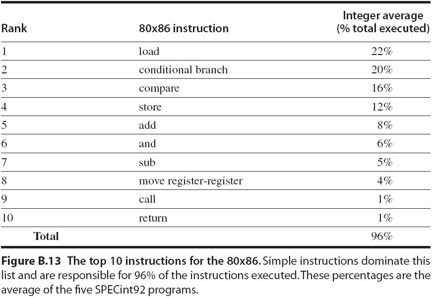
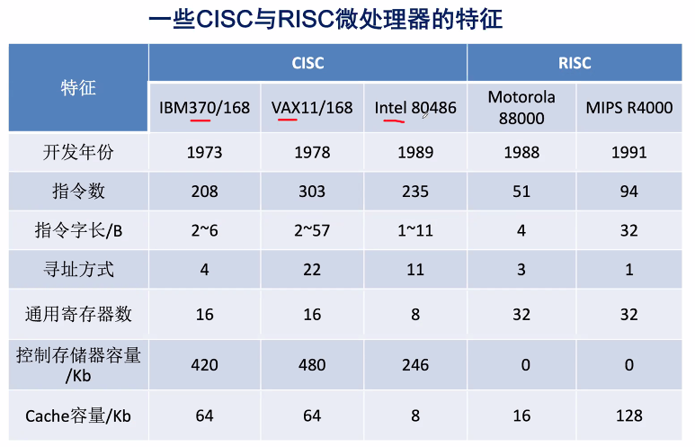

Week 4 of 2020 Spring

<!-- more -->


## Introduction

computer designers have a common goal：
- To find a language that makes it **easy to build** the **hardware** and the **compiler** while maximizing performance and minimizing cost and power.

Instruction / Instruction Set：指令/ 指令集
the words of a computer's language are called **instructions**, and its vocabulary is called an **instruction set**.

MIPS： Microprocessor without Interlocked Pipeline Stages
是一种采取精简指令集（RISC）的处理器架构，1981年出现，由MIPS科
技公司开发并授权，广泛被使用在许多电子产品、网络设备、个人娱乐装
置与商业装置上。最早的MIPS架构是32位，最新的版本已经变成64位。是最低功耗的CPU. 多用于嵌入式系统




MIPS与ARM的架构类似.

## Operations of the Computer Hardware
指令硬件操作

- 自然语言描述的操作: `a=b+c+d+e`
- MIPS 汇编语言描述 (类汇编语言(变量/寄存器/memory)):
  ```MIPS
  add a, b, c # The sum of b and c is placed in a.
  add a, a, d # The sum of b, c, and d is now in a.
  add a, a, e # The sum of b, c, d, and e is now in a.
  ```
- 汇编中会非常关注寄存器、内存的管理, 这里的变量和C是不可比较的.
- 做加法 `a b c` **一定是对寄存器做操作, 而不是内存.**
- 所有操作要么是寄存器内存之间的迁移, 要么是寄存器之间的运算.
> Design Principle 1: Simplicity favors regularity
> 设计原理1: 简单即规整

e.g. compile C into MIPS
```C
a = b + c;
d = a - e;
```
假设a~e在寄存器中, MIPS指令
```MIPS
add a,b,c
sub d,a,e
```
其中涉及了三个操作数, `b`是source(S), `c`是临时寄存器(T), `a`是destination(D). 

e.g.. compile complex C assignment into MIPS
```C
f = (g + h) - (i + j);
```
MIPS指令
```MIPS
add t0, g, h # temporary variable t0 contains （g + h）
add t1, i, j # temporary variable tl contains （i + j）
sub f, t0, t1 # f gets t0 - t1, which is （g + h）-（i + j）
```

## Operands of the Computer Hardware

### Register Operands
硬件操作数的来源
- 运算操作数可来自于多处(寄存器,内存,IO...)，但计算机硬件只选择有限的几种方式。（why？）
  - 否则违背了简单原则, 为此我们做以下规定
- 寄存器（register）：是位于CPU内，距离运算器最近、具有最快访问速度的存储器。
- 寄存器对程序员是可见的。

- MIPS的操作数设计为只能来自于寄存器。
- x86的操作数可直接来自于内存。
- MIPS架构有32个32bit寄存器。
- ARM架构有16个32bit寄存器。

似乎寄存器越多越好？？？(数量过大会降低register的访问速度)

> Design Principle 2: Smaller is faster.
> 设计原理2: 少即快
- A very large number of registers may increase the clock cycle time 时钟周期 simply because it takes electronic signals longer when they must travel farther. 信号传输快
- The designer must balance the craving of programs for more registers with the designer's desire to** keep the clock cycle fast**.
- “Energy is a major concern today, so another reason for using fewer registers is to conserve energy”.
- 受限于指令中对寄存器编址字段的位数。

更明确, 我们用register符号表示汇编指令
```MIPS
add $t0, $s1, $s2 # register $t0 contains （ g + h ）
add $t1, $s3, $s4 # register $t1 contains （ i + j ）
sub $s0, $t0, $t1 # f gets $t0 - $t1, which is （g + h）-（i + j）
```

### Memory Operands



recall: 我们约定
1. CPU寻址范围是$2^{\text{num of address line}}$. 2
2. 一个内存单元的空间就是1Byte
   - 和Data Bus的bit宽度无关(仅仅影响读写的快慢) (64bit比32bit快一倍,不代表寻址范围大一倍)

在memory操作中, 我们要提供一个register, 一个location

LOAD指令(LW)
C语言:
```C
g = h + A[8];
# R = R + M(->R)
```

编译后的MIPS指令
```MIPS
lw $t0, 8($s3) # Temporary reg $t0 gets A[8]
   # 以8 +（$s3）、即8加寄存器s3的内容为地址，
   # 访问存储器，取到的数放寄存器$t0。
add $s1, $s2, $t0 # g = h + A[8]
```

针对传输特性, 我们往往用4个Byte执行存取.(4个内存单元)
如, 在32位总线中,

此时,地址线特性是最后两位都是00.

在64位总线中, 最后三位都是000. 这会为硬件上的实现带来方便.

#### 大/小端

不同架构CPU会确定不同的存取方式
- LE(little endian) 四个Byte内存地址中的低有效位存在内存的L端
  低有效位, 低字节, 内存有效地址的低端
- BE(big endian) 高有效位先存在L端


如果将一个32位的整数0x_12_(H)3456_78_(L) (or hex文件)存放到一个整型变量（int ）中，这个整型变量采用大端或者小端模式在内存中的存储由下表所示。为简单起见，本文使用OP3表示一个32位数据的最高字节MSB（Most Significant Byte），使用OP0表示一个32位数据最低字节LSB（Least Significant Byte）。

地址偏移| 大端模式 | 小端模式
-------|---------|-------
0x00(L) | 12（OP0）| 78（OP3）
0x01 | 34（OP1）| 56（OP2）
0x02 | 56（OP2）| 34（OP1）
0x03(H) | 78（OP3）| 12（OP0）

用函数判断系统是大端还是小端:
```C
bool IsBig_Endian()
{
    unsigned short test = 0x1234 ; // short  2字节
    if (*( (unsigned char *) &test ) == 0x12 )
    return TRUE;
    else
    return FALSE;
}
```


x86、ARM是小端，MIPS、Power PC是大端


#### LOAD指令(LW)
从内存中取操作数:
C语言描述：
```C
g = h + A[8];
```

经编译后. MIPS指令：（按32bit字访问）
```MIPS
lw $t0, 32($s3)   # Temporary reg $t0 gets A[8]
                  # 按32bit字访问
                  # lw R M
add $s1, $s2, $t0 # g = h + A[8]
                  # add R R R
```

#### Store指令(SW)

Compiling Using Load and Store
C语言描述：
```C
A[12] = h + A[8];
```
经编译后MIPS指令： （ 按32bit字访问）
```MIPS
lw $t0, 32($s3)   # Temporary reg $t0 gets A[8]
                  # 按32bit字访问
add $t0, $s2, $t0 # g = h + A[8]
sw $t0, 48($s3)   # Stores h + A[8] back into A[12]
                  # $t0的值，存入48+$s3寄存器值所指的主存单元。
```

### Constant or Immediate Operands

对于有立即数参与运算的情况，可以采用：
```MIPS
lw $t0, AddrConstant ($s1) # $t0 = constant 3
add $s3, $s3, $t0 # $s3 = $s3 + $t0 ($t0 == 3)
```
**某些情况下**, 可以采用在指令中直接包含立即数的指令设计：
```MIPS
addi $s3, $s3, 3 # $s3 = $s3 + 3
                 # i is short hand for immediate
```

分析: 前者立即数长比后者长. 在RISC中, `lw $t0, AddrConstant ($s1)` 和 `addi $s3, $s3, 3` 同样是4个字节. 后者能存constant的field显然小于32位. 而`lw`中, 常量的值能存满32位.

> Design Principle 3: Make the common case fast
> 设计原理3: 加快经常性事件

e.g.:
- 常数经常被用到。 Constant operands occur frequently, and by including constants inside arithmetic instructions, operations are much faster and use less energy than if constants were loaded from memory.
- 0常量值是经常用到的, 所以**MIPS的0号寄存器**，通过硬件设置为恒0 。 The constant zero has another role, which is to simplify the instruction set by offering useful variations. For example, the move operation is just an add instruction where one operand is zero. Hence, MIPS dedicates a register $ zero to **be hardwired to** the value zero. (As you might expect, it is register number 0.) 硬件设置, 你做不到改变它的值.
  - 寄存器之间通过`add`或`addi`进行实现.

### Index Register
寄存器间接寻址.
- 形式：offset[base register/index register]
- 地址= **offset**(常数)+ [**base**/index register]寄存器的数据内容
- 在访问“结构”和“数组”数据结构时，寻址方便。
- 例：8[R2]，(R2)=20080800h,
  则表达的寻址地址为：8+20080800h = 20080808h
  实际计算中, 乘base的操作就是左移两位.


## From CISC to RISC
> 为什么MIPS的指令操作数不像x86那样，可以直接有内存操作数？
> 答: 三大原则

X86(CISC)中有这样一个指令`add AX, [B+INDEX+C]` 以Base*index+const取出值, 自加到AX上. 这与MIPS(RISC)的风格迥异.


### Intel IA-32指令系统的一些大事记
- 1978年：Intel 8086体系结构是之前已经成功的8位微处理器Intel8080的汇编语言**兼容**的扩展。8086是16位体系结构，所有内部的寄存器都是16位的，且大都专用。
- 1980年：Intel 8087**浮点协处理器**问世。该体系结构扩展了8086并多了 60条浮点指令。
- 1982年：80286对8086做了扩展，**将地址空间增加到24位**，并创建了一个详细的内存映射和保护模式，还增加了一些指令去丰富整个指令集以及控制保护模式。
- 1985年：80386扩展80286体系结构的**地址空间到32位**。它的体系结构除了具有**32位的寄存器和32位的地址空间**，也增加了一些新的寻址模式和附加的操作。增加的指令使得80386几乎就是通用寄存器型处理器。
- 1985~1995：后来1989年的80486，1992的Pentium处理器，以及1995的Pentium Pro都是致力于更高的性能，一共只有4条指令被增加到用户可见的指令集中：其中3个有助于多处理技术和1个条件传送指令。
- 1997：Intel用多媒体扩展MMX（Multi Media Extension）指令集来扩充Pentium和Pentium Pro架构。该新指令集包含57条指令，运用了浮点栈来加速多媒体程序和通信应用程序的运行。MMX通过单指令多数据SIMD（Single Instructions，Multiple Data）方式来一次处理多个短的数据元素。Pentium Ⅱ没有引入任何新指令。
- 1999：Intel 公司添加了70个指令，将SSE（Streaming SIMD Extension）作为Pentium Ⅲ的一部分。添加了8个独立的128位寄存器，并增加了一个单精度浮点数据类型。因此，4个32位的浮点操作可以并行进行。为改进内存性能，SSE还包括高速缓存的预取指令，以及可以绕过缓存直接写内存的流存储指令。
- 2001： Intel公司又增加了另外144条指令，命名为SSE2。新的数据类型是双精度运算，允许并行执行成对的64位浮点型操作。对应于MMX和SSE指令，可并行操作64位数据。它不仅允许更多的多媒体操作，并给编译器提供了更好的浮点寄存器优化支持。从而大大提升了Pentium4 的浮点型操作性能（Pentium 4是第一个包括SSE2的微处理器）。
- 2003：AMD公司改进了IA-32架构。把地址空间从32位增加到64位，扩展了多种寄存器数目，并增加了指令的长模式（long mode）等。多种增强模式使得AMD64成为一个比HP/Intel的IA-64更加优秀的从32位过渡到64位寻址的处理器。
- 2004：Intel认输，接受了AMD64，重新标记为EM64T（Extended Memory64 Technology），增加了一个128位的比较交换指令，并发布了新一代媒体扩展。SSE3添加了13条指令来支持一些复杂运算，包括在结构数组上进行的图形操作、视频编码、浮点转换以及线程同步。


IA-32的这段历史说明了什么？
- 兼容性是一副 **“金手铐”**：已有的软件基础太重要了，以至于在每一步发展的时候，体系结构都不能改变过大而使软件受到危害。
- 无论IA-32有多少不足，这个体系结构家族在桌面计算机上比任何一种其它体系结构都要多，并以每年上亿的速度增长。
- 然而，这个多变的家族带来的是一个难以解释并且不讨人喜欢的体系结构。
- 更多详细内容可参考教材《硬件软件接口》第3版2.16节等内容。

在实践中
- 对于x86系列来说，最常用到的指令是源于80386的32位指令子集，而不是整个的16位和32位指令集。
- 在IA-32中，有些复杂指令在应用中极少用到。并且有些复杂指令功能的执行，并不比执行一系列独立的简单指令快。
  - 如带有重复前缀的串传送指令（REP MOVS 在内存中不可打断地拷贝数据），这条指令通常比一个每次移动一个字的循环慢。
  - 在近期的Intel IA-32实现中，LOOP指令总是慢于由简单的独立指令组成的代码序列。这样，以提高速度为核心的优化编译器从生成LOOP指令。造成的结果便是不鼓励在后来的机器中加快LOOP指令的执行，因为它很少被用到。
  - 由于历史原因，在设计80286时添加的许多以字节为单位的十进制数运算指令，如今这些指令很少用到，因为使用32位二进制算术运算指令加上与十进制间的转换要快的多。（但从兼容性考虑，在新的处理器中也必须实现这些十进制指令，即使它们很少用到。）
- 当然，这些变化都是有其发展变化的原因的。

Top-10指令


长期实践表明
- 典型程序中，大约80%的语句仅仅使用处理机中20%的指令。
- 执行频度高的简单指令，因复杂指令的存在，在实现中，难以提高其执行速度。
  - 困难, 因为复杂指令的存在约束了最小周期的限制.
- 【问题】：能否用这20%的简单指令通过组合实现另外的80%的指令功能？

### RISC (Reduced Instruction Set Computer) 
主要特征
- 选用使用频度较高的一些**简单指令**来构成指令集，复杂指令的功能通过由简单指令的组合来实现；
- 指令**长度固定、指令格式种类少、寻址方式少**；
- 只有LOAD/STORE指令访存；
- CPU中有**多个**通用寄存器； 比RISC多
- 采用**流水技术**，_**一个时钟周期**完成成一条指令；_
- 采用**组合逻辑**实现控制器；
- 采用**优化的编译**程序。

值得注意的是，商品化的RISC机通常不会是纯RISC机，故上述这些特点不是所有RISC机全部具备的。

### CISC (Complex Instruction Set Computer)
主要特征
- 指令系统复杂庞大，各种指令使用频度相差大；
- 指令**长度不固定、指令格式种类多、寻址方式多**；
- **访存指令不受限制**；
- CPU中多为**专用寄存器**；(如x86中,Ax,Bx,Cx,Dx是通用寄存器,但乘法除法要求Ax相关,32位运算要求Bx相关,堆栈操作使用BP,SP)
- 大多数指令需要多个时钟周期才能执行完毕；
- 采用**微程序**控制器实现控制；(为向上兼容)
- **难以采用优化编译**程序生成高效的目标代码。

加快常用算法的速度

### RISC和CISC的比较
- RISC**更能充分利用VLSI芯片的面积**；
- RISC**更能提高计算机运算速度**
  指令数少，指令格式少，寻址方式少，**通用**寄存器多，采用组合逻辑控制，便于实现指令流水
- RIS**C便于设计**，可**降低成本**，提高**可靠性**
- RISC**有利于编译程序代码优化**
当然，两种技术是会互相借鉴的。





- 多年来，计算机体系结构和组成技术发展的趋势是增加CPU的复杂性，即使用更多的寻址方式及更加专用的寄存器等。RISC的出现象征着与这种趋势的根本决裂，就自然地引起了RISC和CISC的争端。
- 随着技术的不断发展，RISC与CISC还不能说是截然不同的两大体系，很难对它们做出明确的评价。最近几年，RISC与CISC的争端已减少了很多。原因在于这两种技术已**逐渐融合(如微控制器的结构)**。特别是芯片集成度和硬件速度的增大，RISC系统也越来越复杂。
- 与此同时，在努力挖掘最大性能的过程中，CISC的设计已集中到和RISC相关联的主题上，如增加通用寄存器数量以及更加强调指令流水线设计，所以更难去评价它们彼此的优越性了。

- 80x86是一个与RISC有很大区别且非常成功的系统结构，然而它的成功丝毫没有掩盖掉RISC指令系统的优点。
- 对PC软件二进制兼容的商业重要性，以及在摩尔定律的影响下晶体管容量的不断增加，**促使Intel在内部使用RISC指令系统，同时对外支持80x86指令系统**。
- 近年来的80x86微处理器，像Pentium 4，其硬件将80x86指令转换成类RISC指令，然后在芯片内执行这些转换后的RISC风格的指令。
- 这样，在程序员和编译器开发者看来，这是80x86的系统结构，而同时基于对性能的追求，计算机设计者可以实现RISC风格的处理器以获取高的性能。

部分典型的RISC机器
- 1975年IBM公司John Cocker提出精简指令系统的设想。1982年加州伯克利大学的研究人员专门研究如何有效利用VLSI的有效空间，并采用RISC思想通过设计更多的寄存器，使其研制的RISC Ⅰ（后来RISC Ⅱ）型微处理的功能超过了当时的VAX-11/780和M68000，其速度比VAX-11/780快了一倍。
- 同期，美国斯坦福大学RISC研究的课题是MIPS（Micro ProcessorWithout Interlocking Pipeline Stages），即消除流水线各段互锁的微处理器。他们把IBM公司对优化编译程序的研究与伯克利大学对VLSI有效空间利用的思想结合在一起，最终的研究成果转化为MIPS公司RX000的系列产品。
- IBM公司又继其IBM801机型、IBM RT/PC后，于1990年推出了著名的IBM RS/6000系列产品。
- 伯克利大学的研究成果最后发展成为SUN微系统公司的RISC芯片，称为SPARC（Scalable Processor ARChitecture）。
- Power PC是IBM、Apple、Motorola三家公司于1991年联合研制的RISC微处理器。