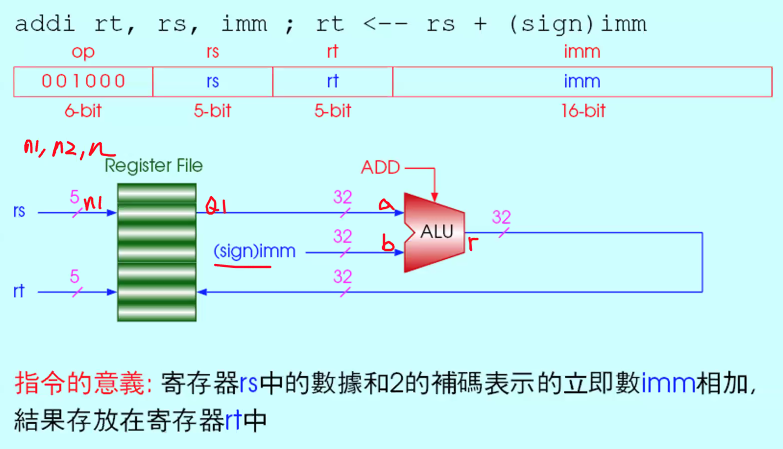
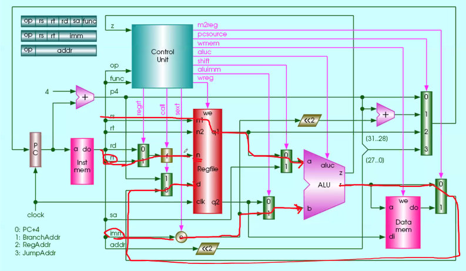
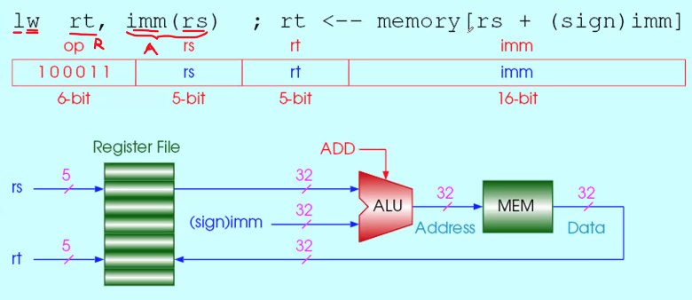
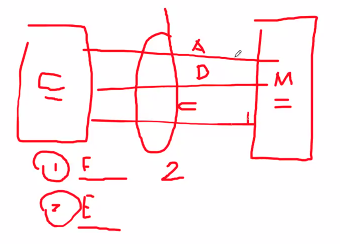

# Instructions (Part B)

<!-----
title: 【Computer Compostion】Instructions (Part B)
url: cc-instructionb
date: 2020-04-01 08:27:42
tags: 
- Computer Composition

categories: 
- Courses

----->

Week 5 of 2020 Spring

<!--more-->

[toc]

设计目标:
To find a language that makes it easy to build the hardware and the **compiler**(software) while maximizing performance and minimizing cost and power.

Instruction / Instruction Set：指令/ 指令集
the words of a computer's language are called instructions, and its vocabulary is called an instruction set.

## Signed and Unsigned Numbers

- 我们用最高位作为符号位
- 特点: 
  1. 一个数与它的补码相加, 结果为0
  2. 一个数取反加1, 得到补码
- 补码一定和位数相关. (无论是在比较大小, 执行计算时, 都要声明补码的位数)

## Representing Instructions in the Computer


Recall: ISA是硬件和软件之间的接口. (抽象层)


CPU通过在PC内放置固定的指令值, 存取外部存储器, 取出内容, 送到指令寄存器, 再将它的内容一路送到控制部件, 产生相应的控制时序, 同时将值送到寄存器堆(在控制部件的控制时序下)

> 例: `add $t0, $s1, $s2`
> 
> R型指令:  所有的操作都是register
> 后三个位域: 寄存器标志(32个)
> 一条汇编语句会唯一地编程一个指令码


### MIPS指令的分类
#### 按功能分类
- 算数
  - add, sub
  - addi
  - addu 无符号数
  - mul, mulu, div, divu
- 逻辑运算
  - and, or
  - andi, ori 立即值
  - sll(shift left logic), srl
- 数据传输
  - lw(load word)
  - sw(store word)
  - lb(load a byte)
  - lbu(load a byte unsigned):是否要做符号扩展
  - sb(store byte)
- 条件转移
  - beq(branch if equal)
  - bne(branch if not equal)
  - bnez, slt, slti, sltu, sltiu
- 无条件跳转
  - j (jump)
  - jr,jal (通过寄存器跳转)

#### 按寻址方式分类
(有且仅有)


特别关注， MIPS中， 如何将26bits转化到32bit的地址。

注意到格式上是非常接近的
> 设计原理4: 良好的设计即是合理的折衷
> Design Principle 4: Good design demands good compromises


- 对R, op=0, funct 改变
- 对I, op=操作名
- I型中，rs是source，rt是destination
- R型中，rs、rt都是source。


### 指令格式与机器语言

- 指令格式/ Instruction Format
  - The layout of the instruction is called the instruction format.
  - 指令一般由多个字段组成，总长度相对固定，可设计有一种或几种长度。MIPS所有指令都为32bit长。
- 机器指令/ Machine Language
  - To distinguish from assembly language, we call the numeric version of instructions machine language and a sequence of such instructions machine code.
  - 用二进制或十六进制编码表示的指令。
- 16进制数/ Hexadecimal
  - 以16为基的一种数据表示形式。


### MIPS中的常见指令

R类型示例
```
sll rd, rt, sa; rd <-- rt << sa   // 将rt左移（shift left logical）sa位到rd中去
srl rd, rt, sa; rd <-- rt >> sa   //（logical看作布尔值）
sra rd, st, sa; rd <-- rt >>* sa  // (arithmetic)
jr rs;          PC <-- rs  
// (将rs中的内容放入PC，jump by register，注意rs是寄存器，存32位的值，可以实现内存空间中任意地址的跳转)
```

I类型示例，存在一个imm的值
```
addi rt, rs, imm; rt <-- rs + (sign)imm
//由于没有加上u,说明不是unsigned, imm的值位数是16位(1符+15值) 实际做的是32, 我们要做扩展. 即如果符号位是1, 高位全部补成1(负数), else 补成0.
andi rt, rs, imm; rt <-- rs & (zero)imm
// 做布尔运算, 无需扩展, 高位全部看作0
ori rt, rs, imm;  rt <-- rs | (zero)imm 
xori rt, rs, imm; rt <-- rs ^ (zero)imm
lw rt, imm(rs) ;  rt <-- memory[rs+(sign)imm] 
// 寻找内存单元中的值, 赋给rt (load)
sw rt, imm(rs);   memory[rs+(sign)imm] <-- rt 
// 把rt中的内容更新到内存 (store)
beq rs, rt, imm;  if (rs == rt) PC <-- PC + 4 + (sign)imm << 2
// if 实际上是对rs rt做减法, 但不改变其中的值. PC+4下一条指令, imm的值*4, 数值相加完成目标地址的确定. branch if equal, 相等就做跳转
// 如果我们希望在这里实现死循环, 那imm的值应该是-1, 即imm是相对于next指令的前后相对位置
bne rs, rt, imm;  if (rs != rt) PC <-- PC + 4 + (sign)imm << 2
lui rt, imm;      rt <-- imm << 16 (load unsigned immediate)
```

J类型
```
j addr;       PC <-- (PC+4)[31..28], addr<<2
// 将PC+4后的高4位拿出, 再加26位的值, 地址左移两位(最后两位都是0) 跳转范围是有限的, 即跳转要求高四位不能改变
// 如果想跳转绝对的32位, 要引入寄存器.
jal addr;     $31 <-- PC+4; PC <-- (PC+4)[31..28], addr<<2
// 锁存下一条地址PC, 之后再跳转到目标地址. "FUNCTION CALL".
// 与中断不同, 中断还要保存现场(PSW), 一般用编号表示, 不会是address
```

### CPU和存储器


- R指令中, 有些shift amount没有用到, 我们要求他们是0(sa)
- 有时rs没有用到, 我们强制rs为0, 类似地,jr指令要求除rs都是0
- R指令的特征: rs rt为Source, rd为destination
- I指令, op code有较大变化


> 例: ADD
> 
> 在操作过程中, 各部件操作了几次?
> 寄存器堆是唯一一个指令中必须存取(access)两次的部件. source+destination
> IR 一次, 控制部件,译码一次, ALU PC一次
> 寄存器堆是我们需要特别设计的.

### 单周期CPU+指令存储器+数据存储器


- Register有两个输出端,q1 & q2, 支持同时输出两个寄存器的值, 这是由n1和n2指定的. 被写的寄存器由n指定, 从d输入
- 所谓的instMem实际上是外部存储(和data mem类似),道理上讲, 之后需要加一个IR寄存器, 图中inst mem右侧的一长排线可以认为是IR寄存器将inst分域后传给对应位置.
- 绿线: 数据通道, 红线: 控制线
  - m2reg: 如果是1, 就是1接通.
  - pcsource: pc的来源, 2bit的多路选择器
  - wrmem: write memory: "we"表示write enable
  - aluc: 控制alu(若干bit)
  - shift: 是否移位
  - ...

### R型指令

#### 指令格式

> 
> shamt: 位移数目
> funct: 挑选一个特殊的操作(如加,减,左移,与或非) 即ALU中实现的操作


图中, 4个Byte形成一个word, 因此PC移动时, 一般自加+4, 当然PC也会接受指令内容的反馈, 根据指令的长度/类型自加相应的长度(CISC架构) 换句话说, 单看memory是不能确定值时指令还是数据. 只有被PC运行时指向的内容, 取到CPU才会被放入IR(instruction register), 被解析为程序.

#### 编码举例
R型指令的统一
| ADD | SUB | ... |
| --- | --- | --- |
| |  |...|
| add rd,rs,rt;| sub rd,rs,rt; | ... |
| 寄存器:时序逻辑(flip-flop),ALU:组合逻辑| 不同之处仅在ALU的控制指令不同 | |

总结

- a:address, do: data-out, IR的位域用datapath表示
- control unit, 也是组合逻辑, 通过编码输出相应控制信号
- aluc的真值表由右上所示.
- 注意: wreg接到write enable, 那么**在周期结束的时候**, 可以将从d端输入的值写入到n端被指定的寄存器中去. (也是时序逻辑)
- PC的更新逻辑, 当前周期内, 值是稳定输出的, 遇到上升沿, 下一条指令永远用+4的方式预备好(p4), 在上升沿时更新.
- R型指令所用的模块体现在大图上, 
  


### I型指令

#### 指令格式


#### 编码举例

I型指令的统一
| ADDI | ANDI | ... |
| --- | --- | --- |
|  |  |...|
| addi rt,rs,imm;| andi rt,rs,imm;  | ... |
| b端的输入是经过符号扩展处理的立即数, | 此时不需要signext | ... |



- 注意: add_func = 100000, addi_op = 001000, 所以ALUC的ADD = x000. 所以在ALUC上是一致的.
- 控制命令最多4个bit，组合逻辑
- regrt(输出端寄存器)是由I/R指令类型决定的

#### 符号扩展


硬件实现，上图第三列正负写反了。
逻辑运算是位对位的运算 （`&`是算数运算，`&&`是逻辑运算）


#### 全0标志

如果ALU的计算结果（32位）全部都是0，那么z-flag=1

#### 涉及存储器（lw sw）


| LW | SW | 
| --- | --- |
|  | |
| `lw rt, imm(rs);` | `sw rt, imm(rs);`  | 
| `rt <-- memory[rs+(sign)imm]` | `memory[rs+(sign)imm] <-- rt` |
| 根据符号扩展，加法运算后的32位地址值，到external memory中（非寄存器internal）读取内容，从**d端口输入**，寄存到rt对应的n寄存器上| rt对应的数据从**q2端口输出**，写到MEM的di端口中 |
| 这里有两条重要的控制信号没有画出，即~WREM和WREG | WREM和~WREG |
| 时序逻辑：取地址，加法，取数，写入 | 由于我们还没有讲到流水线，要求在一个时钟周期内完成 |


分析时序：
延时出现在哪里？
数据通道1：寄存器->q2->di->外部存储
数据通道2：寄存器->q1->ALU-↓
数据通道3：imm->符号扩展->ALU ->a ->外部存储
数据通道4：ControlUnit.....
这些数据通道都要经过计算、分析


#### 为何分inst和mem两块内存

实际上是一块，但inst区域不允许写。

在老式普林斯顿架构上，三总线上会有两次CPU和Memory之间的通信（第一次：求指令值，第二次：将值读写到内存模块）


现在由于cache的存在，我们可以认为把inst指令和数据放到了**两个专用的**高速缓存中，相当于对两块分立的外部存储模块的读写。


> Compiler: 高级程序语言到汇编语言（存在优化指令）
> Assembler：汇编语言到二进制代码

#### Syntax Error

如R-format中，要求shamt位必须是0，如果生成的时候不慎改变了这一串的值，会变成什么样？

可以肯定的是，这条语句机器不认识，一定是无效语句。处理方法：
- 一种情况下，它会被当做NOP指令（no operation，NOP本身是有效指令）。
- 另一种情况下，机器中断，发生异常，由操作系统专门程序检查。
- 第三种情况可能是：UN-DOCUMENTED（后门的一种），该指令可能是有效的，只不过没有写成文档发布出来，即CPU认识，但大家不知道。


