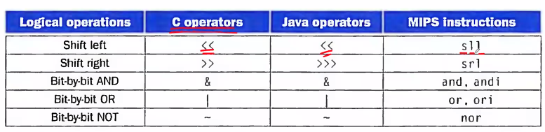
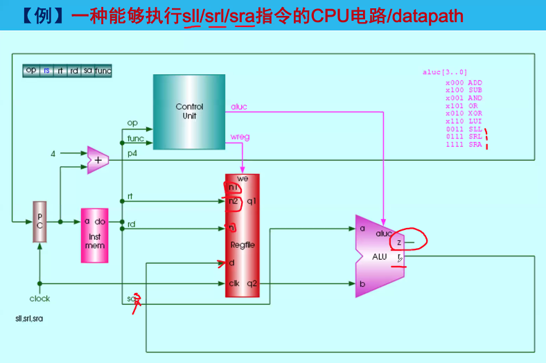
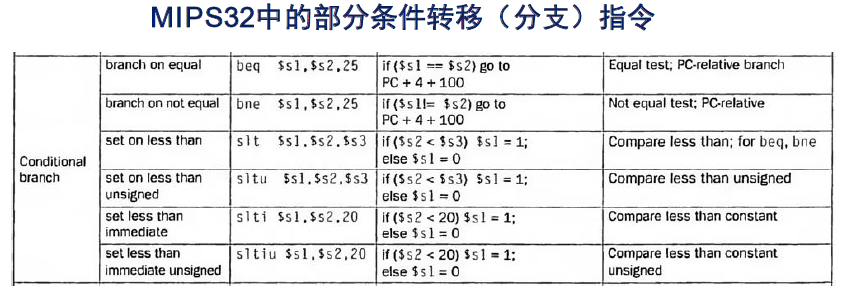
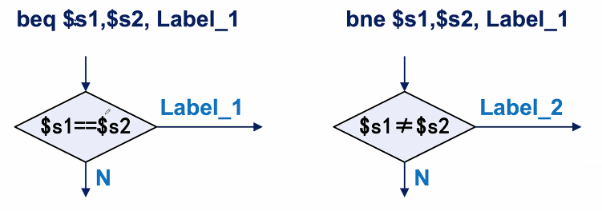
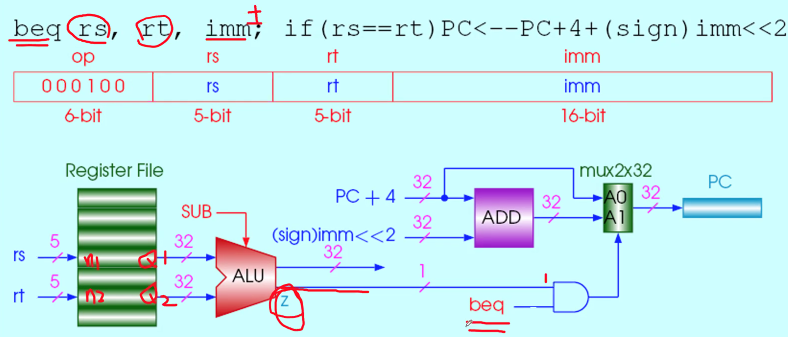
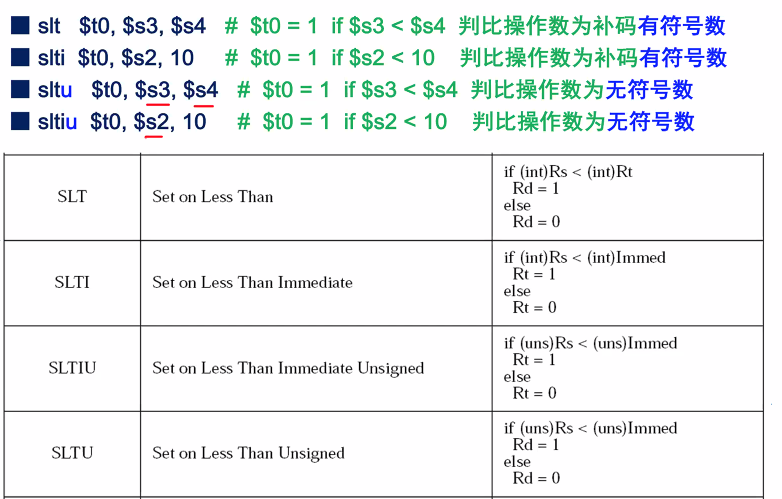

Week 7 of 2020 Spring

<!--more-->


## Logical Operations



bit-by-bit `and`/`or`/`not`,怎么用？
- `&`and，用于取出若干位，某些位置0
- `|`or，将某些为置1，用于开启某些位
- xor, 将某些位取反。

`sll`-shift left logical，不把被移动的值看作带符号的
- rt用于取,rd用于存,rs设置为0
- sa是无符号数
- 左移, 低位填0
- 右移, 高位填0

`sla`-shift left arithmetic, 算数左移, 看作有符号的数字
- 最高位符号位不动
- 左移, 地位填0
- 右移, 高位填符号数

`slav`-shift left arithmetic variable
- 移位数取寄存器rs中的4~0位.

`sllv`-shift left logical variable
- 移位数取寄存器rs中的4~0位.



此时, ALU**也会**判断z. 实际上, 对要不要判断0, 判断overflow, 判断符号, 有一张命令表. 只要执行相关指令, 标志位就会受到影响. 如果一定不会影响, 则标志位不会工作. (cf.MIPS32 4K™ Processor Core Family Software User’s Manual)

已知：
```MIPS
（$t1）= 0000 0000 0000 0000 0011 1100 0000 0000
（$t2）= 0000 0000 0000 0000 0000 1101 1100 0000
```

分别执行以下指令后，考察$t0中的值。
```MIPS
sll $t0, $t1, 4       # reg $t0 = reg $t1 << 4 bits
and $t0, $t1, $t2     # reg $t0 = reg $t1 & reg $t2
or $t0, $t1, $t2      # reg $t0 = reg $t1 | reg $t2
nor $t0, $t1, $t2     # reg $t0 = - (reg $t1 | reg $t2)
xor $t1, $t1, $t2     # reg $t1 = reg $t1 ^ reg $t2 , 没有问题
xor $t1, $t1, $t1     # reg $t1 = reg $t1 ^ reg $t1 , 没有问题
```

i.p. 可以实现目的操作数与运算操作数相同


## Instructions for Making Decisions

What distinguishes a computer from a simple calculator is its ability to
make decisions.



RISC中, 任意寄存器都可以作为比较结果保存. 与CISC不同.



- `beq` branch on equal
- `bne` branch on not equal

和前面的ALU处理不一样, 我们没有取出结果, 而是取出了Z位.


跳转范围$2^{16}$,实际PC范围$2^30$条指令. 范围过大时,一种办法是多次跳转,另一种办法是设置一个跳转表, 使用J类命令跳转.

### Example: Compiling if-then-else into Conditional Branches
```C
if ( i == j )
  f = g + h;
else
  f = g - h;
```

```MIPS
      bne $s3, $s4, Else    # go to Else if i≠ j
      add $s0, $s1, $s2     # f = g + h (skipped if i ≠ j)
      j   Exit              # go to Exit (无条件跳转指令)
Else: sub $s0, $s1, $s2     # f = g - h (skipped if i == j)
Exit:
```


注：“Else”和“Exit”为用于指示位置的行标号,对应为“模块内的相对地址”。

### Example: Compiling a While Loop in C

```C
while (save [ i ] == k)
i += 1; // i = i+1;
```
注：假定
- 变量i 放在`$s3`中，第i个item的地址为`$s6 + sizeof(k) * $s6`, 以字节为单位的偏移量
- 变量k 放在`$s5`中，
- 数组save[ ]的基址放在`$s6`中。指向数组的最低有效地址

```MIPS
Loop: sll  $t1, $s3, 2     # Temp reg $t1 = i * 4 假设size是32bit
      add  $t1, $t1, $s6   # $t1 = address of save[ i ]
      lw   $t0, 0($t1)     # Temp reg $t0 = save[ i ]
      bne  $t0, $s5, Exit  # go to Exit if save[ i ] ≠ k
      addi $s3, $s3, 1     # i = i + 1
      j Loop # go to Loop
Exit:
```


### basic block

指一段指令代码，它不包含分支（除非在代码段末尾），也没有**其它地方的跳转分支**(自己跳自己,fine)指向本段代码中的指令（除非指向本代码段的第一条指令）。

### 其它判比指令




### MIPS32所设计采用的条件判断和转移方法

- MIPS编译器利用slt、slti、sltu、slti进行条件判断的结果设置，利用beq、bne指令，以及它们的组合，实现所有条件转移。
  - 包括：相等转、不等转、小于转、**小于等于转**、大于转、**大于等于转**。
- 若直接采用“小于比较后跳转”，会导致该指令复杂、或执行时间偏长、或需额外时钟周期。
- 用2条执行较快的指令，组合实现较复杂的判比跳转，总体效率会更高。

Example: 关于数组下标是否越界的一种简便判法

如果越界, Jump to IndexOutOfBounds
```
sltu $t0, $s1,   $t2   # $t0=0 if $s1 >= length or $s1 < 0
beq  $t0, $zero, IndexOutOfBounds
```

### Case/Switch 语句的2种实现方法

- 方法1：利用多个if-then-else 语句实现。
- 方法2：编译生成“跳转地址表”，直接索引跳至目标代码块。