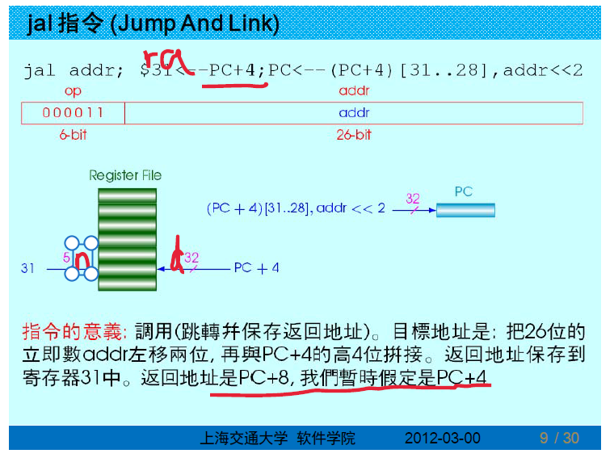
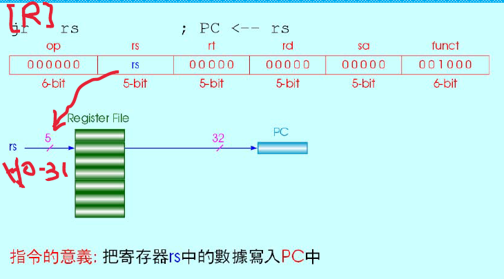
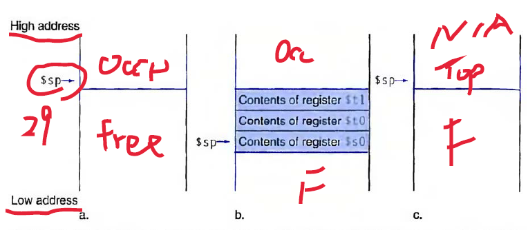
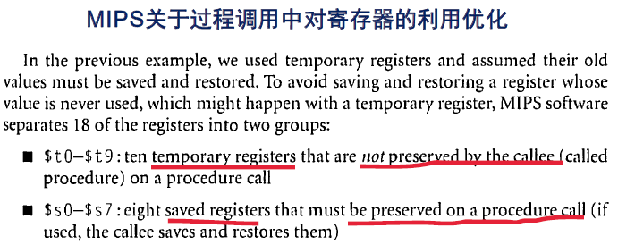
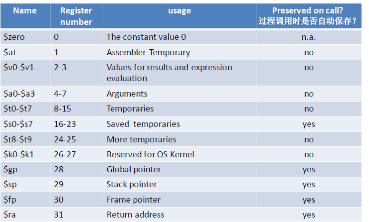

Week 8 of 2020 Spring.

<!--more-->

[[toc]]


过程、函数、子程序的实现步骤
1. 【_准备过程参数_】Put parameters in a place where the procedure can access them.
   传参：把过程参数放到过程能够访问到的地方。一部分放到REGISTER部分，另一部分放到MEMORY中（往往提供一个指针，指向大量参数的起始位置，将指针传到子程序中）。
2. 【jal(jump and link，表示还要返回)过程地址】Transfer control to the procedure.
   把CPU控制权交给过程。（Recall：高级程序语言后往往是`function(args)`）
3. Acquire the storage resources needed for the procedure.
   **建立过程需要的存储空间资源**。（不等于`malloc`，它本身就是一个子程序）包括工作寄存器、缓存寄存器等。我们这里指的空间资源是指堆栈空间。压栈
4. Perform the desired task.
   执行过程任务。
5. Put the result value in a place where the calling program can access it.
   **执行结果放到调用程序能够访问到的地方**。restore
   由于底层资源十分有限，步骤3和步骤5显得十分重要。
   执行结果（函数、过程返回值）放到调用程序能够访问到的地方（**_约定位置_**）。
   同时恢复调用主程序工作现场。退栈
6. 【`Jr $ra` = return】Return control to the point of origin, since a procedure can be called from several points in a program.
   返回到调用程序的调用位置，对CPU的控制权交回调用程序。
   重新回到调用者程序继续执行。


## MIPS对过程调用实现的设计支持

### 寄存器命名
MIPS软件系统在实现过程调用时，对32个寄存器的使用，遵循以下约定（非绝对规定）和别名：
- `$a0 - $a3`：采用这4个变量寄存器用于传递给过程的参数。
  four **a**rgument registers in which to pass parameters
- `$v0 - $v1`：采用这2个寄存器用于存储和传递过程的返回值。
  two **v**alue registers in which to return values
- `$ra`： 采用该寄存器保存过程执行完毕后的返回地址。
  one **r**eturn **a**ddress register to return to the point of origin
> 在MIPS，RISC, ARM中，返回地址并非自动压栈（不同于intel），放在寄存器中
> intel中，哪怕是一层调用子程序，我们都要压栈（速度慢）
> 在MIPS中，当子程序嵌套时，return address还要做人为的保存。一层调用，速度是最快的，子程序嵌套，写起来会比intel的汇编麻烦好多。

### 相关指令

- **jal 指令： jump-and-link instruction**
  功能： 保存返回地址****（即紧接的下一条指令的地址）；跳转。
  `GPR[31]=PC+8`为什么不是4，这是实现时的加速，现在可以当4处理(=call in C)
  `PC=PC[31:28]||offset<<2` 最高的4个bit是不能修改的，其余位是偏移量左移2位
- **jalr： jump and link register**
  `Rd = PC + 8; PC = Rs` 一方面，可以在32位空间中随意跳转，另一方面，返回地址的保存也是可以指定的。（而不是`GPR[31]`）
  当我们需要任意跳转时，把地址存入`Rs`，然后用`jalr`
- **jr 指令： jump register instruction**
  功能： 跳转到寄存器所指定的地址。
  `PC=Rs`
- **J 指令: unconditional jump** = goto in C
  `PC=PC[31:28]||offset<<2`，其余位是偏移量左移2位


### 硬件实现

| jal | jalr |
| --- | --- |
| |  |
| 特别关注，**高四位不动**，指定端口| 端口可变|

注意，jal的procedureddress = 高四位不动+**绝对地址** 将会带来程序的重定位问题。当然，这并不意味着jal失效，我们在拷贝程序到新地址时，只需要把所有指令中的绝对地址根据起始地址计算相应的偏移即可。
（OS的重要职责之一：把程序从硬盘拷贝到内存后，根据偏移量修改程序中的绝对地址，文件中需要有这样的label，一般放在一个数组中，包含了所有需要修改地址值参数的入口点。）
（label的提供者：linker，建立重定位表）

## Using more registers

- 过程（函数/子程序）可能需要用到更多的寄存器，即多于4个传递过程参数的寄存器，或多于2个用于传递返回参数的寄存器。
- 在32个寄存器中，除部分几个用作特殊用途外，其它的通用寄存器可以被过程使用。
- 由于过程在执行完毕返回后，除返回预期的正常结果外，不能影响原调用代码的工作环境（否则…），因此，需要有工作环境的保存和恢复机制。
- 利用栈结构组织的内存，是一种可行、并且资源丰富的暂存方法。
- 什么是栈（stack）？栈（stack）是一种先进后出的数据结构。数据就像弹夹中的子弹。
- 栈有两种操作：压栈（Push）和出栈（Pop）。
  - Push：将数据放入栈顶；栈（顶）指针上（往小端地址）移。
  - Pop：将数据从栈顶移出；栈（顶）指针下（往大端地址）移。

29号寄存器指向内存中的地址值。每次push，我们都会往地址值小的地方跑（`$29 = $29 - 4`）。从大往小走。当前的PC永远指向栈顶



一般，**先移动指针，再写入数据。**（目的：用之前先把栈空间保存起来，以免中断发生，存的数据被其他进程更改）

## Example - Compiling a C Procedure That Doesn't Call Another Procedure

```C
int leaf_example (int g, int h, int i, int j)
{
  int f ;
  f = ( g + h ) - ( i + j );
  return f;
}
```

假定g、h、i、j 这4个变量已放入`$a0、$a1、$a2、$a3` 这4个自变量寄存器，运算结果f 放入`$s0`。

What is the compiled MIPS assembly code?

编译步骤
1. 将过程中用到的寄存器压栈，即先暂存，以备后续恢复工作场景（在内存中开辟空间）
   ```MIPS
   addi $sp, $sp, -12 # adjust stack to make room for 3 items # TOP -=3
   sw   $t1, 8($sp)   # save register $t1 for use afterwards  # TOP+2
   sw   $t0, 4($sp)   # save register $t0 for use afterwards  # TOP+1
   sw   $s0, 0($sp)   # save register $s0 for use afterwards  # TOP-0
   ```
2. 执行过程计算操作
   ```MIPS
   add $tO, $aO, $a1 # register $tO contains g + h
   add $t1, $a2, $a3 # register $t1 contains i + j
   sub $sO, $tO, $t1 # f = $t0 - $t1, which is (g + h)-(i + j)
   ```
3. 将返回值放入`$v0`
   ```MIPS
   add $v0, $s0, $zero # returns f ( $v0 = $s0 + 0)
   ```
4. 退出过程/函数/子程序前，从栈中恢复原工作场景。
    ```MIPS
    lw $s0, 0($sp) # restore register $s0 for caller
    lw $t0, 4($sp) # restore register $t0 for caller
    lw $t1, 8($sp) # restore register $t1 for caller
    addi $sp, $sp,12 # adjust stack to delete 3 items
    ```
5. 最后执行跳转返回到原调用位置
    ```MIPS
    jr $ra # jump back to calling routine
    ```
6. 将返回值放入$v0
    ```MIPS
    add $v0, $s0, $zero # returns f ( $v0 = $s0 + 0)
    ```

我们发现，push和pop的操作异常频繁，我们希望进一步优化。提出以下规定：



即：主程序要用到t0 ~ t9，需要自己在调用前保存起来。
如果子程序用到了s0 ~ s7，那么需要在返回前复原回去。


## 递归调用

```C
int fact ( int n)
{
    if (n < 1)
        return (1);
    else
        return (n * fact(n - 1));
  }
```
假定变量n已放入`$a0`，运算结果放入`$s0`。可重入程序，大量运算结果保存。

编译步骤：
fact： # 过程代码首地址
1. 将过程中要用到的寄存器压栈，即先暂存，以备后续恢复工作场景。
    ```
    addi $sp, $sp, -8   # adjust stack for 2 items
    sw   $ra, 4($sp)    # save the return address
    sw   $a0, 0($sp)    # save the argument n
    ```
2. 确定递归退出条件
    ```
    slti $tO, $aO,1      # test for n < 1
    beq  $tO, $zero, L1  # if n >= 1, go to L1
    ```
3. 满足递归退出条件，将返回值放入$v0
    ```
    addi $v0, $zero, 1  # return 1
    addi $sp, $sp, 8    # pop 2 items off stack （注意：free动作）
    jr   $ra            # return to caller
    ```
4. 递归问题小规模化的递推：
    ```
    L1: addi $a0, $a0, -1 # n >= 1: argument gets (n - 1)
        jal fact          # call fact with (n - 1) ，递归调用
    ```
5. 递归最后一级返回后，执行恢复原工作环境：
    ```
    lw $a0, 0($sp)    # return from jal: restore argument n
    lw $ra, 4($sp)    # restore Lhe return address
    addi $sp, $sp, 8  # adjust stack pointer to pop 2 items
    ```
6. 将返回值放入$v0：
    ```
    mul $v0, $a0, $v0 # return n * fact (n - 1)
    ```
7. 转移返回至原调用处：
    ```
    jr $ra # return to the caller
    ```

在intel中就不会这么复杂。

## 总结 MIPS的寄存器


最后一列：必须被保护，见上文对s寄存器的保护。