Week 8 of 2020 Spring.

<!--more-->

## Introduction

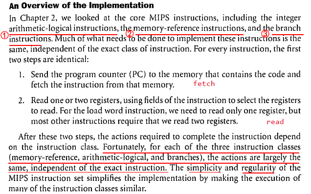

Recall: 我们此前的大部分指令，前半部分（解析命令，取数）基本相同，后半部分则大不相同（算，读，写）

Higher-Order Abstraction

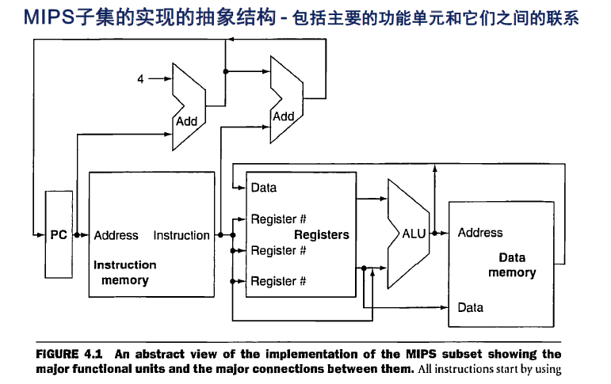

不同的指令实际上是在激活不同的模块，选择不同的数据流进行实现。那么，如果我们能够设计一个方案，在合适的时候设置合适的控制信号，就能够让数据流通道跑起来，那我们就实现了指令的功能。因此，下面我们的重点就放在了Controller上。

此外，对时序逻辑电路，我们还要确保状态的锁存，否则会出现振荡电路。

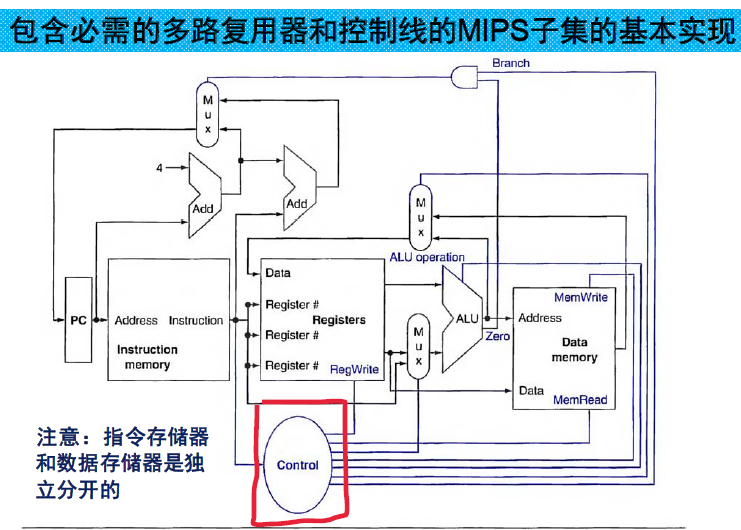

## Logic Design Conventions

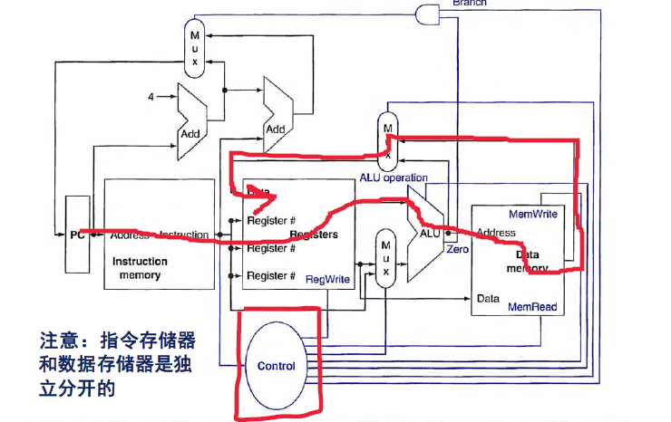

### Clocking Methodology
时钟同步方法

- 时钟的周期大于组合逻辑的响应时间。
- 在Flip-Flop中，从接收到CLK上升沿到读取数据，有一段SETUP值，这一段要求稳定，取样。
- 注意：DE2实验板中的FPGA支持同步MEM（RAM与时钟同步，实际中往往是不同步的）

沿触发方式允许状态单元的写和读发生在同一个时钟周期里，而且不会产生不确定状态（只有PC和REG是时序逻辑）
- 可以将state element理解为维持阻塞型的D触发器、或主从结构的J-K触发器等，
- 理解电路结构决定了其不会发生因反馈导致的“空翻” 。

### FPGA Architecture

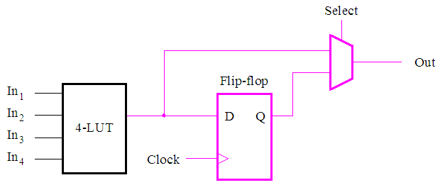

- LUT： look-up table
- SELECT：组合逻辑走上通道，时序逻辑走下通道
- Q决定输入和时钟的逻辑组合关系
- 我们在使用FPGA时，其实就是写一些逻辑表达式，对FPGA的模块做配置。
- 硬件实现的翻译是保证正确性的。

## Building a Datapath

### PC + Instruction

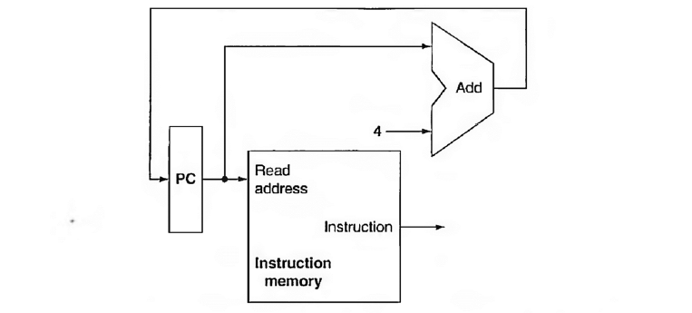

读的功能是始终开放的，因为Instruction就是由Read address控制的。

### Register

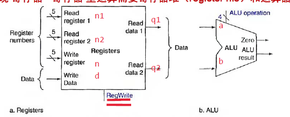
- 读的动作发生在begin of current cycle
- 计算时间存在delay，被周期吃掉了。
- 写的动作发生在end of current cycle

具有双读端口的实现原理 | 写入逻辑
--- | ---
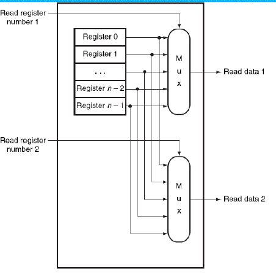 | 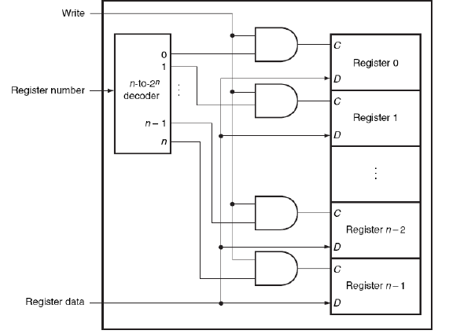
两个端口结构是一样的 | 只有在被选定的线（1） + write control （1） 才可以写入

但C不过是一个使能信号，寄存器内部还会接着一个CLK，CLK才是真正决定写入的信号。

### ALU

功能：（内部原理略）

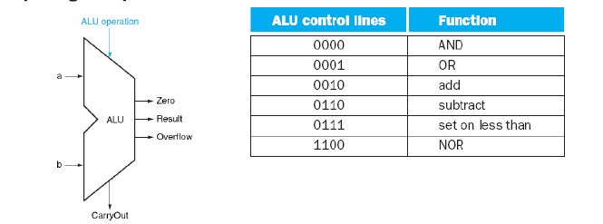

Verilog实现，见书P452

有关延时

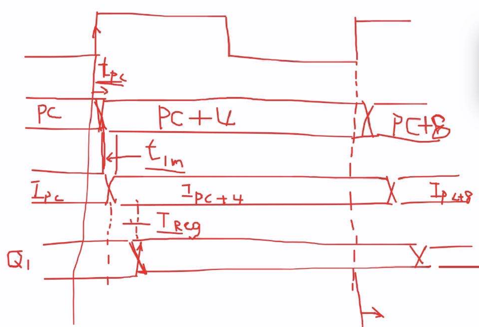
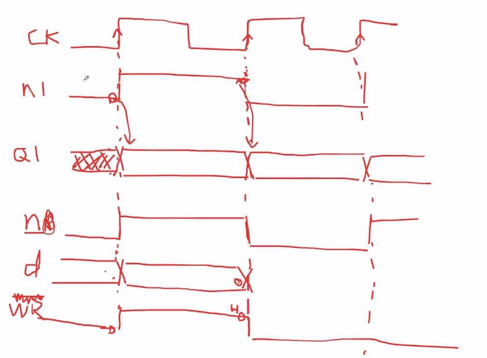
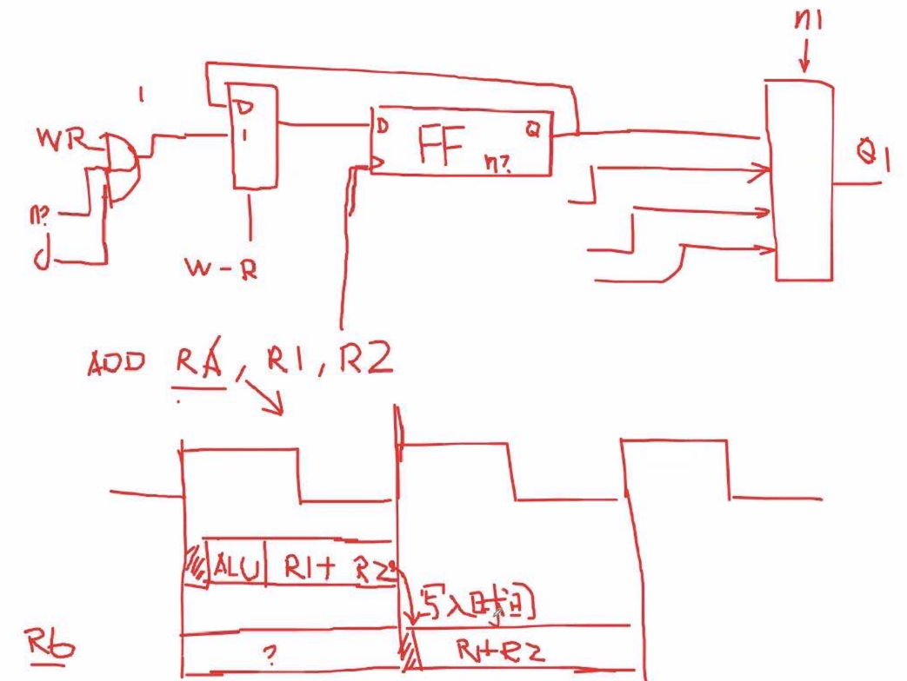
## 单周期指令执行方式

通用的原理方法：
1. 将指令集中所有指令在执行时所需要的数据通路分别明确；
2. 确定每种指令在执行时的（含各种情况下，大部分指令只有一种情况）所有控制信号；
3. 针对**所有指令**及其各种情况，建立针对所有控制信号的**真值表**；
4. 根据以上信息，可以把以操作码作为输入，以控制单元包括所有的输出为输出的逻辑，综合描述为一张大的真值表；
5. 上述真值表所表达的逻辑经化简实现后，即为所需要的控制器。

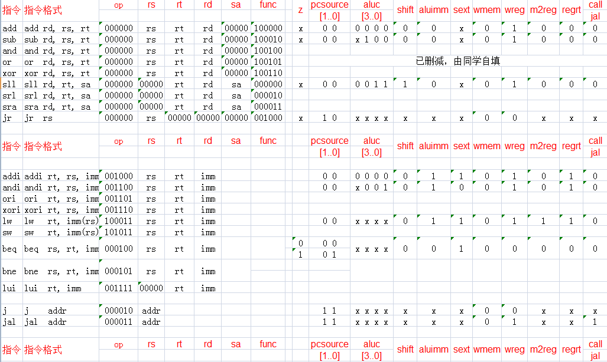