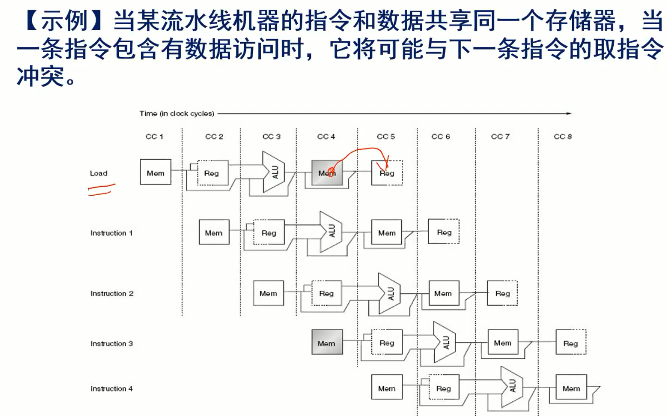

Week 9 of 2020 Spring

<!--more-->

## 流水线

设计目标：
- 减小不同模块间的距离，提高速度，减小时钟周期
- 【流水线】：是利用执行指令所需的操作之间的并行性，实现多条指令的执行过程相互重叠执行的技术。目前，它已成为了高速CPU中所采用的关键技术。

Pipeline

- Pipelining doesn’t help **latency** of single task,不降低工序时间 it helps **throughput** of entire workload 提高了整个生产线的输出量/吞吐量
- 不同指令完成不同指令的不同部分
- Pipeline rate limited by **slowest** pipeline stage （流水节拍/流水段，相连形成流水线）
- Multiple tasks operating simultaneously
- Potential speedup = Number pipe stages
- **Unbalanced** lengths of pipe stages **reduces** speedup
- Time to “fill” pipeline and time to “drain” it reduces speedup
- 指令沿流水线移动一次的时间间隔就是**一个机器周期（processor cycle）（an advanced version）**，其由最慢的流水级决定。在计算机中，这个机器周期通常是一个时钟周期（clock cycle），有时是2个，很少是多个。

设计目标：
（尽可能逼近，实际达不到）平衡各个流水段的长度。

> 衡量指令执行速度的一个评价指标CPI
> CPI：Cycles Per Instruction，每条指令的平均时钟周期数。
> 流水线可以减少指令的平均执行时间，可以认为是减少了每条指令的平均时钟周期数（CPI），也可以认为是减少了时钟周期的长度，还可以认为在这两方面都减少了。
> 流水线是一种在连续指令流中开发指令级并行性的技术。它对编程者是透明的。(硬件上（CPU内部）实现的，程序员是不知道的，编程者对pipeline无能为力，只能知道，哪两条指令放在一起，可以让流水线流畅运行)

## MIPS的指令流水线

一条典型的MIPS指令的执行过程包含以下5个处理步骤：
1. 从内存中读取指令；Instruction Fetch
2. 指令译码的同时读取寄存器；（MIPS的设计允许指令译码和读取寄存器同时进行）Instruction Decode
3. 执行操作或计算地址；execute
4. 在数据存储器中读取操作数；memory
5. 将结果写回寄存器。write back

这要让任何一条指令都能fit-in

实际上，register write接受下一个时钟周期的上升沿。total-time是不严谨的，实际上我们只需研究这张表中最小部分作为pipeline的周期。真正做的时候是1~4段，但我们在考虑流水时，5需要被当做一步。
当我们使用flip-flop上升沿触发，那么这一步可以不算进单周期内，如果我们使用latch，那么写入时间利用的是当前周期末尾的低电平，就要计入单周期内。实际中不作特别说明，我们都是用flip-flop完成（边沿触发写入的好处）

> 这一点引出，FLIP-FLOP设计中，要求所有的寄存器同时翻转，我们会在设计中加入延时补偿，保证各部件能同时接收到上升沿的同步。这是由芯片的工艺决定的。（时间网络）

## 数据通路

横坐标：连续的clock
纵坐标：从上到下内存中顺序执行的语句。
block：实现，i.p.REG实线表示使用，虚线表示部分时段使用

我们发现了一个问题：只有（上半周期）完成写入后，下半周期才可以读。

因此，在紧接着要用刚刚写入的寄存器的两条指令中，我们可能读出错误的结果。
如果存在两条指令之间寄存器值的依赖，流水线将被迫发生“中断”。

## 基本原理

实现指令流水的两个最基本问题
1. 分段— 为了重叠起来并行执行（划分工位）
2. 流动— 能够向前同步推进执行/流水（段间接口）

制定**切割**原则和方法

问题例：两个ADD为什么放在那里？第二个ADD为什么要去MEM绕一圈？
1. 在下一条指令要开始的时候，就要把PC+4准备好，所以第一个add在IF阶段。
2. 我们还要等zero的结果，在MEM阶段才出得来
折线的设计与前一阶段结果什么时候出来影响至关重要。

### 怎么分段

一组寄存器（FlipFlop），当你来了一个时钟脉冲后，可以在当前周期的结束，可以把一个阶段所有信号的输出进行锁存，实现隔离。假设锁存这里的延时很短，忽略不计，因此很快右侧就可以可见。一旦可见，就可以作为下一级流水线的输入。

注意到ID/EX寄存器，我们只需要在下一个时钟周期来之前准备好就可以，Recall 寄存器后半段被ID过程使用，可以满足。（寄存器的读是组合逻辑）

关于WB操作，要与时钟边缘对齐。巧妙利用寄存器一个周期内读存两次的设计。否则我们还需要在MUX之后再增设一个WB流水线寄存器。

各段之间以流水线寄存器彼此分割并联系。

所有反馈都是这样实现的。**隔离+传递信息**，由于不知道所预取的指令，必须保存所有可能用到的值

### 例子：Store

由此确保时间上的同步。

### 例子：Load

地址计算

write-back？

> 寄存器堆、指令集、数据存储在后半周期值是稳定的，可以认为是组合逻辑。

问题：寄存器号在哪里指定？我们将不得不把这个寄存器号的值也跟着流水线进行传递！

> 参与流水线的信息：指令流、控制流、数据流

### 标明控制信号的流水线数据通路

注意到，（单周期中）控制信号线的设置完全取决于指令的操作码字段，那么我们只要按照之前的设计，将信号一级级往后传，就可以达到目的。

每一条控制线都会分布于5个流水段内，每个功能单元执行的都是由**前一级流水寄存器**所决定的工作及运行环境下的对应功能。

现在9条控制线不过是按流水线步骤进行分组了，最简单的实现方式就是扩展相应的控制信号寄存器。

>   
> 控制流水线段寄存器法实现。
> 注意REGWRITE是通过多级锁存实现控制的。

注意CLK的连接，包含5个流水线寄存器，以及用于分割半个周期的寄存器。

## 流水线冒险

1. 结构冒险：也叫结构冲突，当硬件在**指令重叠执行中**不能支持指令所有可能的组合时，所发生的资源冒险。（比如同一周期都要用加法器，MIPS的设计解决了这一问题）
2. 数据冒险：在同时执行的几条指令中，一条指令依赖于前一条指令的结果数据，却得不到时，发生的冒险。
3. 控制冒险：流水线中的转移指令或其它改写PC的指令所造成的冒险。(流水线的中的指令不是我们要的指令)（如jr指令，执行的时候要读寄存器，这时多的两条指令已经执行了）

流水线中的“冒险”，可能会引起流水线的“停顿”，从而影响流水线的性能。

解决方法：
1. flush an instruction
2. insert an instruction

### 结构冒险

1. 传统的普林斯顿架构：Single-Memory，必然产生冒险。
  
  解决方案：分开存储器。

2. 另一种解决案例：dual-port，同时提供两次读写的内存。
  

3. 一旦发生了结构/资源冒险，流水线将停顿其中的一条指令，直到所需的功能单元能够使用为止。这种停顿将把CPI从理想值1增大。空转了一个周期
  在上页的存储器资源冲突中，为消除这种结构冒险，当需要访问存储器时就把流水线停顿一个时钟周期。
  停顿(stall)通常称为流水气泡(pipeline bubble)或气泡(bubble)，因为它在流过流水线的过程中只是占据了空间而不做实际有效的工作。（类似于一条NOP指令）。
  
  insert 一条 NOP 指令。——万能的解决方法。
  > 一个问题：是不是可以插入一条或多条其他指令填充这里的NOP？

例题：假设数据引用占指令的40%，在忽略结构冒险的前提下流水线的理想CPI是1。若有结构冒险的处理器的时钟频率是无结构冒险的处理器的时钟频率的1.05倍，假设没有别的性能损耗，那么两种流水线哪个更快？快多少？
数据引用会抢占memory，产生一个延迟。

【注】对该结构冒险的一种改进方案是为指令提供单独的存储器。具体是把Cache分为指令cache与数据cache，或者用一个单独的缓冲栈来保存指令，称为指令缓冲栈。

### 数据冒险
流水线通过指令的重叠执行，就有可能改变指令的相对执行时间或某些环节的相对执行顺序。就有可能导致后面被提前执行的指令，出现了不能及时得到前面指令执行结果的情况，从而导致流水线不得不停顿等待的情况。这种冲突称为数据冒险。

我们发现DSUB,AND拿不到正确的结果。——相邻的两条不能正确执行。

解决措施
1. 加入气泡，缺点：引入了延迟
   
2. 我们发现，**其实下一个周期需要的数值，在上一个周期ALU操作结束时，已经生成了**。
   用简单的硬件技术来解决：为**直通（forwarding ），或称为旁路（bypassing ）或短路（short-circuiting ）。**
   
   - 送入到EX/MEM流水线寄存器的ALU结果，总是反馈到ALU的输入选择器端。
   - 如果直通硬件检测到前一次的ALU操作写入的寄存器正好是当前ALU操作的源操作数，那么控制逻辑就选择直通结果作为ALU的输入，而不用去从寄存器堆中读取源操作数。
   - 注意连接：非蓝线而是红线。

  这样我们能解决多少问题呢？（如进一步还可以解决Memory读写的数据冒险）
  1. EX末尾/MEM到ALU端
  2. MEM末尾到DM头
  3. MEM头到MEM尾

  <!-- - TODO -->
#### 控制设计

问题：控制器选择MUX的设计
可以分为两类：
1. ALU的操作输入，需要前面一条指令的执行结果（ALU -> RS ）
2. ALU的操作输入，需要前面两条指令的执行结果（MEM -> RS/RT）

与上一条指令相关的检测方法
若存在，则激活

### 控制冒险