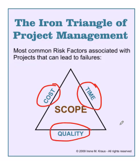

---

title: 【Software Engineering】 1 Introduction

url: se-intro

date: 2020-03-02 10:22:13

tags: 
- Software Engineering

categories:
- Courses
- Software Engineering

---

Week 1 of 2020 Spring. An Introduction to Software Engineering

**Keywords**: Software, Software Engineering, Modeling

<!--more-->

[TOC]

## 0 Cases in this Course

本课程会围绕三个例子展开
- ARENA 在线游戏平台，为玩家、竞赛组织者、游戏开发者、广告商提供游戏平台和框架
- Accident Management System 交通事故处理系统，包含报告紧急情况、处理情况、调配资源的功能
- Next-Gen point-of-state(POS) system 商场POS机

## 1 Introduction to Software Engineering

### 1.1 Software vs. Hardware

Softwares are programs that run on hardwares.

### 1.2 Software Types

System Software vs. Application Software

Open-Source Software vs. Pro-prietary Software vs. Software as Service

### 1.3 Software vs. Programs

Software = Programs + Data + Associated Documentations

### 1.4 Software Characteristics

- **developed or engineered** 软件的主要成本是设计而不是“制造”
- **Software doesn't wear out** 
> 
> Fig 1. 一般商品的失效曲线

> 
> Fig 2. 软件的失效曲线
> 实际软件的失效曲线是绿色曲线，因为在软件使用过程中，存在修正的引入，即更新版本软件产生的扰动。但随着需求的提高，软件将会逐渐失效，也会wear out。

- **Software continues to be custom built** 这与实际工业的组装模式不同，在软件方面，标准化程度还很低
    + Mash-Up技术，整合API提高软件开发速度

## 2 Software is everywhere

More and more systems are software controlled.

Software is sold by reatil. (Software as Service)

SE expenditure represents a significant fraction of total spends in all developed countries.

## 3 Software Crisis and Software Failures

### 3.1 Software Crisis

根据美国政府的统计，只有5%的软件成功得到交付。没有成功交付的软件存在undelivered, unusable的问题，需要major rework或者changes。

### 3.2 Software Failures (软件失效)

#### Cases

每年软件失效造成了数百亿资金的流失。See [20 Famous Software Disasters](http://www.devtopics.com/20-famous-software-disasters/)。

**Blue Screen of Death** (or BSOD) 微软蓝屏事件。在展示Plug & Play环节，屏幕上出现了蓝屏。

These problems will become worse because of the pervasive use of software.

#### Causes

软件开发经常不成功的原因：

- Complexity
    + Difficult Problem Domain
    + 开发过程（思维过程）难以管理
    + Extreme Flexibility
    + Discrete System
    > Continuous Systems have no **hidden** surprises, but discrete systems have!
- Change
    + The **Entropy** of a software system increases with each change. 软件系统的混乱度随着修改增加，且增加后续修改的难度（规范性逐渐降低）。
    > **Second Law of Software Dynamics** Each implemented change erodes the structure of the system which makes the next change even more expensive.
    + eventually leads to the failure of the software
- Unrealistic Expectations (不现实的预期)
    > 
    > 
    > 软件开发过程中面临的三者互斥因素(cost, time, quality)，是软件工程师需要解决的问题

## 4 From Software Development to Software Engineering

### 4.1 Towards the engineering of software development

Skill Training? Qualified Recruitment? Development Process Reengineering?

We need a systematic approach.

### 4.2 Software Engineering

The application of a **systematic, disciplined, quantifiable** approach to the **development, operation, maintenance** of software, and the study of these approaches; that is, the application of engineering to software.

### 4.3 Understand the SE

#### Modeling activity

Model: an abstract representation of a system.

Software engineers need to understand the **environment** and **systems**, evaluate different solutions and trade-offs.

建模的关键在于对环境的理解，对系统的理解。

> Case Study: 股票交易系统
> Probelm Statement: 每个上市公司以他们的股票为标志
> 
> StockExchange实体包含Company（以tickerSymbol标识），*表达多对多关系。代码只是模型的派生。

软件开发过程中的主要模型：

- System Model
    - Object Model: 表示系统内部的结构，从面向对象的角度看，所有系统都是由对象组成的。
    - Function Model：功能模型
    - Dynamic Model：动态模型，如何处理软件系统内部对象相互作用的关系，达到功能的实现。动态模型刻画对象的合作关系。
    - 以上三者组成了系统模型的表达
- Task Model（开发过程模型）
    - PERT chart: 开发过程的先后关系
    - Schedule: 各个过程的DDL
    - Org Chart：组织图，每个任务的人员分配
- Issues Model（开发决策模型）
    - 该模型在业界正在得到逐渐的重视。开发过程中问题的解决、讨论、决定过程。
    - 由于软件具有生命周期，issues model有助于后期维护时的回顾。
    > Case Study: Issue-Modeling
    > 
    > 有助于理解决策的逻辑

三大类模型有机结合在一起，并且通过互相迭代完成软件的开发。在System Model中，存在两种工程方式。

- Forward Engineering: 利用对象模型构建代码（mapping）
- Reverse Engineering: 通过代码构建对象模型

#### Problem Solving activity