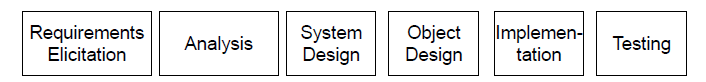

Week 1 of 2020 Spring. Introduction to Software Engineering(cont'd)

**KeyWords**: Software Enginnering, Modeling

<!--more-->

[[toc]]

## 4 From Software Development to Software Engineering

4.1 Towards the engineering of software development

4.2 Software Engineering

### 4.3 Understand the SE

1. Modeling 软件开发是建模的过程
2. Problem Solving Activity
3. Knowledge Activity
4. Rational Activity

### 4.4 Dealing with Complexity
#### 4.4.1 Abstraction: Through Modeling

Already discussed in the previous lecture.

#### 4.4.2 Decomposition

- Function decomposition 功能分解
  从系统功能实现的角度分解
    - Top-Down Functional Decomposition
      e.g. 书房分为书桌/书架...,书桌又分为抽屉...
    - Bottom-up Functional Composition
      e.g. 我们已经有了部分组件,我们将他们利用起来组装成更大的功能
  缺点:这样的分解造成我们的系统可维护性不好,因为功能会随着需求的改变而改变.
- Object-oriented decomposition 面向对象分解
    - 系统分解成一系列对象
    - 每个对象具有它对应的属性和行为

- What is an Object?
  - 逻辑实体 entity, either physical, conceptual...
  - formally : is a concept, abstraction or thing with **sharp boundaries** and **meaning** for an application
  - object = state + identity + behavior
- What is a Class?
  - group of objects with common properties, behavior, relationships and semantics.
  - An object is an **instance** of a class
  - It defines the **structure and behavior** of each object in the class
  - It serves as a *template* for creating objects

- Formalize in UML
> In UML, a class is comprise of three sections
> - Class Name
> - Structure (attributes)
> - Behavior (operations)
> 

> An object (sender) sends a request (message) to another object (receiver) to invoke a method of the receiver object's.
> 
> - like function call, but different 因为message是可以变动的,如message根据receiver object产生调用不同function的响应
> - message 要具有一定格式才会被接受, 因此可以被认为是contract
> - only reponds to protocal(a declaration of the receiver object to receive some type of message).

#### Extend: Object-Oriented Methodology

当然, 面向对象的方法学(methodology)远不止decomposition. (cf.维特根斯坦), 优点如下

- Abstraction
- Encapsulation (a.k.a information hiding)
- Inheritance
  Specialization/Subclass/Superclass
  Abstract/Concrete Class
- Polymorphism

**OOA: Object-oriented analysis** 分析问题中重要的概念,从用户的角度来看待,不触及技术细节

**OOD: Object-oriented design** 从开发者的角度, 决策细节, 将重要的概念进行实现

面向对象包含了归纳(induction: objects to a class)和演绎(deduction:a class to objects)

#### 4.4.3 Hierarchy 分层

| Part of Hierarchy |Is-Kind-of Hierarchy(Taxonomy)|
|---|---|
| 组成学 ◇ |分类学 △|
| ||

然而, 每个人针对同一个问题develop的对象结构可能是不相类似的, 我们还需要更进一步. 我们需要具体的技术将面向对象的方法学用好.

### 4.5 Software Engineering Concepts

> 

## 5 Development Activities

### 5.1 Terminologies

Software LifeCycle 软件生命周期: 开发软件系统的活动activity/关联relationship/安排schedule

### 5.2 Software LifeCycle Activities

### 5.3 Object-oriented development
|details of software lifecycle| |
|--|--|
|  | |

> CASE STUDY 售票机
> 功能需要: 要选择单程票,多程票,time card/计算价格/处理异常(如无票,假币)
> 1. Requirement Elicitation (需求获取)
>    Use Case 用例: 买单程票
>    Initiated by Traveler
>    Entry condition: The traveler strands in front of the TicketDistributor, which may be located at the station of origin or at another station
>    Exit condition: The traveler holds a valid ticket and any excess change
>    Quality requirements: …
>    Flow of events:
>    - 选择目的地zone
>    - 展示价格
>    - 收入足够的钱
>    - 吐出找零和票
> 2. Analysis:
>    | Sequence Diagram | 类图 |
>    |--|--|
>    | 描述功能实现过程中的对象与message交互关系| |
>    |  |  |
>    | 竖条:对象,横向:message | |
> 3. System Design
>    
> 4. Object Design
> 5. Implementation
> 6. Testing

## Summary of Chapter 1

- Software is already everywhere
- Software engineering is a systematic, disciplined, quantifiable approach to the development, operation, and maintenance of software
- Object-oriented methodology is an effective way to deal with the complexity