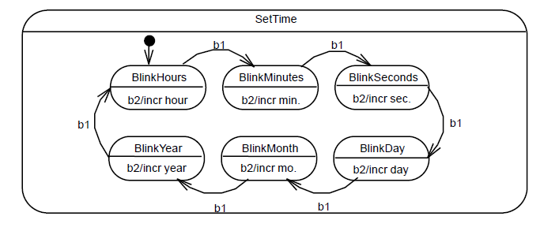

Week 2 of 2020 Spring. Modeling with UML

**KeyWords**: Software Engineering, UML

<!--more-->


## 1. History of Object Oriented Method

### 1.1 The Growth of OO Methods
In 1965 the first object-oriented (OO) programming language, SimulaI, was introduced.
Almost immediately interest in OO design began to rapidly grow.
This led to the emergence of numerous competing OO design methods.

**OO Aalysis vs. OO Design**
- Analysis refers to **understanding the problem.**
- Design refers to **coming up with the solution.**
- Don’t confuse with broader use of word “design”

With all these design methods came numerous modeling languages.
By the early 90’s there were 50+ distinct OO modeling languages.
Darwinian forces in the marketplace led to three dominate methods, each having its own modeling language.

### 1.2 Three Dominant Methods

- Object-oriented Analysis & Design (OOAD) -Grady Booch
- The Object Modeling Technique (OMT) -Jim Rumbaugh
- The Object-oriented Software Engineering method (OOSE) -IvarJacobson
Each one had its strengths and weaknesses.

1. Booch (OOAD)
   - very complex
   - effective low-level design and fine grain detail supported
   - Good at OO design, weak at OO analysis
2. Rumbaugh(OMT)
   - better at higher-level designs
   - Good at OO Analysis, weak at OO Design
3. Jacobson (OOSE)
   - Major feature was **"use classes"**
   - **model how a system interacts with users**

The three then focused their efforts on unifyingtheir three modeling languages

### 1.3 UML was Born


## 2. Modeling Concept

### 2.1 Systems, Models and Views

A **system** is an organized set of communicating parts
System is too complex and **modeling** is a means for dealing with complexity
Unfortunately, a model itself is also very complex. A **view** is a subset of a model
**Notations** are graphical or textual rules for representing views

### 2.2 Different Domains

**Application Domain**: It represents all aspects of the _user’s problem_ (Analysis)
**Solution Domain**: is the modeling space of _all possible systems_ (Design)
object建立了两个domain直观的桥梁, 使软件的维护容易了很多

## 3. An Overview of UML

### 3.1 UML is for Visual Modeling

- Uses standard graphical notations
- Semi-formal
- Captures **Business Process** from enterprise information systems to distributed Web-based applications and even to hard real time embedded systems


### 3.2 UML is also for ...

Specifying...
- 目的: Building models that are: Precise, Unambiguous, Complete
- 语义: UML symbols are based on well-defined syntax and semantics.
- 内容: UML addresses the specification of all important analysis, design, and implementation decisions.

Constructing...
- 语言: Models are related to OO programming languages.
- Round-trip engineering requires tool and human intervention to avoid information loss
  - Forward engineering — direct mapping of a UML model into code (of framework).
  - Reverse engineering — reconstruction of a UML model from an implementation.
- MOA: modeling-oriented architecture

Documenting...
- Architecture, Requirements, Tests, Activities (Project planning, Release management)

### 3.3 Architecture and View
UML is for visualizing, specifying, constructing, and documenting with emphasis on system architectures (things in the system and relationships among the things) from five different views

> 
> - Design view: 系统结构, 类与类的关系等
> - Process View: 进程式, 系统运行起来后对象交互的关系
> - Deployment View: 部署, 软件对硬件/网络的要求
> - Implementation View: 从系统实现的角度
> - Use Case View: 系统的功能, 位于最重要的位置

### 3.4 Three Basic Builing Blocks of UML

**Things**  important modeling concepts (individual ones as the primitive kinds)
**Relationships** tying individual things (i.e., their concepts)
**Diagrams**   grouping interrelated collections of things and relationships
部分到整体的关系 (Thing have relationships and together form diagrams)

#### 3.4.1 Things

**Structural** nouns of UML models. Conceptual or physical elements

> 
> Class: 类
> Interface: 抽象的类
> Active Class: 进程中的类
> Use Case: 系统功能(与interface区分)
> Component: 如文件h/编译结果dll/runtime, 大于类
> Node: 代表硬件, 用于部署图 [physical elements]
> Collaboration: 一组对象相互配合完成一个功能. 
> - e.g. 对place order这一user case, 可以通过Internet/...等方式完成, 完成这一功能的信息放在一起, 被称为collaboration

**Behavioral** dynamic (verbal) parts of UML models.

Interaction | State Machine | 
---------|---------- | 
  |  |
 消息的交换 | 刻画一个对象历经的多个状态(sequence of states) | 
 图中表明消息名 | 电话机挂机到waiting状态的改变 |

**Grouping** using **Packages**. organizational parts of UML models. 
> 
> 简单的grouping, purely conceptual, 仅在开发阶段, 类比成文件夹, nested
> 一个用处是帮助系统结构规划

**Annotational** explanatory parts of UML models.
> 
> 用于说明,可以添加超链接
> 折角矩形

#### 3.4.2 Relations

| Relations | Description | Symbol |
| :------- | ------ | ---- |
| Dependency | a **semantic** relationship between two things in which a change to one thing (independent) may affect the semantics of the other thing (dependent) |  |
| Association | a **structural** relationship that describes a set of links, a link being a connection between objects. |  |
| \|- Aggregation | a special kind of association. It represents a structural relationship between **the whole and its parts**. |  |
| Generalization | a specialization/generalization relationship in which objects of the specialized element (the child) are more specific than the objects of the generalized element. 子类指向父类,继承关系 |  |
| Realization | 类与接口/use case与协同 |  |

#### 3.4.3 Diagrams

最新版本 14 种, 书中/业界广泛应用介绍了9种.


Diagrams and System Model:
- Functional model : Use case diagram
- Object model : Class diagram
- Dynamic model : Sequence diagrams, statechart, activity diagrams (其他非广泛应用与Dynamic Model的模型如上图圈出)

## 4. UML Diagrams
Diagrams | Functions
--- | ---
Use case| Describe the **functional behavior** of the system as seen by the user
Class | Describe **the static structure** of the system
Interaction | Describe **the dynamic behavior between objects** of the system
Statechart | Describe **the dynamic behavior of an individual object**
Activity | Describe **the dynamic behavior of a system**, in particular the **workflow**.
Package | Describe the **groupings of elements**

### 4.1 Use Case Diagrams

从需求表述来说, 文字, 框图较好, 要便于用户识别, 包含以下主要元素
- Actor: 用户类别(with role, 如图书管理员,读者,...)
  - 系统之外的 **external entity**(不等于user), 也可以是机器/其他系统/天气...
  - unique name + optional description
- Use Case: 系统为用户提供的一类功能, 用椭圆表示
  - a **class** of funcitonality: 包含各种情况
  - textual description 需要包含
    1. Unique name
    2. Participating actors
    3. Entry conditions
    4. Exit conditions
    5. **Flow of events** (focus)
    6. Special requirements (如性能描述)
  - 具有不同的描述方式brief/casual/fully addressed
- Actor 和 Use cases 是 communicate 关系.
  - use case 代表系统
  - actor 与 function 通过按键等方式进行交互
- Use Case 之间也具有一定的关系
  Extends Relationship | Includes Relationship | Inheritance Relationship
  ----- | ----- | ----
  在原有功能上加入另外的功能 | 提出common use case供其他case include | 定义一般流程, 其他流程做细化处理
   |  | 
  如 exception 处理, 在原来定义情形中没有细化, 用扩展的方式对原有功能进行补充,  | 如购买单程/多程票都需要收钱, 可以把collect money作为单独用例提出 | 如认证方式既可以用password也可以用card, 但都包含对比信息码/判断正误的操作
  
  从补充功能指向被补充功能 | 从基用例指向子用例(派生用例) | 从派生用例(特殊)指向父用例(一般)
   
- Scenario 场景: instance of use case 具体(指明道姓的)某一次功能的执行
- 成千上万scenario的发生可以概括为用例


### 4.2 Class Diagrams

#### 4.2.1 Things

代表整个系统的结构, 在软件开发的过程中会画多张类图.
- Requiring analysis to **model application domain concepts**
- during system design to **model subsystems**
- during object design to specify the **detailed behavior and attributes of classes**

类图中的基本单元: Classes
- **Class Name is mandatory** 类名必须
- 类的属性与操作以方框的形式接在类名下方.
- 更详细地
  - 每个属性都要有类型(type)
  - 每个操作都要有署名(signature)(=参数+返回类型)

类的实例化: Instance(Object)
- 代表一个现实存在的现象
- 这时每个属性都要带上一个值
- 同样用矩形框表示, 但不同之处在于Instance的**表头的名称下方有下划线**, 有时, 也会用`instanceName:className`的形式作为表头, 可以区分. 有时className也会被省略
- 对匿名对象, 可以用`:className`表示

> 在Use Class中, Actor是Class, 因为它代表一类实体.

#### 4.2.2 Associations

类与类关系的刻画.
- 我们使用直线/箭头将类与类连接起来
1. 方向性: `Order *---->1 Customer` 表明根据一个Order,我们能找到(direct mapping)Customer, 当然, 通过遍历, Customer自然也能找到Order, 但这不具有方向性.
  方向性是对模型的一个细化, 在最初版本的图中可以不作
2. Multiplicity : 对应关系: 数字/*, multiplicity 定义了类与类之间对应关系, 这是指某一个时刻的**对象层面**对应关系(即 给定两个具体实例之间可能有怎么样的关系)
   - 1-to-1 association`Country(name:String) 1 ----- 1 City(name:String)`
   - 1-to-multiple
   - mul-to-mul...
3. 关联类:association classes 存在与关系密切相关的信息, 我们需要额外设定一个类表达.
   - 如, 商场与银行开账户的信息, 那可以有`ServiceContract(MerchantID)`关联在关系上
   - Guideline
     - 如果有信息附着
     - 当关系存在life-time dependency(有生灭关系), 如银行账户的失效
     - 两个类之间存在mal-to-mal关系 (如果是一对多,可以记在1那一头)
4. Qualifier 限定符: 消除multiplicity
   如,给定filename,要么存在,要么不存在, 这一信息对于后续实现有帮助, 因此可以帮助消除.
```
Directory 1----* File(filename)
Directory [filename] 1----(0..1) File
```
  Qualification: Another Example, 如给定TickerSymbol,就知道公司了

5. Aggregation: 强化, 表达...有...组成
   - ◇一般,表示关系不是从一而终的, 是可以改变的. 如学生与班级的从属关系
   - ◆共存亡关系, 即如果主体不存在,那么组成部分就没有意义了.
```
Exhaust System 排气系统◇------0..2 tailpipe
                      ◇------1 muffler
Ticket Machine ◆------3 ZoneButton
```

6. From Problem Statement to Associations
   e.g. A stock exchange lists many companies.Each company is identified by a ticker symbol
   这句话启发我们, association是多对多关系, 用Lists(列出)标明.
   在代码映射的过程中, association被映射成attributes


### 4.2.3 Inheritance
a "kind-of" hierarchy, 代表了一种分类学taxonomy
Recall. Chapter 1.

### 4.2.4 Class Modeling in Practice

1. **Right Naming** - Account
2. **Find New Classes** - Account就有Customer,就有Bank
3. **Review Names, Attributes and Methods**
4. **Find Associations between Classes**
5. **Label the generic associations** has...
6. **Determine the multiplicity** bank-account-customer 1对多
7. **Review Associations** 加上修饰, 如aggregation, 如在bank和account之间加上强强化关系◆
   Account可不可以是关联类? (有自己的方法,不太好)
   Develop更多分类性质, Saving, Checking, Mortagage...
8. **画细节图** Use the _7±2 heuristics_


### 4.3 Interaction Diagram

是所有图中最重要的图, 也是很多图的总称, 我们主要关注Sequence Diagram和Communication Diagram
Interaction Diagram是我们设计时的过程

Seq和Com两类图是孪生关系, 即一张图表达清楚之后, 另一张图就可以导出了, 表示一样的信息.

Seq强调时间顺序, 且决定了对象的**生灭周期**(lifeline)
Com可以体现time ordering,但更重在强调复杂的交互

#### 4.3.1 Sequence Diagram
我们在分析阶段(发现对象),系统设计(确定子系统接口)等阶段有不同的用途

Format:
- 实例用矩形表示, 用虚线向下延伸表示生命线
- Actor用人形表示,总是画在左边.
- Message发生在箭头上方
- Activation(控制焦点)可以直观地理解为工作时间/调用方法对应的代码
> 
> 类图成为了Seq图的产物
> 
> 也可以表示消息的传递关系, 虚线代表返回值


- 我们用`*`代表(多重)迭代调用
- 我们用`[condi]`表示条件下的消息发送关系.
- 有时消息会触发新对象的生成,或触发对象的销毁

#### 4.3.2 Communication Diagram
also called collaboration diagram
- 对象之间存在link通路, message发生在link之上(可能有多重)
- 具体实现上, link表示具有对方的指针.
- 一条link上可能有多条消息
- 消息格式:`1:tot:=total():Integer` 携带返回值名称tot, 返回值类型Integer,消息函数
- 消息也可以发回给自己(调用自己的方法)
- 同样,用`*`表示迭代多次
- 可以加入迭代子句`1*:[i=1,...10] tot:=...`
- `1:create()`函数需要手动声明,表示新对象的触发创建
- 我们要通过消息的(嵌套)编号查看时间顺序, 第一条消息通常由actor触发, 不加编号
  
- 条件字句, 同样用`[test]`表示, 消息编号上使用下标
  


### 4.4 State Machine Diagrams
主要刻画**某一个对象**
Notation of **describing the sequence of states an object goes through in response to external events**.
State: 对象属性所满足的条件
Transition: 由events,conditions,time触发的状态改变

状态是一个general的描述, 可以在状态中定义internal transitions作为细化. 用`pressButton/beep`描述转移时的触发动作+伴随动作

| 状态 | 状态内部图 |
|--| --|
| |  |

### 4.5 Activity Diagram
与state类似, 但重在刻画**整个系统**的某些活动(workflow).
- 分支
- synchronizing 同步
- swimlane 泳道(表示责任分属)

### 4.6 Package Diagram
一个Package对应一个子系统, 表示系统的体系架构与用户的交互关系
Note 可以附着到图中特定的部件上

### 4.7 Diagram Extensions
一个Package对应一个子系统, 表示系统的体系架构与用户的交互关系
Note 可以附着到图中特定的部件上
- stereotype: 为方框矩形(class)加上特定的spec
  - `[<<entity>> year]` `[<<control>> Day]` `[<<boundary>> ButtonBoundary]`
- constraint: 引入额外的信息
```
EmergencyReport 1..*------------1 Incident
                          |
                          |
                (ordered by time of report)
```

### 4.8 More Diagrams

大部分图会做详细介绍, 我们介绍一些新UML的图
- **Profile Diagram** 表示Extension
- **Composite Structure Diagram**组合结构图: 表示类的Internal Structure和External Ports, 也可以表达collaboration关系
- **Timing Diagram** state/value/combined timeline, used to reason about time
- **Interaction Overview Diagram**可看做活动图和交互图的耦合, 总结构是活动图, 节点内部是交互图.


## Summary
UML is for **visualizing, specifying, constructing, and documenting** with emphasis on system architectures (things in the system and relationships among the things) from **five** different views
UML as a standard language to represent the O-O model is widely accepted.