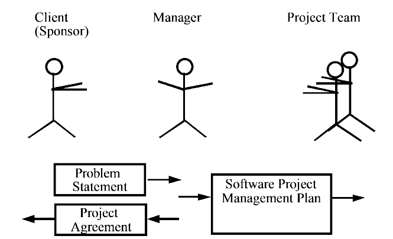

Week 3 of 2020 Spring

<!--more-->

[[toc]]

## 1 An Overview of Project Management

### 1.1 History of Project Management

### 1.2 The Triple Constraint of Project Management

任何项目都受范围,时间,成本的约束 (Recall 铁三角 in intro).

Scope:
- What work will be done as part of the project?
- What unique product, service, or result does the customer or sponsor expect from the project?
- How will the scope be verified?

Time:
- How long should it take to complete the project?
- What is the project’s schedule?
- How will the team track actual schedule performance?
- Who can approve changes to the schedule?

Cost:
- What should it cost to complete the project?
- What is the project’s budget?
- How will costs be tracked?
- Who can authorize changes to the budget?

### 1.3 Project Management Framework

PMI regulates the knowledge scope in project management

### 1.4 Tasks and Work Products
- Task: 可以直接分配给某个人的工作
- Work Product: 任务中需要产出的东西(tangible)
  - object model/code/document
> 
> 组合模式(套路): 定义了多态的树结构
> 解释: activity由各种work组成, work可以有task和activity组成
> activity构成了项目的主要功能

我们再次对work product进行组合模式(父类套子类,树形嵌套结构)
> 
> outcome包含set of work products或products, 而set of work products又由outcome组成

Solution: **Divide and Conquer**
Technique:
- work to be done
  - **WBS**(work breakdown structure)
    - brainstroming
    - hierachy (tree structure)
- dependency between work units
  - Dependency Graph
    - From WBS tree to Acyclic Directed Grph
    - Gant Diagram 甘特图, 用于跟踪项目进度
- Estimate the duration of work to be done

We use UML class Diagram to represent the idea of a project.

### 1.5 Project Agreement, Problem Statement vs SPMP

项目管理中的纲领性文件: project agreement 通常以合同, 计划, 图表形式呈现

Deliverables = Work Products that will be delivered to the client, 需要交给客户的文件

## 2 Project Management Activities

### 2.1 Four Management Activities
项目管理中的典型活动包括:
- Planning the Project
- Organizing the Project
- Controlling the Project
- Terminating the Project

### 2.2 Planning the Project

### 2.3 Organizing the Project

设立项目组内的沟通机制, Setting up the communication infrastructure
- Schedule Modes
- Event-based modes

Identifying skills, 招兵买马
- Application domain skills
- Communication skills
- Technical skills
- Quality skills
- Management skills

### 2.4 Controlling the Project

Decision making relying on collecting accurate status information
- Meetings
- Sharp milestones
- Project reviews
- Code inspections
- Prototype demonstration

量化管理, 定义 Metrics
- Financial status
- Technical progress
- Stability
- Modularity
- Maturity

### 2.5 Terminating the Project
- Accepting the system, 对照Project Agreement
- Installation, 还包括旧系统的适配, 数据的迁移
- Postmortem, 总结, chance for learning

## 3 Software Life Cycle Model
软件生命周期模型 = 项目管理概念和软件开发过程的结合

| Waterfall Model | V-Model| 
| --| -- |
|  |  |
| 优点是管理简单, 做完一件事再做下一件, 质量控制严格. 但缺点是, 当change出现时, 返工的代价很高 | |

| Boehm's Spiral Model| Unified Process Model|
| -- | -- | 
| | |
|螺旋模式通过多人的迭代完成一个个"原型", 每一轮迭代都完成一个目标, 将分析做足, 当所有问题解决后再开始正规的开发, 保证成功性的同时却造成了复杂 | 统一开发过程|

### 3.1 Unified Process Model

|  |  |
| -- | -- |
| 包含:初始化,细化,构造,移交, 很大的特点是强调四个阶段的推进有很多workflow齐头并进.  |如, 需求实际是在elaboration,构造阶段要求最多的.强调iteration, 每一个迭代都围绕单个use case进行. |

Extension: Capability Maturity Model (CMM) by CMU

## Summary
- Software development as a Project
- Project Management is a modern approach to coordinate complex task teams
- There are different Software Life Cycle Models with different characteristics.