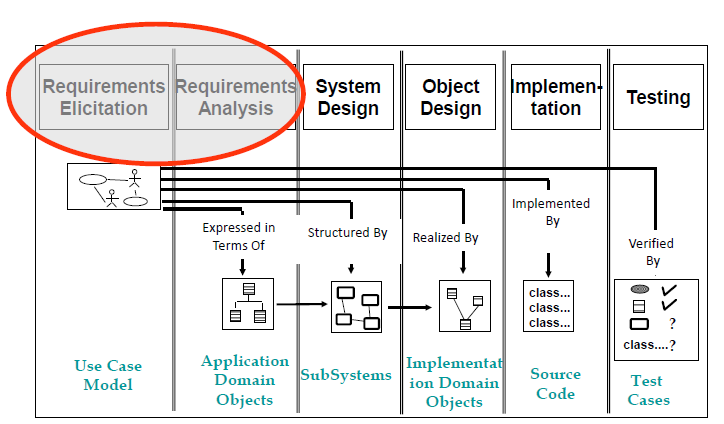
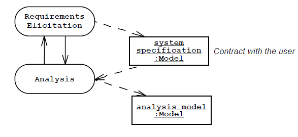
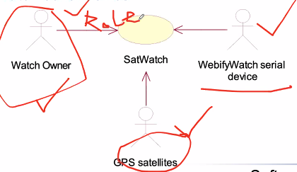
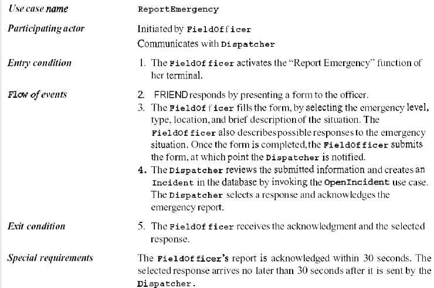
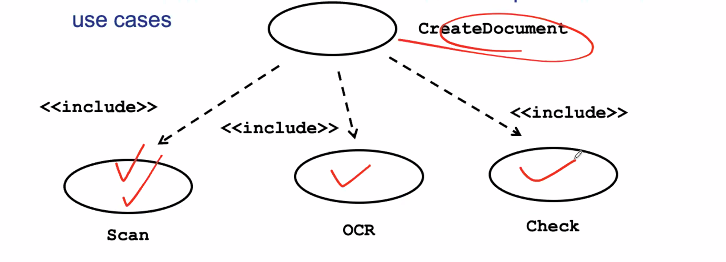
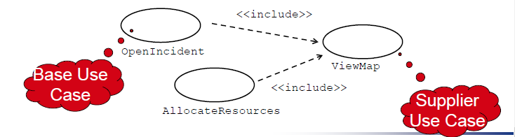
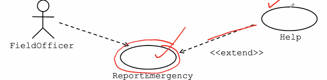
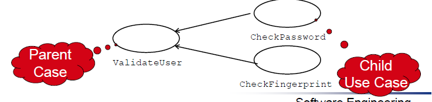
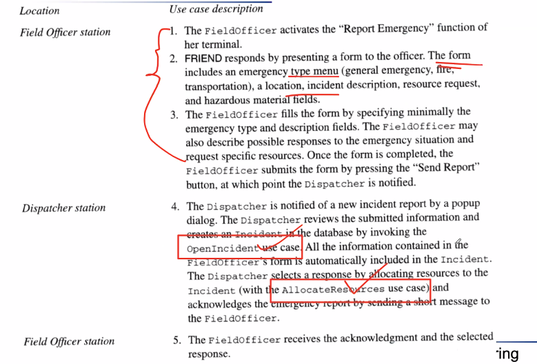
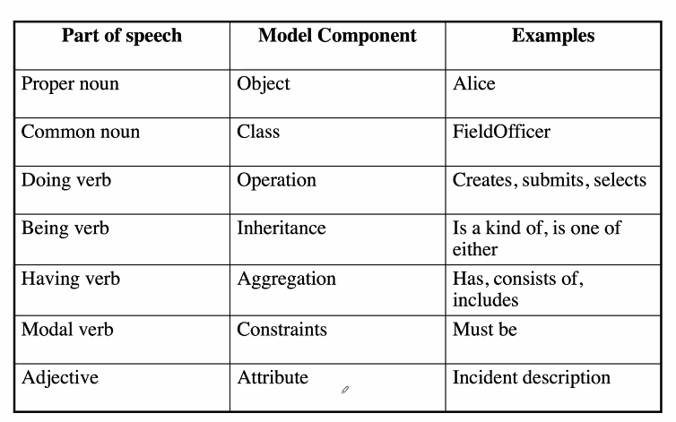

Week 3 of 2020 Spring

<!--more-->

[[toc]]

## Introduction

- Requirement Driven Software Development
- But requirement is hard to capture

## Requirement Engineering

需求工程是软件工程的一个分支, 帮助我们弄清软件的真实功能, 约束, 准确地描绘出来.

Ecliciation, analysis, specification, validation都是需求工程中的一环, 这是我们达到的baseline requirements, 开发过程中我们还需要有一定的requirement management进行维护.

## Requirement Process

### SoftWare LifeCycle Activities


用例图, 子系统图, 软件类图, 源代码, 测试用例.
其中, Use Case Model扮演了主导的地位

### System Identification

我们要知道系统的目的(purpose),和系统的边界(boundaries)

这两个问题可以由两个角度进行刻画: 从客户的角度理解需求(problem description), 从开发者的角度分析需求(specification)

System Purpose:
- Depending on the purpose of the system, different objects might be found
  - What object is inside, what object is outside?
- How can we identify the purpose of a system?
  - Scenarios
  - Use cases: Abstractions of scenarios


- system specification 我们希望不要太专业化, 要让用户看得懂
  - use case工具
- Analysis 阶段, 交付 analysis model

### System Specification VS. Analysis Model
- System specificationuses natural language (derived from the problem statement)
- The analysis modeluses formal or semi-formal notation (for example, a graphical language like UML)


## Requirements Elicitation
In order to, Bridging the gap between user and developer...
- 讲故事Scenarios: **Example** of the use of the system in terms of a series of interactions with between the user and the system
- 做抽象Use cases: **Abstraction** that describes a class of scenarios

### Types of Requirements
- 功能需求 Functional requirements: Describe the interactions between the system and its environment independent from implementation
  - The watch system must display the time based on its location
- 非功能需求,如性能 Nonfunctional requirements: User visible aspects of the system not directly related to functional behavior.
  - The response time must be less than 1 second
  - The accuracy must be within a second
  - The watch must be available 24 hours a day except from 2:00am-2:01am and 3:00am-3:01am
- 约束Constraints(伪需求“Pseudo requirements”): Imposed by the client or the environment in which the system will operate
  - 客户提出的本应该由开发者决定的要求
  - 系统机构, 开发方法, 编程语言, 开发环境, 重用组件...
  - The implementation language must be COBOL.
  - Must interface to the dispatcher system written in 1956

### Case Study ARENA

#### The Problem
- The Internet has enabled virtual communities
  - Groups of people sharing common of interests but who have never met each other in person. Such virtual communities can be short lived (e.gpeople in a chat room or playing a multi player game) or long lived (e.g., subscribers to a mailing list).
- Many multi-player computer games now include support for virtual communities.
  - Players can receive news about game upgrades, new game levels, announce and organize matches, and compare scores.
- Currently each game company develops such community support in each individual game.
  - Each company uses a different infrastructure, different concepts, and provides different levels of support.
- This redundancyand inconsistencyleads to problems:
  - High learning curve for players joining a new community,
  - Game companies need to develop the support from scratch
  - Advertisers need to contact each individual community separately

#### The Objectives

Provide a generic infrastructure for operating an ARENA to
  - Support virtual game communities.
  - Register new games
  - Register new players
  - Organize tournaments
  - Keeping track of the players scores.
Provide a framework for tournament organizers
- to customize the number and sequence of matchers and the accumulation of expert rating points.
Provide a framework for game developers
- for developing new games, or for adapting existing games into the ARENA framework.
Provide an infrastructure for advertisers.

对于以上系统, 我们来识别一下不同种类的requirements, 举几个例子

Functional requirements:
- Describe the interactions between the system and its environment independent from implementation
- An ARENA operator should be able to define a new game. 可以加载新游戏
Nonfunctional requirements:
- User visible aspects of the system not directly related to functional behavior.
- The response time must be less than 1 second
- The ARENA server must be available 24 hours a day
Constraints (“Pseudo requirements”):
- Imposed by the client or the environment in which the system operates
- The implementation language must be Java
- ARENA must be able to dynamically interface to existing games provided by other game developers.


### Types of Requirements Elicitation
需求获取的三种典型方式.
Greenfield Engineering
- Development starts from scratch, no prior system exists, the requirements are extracted from the end users and the client
Re-engineering
- Re-design and/or re-implementation of an existing system using newer technology
Interface Engineering
- Provide the services of an existing system in a new environment

## Use Case
需求获取建立了user和developer之间的桥梁, 我们需要找到一些较好的交流方式.
- Use case描述了一系列产生可见价值的交互
- 系统被看作一个黑盒, 不会被use case刻画
- _**use case model不属于面向对象方法学**_, 具有普遍的实用性

## Use Case based Requirements Elicitation

### Identifying actors

- Actors represent **external entities** that interact with the system
- An actorcan be **an human** or an **external system**
- ACTOR是一个角色, 不是具体的一个人
- 
- 如卫星手表中:
  - Watch owner
  - GPS satellites
  - WebifyWatch Serial Device(USB串口用于更新)

### Scenarios
A concrete, focused, informal description of a single feature of the system used by a single act
比如, 用WareHouse on Fire描述Disptacher指名道姓地描述事件的发生和软件的参与. 描述形式:
```
Scenario name: ...
Participating actor instances: ...
Flow of Events:
1.
2.
```

故事还可以分成不同类型
- As-is scenario 目前系统的状态, 一般用于re-engineering
- Visionary scenario 假设存在一个设计完成的系统
- Evaluation scenario 用来描述比较系统A和系统B中操作方式
- Training scenario 一步一步告诉用户应该怎么具体使用这些系统

Heuristics提出scenario的策略
- primary tasks
- 系统会用到什么数据?
- 系统外部会发生什么变化需要系统知道?
- 系统的actor需要得知什么信息

一般针对一个use case, 需要写若干个scenario, 这样才能概括抽象出use case.

### Use Cases

描述Use Case
- 将Scenario中的人物归类到actor
- entry:
  - This use case starts when ...
- formulate the flow of events
  - use case之间可能存在一些关系
- 一般一句话是主谓宾形式, 主语是use case
- Write down exceptions
  - 断网
  - The **Dispatcher** is notified immediately if the connection between any logged in FieldOfficerand the central is lost.
- 写下其他要求
  - 时间要求
  - 非功能需求和约束
  - The selected response arrives no later than 30 seconds after it is sent by the Dispatcher.



### Use Case Associations
relationship between use cases, 有且仅有三种
- 扩展
- 包含
- 泛化

#### Include: Functional Decomposition
原始功能太复杂, 将大功能分为小功能, 每个功能依次调用.


#### Include: Reuse of Existing Functionality
已经存在一些功能, 重用功能. 如分配资源, 创建事件, 都需要viewmap. 注意方向: 从基用例指向子用例. 基用例不会单独存在, 即基用例发生时必须需要子用例的运行.



#### <Extend>> Association for Use Cases
Help是额外加的, 没有help, report也能运行. 扩展的方向是从supply指向基用例.


#### Generalization association in use cases
用例之间(结构)都差不多, 具有一些common behavior. 具有同样的大步骤, 但可能不具备像include一样把小节完整抽出的能力.


为此我们可以对use case做更详细的描述. 随着分析的深入, 做一定的扩充. 我们希望在系统实现时做奢侈版的use case


### How to find use cases
- 先专注于一个功能, 然后挖深 vertical
- 先考虑系统有多少种scenario, 找全use case, 挖下去, horizontal
- mock-up, 对系统先进行大概的刻画
- 好的做法是task observation(观察用户), 坏的做法是问卷

### From use case to Objects
我们希望找到use case中的对象, 完整地识别对象是analysis要做的事情. 但 use case的文本已经提供了不少有用的信息.

下表提供了一个很好的映射关系.


进一步, 为寻找objects
- 有待声明的术语/声明
- 现实世界的实体
- 现实过程
- 数据源(source or sinks)
- 界面

## Summary
In this lecture, we reviewed the requirements elicitation activities aimed at defining the boundary of the system:
- Scenario identification
- Use case identification and refinement
- Identification of participating objects

Requirements elicitation is to build a **functional model**功能模型 of the system which will then be used during analysis to build an object model and a dynamic model. **为对象模型和动态模型打下一个好的基础.**