Week 4 of 2020 Spring

<!--more-->


## Models for Analysis

### What is a good model

关系保持准则 Relationships, which are valid in reality R, are also valid in model M.
- I : Mapping of real things in reality R to abstractions in the model M abbildet(Interpretation)
- $f_M$: relationship between abstractions in M
- $f_R$: relationship between real things in R

In a good model the following diagram is commutative:
[It preserves relationships among the objects it represents.]
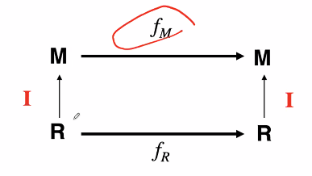

### Models of models of models

在以往模型基础上建立新的模型 Modeling is relative. We can think of a model as reality and can build another model from it (with additional abstractions).
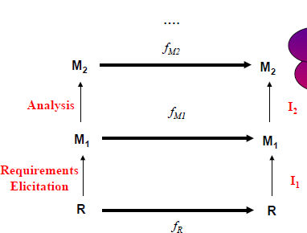
一层层模型的development体现的是软件开发的生命周期过程.

### Analysis Model
分析阶段, 我们需要创建下面三类模型:
- Functional model: user cases and scenarios
  - Use case diagram
- **Analysis** object model: class and object diagrams
  - Class Diagram
  - 区分此后design阶段的object model
- Dynamic model: state machine and sequence diagrams
  - statechart diagram
  - sequence diagram
  - ...... (activity diagram, etc)
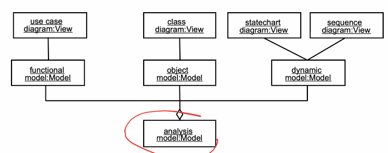

分析阶段的模型和前后开发过程的关系
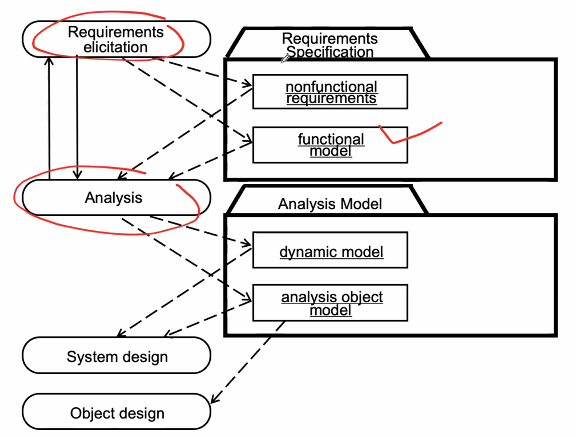

提醒: analysis阶段承上启下, 但仍然是在需求的大阶段内, 依然是user-level concepts(即object model反应的是user相关的概念)
- 数据库, 子系统, 网络, 等概念不应该出现.
- 避免技术术语的出现, 见下图
- 过早的决策可能会产生非最优的结果
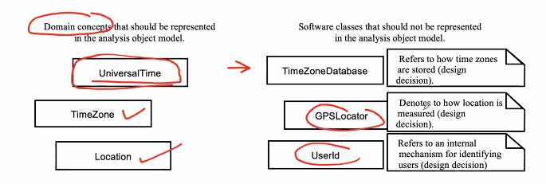


## Activities during object modeling
七个步骤间存在迭代, 不一定是承接的

Main goal: Find the important abstractions
Steps during object modeling
1. Object identification 实际是在找类
   - Identifying Entity Objects
   - Identifying Boundary Object
   - Identifying Control Objects
2. Mapping Use Cases to Objects with Sequence Diagrams 建立动态模型, 同时也帮助我们找到更多类
3. Modeling Interactions among Objects with **CRC Cards**(class responsbility cards)
4. Identifying Associations, Aggregates and Attributes
5. Modeling State-Dependent Behavior of Individual Objects 如果单个对象有多个状态
6. Modeling Inheritance Relationships 类与类之间是否存在继承关系
7. Reviewing

Order of steps
- Goal: get the desired abstractions
- Order of steps secondary, only a heuristic
- **Iteration** is important


### Object Identifications

#### Object Identification
- Identify the **boundaries** of the system 开发财务系统还是开发企业管理系统, 哪些是系统的内部对象, 哪些是与系统交互的对象
- Identify the **important** **entities** in the system
- Object identification is crucial to object-oriented modeling
- Basic assumption: 
  1. We can find  the  objects  for a new software system (Forward Engineering) 从头开始找起
  2. We can identify the  objects in  an existing system  (Reverse Engineering) 从代码找起

- The application domain has to be analyzed. 
- Depending on the purpose of the system different objects might be found
  - How can we identify the purpose of a system?
  - **Scenarios and use cases**
- Another important problem: Define system boundary. 
  - What object is inside, what object is outside?

#### Pieces of an object model

object model不止是classes
- Classes
- Associations (Relations)
- Attributes
- Operations

#### Object Types

我们可以按照对象的类别识别对象. 软件工程领域非常重要的三分类:
- Entity Objects 实体类
  - Represent the persistent information tracked by the system (Application domain objects, “Business objects”)
  - 生产力
- Boundary Objects 边界类
  - Represent the interaction between the user and the system
  - 交互
- Control Objects: 控制类
  - Represent the control tasks performed by the system
  - 管理者
- Object types originated in Smalltalk: 推广之, 在系统开发中, 也会存在对应的三部分架构模式
  - Model 业务代码, View 交互, Controller 协调单元(MVC)

为什么我们要按照三个类别识别对象?
Recall: 软件开发的挑战: complexity and **change**
- Both **interface** and **control** of the system are more likely to change than the application domain [model] UI一定是变化最大的, 需要单独提出
- Paradox: The static information model from analysis is more stable, yet the designed representation is most likely to change [implementation]
- David Parnas invented **the Information Hiding Principle** and recommended **encapsulation of data structures** for this reason. 面向对象方法学可以良好的支持数据隐藏和封装

#### How to find objects
具体的识别对象的方法:
Finding objects is the central piece in object modeling
- Learn about problem domain: Observe your client
- Apply general world knowledge and intuition
- **Take the flow of events and find participating objects in use cases**
- **Do a syntactic analysis** of problem statement,  scenario  or flow of events 
  - Abbott Textual Analysis, 1983, also called noun-verb analysis
    - Nouns are good candidates for classes 
    - Verbs are good candidates for operations
- **Apply design knowledge**
  - 在一些设计模式中, 要求提供一些类
  - Distinguish different types of objects [recognition/discrimination]
- Try to establish a taxonomy 分类法	[inheritance discovery]
我们重点介绍三类重点方法.

#### Finding Participating Objects in Use Cases

拿到use case, 看 flow of events中重点的六样东西
- Find **terms** that developers or users need to clarify in order to understand the flow of events
- Look for **recurring nouns** (e.g., Incident),
- Identify **real world entities** that the system needs to keep track of (e.g., FieldOfficer, Dispatcher, Resource)现实生活中需要跟踪的实体
- Identify **real world procedures** that the system needs to keep track of (e.g., EmergencyOperationsPlan) 现实生活中虽然并非具体, 但需要被软件调控管理, 会是在发生的一件事情.
- Identify **data sources** or **sinks** (e.g., Printer) 数据的输入输出点
- Identify **interface artifacts** (e.g., PoliceStation) [e.g., telecomm link?] 用户界面/端口

当然, 还会有不能识别的对象, 这会通过sequence diagram找出
**牢记! user's term!!**

> Example: flow of events 买玩具
> The _customer_ 类 _enters_ (方法) a _store_(是store提供的enter方法). with the intention of buying a _toy_(类) for his _child_(类) with the age of n.
> Help must be available within less than one minute. 
> The store owner gives advice to the customer. The advice depends on the age range of the child and the attributes of the toy. 
> The customer selects a dangerous toy which is kind of _unsuitable_(child和toy之间存在关系,suitable) for the child.
> The store owner recommends _another type of toy_(存在继承结构). a more _yellow doll_(继承的子类). 
> 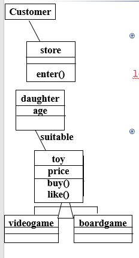

我们再针对三类对象的类型分别详述

Entity objects 主要关注
- 术语 Terms that developers or users need to clarify in order to understand the use case
- 重复出现的名词 Recurring nouns in the user cases (e.g., Incident)
- 现实实体 Real-world entities that the system needs to track (e.g., FieldOfficer, Dispatcher, Resource)
- 现实活动 Real-world activities that the system need to track (e.g, EmergencyOperationsPlan)
- 数据端口 Data sources or sinks (e.g, Printer)

Boundary object 边界类
- 界面元素 Identify user interface controls that the user needs to initiate the use case (e.g., ReportEmergency _Button_)
- 用户信息 Identify forms the users needs to enter data into the system (e.g., EmergencyReportForm)
- 消息 Identify notices and messages the system uses to respond to the user (e.g., AcknowledgementNotice)
- 当多个用户进行交互时, 需要将终端分开 When multiple actors are involved in a use case, identify actor terminals to refer to the user interface under consideration (e.g., DispatcherStation)

Control Objects 控制类
- 实际是我们发明出来的, 往往没有实体对应
- 设立领导,提高效率, 两种方式
  - Identify one control object per use case
  - Identify one control object per actor in the use case
- The life span of a control object should cover the extent of the use case or the extent of a user session

> Example: 电子手表的三分类
> 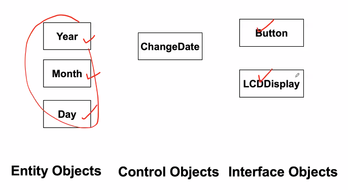

在UML中, 存在原型机制, 可以手动选择.


### Mapping Use Cases to Objects with Sequence Diagrams
识别对象的第二方法. Sequence Diagram是识别对象过程的工具, 边画sequence diagram边做决定,做设计.

- An event always has a sender and a receiver. 我们通过sender和receiver识别对象
- The representation of the event is sometimes called a message
- Find sender and receiver for each event => These are the objects participating in the use case

> 比如, _警官_ 通过按 _按钮_ 播报警情, 创建了 _control对象_ (在后续过程中扮演协调者的作用), 创建 _警情表_ , 由警官提交, form会给control发完成信息, control 创建了 emergency report, 发到控制中心, 销毁officer form
> 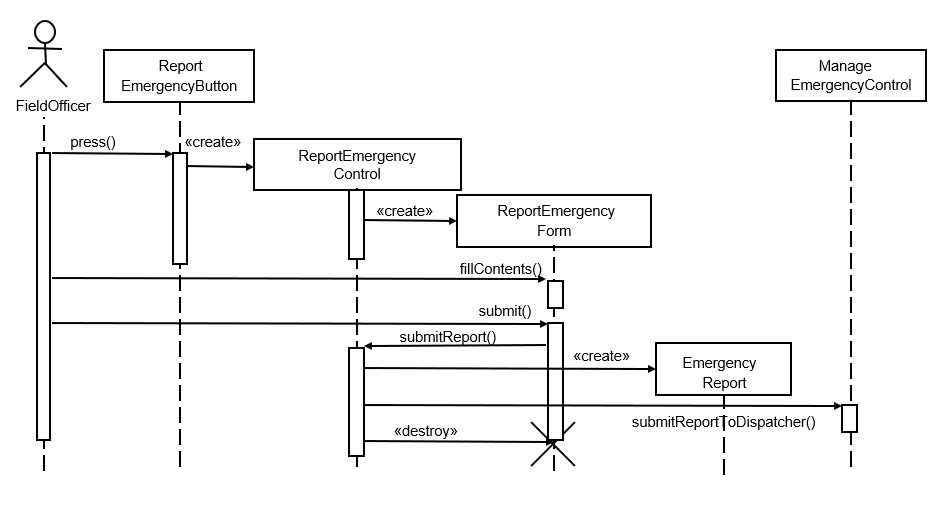
> 接下来由manage主导, 创建incidentform, 由dispatcher看到, 创建incident, 填入, 提交, 创建通知, manage就可以销毁incident form
> 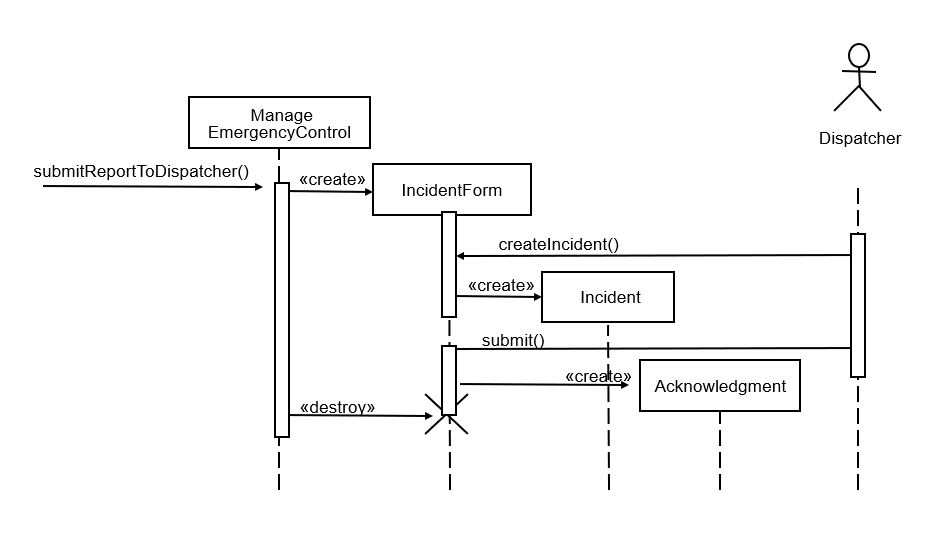
> manage将完成调度的信息发回report emergency control, 创建notice, 告知现场警官, dismiss掉, manage也可以销毁report control了.
> 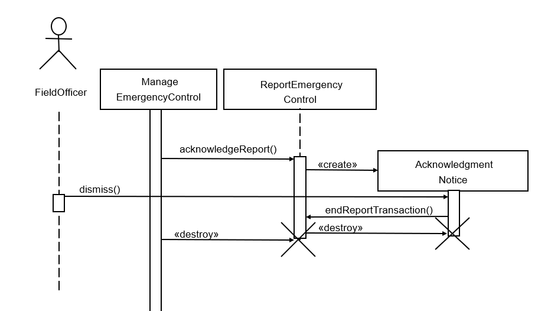

总结: 画顺序图的规则和规律
Layout
- 第一列: actor, 系统之外启动交互的实体
- 第二列: 边界对象, 直接和acotr交互
- 第三列: control object

creation:
- control object应该尽早(由initial边界对象)唤起, (后续的)边界对象应该由唤醒的control object全权负责

access:
- 实体可以被control和boundary访问
- 但实体不能命令boundary和control
  - 由此确保有效抗拒外界的变化, 各司其职.


> Example: 游戏平台组织比赛
> 联盟负责人向边界类发起新比赛, 边界类创建新比赛控制类
> 比赛控制类首先向arena检查是否允许新比赛.
> 联盟负责人继续向边界类提交信息, 交到控制类, 控制类带上这些数据,向league创建, 由此创建了新的锦标赛类.
> 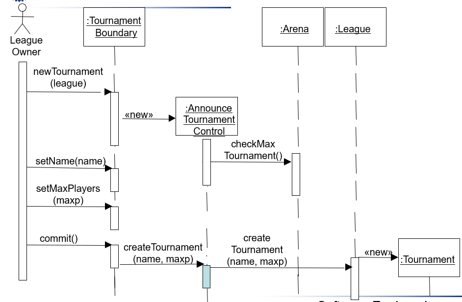

由于部分概念已经找出来, 画在图上了, 但通过画顺序图, 我们找到了更多的边界类,控制类

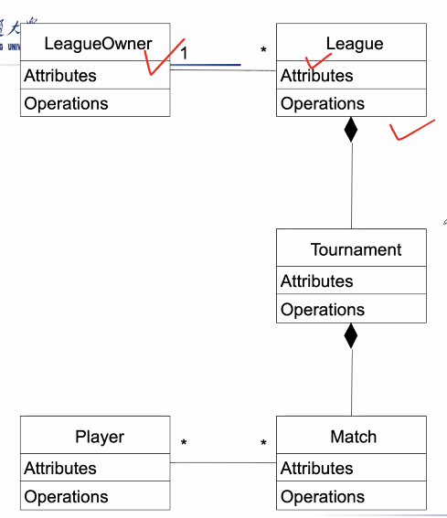 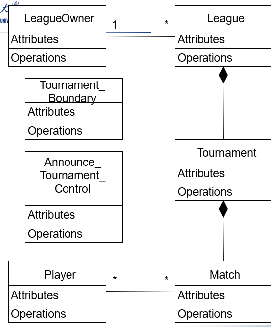

同时, 顺序图还帮助我们发现了更多类的事件响应/消息/方法, 这会落实到类(i.p. public operation of the message receiver). **实现了责任的划分**.

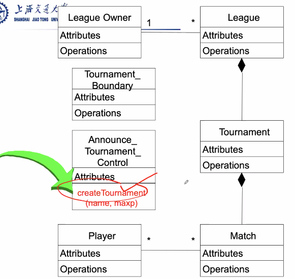

> 注意: 我们用匿名示例(下划线+`:classname`)表示顺序图

两种风格的责任分配
| 集中式 | 分布式 |
|--|--|
| 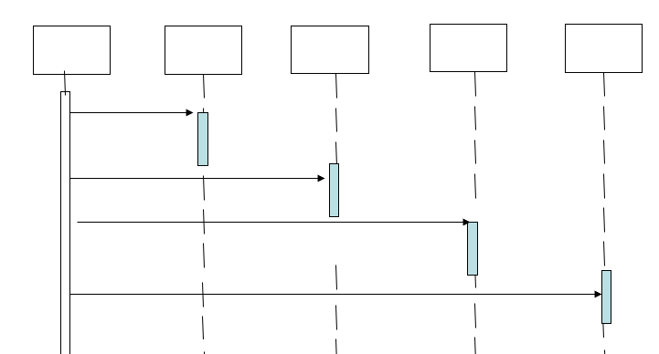 | 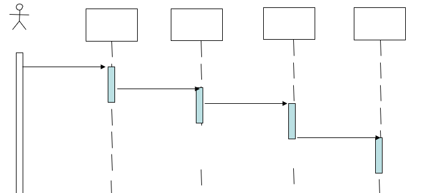 |
| 用一个control unit负责下达一切命令, 其余部门都听命于control, 相互之间不交流 | 相互之间存在消息的传递 |

过去, 终端的能力十分局限, centralized好
后来, PC的发展, decentralized好
现在, 云端能力极大提升, centralized好
未来, 又提倡数据存储在终端, 边缘分布式, decentralized好.


### Modeling Interactions among objects with CRC cards
CRC: Class, Responsibilities, and Collaborators
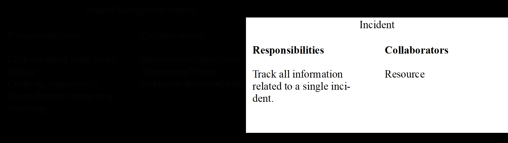


### Identify Associations

association 是types（more specifically, instance）之间meaningful and intresting 的关系。

如何确定需要标明的关系?
1. Associations for which knowledge of the relationship needs to be **preserved for some duration**
2. Associations **derived from the Common Associations List**

首先我们要确定一个Common Associations List, 根据我们的经验, 以下association会被建模出来
- Physical part of
- Logical part of
- Member of 
- ……

> 
> 之间存在write关系, 标明角色可以使关系之间的语义更为完整
> UML作图时命名是好习惯.

下图刻画了我们画图时需要注意的方方面面.
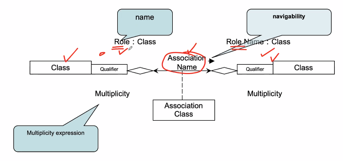
- name: 不可缺少
- role: 介绍对象承担作用,一方面便于理解, 另一方面方面模型mapping代码, 成为**类的属性**依据 (optional)
- 多重性
- 关联类
- Quantifier:限定符, 如何将

如何理解多重性?
- instance千千万, 我们说的是类
- 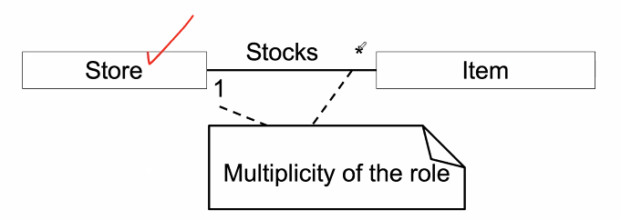
- 1个store会有多少item? 一对多
- 一个item在几个store里? 一对一
- 你怎么说商品专属于一个store呢?
  - 我们看的多重性是在一个**时刻点**上允许的关系, 即sequence diagram上某一时刻, 合法的数量关系
- 具有多种不同的表示形式
  - 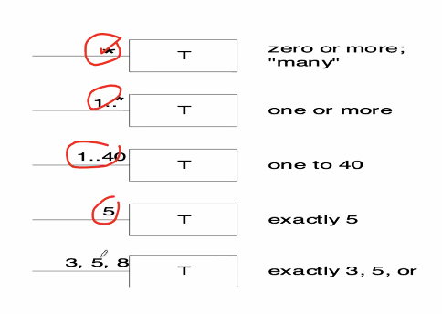

关联之间也存在方向
- 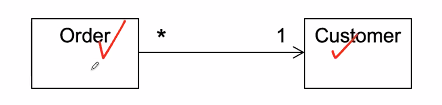
- 给定一个order, 我们能直接找到customer
- 给定一个customer, 我们不能直接找到order
- 可以建模时暂时不画箭头, 说明想法, 在建模的过程中完善.

### Identify Aggregates
aggregation, 一种特殊的association, 聚合关系. 表达整体和部分的关系.

我们可能还要进一步强化aggregation(聚合)这一概念, 用composition(组合)如整体和部分在某些情形下存在同生死共存亡的关系. 即如果整体不存在,部分也不存在.
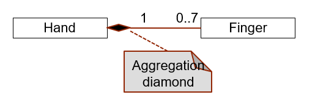

Shared Aggregation, 今天属于你, 明天属于别人. means that the multiplicity at the composite end may be more than one, and is signified with a hollow diamond. It implies that the part may be simultaneously in many composite instances.

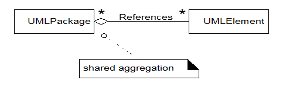

我们做一个直接对比
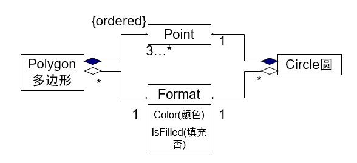
多边形不存在, 圆不存在, 那么点就不存在了.
如果是格式, 那么它不一定属于特定的圆, 特定的点.

### Identify Attributes

只关注我们所关注的属性, 在class的第二格中
属性名:类型.

需要注意的地方: 
1. Keep Attributes Simple
   - 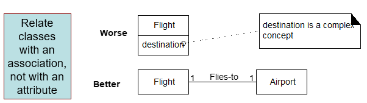
   - 因为flight可以取消, 但destination是确定的, 所以用association更好
2. Data Types:
   - 简单类型: number, string
   - 非简单类型: 最好做成类(conceptual class)
     - 条形码, 身份证id 因为他们有自己的方法
     - 重量, 因为他们有单位, 可能分为若干部分

### Modeling State-Dependent Behavior of Individual Objects

圆角矩形代表状态, 实心黑点代表起始状态. 外加圈代表终止状态. 中间各个状态之间由箭头表示状态的变化情况. 状态内部允许嵌套. 每个状态有状态名.

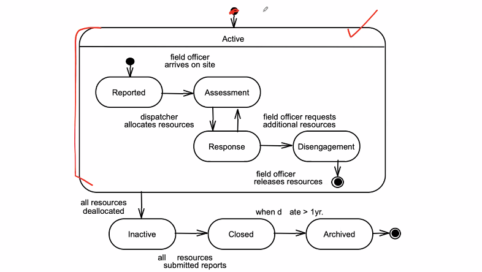

状态图是如何画的?

1. 信息来源: Use Case
   以电话机为例: Caller lifts receiver/ Dial tone begins/ Caller dials/ Phone rings/ Callee answers phone/ Ringing stops
2. 状态变化伴随着事件的发生, 可能还伴有动作.
   比如: 电话机从基座拿起, idle 到active状态的转变, 电话机会播放拨号音(action)
   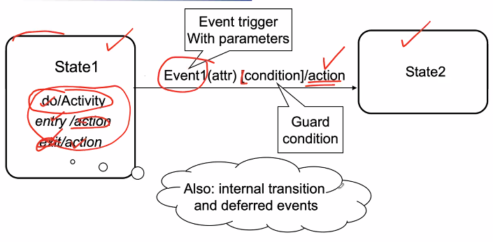
3. 区分两个概念:
   - activity: 需要时间完成的(通常和states连接)
   - action: 瞬时完成的操作(通常和events连接, 或者states中的entry/exit/internal)
4. statechart刻画的一定是**一个类**的生命周期. 当然, 不见得每个类都需要画状态机图.

什么是状态:
- 数学意义上, 是变量的取值
- 在工程上, 和需求相关, 进行分类. 且需要稳定持续一段时间

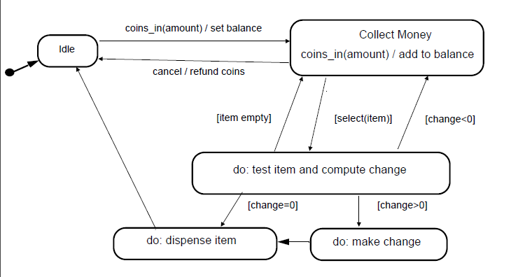
上图刻画一个自动售货机的状态变化. 好像售货机的过程也没有那么简单, 特别是dispense item这一环. 我们将它定义为一个superstate, 另作图展开.
‘Dispense item’as a composite activity [or sub-machine]:
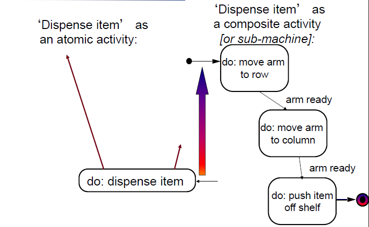


#### concurrency
状态机图也可以表示并发(concurrency)
计算机有两个层面的并发:
1. 系统层面: 可以用状态机图表示系统层面需要关注的并发状态
2. object层面: 一个对象的若干子状态会同时成立
如 付钱时, 可以选择部分现金,部分card, 可能处于两个状态上或两个状态之一. 我们用一根虚线表示
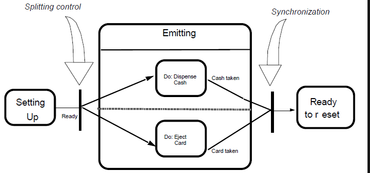

#### State Chart Diagram vs Sequence Diagram
都是随着时间的变化, 但前者表示object个体的变化, 后者表示object对外界消息的相应, 描述对象之间的关系.
**State diagrams are class-level documentation; sequence diagrams are instance-level documents.**
有生命线的是instance, sequence diagram是指名道姓地讲故事

#### Dynamic Modeling of User Interfaces
state chart diagram 一大特殊用处是对用户界面进行建模.
- Statechart diagrams can be used for the design of user interfaces
  - Also called **Navigation Path**
- States: Name of screens
  - Graphical layout of the screens associated with the states helps when presenting the dynamic model of a user nterface 
- Activities/actions are shown as bullets under screen name
  - Often only the exit action is shown
- State transitions: Result of  exit action
  - Button click
  - Menu selection
  - Cursor movements
- Good for web-based user interface design

### Modeling Inheritance Relationships between Objects

目前, 我们已经识别了一堆类. 我们在这里特别关注一下类的继承层次关系. Create generalization(相似性)-specialization(多样性) hierachies

规律: Apply the “100%” and “IS-a” tests to validate subclasses

> 100% Rule: 子类的属性,关联是否100%符合父类
> 100% of the conceptual superclass’s definition should be applicable the sub-class. The subclass must conform to 100% of the superclass’s:
> - Attributes
> - associations

> Is-a Rule
> All the members of a sub-class set must be members of their superclass set.
> In natural language, this can usually be informally tested by forming the statement: Subclass **is a** Superclass


## Managing Analysis


分析阶段的成果: RAD文档(Requirements Analysis Document)
```
1.	Introduction
2.	Current system
3.	Proposed system
	3.1	Overview
	3.2	Functional requirements
	3.3	Nonfunctional requirements
	3.4	Constraints (“Pseudo requirements”)  
	3.5	System models
		3.5.1  Scenarios
		3.5.2  Use case model
		3.5.3  Object model
		          3.5.3.1 Data dictionary
		          3.5.3.2 Class diagrams
		3.5.4  Dynamic models
		3.5.5  User interface
4. Glossary
```

### Class Diagrams
- Purpose of Class diagrams :
  - The description of the static properties of a system (main purpose)
  - [Has a lot to do with the semantic meaning of the parts]
- Who uses class diagrams?
  - The **application domain expert** uses class diagrams to model the application domain
  - The **developer** uses class diagrams  during the development of a system,that is, during analysis, system design, object design and implementation.
  - The **customer** and the **end user** are often not interested in class diagrams. They usually focus more on the functionality of the system.  

### Application domain vs solution domain
- Application domain: 
  - The problem domain (financial services, meteorology, accident management, architecture, …).
- Application domain class: 
  - An abstraction in the application domain. If we model business applications, these classes are also  called business objects. 
  - Example: Board game, Tournament
- Solution domain:
  - Domains that help in the solution of  problems (tele communication, data bases, compiler construction, operating systems, ….)
- Solution domain class: 
  - An abstraction, that is introduced for technical reasons, because it helps in the solution of a problem.
  - Examples:  Tree,  Hashtable, Scheduler


Roles
- Analyst: 分解问题
- Designer: 确定接口, class library
- Implementor:
  - Class implementor: 实现类
    - Implements the class. The implementor chooses appropriate data structures (for the attributes) and algorithms (for the operations),  and realizes the interface of the class in a programming language [as a source code file] .
  - Class extender: 对类扩展
    - Extends the class by a subclass, which is needed for a new problem or a new application domain. [Methods may be extended too.]
  - Class-user (client): 调用类生成的对象和方法
    - The programmer, who wants to use an existing class (e.g. a class from a class library or a class from another subsystem). 
    - The class user is only interested in the signatures of the class operations and the preconditions under which they can be invoked. The class user is not so much interested in the implementation of the class. 


## Summary
1. 分析需求: What are the transformations?  (Functional Modeling)
   Create _**scenarios**_ and  _**use case diagrams**_
   - Talk to client, observe, get historical records, do thought experiments 
2. 系统实现: What is the structure of the system? (Object Modeling)
   Create _**class diagrams**_ [static information models]
   - Identify **objects**. 
   - What are the associations between them? What is their **multiplicity**?
   - What are the **attributes** of the objects?
   - What **operations** are defined on the objects?
3. 定义行为: What is its behavior? (Dynamic Modeling)
   3.1. Create _**sequence diagrams**_ [Dynamic object behavior instance examples]
   - Identify event senders and receivers
   - Show sequence of events exchanged between objects. 		 Identify event dependencies and event concurrency.
  
   3.2. Create  _**state diagrams**_  [Dynamic class method behavior models]
   - Only for the dynamically interesting objects.

下一步就是Design了.